# 我的时间序列模型表现如何？

> 原文：<https://towardsdatascience.com/how-well-my-time-series-models-performed-actual-vs-prediction-r-1281fc66238e?source=collection_archive---------11----------------------->

## 实际与预测— R


对英格兰国民健康服务(NHS)每月事故和急诊就诊人数的时间序列分析和预测是一个有趣的项目。在那里，我建立了四个不同的预测模型，以预测 2018 年 8 月至 2019 年 7 月期间 NHS 组织的每月总人次。 [*了解更多(点击此处*](/time-series-analysis-and-forecasting-for-a-e-attendances-and-emergency-admission-in-england-53e41a93be35) *)。*

这四个模型分别是:**【SN】****【LR】****ARIMA**和**自动 ARIMA** 模型。然而，我在 2018 年 8 月制造了那些模型。从那以后，我一直通过 [NHS 网站——A&E 就诊和急诊](https://www.england.nhs.uk/statistics/statistical-work-areas/ae-waiting-times-and-activity/),监测每个月底总就诊人数的实际统计数字。

现在已经快三个月了，总的来说，我可以说这些模特表现得非常好。但在这里，我们将通过比较三个月前每个模型的预测数据与实际数据，更深入地了解他们的表现。这可以简单地通过计算**绝对误差(AE)** 、**均方根误差(RMSE)** 和**均方根对数误差(RMSLE)** 来实现。

首先，我想展示 12 个月内**【TA】**各模型预测的汇总。然后，将 3 个月的真实/实际统计数据与预测进行比较:

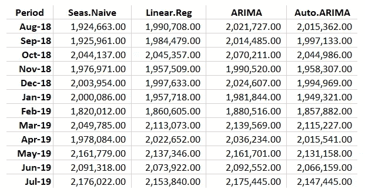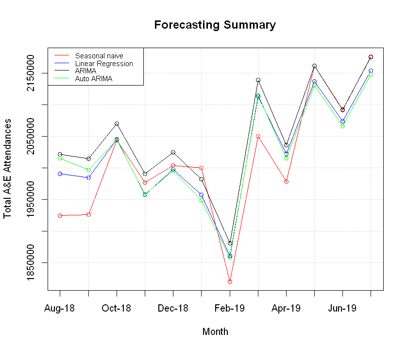

现在，让我们将每个模型的前 3 个月的值与 NHS 网站上的实际**总出席人数** ( **TA** )数据进行比较:

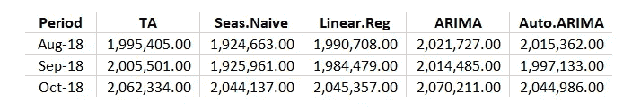

所有模型相对于实际 TA 值的条形图和散点图:

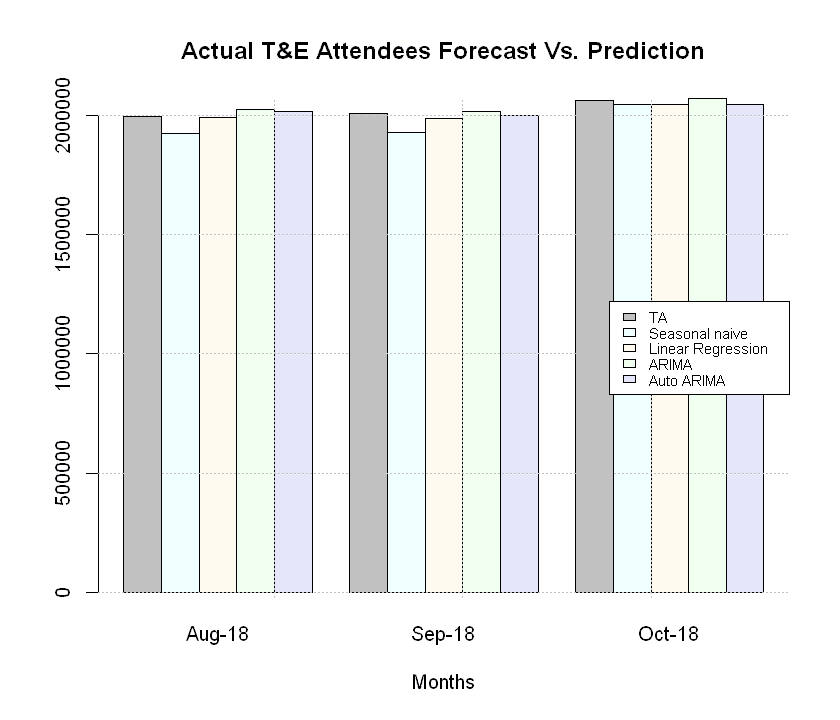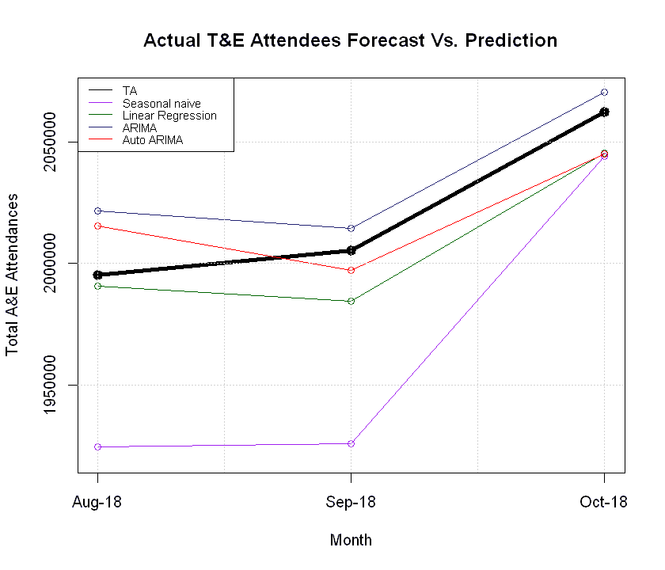

粗黑线是**实际 TA** 值，我们可以看到所有模型的趋势表现与 TA 相同。但是季节性的天真倾向于在前两个月有更大的差异。说到这里，我们来计算一下绝对误差，把数据可视化。但我们可以清楚地注意到，线性回归和 ARIMA 模型是最好的。我们会进一步调查！

# 绝对误差

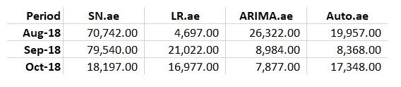

```
> Period       SN.ae      LR.ae      ARIMA.ae    Auto.ae
> Aug-18       70,742      4,697      26,322      19,957
> Sep-18       79,540     21,022       8,984       8,368
> Oct-18       18,197     16,977       7,877      17,348
```

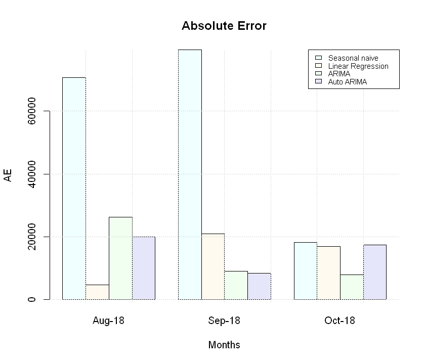

# 均方根误差(RMSE)

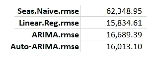

```
> SN.rmse          62,348.95
> LR.rmse          15,834.61
> ARIMA.rmse       16,689.39
> Auto.rmse        16,013.10
```

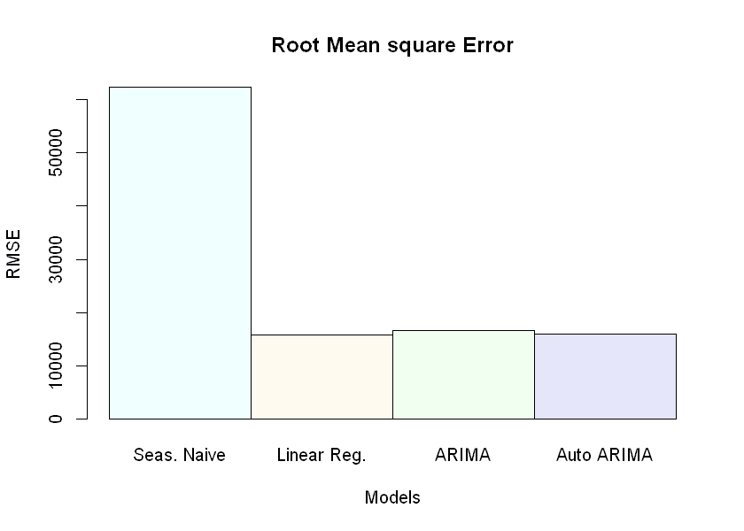

线性回归具有最低的 RMSE 值，而季节性朴素具有最高的值。

# 均方根对数误差

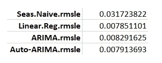

```
> SN.rmsle              0.031723822
> LR.rmsle              0.007851101
> ARIMA.rmsle           0.008291625
> Auto.rmsle            0.007913693
```

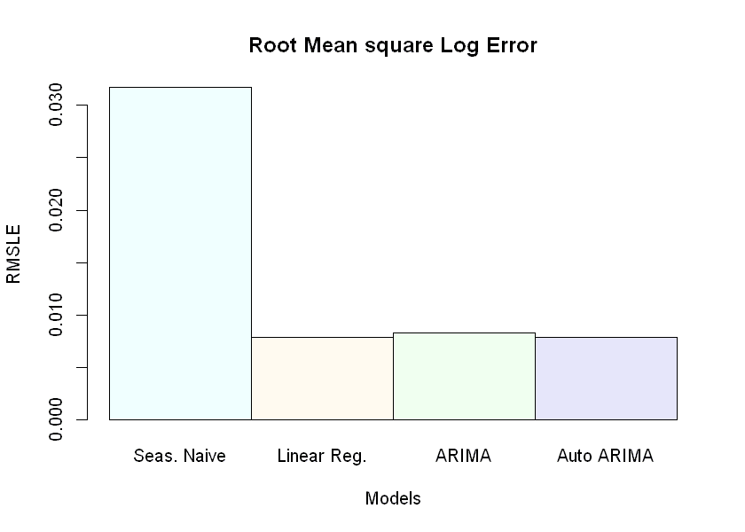