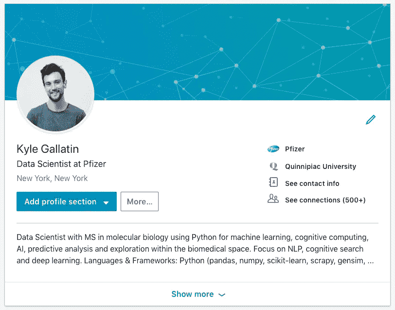
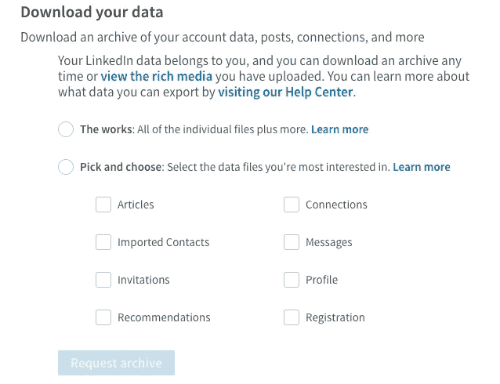
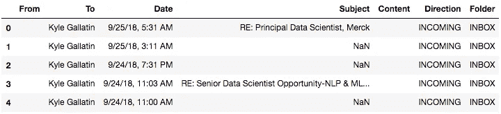
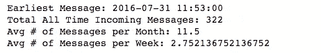
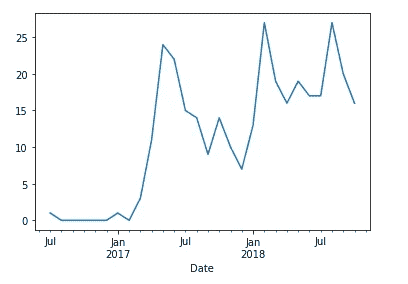
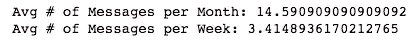
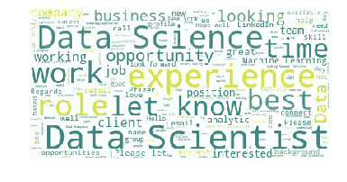
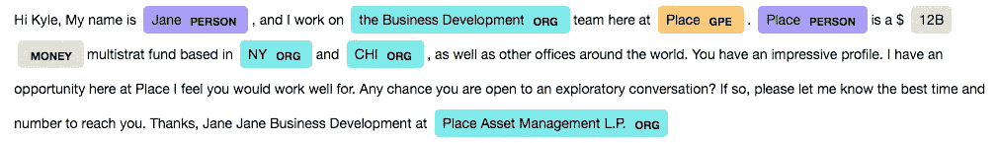
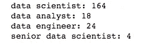

# 你将如何被招聘为数据科学家？我的 LinkedIn 消息的简要分析。

> 原文：<https://towardsdatascience.com/how-will-you-be-recruited-as-a-data-scientist-a-brief-analysis-of-my-linkedin-messages-498c6e20916d?source=collection_archive---------7----------------------->

## 使用一些数据科学和 LinkedIn 的数据对数据科学招聘进行分析，然后我会在 LinkedIn 上发布这些数据。


A picture I took in London, UK that has nothing to do with this article.

关于数据科学领域的工作，有大量的统计数据被抛出:空缺职位的数量、较高的基本工资中位数、未满足的市场需求等。虽然这很有希望，但如果你是求职者或数据科学领域的新手，你不一定要将这些统计数据等同于任何直接的个人结果。因此，这篇文章的目的是给我一点点洞察力，自从我在 LinkedIn 上的头衔变成“数据科学家”以来，我是如何被招聘的，我的个人资料获得了越来越多的技能/流行语。

为了透明起见——并且因为这样做将是讽刺性的*而不是*,我将使用一些基本的数据科学技能来进行分析并分享 Python 代码，这样如果您感兴趣的话可以跟随。

# 关于我的一点点

我的背景其实是生物。当我获得分子和细胞生物学硕士学位时，我很幸运地在一家生物技术公司找到了一份数据分析师的工作。在那里，我的角色基本上是自学 R 和 Python 来对我们的细胞和生物数据进行统计分析。随着我对编程数据科学越来越感兴趣，我想要更正规的教育——或者基本上除了我和 stack overflow 之外的任何东西。



[Me](https://www.linkedin.com/in/kylegallatin/)

因此，我参加了纽约市数据科学院(NYCDSA)训练营。我为他们工作了一段时间，撰写和管理数据科学面试问题，以及其他一些数据科学和分析工作，直到我在辉瑞获得数据科学实习。现在我已经在他们那里做了一年多的数据科学家，主要从事深度学习、NLP、数据工程和架构方面的工作。

# 下载您的电子邮件

随着我从招聘人员那里收到越来越多关于数据科学职位空缺的消息，我开始想知道是否有一种好的方法来访问这些数据，而不破坏我自己的个人资料。虽然 LinkedIn API 在这种情况下没有用，但实际上您可以将所有消息数据下载到一个方便的。csv 文件。你可以通过个人资料的**设置&隐私**部分访问它，但为了方便起见，这里有个链接:【https://www.linkedin.com/psettings/member-data】的。然后，您应该会看到下面的选项。



然后，您可以选择您想要下载的数据，它会向您发送一封电子邮件确认链接。对于本演练/分析，它只是“消息”。

# 非常基本的情节和统计

好了，现在我们可以开始处理数据了。让我们启动 python，看看我们得到了什么。

```
import pandas as pd
import matplotlib.pyplot as plt
from datetime import datetimemessages = pd.read_csv("messages.csv")
messages.head()
```



为了匿名起见，我已经删除了`From`和`Content`列中的值，但是您应该会看到上面的字段。我们可以看到谁发的邮件，日期/时间，主题和内容。首先，我们只需要稍微清理一下数据。对于绘图，将日期和时间作为索引会很有帮助。此外，我真的不想看所有的来回信息，因为这可能有点误导。让我们只保留每个人给*我*发的第一条消息。

```
## properly format the date and set it as the index
messages['Date'] = [datetime.strptime(x, '%m/%d/%y, %I:%M %p') for x in messages['Date']]## keep only message sent to me
df = messages[messages['Direction'] == "INCOMING"]## keep only the first message everyone sent me
df = df.drop_duplicates('From', keep = 'last')
```

现在我们只有每个人发给我的第一条消息，让我们来看看一些基本的统计数据。

```
df = df.set_index(pd.DatetimeIndex(df['Date']))total_msg = len(df)
min_date = min(df.index)
mean_msg_month = df.resample('MS').size().mean()
mean_msg_week = df.resample('W-MON').size().mean()print("Earliest Message: %s" % min_date)
print("Total All Time Incoming Messages: %s" % total_msg)
print("Avg # of Messages per Month: %s" % mean_msg_month)
print("Avg # of Messages per Week: %s" % mean_msg_week)
```



所以我收到了 300 多条来自不同个人的信息。为简单起见，我们假设大部分是招聘人员，排除偶尔的产品促销、垃圾传销或其他。然而，直到 2017 年 2 月或 3 月，我才在我的个人资料中添加任何关于数据科学的内容，我的第一条消息是在 2016 年 7 月；这可能有点扭曲了数据。让我们策划一下，找出答案。



# of LinkedIn Messages over Time

好了，你可以看到，在 2017 年 2 月将数据科学术语添加到我的个人资料之前**，我的电子邮件中基本上没有招聘人员。一旦我这么做了，我的信息就会激增！请注意，我想我也打开了该设置，让招聘人员知道我在这个时候对新的机会持开放态度，但我在 2017 年 8 月关闭了它，因为几乎看不到归因。12 月份接近年底时会有一段短暂的平静，但 2018 年 1 月再次以大量消息开始，自那以来一直相当稳定。**

知道我有很多前数据科学数据影响我的平均计算，让我们重做 2017 年以后的数据。

```
mean_msg_month = df[df.index > '2017-01-01'].resample('MS').size().mean()
mean_msg_week = df[df.index > '2017-01-01'].resample('W-MON').size().mean()print("Avg # of Messages per Month: %s" % mean_msg_month)
print("Avg # of Messages per Week: %s" % mean_msg_week)
```



那更好。平均而言，我每月收到 **14 条消息**，每周收到 **3 条**，标题为数据科学家，个人资料中包含数据科学术语。从图表中可以看出，有些月份比其他月份强得多。

# 一点自然语言处理

这些统计数据提供了丰富的信息，但这是我一年中做过的最无聊的 python。尽管可能没有那么大的收获，但让我们稍微研究一下文本，看看我们能提取出什么信息。我们可以回到我们读到的原始表格，在`Content`列中删除 NA 值，并从 NLP 视觉效果最差的单词云开始查看传入的消息。

```
from wordcloud import WordCloud, STOPWORDSstopwords = set(list(STOPWORDS) + ['hi','kyle','will','thank','thanks'])df = messages[messages['Direction'] == "INCOMING"]
df = df[pd.notnull(df['Content'])]wc = WordCloud(background_color='white',
               stopwords=stopwords,
              ).generate(' '.join(list(df['Content'])))plt.imshow(wc)
plt.axis("off")
plt.show()
```



在删除停用词和一些额外的自定义词后，我们看到我的大部分邮件都在讨论数据科学和数据科学角色。一些人提到了我目前的职位，但更多人提到了数据科学或“机器学习”角色的“客户”或“业务”的新“机会”。这很酷，但没有告诉我们太多，让我们看看我们是否可以用更高级的东西来深入挖掘。

## 实体识别

“命名实体识别(NER)(也称为实体识别、实体分块和实体提取)是[信息提取](https://en.wikipedia.org/wiki/Information_extraction)的子任务，旨在定位[非结构化文本](https://en.wikipedia.org/wiki/Unstructured_data)中提到的[命名实体](https://en.wikipedia.org/wiki/Named_entity)并将其分类为预定义的类别，如人名、组织、位置等……”—维基百科。基本上是从非结构化文本中提取有用的标记数据。

不用训练我们自己的模型或标记数据，我们可以使用像`spacy`这样的包来提供预训练的 NER 模型，这些模型能够识别许多对象，其中一些可以在下面看到。

这样，使用几行代码，您就可以从任何文本中快速收集和显示实体。下面的例子使用了一个随机匿名的例子，来自我在 jupyter 笔记本上呈现的消息。

```
import spacy
from spacy import displacynlp = spacy.load('en_core_web_sm')
text = df['Content'][i]
displacy.render(nlp(text), jupyter=True, style='ent')
```



它很酷，但不是很好用。该算法用 4 种不同的方式给公司“定位”，分别是`GPE`、`PERSON`、无，最后是正确的方式`ORG`。NY 和 CHI 应该也不是`ORG`的年代

我原本希望利用这一点来更好地了解我被招聘的公司职位和薪水提及，但如果不标记大量我自己的数据(我不会这样做)和训练一个新模型(我不想这样做)，它可能不会产生好结果。看来我们得尝试更硬的编码方法了。

```
positions = ['data scientist',
             'data analyst',
             'data engineer',
             'senior data scientist']text = ' '.join(list(df['Content'])).lower()
for job in positions:
    count = text.count(job)
    print(job + ': %d' % count)
```



可能仍然遗漏了许多只在邮件主题中提到的边缘案例、角色或职位，但你知道了。对我邮件中提到的角色的简短探索。

# 未来方向

用这些数据做一些机器学习会很酷。我用平均预训练单词嵌入对数据做了 k-means，但这对于这篇文章来说有点过了。

此外，如果我有我的 LinkedIn 个人资料随时间变化的全面日志(简历、证书、职位、联系等)，我会希望看到某些术语是否能激发最佳互动，并更多地挖掘时间序列方面。不幸的是，我可能没有这样的时间和数据。不管怎样，希望你喜欢它，如果你有更多的探索想法，请告诉我。