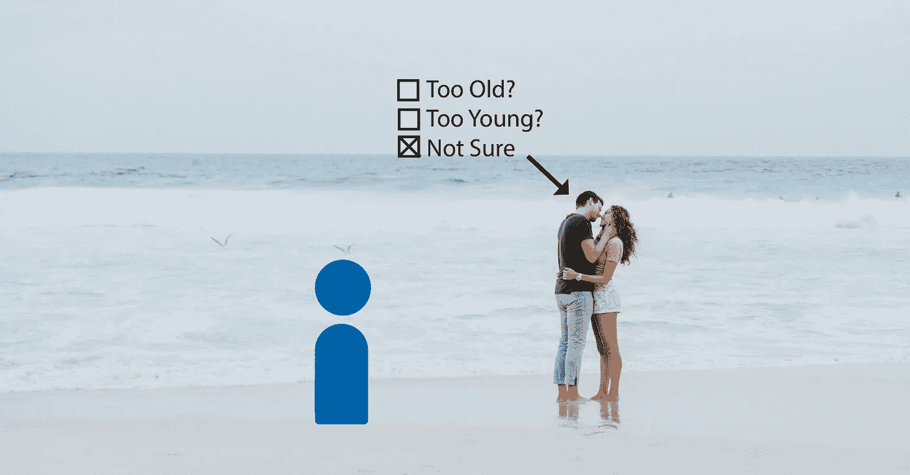
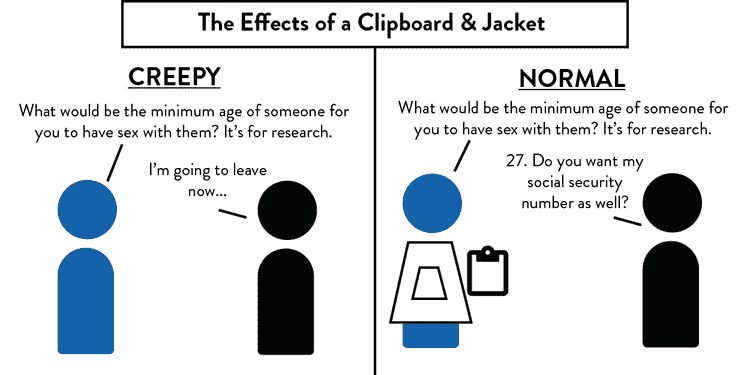
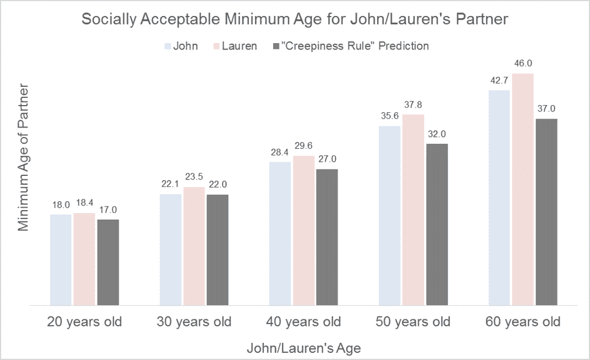
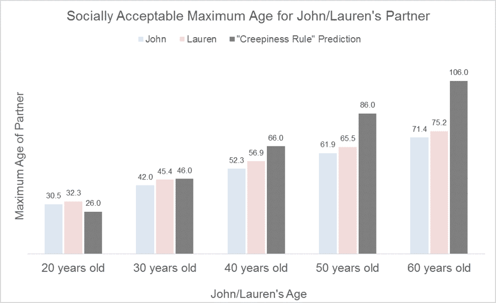
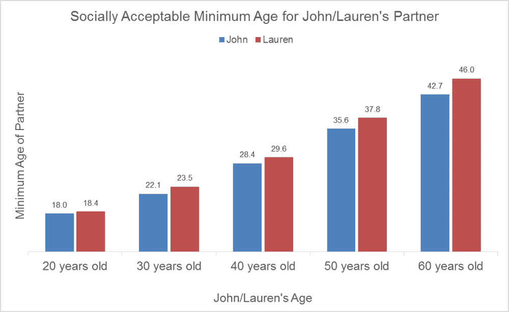
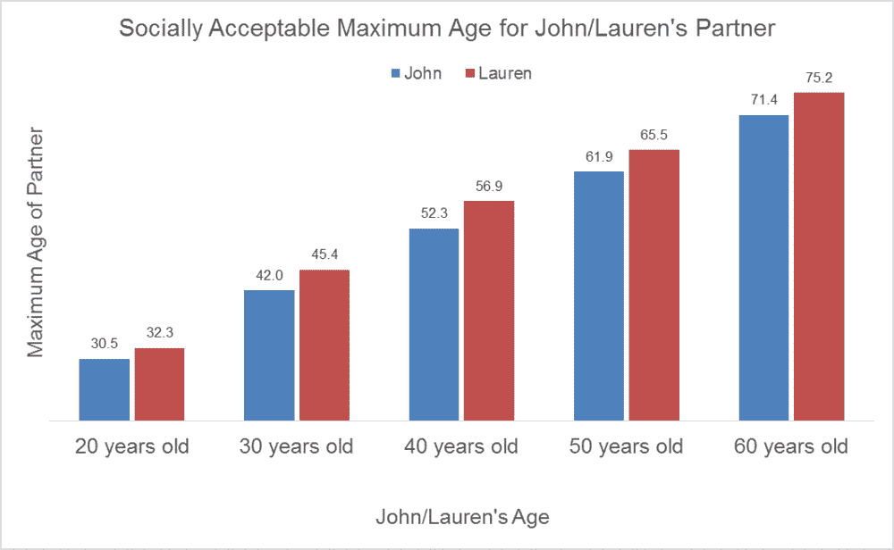
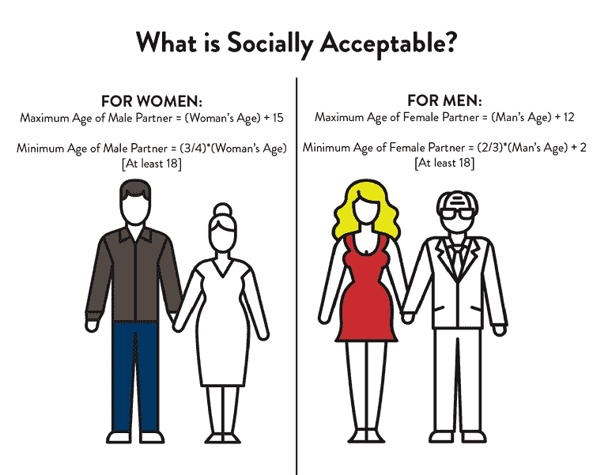
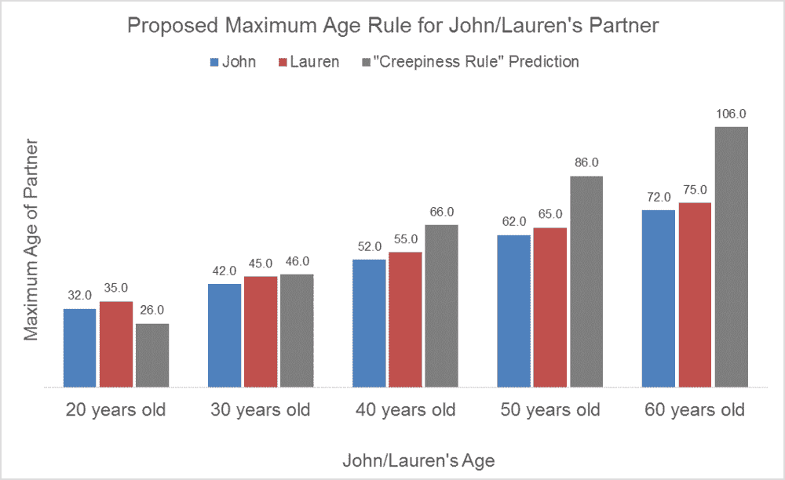
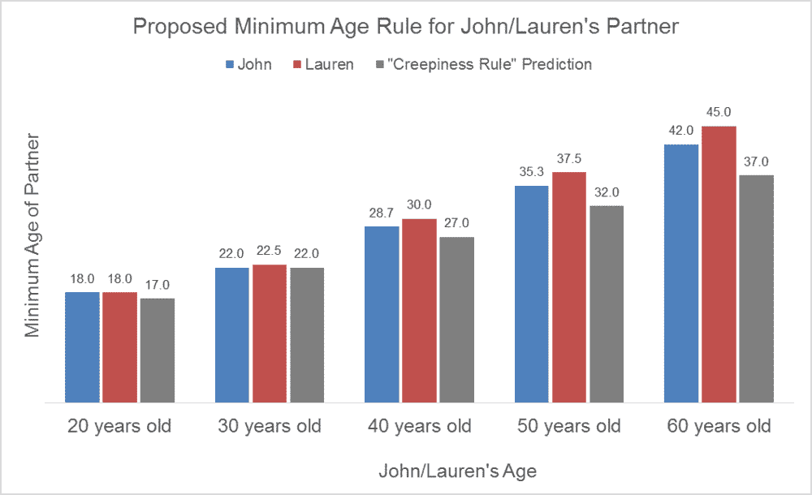

# 多年轻才算太年轻不适合约会？

> 原文：<https://towardsdatascience.com/how-young-is-too-young-to-date-ae0061bc2115?source=collection_archive---------0----------------------->

## 你可以约会的老老少少的真正规则

# 多大才算太老？多年轻才算太年轻？

关于多大年纪和多年轻可以约会的真正规则。

“恐怖法则”指出，你应该约会的最小年龄是“你年龄的一半加七岁”一个不太常用的推论是，你应该约会的最大年龄是“从你的年龄中减去 7，然后加倍。”

根据这条规则，社会应该接受一个 50 岁的男人和一个 32 岁的女人约会。对我朋友的一项快速调查显示，情况并非如此。反应从“当然”到“这很奇怪”到“你为什么问我这个？”。当我颠倒性别时——一个 50 岁的女人和一个 32 岁的男人约会——人们的反应也经常颠倒。

这让我想知道，当谈到约会中的年龄差异时，creepiness 规则实际上反映了什么是社会可以接受的吗？换句话说，令人毛骨悚然的规则实际上反映了社会所发现的……令人毛骨悚然的东西吗？

# 研究表明

互联网上对这个话题的看法不一。文章和博客文章在声称年龄**在一段关系中绝对重要**和年龄**在一段关系中绝对不重要**之间交替出现。有一点是清楚的——没有什么比其他人的爱情生活更能引发更多的观点。

Buunk 和他的同事写了一篇论文，调查了年龄、性别和浪漫关系类型(随意、认真、婚姻等)等因素是如何影响爱情的。)影响人们对潜在浪漫伴侣的年龄限制。

研究人员在公共场合随机接近一些人，让他们想象自己和一个有魅力的异性处于浪漫关系中。研究人员随后展示了不同类型的关系——性幻想、临时恋情、长期关系、婚姻——并询问参与者在每种情况下他们伴侣的最小和最大年龄是多少。

除了允许你以科学的名义违反所有社会规范之外，以下是实际结果:

*   不管是什么类型的关系，女人都喜欢和自己年龄相仿的男人。根据 Buunk &同事的研究进行的另一项分析，女性在“恐惧法则”的指导下寻找伴侣。
*   男人想要年轻得多的女人，以换取更少的承诺，更多的私人关系(例如，性幻想，随便的事情)。对于这些类型的关系，男性寻找的女性年龄低于令人毛骨悚然规则的下限。对于更加忠诚和公开的关系，男性会寻找与自己年龄相近的女性。
*   男人和女人都没有兴趣像猥琐法则允许的那样约会。男性和女性的最大年龄偏好都远低于恐怖规则的上限。

结果很有趣，但是仅仅因为我想和比我年轻得多的人约会并不意味着我可以接受别人做同样的事情。我仍然不知道这些令人毛骨悚然的规则是否真正代表了社会所能接受的东西。

所以我决定自己寻找答案。

# 设置调查

我用我所知道的唯一方法解决了这个范式转换的研究:我创建了一个调查。

我向人们展示了一些假设的场景，在这些场景中，他们的朋友“约翰”或“劳伦”开始了一段新的浪漫关系，这段关系还太早，无法定义。然后我给了他们的朋友不同的年龄——20 岁、30 岁、40 岁、50 岁、60 岁——并询问参与者他们朋友的新欢的社会可接受的最小和最大年龄是多少。

尽管我本可以走上纽约街头，以一种非传统的方式亲自调查人们，但我还是决定用手机做调查。我尽量避免日常生活中的社交活动。

对于那些不知道现代血汗工厂的人来说，你错过了。Mechanical Turk 是亚马逊的在线平台，人们向其他人支付费用来完成在线任务。这可以从转录一部电影，到识别收据上的一个项目，到进行一项关于假设的浪漫关系的调查。几天之内，我收到了 274 份回复:110 名男性，163 名女性，还有一个人“宁愿不说”。

# 测试“爬行规则”

结果显示，对于多年轻就可以约会，猥琐法则通常过于宽松——尤其是当你变老的时候。

根据恐怖法则，20 岁的约翰/劳伦可以和 17 岁的人约会。这与被调查者认为可以接受的结果一致(约 18)。然而，随着约翰和劳伦年龄的增长，令人毛骨悚然的规则与人们的实际反应有所不同。根据规定，一个 60 岁的女人可以和 37 岁的人约会。然而根据调查，37 岁远远超出了社会认可的年龄范围。

研究结果还显示，当你年轻的时候，关于多大年龄可以约会，这个令人毛骨悚然的规则过于严格，但是随着年龄的增长，这个规则就变得过于宽松了。

当约翰/劳伦 20 岁时，最大约会年龄限制在 26 岁([20–7]* 2)。然而，接受调查的人对约翰和劳伦在 30 岁出头时约会没有意见。

当约翰/劳伦 30 岁的时候，令人毛骨悚然的规则实际上符合人们的反应。该规则规定劳伦情人的最大年龄是 46 岁，根据调查，实际可接受的年龄是 45.4 岁。

当约翰和劳伦 60 岁时，猥琐规则允许他们和任何比自己大的人约会(官方上限是 106)。然而，社会对年龄的限制更多，分别为 71 岁和 75 岁。

总的来说，令人毛骨悚然的规则不能准确地代表人们认为社会可以接受的东西；人们比“恐惧法则”所暗示的更具批判性。对于多大年龄和多年轻的人被“允许”约会，该规定过于宽松。

我有了最初问题的答案，但我并不满意。如果恐怖规则是错误的，那么我需要一个新的规则来指导我不存在的爱情生活。当我查看数据时，我意识到一条规则是不够的。

# 不同的人有不同的规则

社会对男人和女人有不同的期望——男人可以比女人年轻约会，女人可以比男人年长约会。

在调查中，约翰伴侣的可接受最低年龄一直低于劳伦。当约翰/劳伦年幼时，这种差异很小(大约 6 个月)，但随着约翰/劳伦年龄的增长，这种差异会增大。到他们 60 岁的时候，约翰被“允许”和比劳伦最小年龄小三岁的人在一起。

说到和年长的人约会，女人更有优势。劳伦伴侣的可接受最大年龄始终比约翰高 3.5 岁左右。

根据你在关系中的地位，社会也会有不同的期望——仅仅因为你可以接受和你的伴侣约会，并不意味着你的伴侣也可以接受和你约会。

根据调查，20 岁的约翰可以和 30 岁的人约会。然而，当劳伦 30 岁时，她应该和至少 22 岁的人约会。社会对老年人如何约会的期望与对年轻人如何约会的期望并不总是一致。

# 关于年龄外约会的新规则

考虑到这些不同的期望，我创造了四个“修订”规则来捕捉社会实际上认为可以接受的年龄限制。我不仅为男性和女性制定了不同的规则，还制定了不同的规则来决定男女可以约会的年龄和年龄。

> 对于男性:
> 
> **女方最大年龄=(男方年龄)+ 12**
> 
> **女性伴侣的最低年龄= (2/3)*(男性年龄)+ 2【至少 18 岁】**
> 
> 对于女性:
> 
> **男性伴侣的最大年龄=(女性的年龄)+ 15**
> 
> **男性伴侣的最低年龄= (3/4)*(女性的年龄)【至少 18】**

下面的图表比较了修订规则的输出与原始蠕变规则的预测。我加入了“至少 18 岁”的要求，以帮助防止我出现在任何联邦调查局的监视名单上。在几乎所有的情况下，修订后的规则比“令人毛骨悚然”的规则更具限制性。

# 请不要用这篇文章作为建议

我认为有机会在这项如此重要的研究上更进一步。情侣之间的实际平均年龄差是多少？这项研究如何转化为同性关系？富有/出名会影响人们认为什么是社会认可的吗？

说到底，这篇文章是关于人们如何思考， ***而不是*** 人们应该如何思考。不要把你的感情决定建立在别人的判断上。寻找能让你快乐的关系。

# 你可能喜欢的其他文章

如果你喜欢这篇文章，请访问[**LateNightFroyo.com**](http://latenightfroyo.com/)阅读关于爱情、生活等话题的话题。

什么时候去参加聚会比较合适？

[如何走出去？](https://www.latenightfroyo.com/archive/2017/4/30/how-to-get-out-of-going-out)

[多年轻才算年轻到不能约会？](https://www.latenightfroyo.com/archive/2016/10/2/how-young-is-too-young)

来源:

Buunk，B. P .，Dijkstra，p .，Kenrick，D. T .，& Warntjes，A. (2001 年)。与性别、自身年龄和参与程度相关的择偶年龄偏好。进化和人类行为，22(4)，241–250 页。

谁对你来说太年轻或太老而不能约会？今日心理学，2014 年 5 月 2 日。网络。2016 年 10 月 2 日。

[1] 虽然我们关注的是异性恋关系，但同性恋关系也会是一个有趣的后续问题。