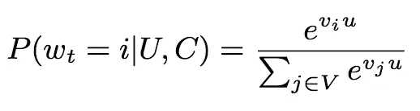
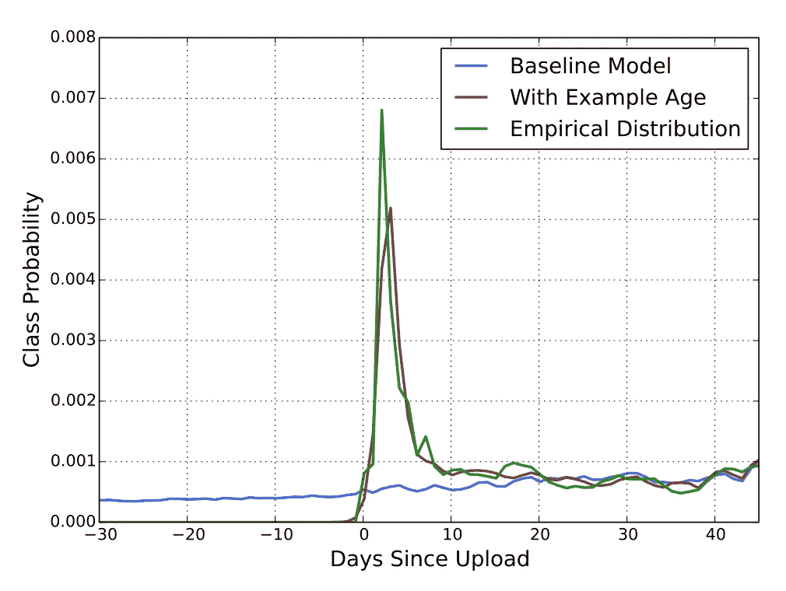
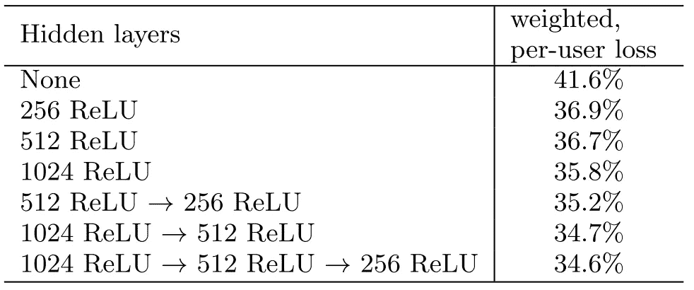

# YouTube 如何推荐视频

> 原文：<https://towardsdatascience.com/how-youtube-recommends-videos-b6e003a5ab2f?source=collection_archive---------1----------------------->

> 这是麻省理工学院机器智能社区(MIC)的“ML 开创性论文”系列的第一篇论文。麻省理工学院 MIC 旨在教育整个社区关于机器学习的知识，并降低进入门槛。如需了解更多信息，请访问 [https://mitmic.io](https://mitmic.io) 或发送电子邮件至【mic-exec@mit.edu】T2。

推荐系统是用户会遇到的最常见的机器学习形式之一，无论他们是否意识到这一点。它在[脸书](https://code.fb.com/core-data/recommending-items-to-more-than-a-billion-people/)和[推特](https://web.stanford.edu/~rezab/papers/wtf_overview.pdf)以及 [YouTube](https://ai.google/research/pubs/pub45530) 上为策划时间线提供了动力。

之前被公式化为试图预测特定用户的电影评级的[矩阵分解问题](https://en.wikipedia.org/wiki/Matrix_factorization_(recommender_systems))，现在许多人正在使用深度学习来解决这个问题；直觉是特征的非线性组合可能比传统的矩阵分解方法产生更好的预测。2016 年，Covington、Adams 和 Sargin 用“[用于 YouTube 推荐的深度神经网络](https://ai.google/research/pubs/pub45530)”展示了这种方法的好处，使谷歌成为首批为推荐系统部署生产级深度神经网络的公司之一。

鉴于 YouTube 是美国第二大访问量网站，T2 每分钟上传超过 400 小时的内容，推荐新鲜内容并不是一件简单的任务。在他们的论文中，Covington *等人*展示了一种两阶段信息检索方法，其中一个网络*生成*推荐，第二个网络*对这些生成的推荐进行排名*。这种做法其实挺有想法的；由于推荐视频可以被提出为一个极端的多类分类问题，因此使用一个网络将任务的基数从几百万个数据点减少到几百个数据点允许排名网络利用更复杂的特征，这些特征对于候选生成模型来说可能太微小而无法学习。

# 背景

YouTube 对推荐系统的深度学习方法背后有两个主要因素:

*   **规模:**由于这些矩阵极其稀疏，先前的矩阵分解方法很难在整个特征空间中进行规模扩展。此外，以前的矩阵分解方法很难处理分类变量和连续变量的组合。
*   **一致性**:谷歌许多其他基于产品的团队已经转而将深度学习作为学习问题的通用框架。自从 Google Brain 发布了 [Tensorflow](https://www.tensorflow.org/) ，以分布式方式训练、测试和部署深度神经网络就足够容易了。

此外，最近在这一领域的成功证明了这一方法的可行性。 [Sedhain *等人*](http://users.cecs.anu.edu.au/~u5098633/papers/www15.pdf) 已经证明，使用[自动编码器](https://en.wikipedia.org/wiki/Autoencoder)来解决协作问题会比有偏矩阵分解等方法产生更好的结果。

# 网络结构

Fig. 1, the “funnel” approach of narrowing down the set space for videos to be recommended.

有两个网络在起作用:

*   **候选生成**网络获取用户的*活动历史* (例如，正在观看的视频的 id、搜索历史和用户级别的人口统计数据)并输出数百个可能广泛适用于用户的视频。
    总的想法是这个网络应该针对**精度进行优化；每个实例都应该高度相关，即使这需要放弃一些可能广受欢迎但不相关的项目。**
*   相比之下，**排名**网络对每个视频采用更丰富的特征集，并对来自候选生成网络的每个项目进行评分。对于这个网络来说，高召回率是很重要的；只要你没有错过最相关的项目 ***，有些推荐不太相关也没关系。***

总的来说，这个网络是端到端训练的**；训练集和测试集由保留数据组成。换句话说，网络被给予一个用户的时间历史，直到某个时间 *t* ，并且网络被询问他们在时间 *t+1 想要观看什么！作者认为，如果 YouTube 上的视频具有情节性，这是推荐视频的最佳方式之一。***

# 发电网络

Covington *等人*将候选生成问题作为*极端多类分类问题*提出，其中预测问题变为“在某个时间 t 对 w(t)的某个观看时间进行准确分类”，对于某个给定的项目 *i* ，上下文 C 和用户 u。图 2 展示了目标的形式化。

Figure 2: Understanding the probability of the watch time distribution.

模型架构遵循传统的“塔式”方法，其中网络的底部是最宽的一层，此后每层将网络的宽度减半。作者实验了不同的网络，深度从一层到四层不等。最小的层是 256 个 ReLu 单位的一层，而最宽的层是 2048 个 ReLu 单位宽，并且是四层深。

该模型使用[负采样](https://www.tensorflow.org/extras/candidate_sampling.pdf)进行训练，其中我们试图通过仅传播这些负样本的子集而不是全部来加强负结果，并针对负样本之间的关系来加强这种相关性。在服务时间，使用近似最近邻算法来服务次线性时间中的前 *N* 个结果。

# 性能黑客

在候选人生成和候选人排名网络中，作者利用各种技巧来帮助降低模型的维度或性能。我们在这里讨论这些，因为它们与两个模型都相关。

首先，他们训练了一个子网，通过学习这些特征的嵌入，将稀疏特征(如视频 id、搜索令牌和用户 id)转换为密集特征。这种嵌入是通过梯度下降与模型参数的其余部分联合学习的。

其次，为了帮助对抗[开发/探索](https://en.wikipedia.org/wiki/Multi-armed_bandit)问题，他们*将训练范例*的年龄作为一个特征。这有助于克服模型中倾向于推荐陈旧内容的隐含偏见，这是训练时间期间平均观看可能性的结果。在服务时，他们简单地将示例的年龄设置为零，以补偿这个因素。下图有助于展示基线模型对统一类别概率的偏差。

Figure 3: a comparison on the probability of classes, with and without the “example age” feature.

它们以 A/B 测试的形式结合了生产化模型的反馈，而不是离线度量(如精度、召回或优化的损失函数)。这提供了比任何离线指标更真实的目标。为了优化这一指标，作者平等地权衡了所有用户，这样一小部分高级用户就不会影响面向大众的内容推荐。

# 对预测进行排序

将推荐系统分成两个网络背后的基本思想是，这为分级网络提供了用比候选生成模型更精细的齿梳检查每个视频的能力。

例如，候选生成模型可能只能访问诸如视频嵌入和观看次数之类的特征。相比之下，排名网络可以采用诸如缩略图和他们的同行的兴趣之类的特征，以便提供更加准确的评分。

排名网络的目标是最大化任何给定推荐的*期望观看时间*。由于视频中常见的“点击诱饵”标题，Covington *等人*决定尝试最大化点击概率的观看时间。

与候选生成网络类似，作者使用嵌入空间将稀疏分类特征映射到密集表示中。与多个项目相关的任何特征(即，在多个视频 id 上的搜索等)在被馈送到网络之前被平均。然而，依赖于相同底层特征的分类特征(即印象的视频 ID、最后观看的视频 ID 等)在这些类别之间共享，以便保留存储器和运行时间要求。

就连续特征而言，它们通过两种方式进行规范化。

*   首先，它遵循[0，1]之间的标准归一化，使用累积均匀分布。
*   其次，除了标准归一化 **x** 之外，还馈入了表格 **sqrt(x)** 和 **x** 。这允许模型创建每个特征的超线性和亚线性函数，这对于提高离线精度至关重要。

为了预测预期观看时间，作者使用了逻辑回归。点击印象用观察到的观看时间来衡量，而负面例子都接受单位重量。在实践中，这模拟了概率 *E[T](1+P)* ，其中 *E[T]* 模拟了印象的预期观看时间，P 模拟了点击视频的概率。

最后，作者展示了更广更深的网络对每用户损失的影响。每用户损失是指错误预测的观看时间总量，与保留数据的总观看时间之比。这允许模型预测作为好的推荐的代理的东西；而不是预测一个好的推荐本身。

Figure 4: Demonstrating the effects of wider and deeper networks on next-day holdout data.

相对清楚的是，这些结果表明，更宽+更深的网络往往会大大减少损失。作者选择部署最后一个模型。有趣的是，选择最后一个模型，同时决定平等地权衡正面和负面的例子，会导致加权损失增加 4.1%。

# 结论

“[用于 YouTube 推荐的深度神经网络](https://ai.google/research/pubs/pub45530)”是首批强调深度学习可能为推荐系统提供的进步的论文之一，出现在 ACM 2016 年推荐系统会议上。它为后来的许多论文奠定了基础，包括有影响的“ [Irgan:统一生成式和判别式信息检索模型的极小极大博弈](https://dl.acm.org/citation.cfm?id=3080786)”。

我们“ML 开创性论文”系列的下一篇是[更快的深度学习:最佳 DNN 原语](/paper-summary-optimal-dnn-primitive-selection-with-partitioned-boolean-quadratic-programming-84d8ca4cdbfc)。之后请继续关注 WaveNet 了解更多信息！

有兴趣了解更多关于机器智能及其对我们世界的影响吗？在[http://machineintelligence.cc/](http://machineintelligence.cc/)了解更多关于机器智能社区的信息，并发送电子邮件[mic-exec@mit.edu](mailto:mic-exec@mit.edu)了解更多！

## 关于作者

> 莫因·纳迪姆(Moin Nadeem)是麻省理工学院(MIT)的大三学生，也是麻省理工学院机器智能社区本科生人工智能俱乐部(本科生 AI club)的联合主席。今年夏天，他正致力于开发一种协同过滤方法，在 [Quizlet](https://quizlet.com) 上推荐内容，并在空闲时间和朋友们一起闲逛。了解更多关于 MIC 的信息。