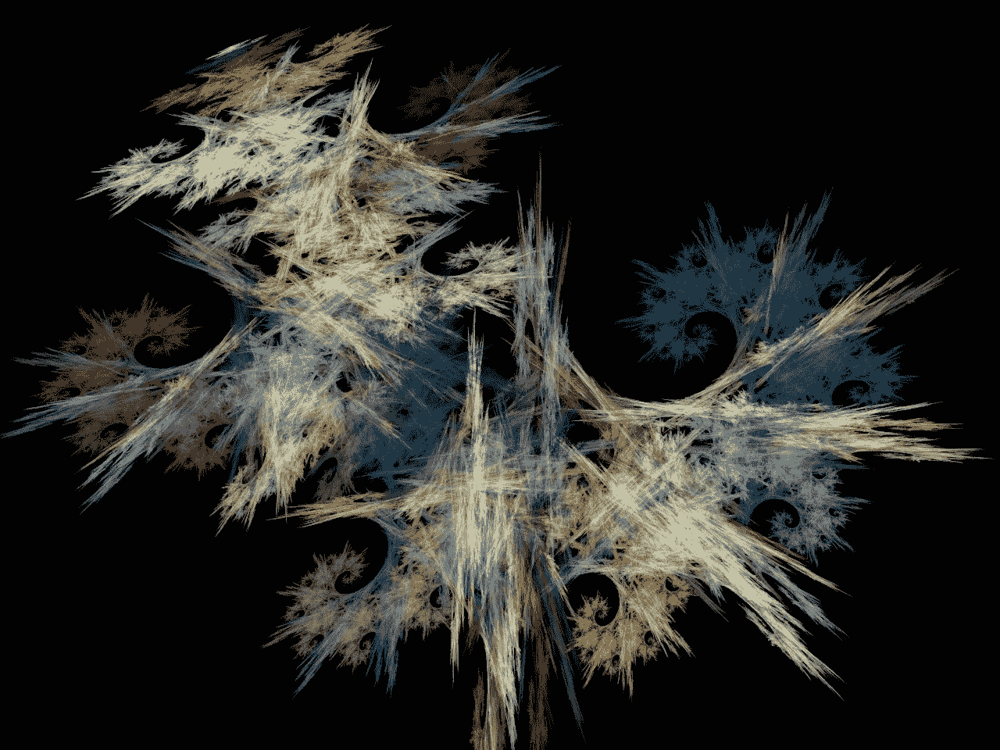

# 如何成为一名计算机科学家

> 原文：<https://towardsdatascience.com/howto-became-a-computer-scientist-2ecb6e9e7835?source=collection_archive---------4----------------------->

Just cool fractals made by [Nick Spratt](https://www.flickr.com/photos/112587493@N02/)

经常有人问我如何成为一名计算机科学家。这就是为什么我决定描述我自己的道路。当然，网上已经有很多其他的教程了，所以这里我只收集它们并把它们合并成一个。此外，由于每个人的知识水平不同，因此是否跳过某些部分由您决定。

主要学习可以分为四个主要主题:附加资源、数学、编程和机器学习本身。

## 其他来源

有些资源是完全可选的，不是理解该领域所必需的。但是如果你覆盖了它们，学习其他的东西就容易多了。

*   [学习如何学习(Coursera](https://www.coursera.org/learn/learning-how-to-learn) )。它将向你解释我们的大脑是如何工作的，以及如何利用这些知识进行更快更好的学习。我强烈建议在开始学习之前先通过这门课程，它真的很有帮助。
*   [数学思维入门(Coursera)](https://www.coursera.org/learn/mathematical-thinking) 。这门课程让你了解如何不用数学，而是用数学来思考。“数学思维不同于做数学——至少不同于我们学校系统中典型的数学”。如果你打算深入研究数据科学的数学方面，这将是适用的。

## 数学

为了计算机科学的目的，你至少应该知道*线性代数*和*概率和信息理论*。目前我还没有为这些主题选择资源，但是简介在[深度学习书籍，第一部分](http://www.deeplearningbook.org/)中有很好的介绍

如果你觉得深度学习的书很复杂——试着通过可汗学院的[线性代数](https://www.khanacademy.org/math/linear-algebra)和[统计和概率课程](https://www.khanacademy.org/math/statistics-probability)。

## 编程；编排

作为一门编程语言，我会选择 [Python3](https://www.python.org/) ，因为它易学易用。我建议通过这样的书去接触它:

*   [思考 Python](http://greenteapress.com/wp/think-python-2e/)——一本介绍 Python 世界、算法和编程的书。
*   [深入研究 Python](http://www.diveintopython3.net/)—Python 的更深入的用法。它会通过例子教你如何使用这种语言。
*   [Python 食谱](http://chimera.labs.oreilly.com/books/1230000000393) —带讨论的现成 Python 示例。
*   [流利的 Python](http://shop.oreilly.com/product/0636920032519.do)——成为真正的 Python 高手。
*   [用于数据分析的 Python](http://shop.oreilly.com/product/0636920023784.do)—描述如何使用 Python 库，如 numpy、pandas、matplotlib 和其他用于数据分析的库。
*   Scipy 课堂笔记——完全免费的笔记，在这里你可以学习如何使用主要的 Python 包，也是为了科学。

另一个对你有用的话题是:

*   linux/unix 系统和 bash。看一看[这个教程](http://ryanstutorials.net/linuxtutorial/)。
*   版本控制系统，比如 GIT。[这里有个很酷的在线教程](https://try.github.io)，大概 30 分钟就能传过去。

## 机器学习

在学习了数学基础和一些编码之后，您可以开始学习 ML 本身:

*   阅读 [Adam Geitgey 系列博文](https://medium.com/@ageitgey/machine-learning-is-fun-80ea3ec3c471)。至少有几个。他们会给你一些想法，机器学习到底是关于什么的，为什么它如此酷和有趣。
*   来自 AndreNg 的 Pass 入门课程—可在 [Coursera](https://www.coursera.org/learn/machine-learning) 和[斯坦福网站](http://cs229.stanford.edu/)获得。它将描述机器学习的主要原理和应用。出于教育目的，本课程使用 Octave 作为主要语言，但使用它很容易理解。课程中还有对 Octave 的介绍。
*   利用所学知识，尝试通过 Kaggle 的一些入门比赛，如[泰坦尼克号:灾难机器学习](https://www.kaggle.com/c/titanic)或[数字识别器](https://www.kaggle.com/c/digit-recognizer)。 [Kaggle](https://www.kaggle.com/) 本身“是作为一个预测建模和分析竞赛的平台而成立的，公司和研究人员在这个平台上发布他们的数据，来自世界各地的统计学家和数据挖掘者竞争产生最好的模型”( [wiki](https://en.wikipedia.org/wiki/Kaggle) )。为了解决入门任务，我建议你学习一种用于机器学习的 Python 框架: [scikit-learn](http://scikit-learn.org/) (更容易)或 [tensorflow](https://www.tensorflow.org/) (更难)。在 udacity 有一个关于 tensorflow 的相当不错的[课程。](https://www.udacity.com/course/deep-learning--ud730\)
*   通过 [CS231n:用于视觉识别的卷积神经网络](http://cs231n.stanford.edu/)斯坦福课程。它将教你如何将机器学习应用于图像。
*   从教程中改进结果。开始在你自己的项目中使用机器学习。实验算法/神经网络架构。
*   不要犹豫尝试任何其他框架，如 Theano、Caffe、Pytorch 等。
*   端到端阅读[深度学习书籍](http://www.deeplearningbook.org/)。
*   看一些报纸。尝试自己实现一些模型。
*   更新一些型号。发表自己的论文。

## 结论

我希望这样的途径对你有用。以后我会尽量用相关资源更新。所以请在评论中随意指出一些有趣的东西。感谢阅读！