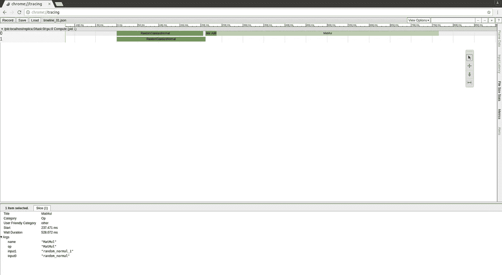
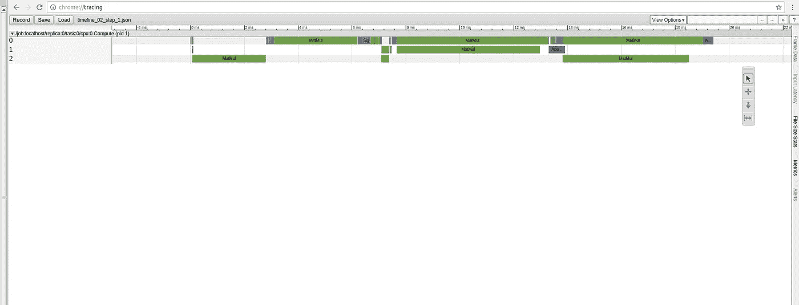
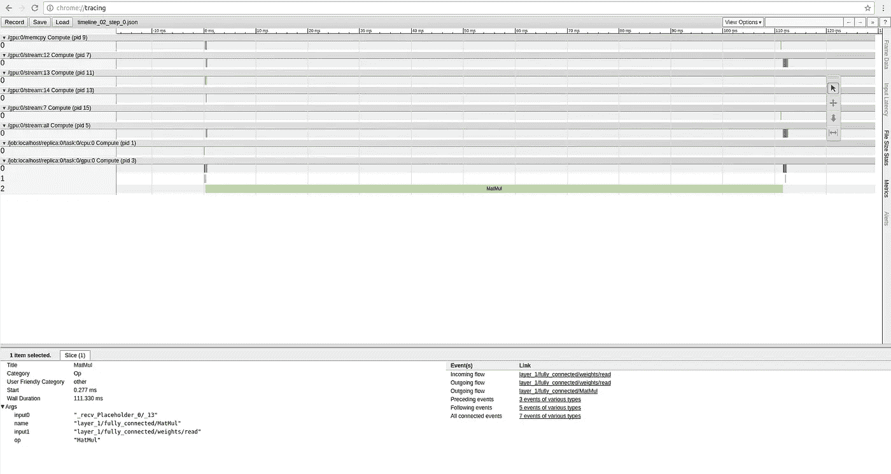
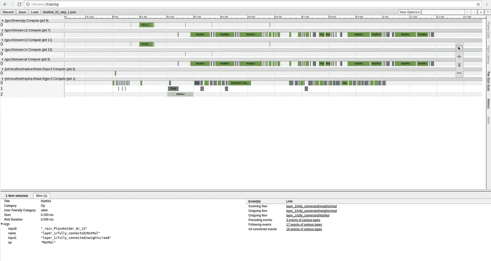
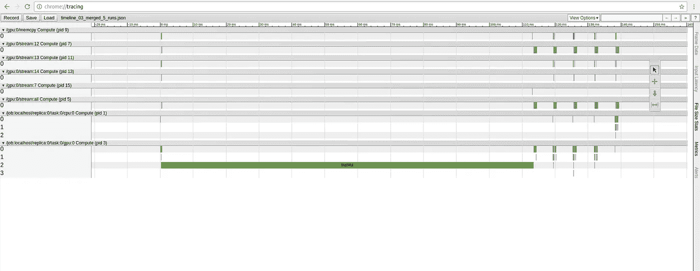
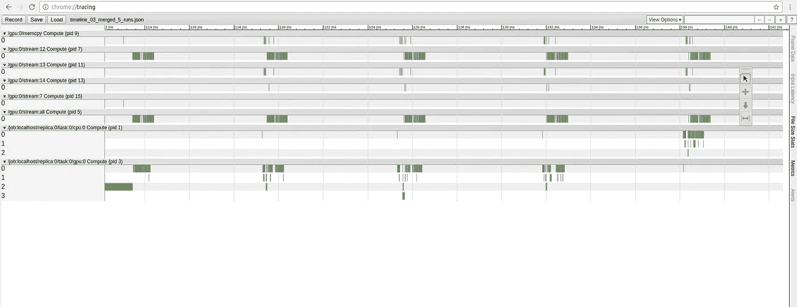

# 如何分析张量流:

> 原文：<https://towardsdatascience.com/howto-profile-tensorflow-1a49fb18073d?source=collection_archive---------1----------------------->

现在 TensorFlow 是机器学习最常用的库之一。有时，绘制张量流图并了解哪些操作花费更多时间，哪些花费更少时间可能非常有用。这可以通过 tensorflow `timeline`模块完成。不幸的是，我找不到任何清晰的教程如何使用它。因此，在这篇博文中，我将尝试解决这个问题，涵盖以下主题:

*   如何执行张量流代码的剖析？
*   如何合并多个会话运行的时间线。
*   分析过程中可能会出现哪些问题以及如何解决这些问题。

## 简单的例子

首先让我们定义一个简单的例子，然后是 [StackOverflow 回答](http://stackoverflow.com/questions/34293714/can-i-measure-the-execution-time-of-individual-operations-with-tensorflow/37774470#37774470):

您应该注意到为会话运行提供了额外的`options`和`run_metadata`。这个脚本应该在 CPU 和 GPU 上运行。执行之后，我们将拥有一个`timeline_01.json`文件，其中包含以 Chrome trace 格式存储的分析数据。如果您的脚本失败了——请尝试来自【profiling 期间的问题部分的第一个解决方案。

要查看存储的数据，我们应该使用 Chrome 浏览器(不幸的是，据我所知，只有它支持自己的跟踪格式)。进入`chrome://tracing`页面。在左上角，你会发现`Load`按钮。按下它并加载我们的 JSON 文件。



Example profiling of our simple script on CPU.

在顶部，你会看到以毫秒为单位的时间轴。要获得一些操作的更精确的信息，只需点击它。同样在右边，有简单的工具存在:选择，平移，缩放和计时。

## 更复杂的例子

现在让我们用一些占位符和优化器来定义更复杂的例子:

现在我们的操作存储在变量作用域下。使用这种方法，操作名称将以作用域名称开始，并在时间线上明确区分。

此外，代码存储三次运行的跟踪。如果我们在 CPU 上执行脚本，我们会收到三个相对相似的时间线，如下所示:



Profiling second script on CPU.

但是，如果我们检查来自 GPU 分析的结果，第一个结果将与接下来的结果不同:



Profiling second script on GPU, 1-st run.



Profiling second script on GPU, 2-nd or 3-rd run.

你可能会注意到，第一次运行比以后的运行花费更多的时间。这是因为 tensorflow 在第一次运行时会执行一些 GPU 初始化例程，稍后会对它们进行优化。如果你想要更精确的时间线，你应该在运行一百次左右后存储轨迹。

此外，现在所有输入/输出流都以变量作用域名称开始，我们确切地知道一个或另一个操作在源代码中的位置。

## 在一个文件中存储多次运行的时间线

如果出于某种原因，我们希望在一个文件中存储多个会话运行，该怎么办？不幸的是，这只能手动完成。Chrome trace 格式中存储了每个事件及其运行时间的定义。在第一次迭代中，我们将存储所有数据，但是在下一次运行中，我们将只更新运行时间，而不是定义本身。这里只是合并事件的类定义，完整的例子你可以[在这里找到](https://github.com/ikhlestov/tensorflow_profiling/blob/master/03_merged_timeline_example.py):

我们收到了很酷的合并时间线:



Merged profiling for 5 runs.

看起来初始化还是需要很多，我们放大到右边:



Merged profiling for 5 runs zoomed.

现在我们可以看到一些重复的模式。运行之间没有任何特定的分隔符，但我们可以在视觉上区分它们。

## 分析期间的问题

在剖析过程中可能存在一些问题。首先，可能根本行不通。如果您遇到了类似这样的错误:

```
I tensorflow/stream_executor/dso_loader.cc:126] Couldn't open CUDA library libcupti.so.8.0\. LD_LIBRARY_PATH:
```

你确定不按预期对所有作品进行概要分析，它可以通过安装额外的库`libcupti-dev`根据 [GitHub 问题](https://github.com/tensorflow/tensorflow/issues/5282)得到解决。此命令应该可以修复所描述的错误:

```
sudo apt-get install libcupti-dev
```

其次是运行过程中的延迟。在最后一张图片上，我们看到了运行之间的间隙。对于大型网络，这可能会花费大量时间。这个 bug 不能完全解决，但是使用定制的 C++ protobuf 库可以减少延迟。在 [tensorflow 文档](https://www.tensorflow.org/install/install_linux#protobuf_pip_package_31)中清楚地描述了如何执行安装。

## 结论

我希望通过这样的分析，您能更深入地了解 tensorflow 的内部情况，以及您的图表的哪些部分可以优化。所有已经在 CPU 和 GPU 上生成时间线的代码示例都存储在[这个 repo](https://github.com/ikhlestov/tensorflow_profiling) 中。

感谢阅读！