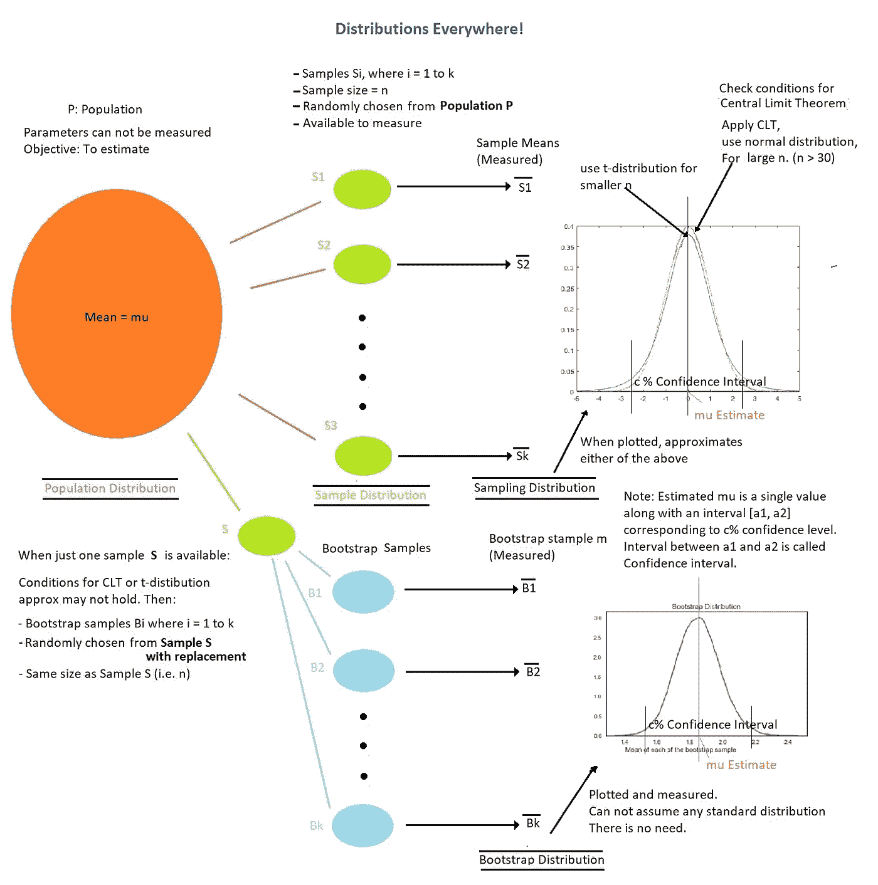
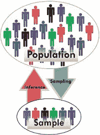
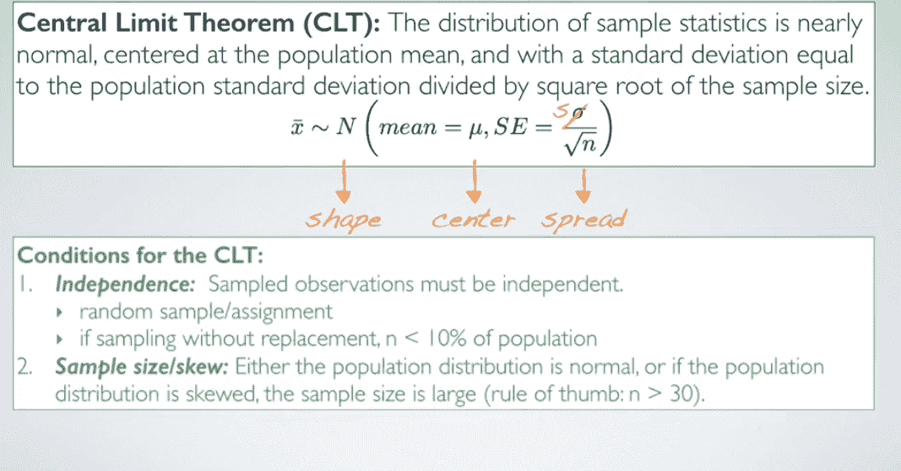
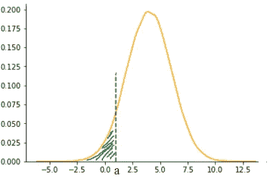
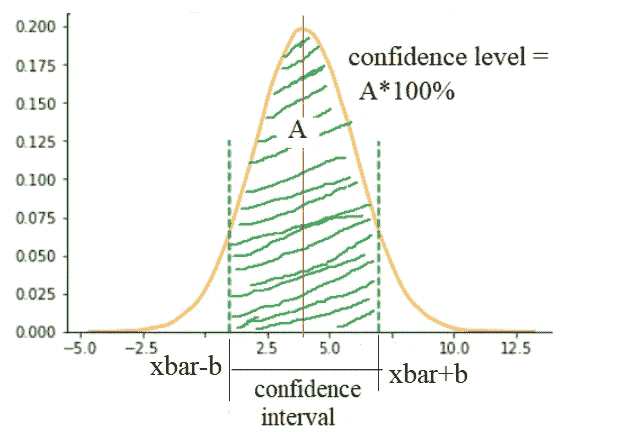
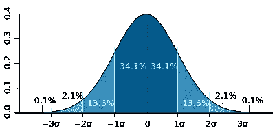
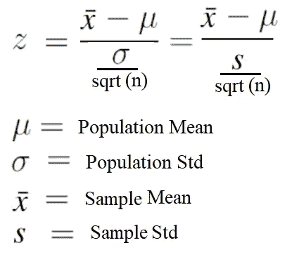

# 一个小样本能告诉我们关于一个大群体的什么？—第一部分

> 原文：<https://towardsdatascience.com/https-medium-com-aparnack-what-can-a-small-sample-teach-us-about-a-big-population-part-1-b7c048c22bf2?source=collection_archive---------6----------------------->

## **理解基本术语**

[Pixabay](https://pixabay.com/photos/goal-portal-gate-door-input-3144351/)

# 简介:

推断统计学:它是什么？查看[这里](https://en.wikipedia.org/wiki/Statistical_inference)的正式定义。推断统计学和数据科学是如何关联的？推断统计学通过从大量数据(总体)中抽取一个小的子集(样本)来帮助估计数据中的未知量，并检查我们对未知量的假设。这对学习机器学习的底层原理很重要(跳到最后看看怎么做)。它是营销数据科学的面包和黄油。

推断统计是非常基本的，但被低估的概念。大多数数据科学训练营只是触及了皮毛。然后是[关于 p 值黑客](https://fivethirtyeight.com/features/science-isnt-broken/#part1)和样本测试无用的帖子，因此使我们中的一些人能够愉快地忽略这一部分。我是推断统计学的粉丝之一。

当我第一次通过这个 [coursera](https://www.coursera.org/learn/inferential-statistics-intro/) 课程学习时，推理统计学给了我很大的刺激。我想写一写它，但是想知道用一个像温度数据这样的小数据集来展示它是否有趣。在做了一些研究之后，我确信我将要在这里展示的东西会引起人们的兴趣。为什么？那是你看完之后决定的。以下是我认为你会感兴趣的原因。大多数研究从 t-检验/z-检验的公式开始，定义诸如误差范围、z-stat 等术语以及如何计算它们。在这篇文章中，公式出现在最后，所有的困惑都被正面处理。

在阅读任何与统计相关的文章时，很容易感到困惑。我将尽可能地强调混淆点，基于我在道路上混淆的地方(当第一次学习概念时)。

# **先决条件:**

没有推断统计学的先验知识。然而，你应该知道什么是均值、标准差、方差、条件概率、分布函数、正态分布和中心极限定理(CLT)。如果你不知道 CLT，请浏览这个由可汗学院制作的[短片](https://www.khanacademy.org/math/ap-statistics/sampling-distribution-ap/sampling-distribution-mean/v/central-limit-theorem)或阅读这篇[文章](https://en.wikipedia.org/wiki/Central_limit_theorem)。如果你不知道其他条款，请不要马上阅读这篇文章。首先从一个在线课程(Coursera，datacamp，Udacity，任何一个取决于你对什么感兴趣)中学习“描述统计学”,然后回来。这是一个很大的话题，因此我决定写一系列的帖子。这篇文章将有术语介绍。

# 术语和直觉:

看这张照片。这是您在进行任何样本测试并满怀信心地报告您的发现之前，至少需要了解的内容！！

Image: Drawn by myself

**人口:精确分布或汇总统计数字未知的一组数字。** *(你只有一些想法，不能称之为“已知”)*

例如:全世界人的体温，印度农村儿童的智商，某一种花的萼片长度。你说吧！

样本:来自总体的一小部分。混乱从这里开始。“样本”是一个数字吗？不，这是一组数字。

Taking Sample and Drawing Inferences (Image Courtesy: Google Images)

例如，人类心率的 100 次测量。这是人类心率群体的样本。它不是人口的“样本”。如果您有 3 组不同的 100 个测量值，那么就是人口的 **3 个“样本”。**获取样品的过程称为**取样。**这里的数字 100 是**样本量，**通常用 **n** 表示。通常当取 1000 个大小为 100 的样本时，会有将 1000 混淆为 n 的倾向。

样本不必总是从总体中抽取。也可以从另一个样本中取样！

可以进行采样，

I)无替换:来自总体或原始样本(从中进行抽样)的每个成员在所取样本中只能出现一次。

ii)替换:总体或原始样本(从中进行抽样)中的每个成员可以出现与样本大小一样多的次数。替换取样在开始时似乎有点奇怪。

**样本分布:**样本分布。这通常使用直方图命令绘制(对于 Python 用户，为 matplotlib.pyplot.hist 或 seaborn.distplot)。样本是总体的一个子集，因此，在没有替换的情况下进行抽样时，分布的形状类似于总体分布。然而，我们应该始终意识到这只是一个近似值，因为它是总体的一个抽样版本。当样本量 n 足够大时，这通常足以收集关于总体的大量信息。

**样本中心:**中心指均值、众数或中位数。一个样本的中心靠近人口的中心，这就是为什么我们要取样并试图了解他们的原因。永远记住这篇文章的开头句子。我们的目标是理解/估计未知量，即总体及其参数/统计量。

**样本的离差:**离差可以指以下任何一项:方差、范围值，或通常指距中心的几个标准差。样本分布是总体分布的近似值。仔细阅读下一句话:很多时候，从样本中心估计人口中心(例如:平均值)的公式将需要*人口分布*(比如标准差)的值，显然这是不可测量的(人口参数是不可测量的)，因此在公式中，我们使用样本分布。

还有一个术语叫做**抽样分布**，也叫 **Bootstrap 分布。**如上图所示，以样本均值作为感兴趣的统计量。

**抽样分布:**我们可以从总体中抽取 N 个大小为 N 的样本，并测量样本统计量。这些测量值的分布称为抽样分布。

这是另一个困惑点。近似总体分布的*样本分布*和作为测量样本统计量(如均值)分布的*样本分布*是不同的。

**中心极限定理的妙处**:回想一下，对于一个正态分布，均值、中位数、众数都是一样的。还记得我们用样本分布代替总体分布。

Image courtesy: Screen capture from [coursera](https://www.coursera.org/learn/inferential-statistics-intro/) inferential statistics course

样本均值的抽样分布(不是总体均值的抽样分布！)理论上是以“人口平均数”为中心的。请注意，测量真实的总体平均值是不可能的。经常(conf)使用*【估计】*样本均值是正常的。这是不对的。样本可用，因此其平均值是**测量值，**不是估计值。这种抽样分布的标准偏差是 n 的平方根的“理论总体标准偏差”。这被称为平均值的标准误差，或 **SEM** 。

现在，我们如何用 CLT 来从 N 个**样本均值**中估计总体均值？N 是每个样本的大小，N 是样本的数量。CLT 的有用性来自于这样一个事实，即人们可以通过增加样本大小 n 来提高获得更好估计的机会，即降低估计中的误差。N 越高，正态曲线越平滑，视觉效果越好，但这并不影响估计的理论精度。人们通常很容易混淆 n 和 n。请试用这个免费工具，通过研究不同类型的人口分布和不同的 n 和 n 值来了解 CLT

 [## 平均值的中心极限定理

### 编辑描述

gallery.shinyapps.io](https://gallery.shinyapps.io/CLT_mean/) 

我认为触及 bootstrap 也很重要，因为基于 CLT 的人口参数估计不够通用。

[**Bootstrapping**](https://en.wikipedia.org/wiki/Bootstrapping_(statistics))**:**Bootstrapping 技术在无法应用 CLT 时很有用，因为要么假设不成立，要么我们感兴趣的是统计而不是均值。如果只有一个大小为 n 的样本可用，我们通过复制这个样本来创建更多的样本。要做到这一点，用更换的样品再次进行相同大小(即 n)的取样。注意，如果自举采样是在没有替换的情况下进行的，我们得到的是原始样本本身，这是没有用的。这使我们能够估计人口的任何统计数据，不像基于 CLT 的估计，这只是为了平均。

**Bootstrap 分布**:假设我们取 N 个这样的样本，称为 **Bootstrap 样本。**测量每个样本的感兴趣的统计量，这种测量被称为“引导复制”。这些副本的分布称为引导分布。N 越大，绘制的分布越平滑。

**置信区间**和**置信水平**:我们有这个正态分布，就是样本均值的概率分布(pdf)。就像所有的 pdf 一样，这条曲线下的面积是 1。出于所有计算目的，我们将其视为理想的正态曲线，即围绕平均值对称。

Plot showing P(Sample mean < a) as shaded green area

上述曲线的含义:如果从总体中随机抽取一个大小为 n 的样本，测量样本均值(xbar)，**xbar 小于某个值“a”的概率为= a**(绿色虚线)处垂直线左侧的曲线下面积。理解这一点非常关键。这将有助于理解这篇文章的剩余部分和这个系列的下一篇文章，解释 p 值，假设检验。

假设 xbar 是这条曲线的平均值。样本均值在区间[xbar-b，xbar+b]内的概率就是该区间内曲线下的面积，把这个面积数称为 a .直观地表示出来，

Figure demonstrating the confidence interval corresponding to a confidence level

上界为 1(因为是概率)。 **[xbar-b，xbar+b]是对应于置信水平 A*100%的总体均值估计的置信区间。**一种解释方式是，如果从总体中抽取 100 倍的随机样本并测量其平均值，则 A*100 倍的平均值预计位于区间[xbar-b，xbar+b]。

对于较大的 A，置信区间较长(较宽),对于较小的 A，置信区间较短。**混淆点:**置信水平 Vs 置信区间。置信区间是长度**和 x 轴**的一部分。置信水平为**面积**，为曲线下面积的**部分；在这种情况下，两者之间存在一对一的关系。**

**z-stat** : z-stat 更多时候被看作是一个公式，而不是直观的。z-stat 只是一个用于计算与所选置信水平相对应的标准偏差的实数的别称。**换句话说，要得到一个*100%的曲线下面积，两边要取多少个均值周围的标准差？那是你的 z-stat。**人们经常会混淆 z-score 和 z-stat。z-score 用于(样本的)任何单个数据点，z-stat 用于样本统计。

Image courtesy : [Wikipedia](https://en.wikipedia.org/wiki/Standard_deviation)

深蓝色是平均值两边的一个标准差。对于正态分布，这占集合的 68.27%(对于 A = 0.6827，z-stat = 1)；而平均值的两个标准偏差(中蓝色和深蓝色)占 95.45%；三个标准差(浅蓝、中蓝和深蓝)占 99.73%；四个标准差占百分之 99.994(对于 A = 0.99994，z-stat=4)。z-stat 和置信水平/区间具有 1-1 的关系。陈述其中一个就足以找出其余的。

有人可能想知道我们熟悉的 z-stat 公式在哪里。这是你在想的吗？

如果您有一个带有均值 xbar 和样本标准差的样本，

Formula for z-stat

可以这样想，有一个正态分布，以真实的总体平均值为中心，人们试图找出随机抽取的样本平均值 xbar 位于各种蓝色阴影中的哪个区域。

**误差范围:**使用 CLT 完成所有估算后，如何陈述结果？你知道在我们上面定义的均值估计中有一个标准误差。希望你明白它的意思。那么，它如何转化为真实人口的误差呢？误差幅度对应于一些标准偏差或置信水平。标准差是 sqrt(n)*SEM。可以将结果表述为，“我对总体均值的估计= xbar +- z-stat *样本 std”(回想一下，样本 std 只是总体 std 的一个替代)

**这里可能会出现混乱**:**人口均值估计中对应 A*100%置信度**的误差幅度**是 b** ？**否**。这通常是我在许多 Python 笔记本中观察到的基于估计值测量总体参数正常范围的错误。事实上 xbar+ b 或 xbar -b 是*抽样分布*图的 x 轴上的点，而不是*人口分布*上的点。A*100%对应的总体均值的误差幅度实际上会是 xbar +- z-stat* sqrt(n)*b，为什么？回忆一下中心极限定理和由此产生的分布的标准差。它是总体的标准差/ sqrt (n)。直观上，真实总体均值的置信区间更宽，因为其标准差是 sqrt(n)倍。(抱歉重复，我认为在统计学研究中，重复和重新措辞有助于概念的强化)

从本质上讲，取样和测量样本均值的整个过程有助于估计总体均值。样本量越大，平均值的标准误差越小，相同 b(相同宽度)的 A(更高置信度)越高。

# 与机器学习的关系:

以多元线性回归为例。一个是试图拟合一条 n 维直线 y = f(x)，其中 f(x) = a0 + a1*x1 +a2*x2 + …。an * xny 是目标变量，x1 到 xn 是特征，a0 是截距，a1 到 an 是系数。每个特征向量在机器学习中称为一个样本，这个样本类似于上面段落中讨论的样本。这里，f(x)实际上是将特征向量 x 与 y 相关联的真实函数的估计值。f(x)是使用称为训练数据的一组特征来估计的。使用称为测试数据的另一组样本来测试这种线性拟合 f(x)。群体是从中抽取训练样本、测试样本的整个集合，并且群体具有许多我们从未见过的样本(这就是为什么再多的测试也不能保证 ML 算法的性能)。a0 到 an 类似于 xbar。就像 xbar 是作为几个样本平均值计算出来的，a0 到 an 是从总体的几个样本计算出来的。解释机器学习算法基础的书籍也谈到了系数估计的置信区间。现在，你也许能更好地和他们相处。

编辑:1。中心极限定理是理解当构建多个树以形成集合(如在 Bagging 分类器、随机森林等中)时为什么过度拟合(方差)减少的关键。

2.“B”oot spatting 和“Agg”regating 是使它“bagging”的原因。因此，如果一个人理解自举背后的直觉，他会更好地记住 Bagging 分类器及其修改版本 Random Forest。

# 结论:

希望到本文结束时，一些术语已经很清楚了，我们已经为这个系列的下一部分做好了准备。在下一篇文章中，我将借助 python jupyter notebook 分析的人体体温数据来解释所有这些术语。我还计划引入新的术语，并举例说明假设检验(1 样本，2 样本检验)。在那之前，希望你喜欢阅读这篇文章，并在这里提出问题。我强烈建议做一个谷歌搜索，从多个来源阅读，看看你的理解是否超越了公式。不同的资源有时会有不同的符号，如果你的大脑很清楚，尽管阅读不同的资源，你应该保持清晰。

# 审查学分

该系列由数据科学社区的活跃人士之一进行审查后发布: [Megan Silvey](https://meganesilvey.wixsite.com/mysite)

你可以去我的 [github](https://github.com/aparnack/data_science) 查看我的数据科学工作。在[推特](http://www.twitter.com/aparsha2303)上关注我，听听关于数据科学/机器学习/哲学的偶然想法。如果有任何令人兴奋的合作机会，请给我发邮件到 aparnashastrymls@gmail.com