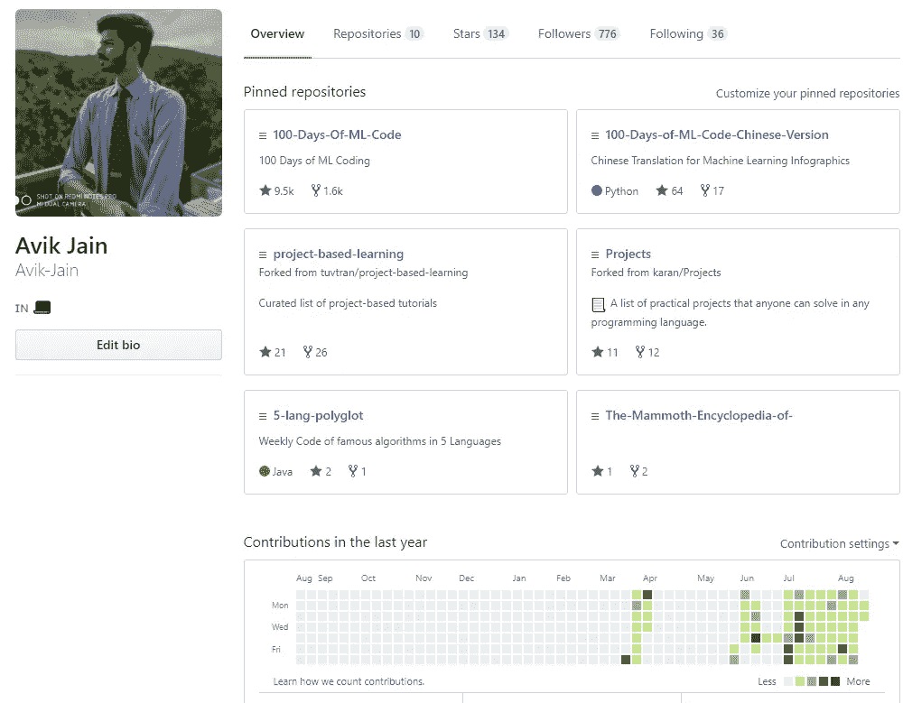
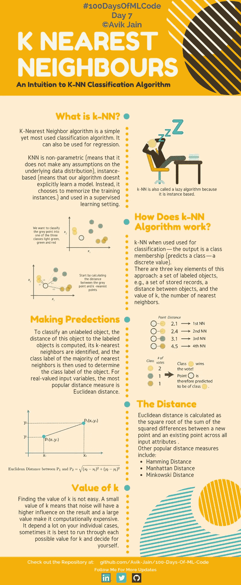

# 机器学习之旅

> 原文：<https://towardsdatascience.com/https-medium-com-avikjain-journey-to-machine-learning-62105b2de077?source=collection_archive---------10----------------------->

你会让人工智能代表你做决定吗？—如果是的话，那么到什么程度，可能你的人生就靠它了。随着所有关于人工智能的讨论和对其监管的呼吁(显然人工智能有一天会杀死我们所有人)，我一直在思考在什么情况下我们可能会从机器(称之为人工智能)那里拿走决策权。但是我们仍然(尽我们所能)利用它们——这并不像听起来那么疯狂，因为人类已经这样做了很多年。它无处不在，我们无法回避它会一直存在的事实。

Source — [https://www.reddit.com/r/memes/comments/8s6wq1/terrifying_artificial_intelligence](https://www.reddit.com/r/memes/comments/8s6wq1/terrifying_artificial_intelligence/?utm_source=ifttt)

从苹果个人助理 Siri 令人难以置信的友好声音，到《前玛奇纳》这样的电影，al 总是比任何其他东西都更让我兴奋。我不知道你怎么想，但是网飞可以根据你对以前看过的电影的反应来预测电影的推荐列表，这个想法听起来很吸引我。有一天，不知从哪里我在 Youtube 上看到了 Siraj Raval 的一个视频，他在视频中谈到了一个叫做#100DaysOfMLCode Challenge 的东西。这意味着在接下来的 100 天里，每天至少花一个小时来编码和学习机器学习。我强烈推荐看一下[视频](https://www.youtube.com/watch?v=cuQMBj1cWPo)。

这正是我开始深入学习我一直关心的东西所需要的动力。所以我接受了这个挑战，开始学习机器学习。

从最基本的算法开始，用 Python 语言实现它们。
为了对我所学的一切有一个好的日志，我在 GitHub 上创建了一个知识库。我强烈建议你也这样做。随着我不断学习关于 ML 的新东西，我也用实现 ML 算法的代码和一些信息图更新了[库](https://github.com/Avik-Jain/100-Days-Of-ML-Code)，以便更好地理解。

Some of the Infographics

我收到的关于这个库的回应非常热烈，至少可以说，我没有预料到这一点。人们一直在社交媒体的各个角落支持我，这无疑让我感到谦卑，我想借此机会感谢所有为我付出宝贵时间的人。

Checkout My Repository

数字在这里无关紧要，因为我这样做不是为了名声或任何知名度。我这样做是因为我想这样做，我关心它，我相信我可以有所作为。

K — Nearest Neighbor Info graphic

综上所述，我认为我现在只是在学习，在这个快速变化和不断发展的世界里，我认为你永远不会真正完成学习。这只是一个很大的学习曲线。说实话，目的地还不在这里，我甚至还没有接近。但是我知道我的道路是正确的，我的思想集中在实现我渴望做的事情上。因此，我想挑战现在正在阅读这篇文章的每一个人，来加入我的旅程，参加#100DaysOfMlCode 挑战
，开始每天的工作。

如果你对人工智能领域不感兴趣，这不是问题也不是借口，找一些你关心的事情，一些感觉不像工作的事情，一些你可以奉献一生的事情。莱斯·布朗曾经说过，“要想在生活中取得任何有价值的成就，你必须要有饥饿感。”渴望成功，追随你的梦想，看着它们成为你的现实。
和我一起开始这段旅程，也许有一天我们会一起到达一个点，在那里我们可以实现我们的梦想，你知道去哪里。

从下面的链接关注我在#100DaysOfMLCode 上的工作—

[Github](http://www.github.com/avik-jain)LinkedInTwitter网站