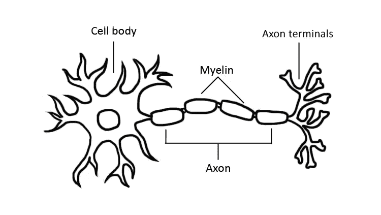
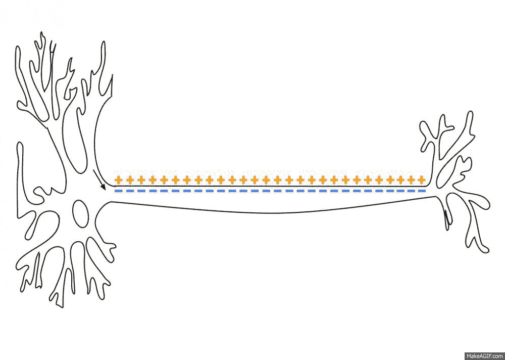
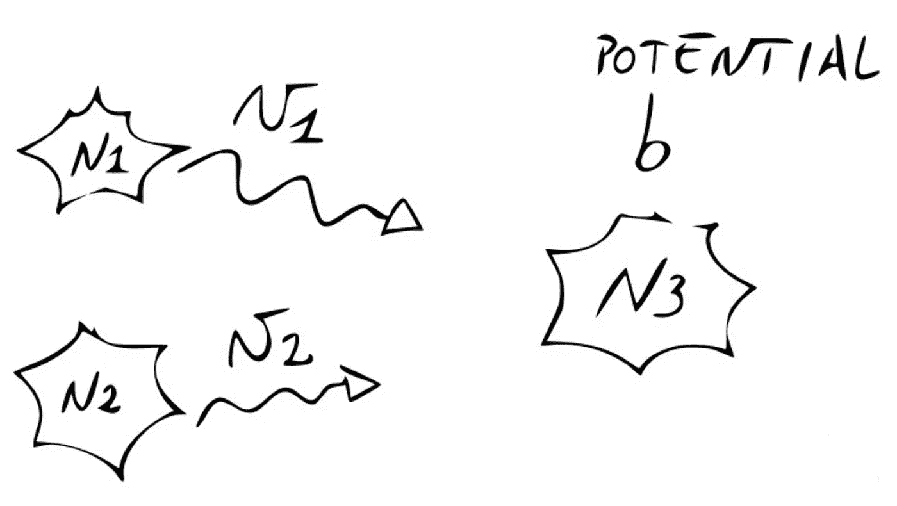
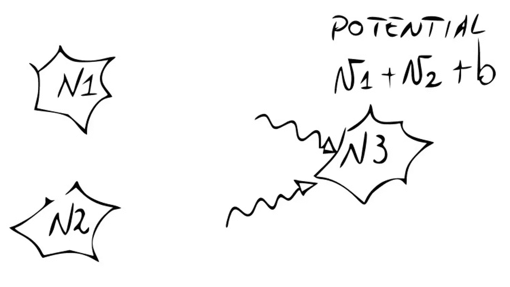
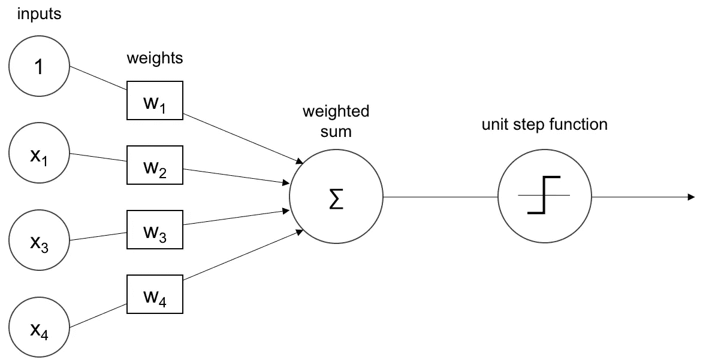
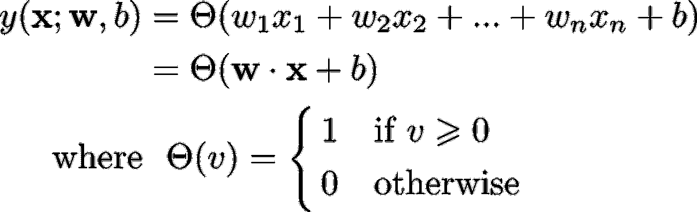

# 感知器:什么、为什么和如何

> 原文：<https://towardsdatascience.com/https-medium-com-francesco-cicala-whats-whys-and-hows-of-perceptron-f87c66f512c5?source=collection_archive---------4----------------------->

如果有一天我们会告诉我们的曾孙们人工智能的故事，它也许应该从感知机开始。

# 生物学导论

> **神经元**是一种电可兴奋细胞，通过电信号和化学信号接收、处理和传输信息。

Very simplified diagram of a neuron

信号通过连接神经元的轴突在神经元之间传播。这种连接发生在发射神经元的轴突末梢和接收神经元的树突之间，在一种称为突触的结构中。

当一个神经元处于静止状态时，即它没有接收到任何信号时，它会受到一个**静止电位**的影响，该电位平均在-70 毫伏左右，并且与神经元内外的电荷差有关。
当一个细胞发出**电** **脉冲**时，一个与之相关的电位通过轴突传播。叫做**动作电位**。

The action potential propagates through the axon

最终，动作电位到达神经元，在那里，电压迅速变化。如果它的值大于某个阈值，所谓的**触发过程**被触发，包括从神经元本身发出信号。
不存在部分发放，即当电位达到阈值时，神经元发放一个强度与接收到的电信号无关的电信号。

Illustration of the electrical chemical signal crossing a synapse. (*Andrii Vodolazhskyi* [*via Shutterstock*](http://www.shutterstock.com/image-illustration/synapse-neuron-cells-sending-electrical-chemical-432573415?src=KfrD36n4CXkPB9oBw3IMGw-1-3)*)*

关于接收电信号的强度，要提两点:
1。当神经元接收到一个或多个信号时，它所经受的电位变化由所接收的动作电位的总和给出。

2.通常，从神经元 N3 接收的信号强度与从该神经元发送的信号强度不同:当通过轴突传播时，强度会根据覆盖轴突的髓鞘的**厚度**而变化。它越厚，信号的色散越小。

# 生物神经元的数学模型

我们可以用一个非常简单的数学模型来形式化这个过程。我们将为上一段中用粗体显示的每个术语分配一个变量:

1.  神经元从 N 个不同细胞接收到的电脉冲由 N 维向量 **x** ，输入向量*描述。*
2.  *静止电位为 ***阈值*** 。如果接收到的动作电位之和达到阈值，神经元就会放电。我会用字母 b 表示阈值，有时候阈值叫做**偏差**。*
3.  *携带电脉冲的轴突的髓鞘越厚，接收的强度越高。事实上，髓磷脂是一种绝缘体，它有助于电脉冲的传导，减少其向新神经元的扩散。乘法因子，代表覆盖连接两个神经元的轴突的髓鞘厚度，在我们的模型中由参数 w 表示，称为 ***权重*** 。如果我们考虑神经元在每个时间步长通过 N 个不同的轴突接收 N 个脉冲的模型，我们得到 N 个权重的向量， **w** 。*
4.  *加权输入和偏置之和有时被称为**感应局部场**，我们将用字母 v 表示:
    *v*=***w***∙***x***+*b**
5.  *神经元的输出表示激发信号的强度，用 y 表示。它是 v 的函数(T21 激活函数)*

## *感知器的架构*

**

*概括一下:一个神经元接收一个 N 维输入 **x** ，用权重向量 **w** 加权。如果诱发的局部场，*v*=***w***∙***x***+*b，*等于或大于零，那么神经元发射一个固定强度的信号，我们说 1。否则，它不会，这意味着发射的强度为 0。*

*我们可以用一个简单的公式将其形式化，使用 **Heaviside 阶跃函数**θ作为激活函数:*

**

*我把 ***w*** 和 *b* 放在分号的右边，以区别于 **x** :其实前者是参数，后者是输入向量。*

*让我们用 Python 实现这个函数:*

# *未完待续——深度学习药丸*

*这是关于深度学习系列文章的第一篇，我称之为 ***深度学习药丸*** 。在下一集里，我们将看到感知器能解决什么样的问题，它是如何学习的，以及它的局限性是什么。我将很快发表，敬请期待！
还有，可以随时在 [Linkedin](https://www.linkedin.com/in/francescocicala/) 和 [Quora](https://www.quora.com/profile/Francesco-Cicala-2) 上和我联系。*

*如果你喜欢这篇文章，我希望你会考虑鼓掌或评论:)*

*很快再见，弗兰克*