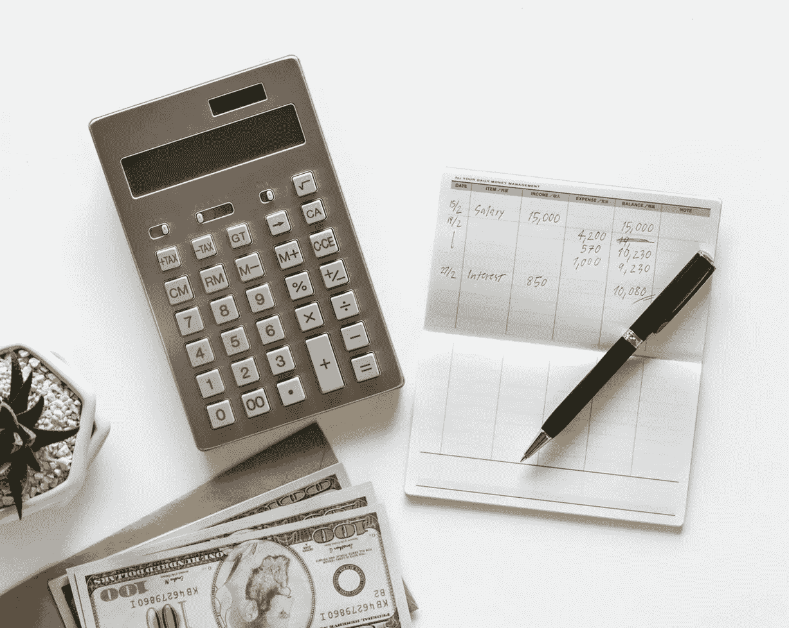
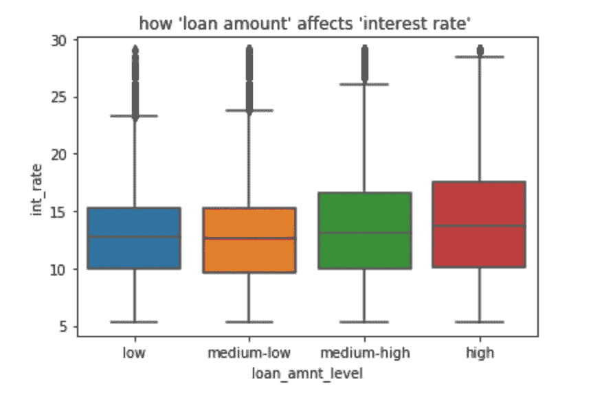
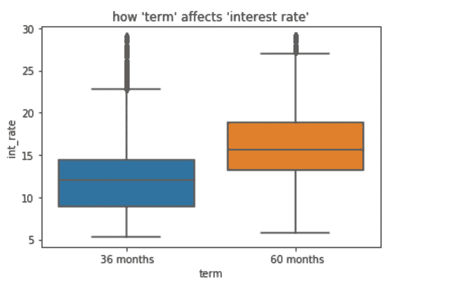
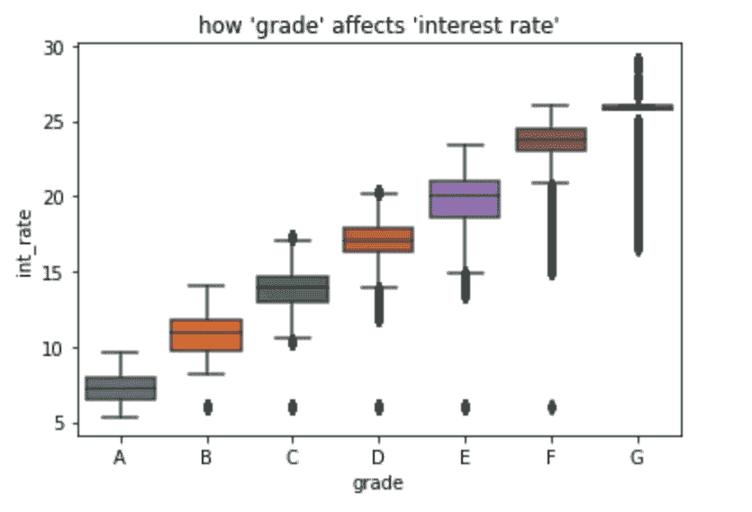
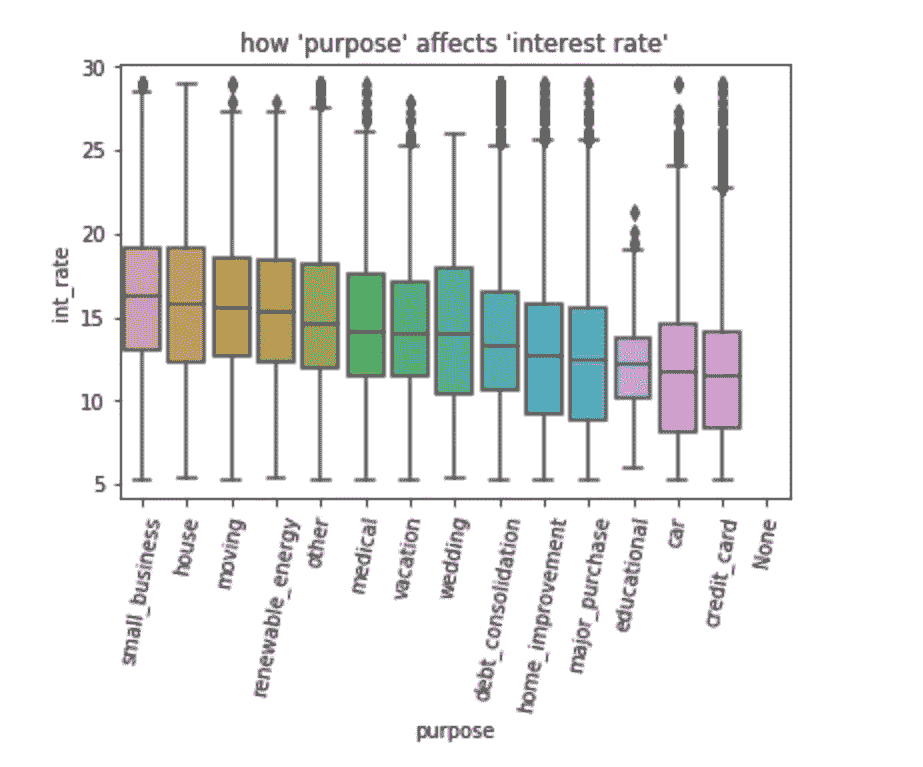
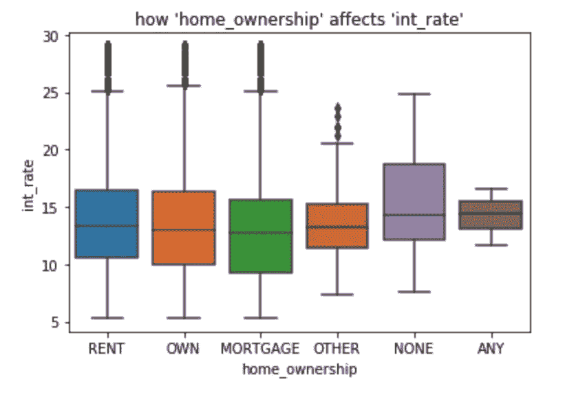

# 是什么推高了利率？

> 原文：<https://towardsdatascience.com/https-medium-com-hisham-hawara-what-drives-up-loan-interest-rates-45c778baafc2?source=collection_archive---------12----------------------->

利率是一种极其强大的金融工具；一方面，它们有创造机会和促进增长的潜力，但另一方面，它们也可能造成沉重的债务、数万亿美元的泡沫，并摧毁它们本应服务的经济体。

但是为什么贷款利率会有如此巨大的差异呢？真正的潜在因素是什么？让我们利用数据科学的力量来探索 Lending Club(美国最大的贷款人)—贷款数据集，以找到满意的答案。

 [## Lending Club 贷款数据

### 分析 Lending Club 发放的贷款

www.kaggle.com](https://www.kaggle.com/wendykan/lending-club-loan-data) 

# **贷款金额:**

不出所料，随着贷款规模的增加，贷款利率也会上升，以适应与贷款相关的风险增加。然而，我们注意到低利率和中低贷款利率相对相同。

# **期限:**

这张图表清楚地表明，期限越长，利率越高。这可能与短期贷款通常涉及较小的贷款金额这一事实直接相关。

# 等级:

为了解释贷款等级的含义，这里有一段瑞恩·高斯林在《大空头》中解释贷款等级及其区别的片段:

The Big Short — (2015)

简单来说，贷款等级是一个公式的结果，它不仅考虑了信用评分，还考虑了来自信用报告和贷款申请的几个信用风险指标的组合。A 的风险最小，G 的风险最大。因此，我们可以理解为什么 A 级贷款的利率最低，而 G 级贷款的利率最高。

# 目的:

这张图表具体显示了贷款的目的如何影响其利率。小企业有最高的利率，这可能是因为他们失败和取消贷款的几率最高。另一方面，信用卡的利率最低。

# 房屋所有权:

与其他住房来源相比，自有住房对贷款利率的影响很小。然而，没有住宿来源增加了兴趣。不出所料，成为沙发冲浪者或无家可归者会大幅提高利率。

很明显，贷款利率是由非常复杂的系统估算的，这些年来，这些系统不断发展，以尽量降低为金融机构提供贷款的风险。然而，这些系统仍然不是最佳的，并且在将来仍然可以添加许多新的因素来改进它们。既然我们已经用数据科学的力量回答了我们的问题，也许我们也可以用它来发现这些因素是什么！