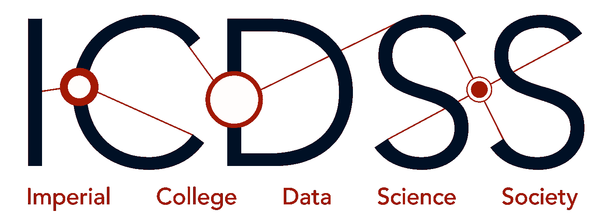
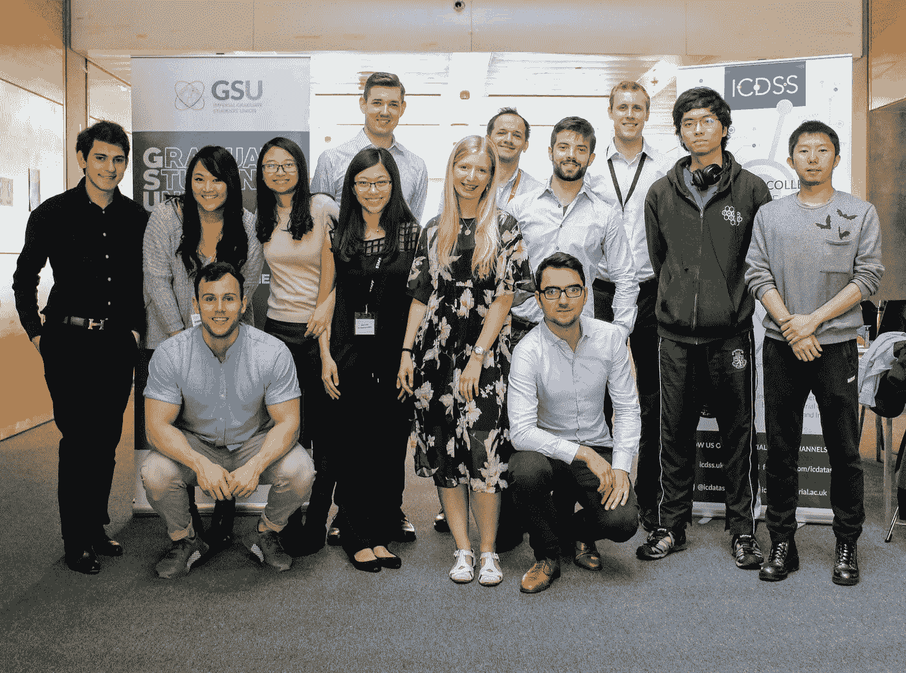
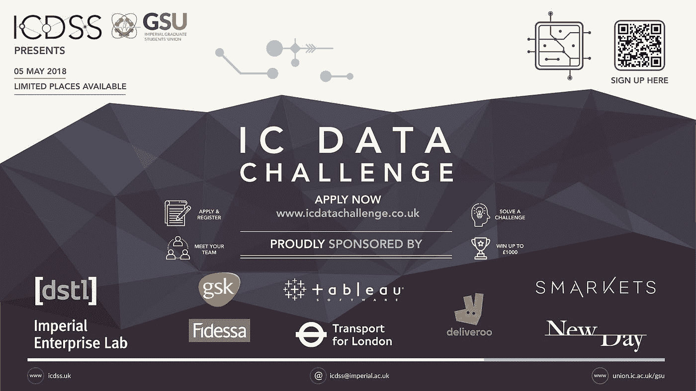
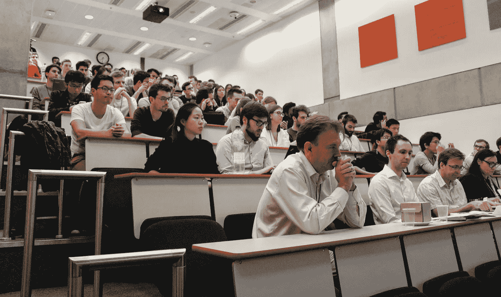
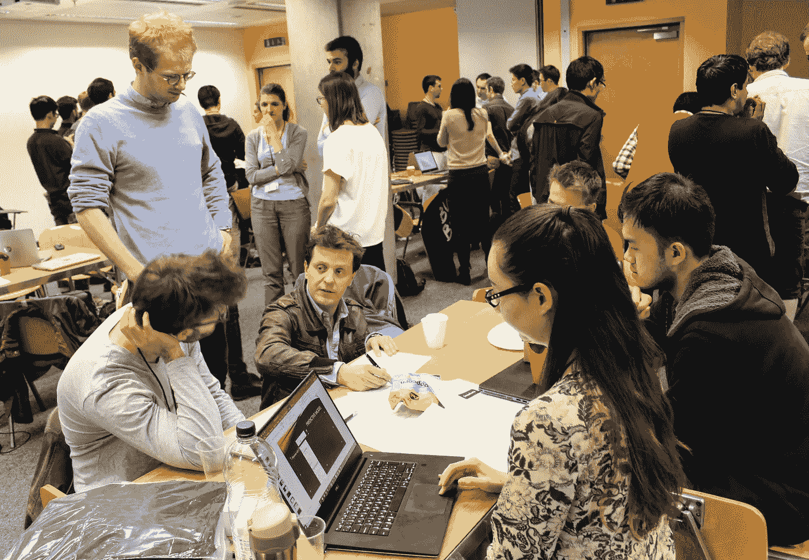
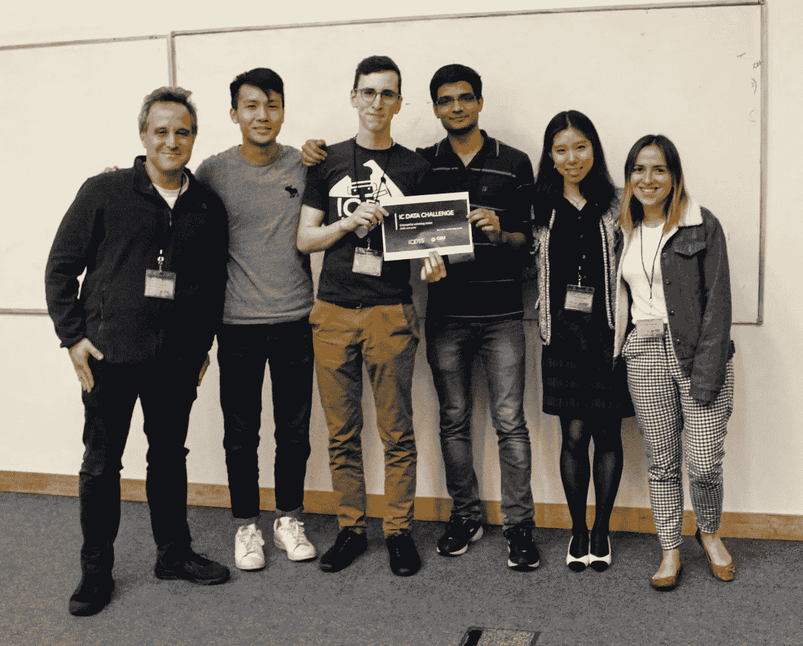

# 我们是如何从零开始组织黑客马拉松的

> 原文：<https://towardsdatascience.com/https-medium-com-hugoperrier-how-we-organized-a-hackathon-from-scratch-75ef5d2c2780?source=collection_archive---------7----------------------->

Photo by [rawpixel](https://unsplash.com/@rawpixel?utm_source=medium&utm_medium=referral) on [Unsplash](https://unsplash.com?utm_source=medium&utm_medium=referral)

通过这篇文章，我旨在揭开黑客马拉松的神秘面纱，降低任何考虑组织黑客马拉松的人的门槛。

我描述的黑客马拉松专注于“数据科学”这个时髦的话题，但是，在我看来，黑客马拉松并不局限于数据或计算机科学。

> 我鼓励任何人加入黑客马拉松冒险，不管他们的背景如何。

# 什么是黑客马拉松？

黑客马拉松这个词是“黑客”和“马拉松”的缩写。“hack”可能用于入侵计算机系统的意思，但我更喜欢寻找快速解决方案(“Hack”)来解决特定问题的广义含义。

> 这个想法是把有积极性的人聚集起来，组成团队，给他们一个挑战，让他们在短时间内(通常是一天或一个周末)解决，然后让奇迹发生！

例子从技术任务——比如发现安全系统的漏洞——到公开挑战——比如就如何改善伦敦人的通勤状况进行头脑风暴。

# 这一切是如何开始的…

11 月 29 日星期三收到的电子邮件

> “亲爱的雨果
> 
> 我目前在伦敦帝国理工学院攻读理学硕士学位，我很好奇你们协会是否会组织一次与数据科学相关的黑客马拉松？
> 
> 最好的，
> 
> SK "

有意思…我们去年想组织一次黑客马拉松，但没有实现…我们应该再试一次吗？

**是的，我就是这样开始的！**但在我描述我的黑客马拉松组织之旅之前，让我自我介绍一下:

我叫雨果·巴黎水，我在法国阿尔卑斯山长大。在洛桑、斯德哥尔摩和苏黎世学习后，我最终去了伦敦攻读流体动力学博士学位。

> *那时，我对“类似黑客马拉松”活动的体验仅限于巴厘岛的“创业周末”，我在那里度过了一个周末，启动了一个商业想法。*

我必须说，起初，组织一次黑客马拉松对我来说听起来很吓人。如果参与者不喜欢提出的挑战怎么办？如果没人出现呢？

# 我早期的审讯

Photo by [Kyle Simmons](https://unsplash.com/@kas923?utm_source=medium&utm_medium=referral) on [Unsplash](https://unsplash.com?utm_source=medium&utm_medium=referral)

## 黑客马拉松形式

黑客马拉松的一种普遍形式如下:

> 周五晚上与你的团队见面，整个周末工作，周日下午向评委展示。

三天一个活动挺长的！我们能在整个周末保持参与者的积极性吗？如果人们在周五晚上退出怎么办？是不是太贵了？

## 挑战的类型

数据科学竞赛并不新鲜。有了在线平台 Kaggle，竞争对手被给予解决同样的问题，并且有一个明确的量化指标来对参与者进行排名。

> Kaggle 式的挑战便于组织和判断，但是它们技术性太强，与大多数企业面临的挑战相去甚远。

我们的目标受众是多样化的，包括有商业背景的学生。为了取悦所有人，我们正在考虑更多的开放式挑战。向参与者提供与业务相关的数据，并让他们决定他们想用这些数据做什么。

据我所知，这种类型的挑战在数据科学领域并不常见。我们有能力组织一场新型的黑客马拉松吗？

# 组建团队并开始行动

组织黑客马拉松听起来工作量很大，我肯定需要一个团队来帮助我。我的第一个想法是与我担任副主席的学生社团讨论黑客马拉松。我来介绍一下 ICDSS。

## 帝国学院数据科学学会

该协会拥有庞大的会员基础、高效的沟通渠道(邮件列表、社交媒体)、赞助商网络和在校园组织活动的经验。但是有一个问题…大多数委员会成员已经忙于其他 ICDSS 活动和考试。

所以我们在这里，与 SK(来自电子邮件)，SL(ICDSS 的营销主管)和我在一起。这是一个开始，但可能还不够。

> 我想我们需要帮助！！

## 研究生会(GSU)

1 月 10 日星期三收到的电子邮件

> “亲爱的研究生们:
> 
> 研究生会(GSU)是伦敦帝国理工学院所有研究生的唯一代表。
> 
> […]
> 
> **大数据黑客马拉松**
> 
> 我们已经和几个横跨不同行业的大公司取得了联系(有待透露)。公司会提供与大数据相关的问题来解决。学生组成多学科团队，竞争最佳解决方案。
> 
> 日期**:**2018 年 4 月 28 日
> 
> […]
> 
> GSU 总统”

哇！！这是及时的！研究生会(GSU)也提出了同样的想法。我不认识那里的任何人，但他们似乎在我们前面，让我们试着联系一下！

## 与 GSU 会谈的要点

*   **名称**:大数据黑客马拉松——帝国理工学院数据挑战赛——数据日——等。
*   目标受众:我们应该只招收研究生还是包括本科生？
*   **预期人数**:约 80 名学生，6-8 家公司提供挑战(目前已确定 3 家)，从每家公司获得 2 名助手。
*   **财务**:通过要求参与公司出资来支付费用(500 英镑/公司)。如有必要，使用社会资金。
*   **场地**:使用大学基础设施(待定)。
*   **营销**:社团的邮件列表和社交媒体、传单、校园屏幕等(我们需要更多，让我们发挥创意！).
*   **参与者报名** : Eventbrite？谷歌表单？(待讨论)
*   **日期**:仍未确认，有与复活节假期冲突的风险。

太好了！GSU 团队非常友好，他们乐于合作。仍然有许多工作要做，但是，现在，我们已经有足够的人员和路线图可以遵循。当务之急之一是**找到提供挑战的公司！**这被证明是最困难的部分之一。

The IC Data Challenge organizers

# 寻找参与黑客马拉松的公司

我们正在组织首届 IC 数据挑战赛(没错，这就是我们选择的名称)。没有人听说过我们，挑战的形式仍然不确定，在这一点上，我们召集 70 名学生的能力是不确定的。

尽管我们自己也有疑问，但我们需要让公司相信黑客马拉松正在发生，他们将从中受益。

> 我们如何说服公司加入冒险？！

简单的答案是招聘。黑客马拉松是学生和公司员工互动的特权环境。公司有机会向顶尖大学的学生深入展示他们的业务。

起初，联系公司的任务令人沮丧:发送冷冰冰的电子邮件，得不到回应，面对管理上的死胡同。即使我们得到了积极的回应，也需要做大量的工作来保持沟通。有时，我们还需要适应公司的特定需求。

> “嘿 SK，
> 
> 谢谢你伸出援手。
> 
> 我们通常不赞助黑客马拉松。有没有一本所有学生都参与的简历书？这样，我们可以审查并决定这是否是我们想要考虑的事情。
> 
> 最好的，
> 
> X 公司"

> 一本履历书！真的吗？那个特别的回答很吓人！

获得第一个积极的回应需要奉献和毅力。几周后，我们获得了一家大公司(一家提供食品的公司)的参与，团队士气大增。在接下来的几周里，又有一些公司加入了黑客马拉松，干得好，伙计们！

# 说服学生参与黑客马拉松

如果你和我一样，你参加过一些活动，比如聚会、会议、培训等，由于定向广告，你现在淹没在活动邀请的海洋中。

> 由 DeepMind 的联合创始人主演的关于人工智能未来的演讲？哇，我一定要注册！

如果你像我一样，你也会中途退出你报名参加的活动。一天只有 24 小时，我们都需要睡眠。

这正是我们在大学组织的活动所发生的事情。根据我们的经验，参加活动的人数大约是注册人数的三分之一。我们怎样才能保证参与者的正确数量？

我不会用我们采取的策略的细节来烦你，但我想给你一个遇到的挑战的提示。

## 营销材料设计

说到广告，一个很酷的 logo 和一张精美的宣传单能帮上大忙！幸运的是，ICDSS 的委员会中有熟练的设计师。我敢打赌，我们很快就会得到高质量的营销材料！

3 月 30 日星期五在时差收到的消息

> “嗨，团队，
> 
> 对此我深表歉意，但不幸的是，我的公寓两天前遭到了搜查。
> 
> 我们很多贵重物品被偷了，包括我的笔记本电脑。警方的法医小组来做了犯罪调查。在我的新笔记本电脑到来之前，我无能为力。
> 
> 幸运的是，我把所有东西都存到了 Dropbox，所以文件应该还在。
> 
> 祝你好运，
> 
> SL(ICDSS 营销主管)"

听到 SL 被搜查的消息很难过…但他还是设法把文件保存在了 Dropbox 上。这家伙是个英雄！

Advertisement flyer for the IC Data Challenge designed by SL

我们的广告策略非常有效，我们记录了 300 份 IC 数据挑战申请！

还有许多其他与组织黑客马拉松相关的话题。活动后勤，组成(平衡的)团队，给公司分配团队，评判(陪审团，标准)，奖励等等…

为了简洁起见，我将跳过这些话题，直接跳到黑客马拉松那天。如果你想知道更多，请随时留下你的评论。

# 帝国理工学院数据挑战 2018

黑客马拉松终于要开始了，我们需要解决最后一分钟的事态发展:公共交通中断，一名学生不请自来，Wi-Fi 问题。上午 8:00，我们准备启动活动！我们首先介绍公司和面临的挑战。

IC Data Challenge participants listening to the company presentations.

创建算法来预测公共交通延误。分析足球比赛中进球或黄牌等事件如何影响赔率。调查各种餐馆的食物菜单，并对推荐的食物进行分类。提出的挑战范围很广。

IC Data Challenge participants getting insight from their assigned industry supervisor.

在 12 个小时里，这些挑战让参与者忙个不停。挑战是激烈的，但参与者得到了公司主管的帮助。一些团队太专注于他们的挑战，以至于错过了食物休息时间！

IC 数据挑战赛是一项竞赛，因此每个团队都要向评审团展示自己的作品。最佳技术演示和最佳商业演示获得了两项现金奖。

Team who won the best business presentation prize (500£).

参与者、行业帮手、评委、组织者，一天下来，我们都显得筋疲力尽。为了放松和结束忙碌的一天，我们邀请大家去大学酒吧喝一杯。

## 参与者的反馈

> “我以前从未参加过黑客马拉松。在一个多学科团队中工作对我来说是新鲜的，但这非常刺激。
> 
> DM(集成电路数据挑战参与者)”

花一整天的时间和团队一起完成一项挑战，是结交新朋友的好方法。参与者喜欢团队合作，也有机会认识不同背景的人。

学术界和公司之间有一条鸿沟。对于学生来说，黑客马拉松是一个接触行业问题和增长商业意识的绝佳机会。他们也有机会为将来找工作发展有价值的技能。

尽管有很多积极的反馈，但最后一刻披露的挑战让一些参与者感到措手不及。一名学生提到，如果提前几天通知，他本可以熟悉相关技术。对于未来的活动，尽管有退出的风险，我们应该尽早让参与者了解挑战。

## 来自公司的反馈

对公司来说，提出挑战并不容易，尤其是对初创公司。他们中的大多数人以前从未参加过黑客马拉松。他们必须收集、清理和匿名化挑战所需的数据。这些任务需要付出巨大的努力。他们还必须就挑战的复杂性集思广益，是不是太容易了？太用力了？太具体了？太开放？

不过，我们从公司得到的反馈令人鼓舞。他们珍惜与各种学生交流的机会。如果一些参与者在黑客马拉松后被雇佣，我不会感到惊讶！

> 所有的公司都说他们愿意参加我们组织的下一次黑客马拉松！

# 总结一下…

组织一次黑客马拉松是一次令人生畏的经历，有时令人沮丧，而且常常令人不安。然而，整个过程也真的令人兴奋，最终，非常值得！

我相信，由于我们学到的教训，下一届帝国理工学院数据挑战赛将会更好，我希望我的故事能激励其他人继续前进，规划丰富的活动。

# 承认

非常感谢所有的黑客马拉松组织团队，GSU 和 ICDSS。你做了出色的工作，使这次活动成为可能！

公司和参与者都表现出极大的热情，这使得活动非常愉快。这是我能期待的最好的回报！

我也很感谢给我反馈帮助我写这篇文章的人。欢迎在评论区提出更多的批评、建议和问题。