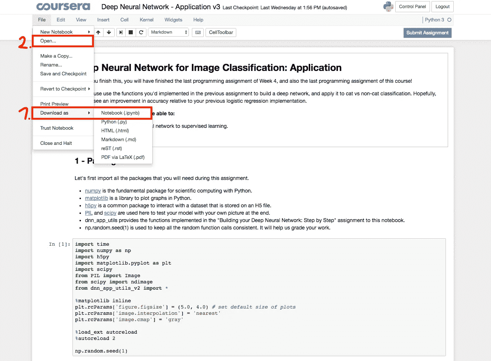
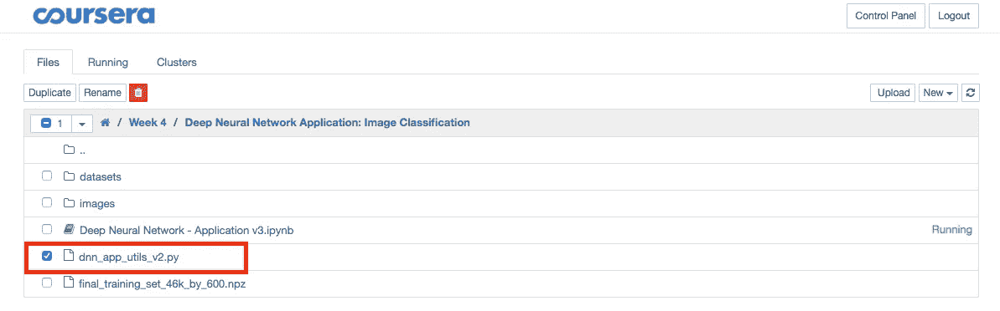
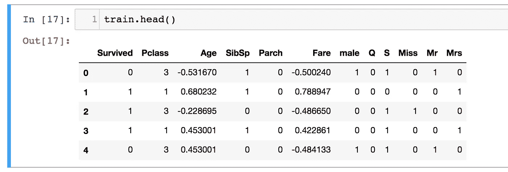
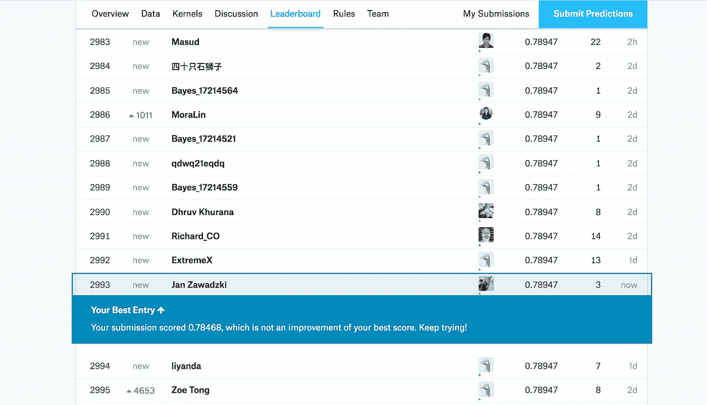

# 将吴恩达第一深度神经网络应用于泰坦尼克号生存数据集

> 原文：<https://towardsdatascience.com/https-medium-com-janzawadzki-applying-andrew-ngs-1st-deep-neural-network-on-the-titanic-survival-data-set-b77edbc83816?source=collection_archive---------0----------------------->

你被吴恩达第一个关于深度学习的 Coursera 课程震惊了，甚至[可能在一周内就把它吃光了](https://medium.com/machine-learning-world/netflix-or-coursera-how-to-finish-andrew-ngs-1st-deep-learning-course-in-7-days-6fa293ee83d8)。我们都是！但是，在将新获得的知识应用到新的数据集之前，请控制您急切的手指不要跳到第二道菜。

Utilize Andrew Ng’s Deep Learning course to predict Titanic Survival rates

这篇文章介绍了神经网络在 kaggle 的泰坦尼克号生存数据中的应用。它帮助读者加深对神经网络的理解，而不是简单地执行吴恩达精心安排的代码。泰坦尼克号的生存数据集只是一个例子。请随意使用您喜欢的任何其他二元分类数据集！

代码在 Github repo [这里](https://github.com/jaza10/AppliedNeuralNetworkTitanicSurvival)。现在让我们开始享受乐趣吧。

1.  **从 Coursera hub 下载“深度神经网络应用”和“dnn_utils_v2.py”文件并保存在本地**

*   Github repo 不包含 deeplearning.ai 提供的代码，请报名参加 [Coursera 深度学习专业化](https://www.coursera.org/learn/neural-networks-deep-learning)的课程 1。所需材料在第四周的编程作业中。

Download the “Deep Neural network Application v3” notebook from the Coursera hub and click on “Open”

Download the dnn_app_utils_v2.py file

**2。从 kaggle 下载** [**泰坦尼克号生存数据集**](https://www.kaggle.com/c/titanic/data) **并将其保存在“数据集”文件夹中与您的笔记本相同的位置**

*   为了方便起见，我已经在 Github repo 中包含了数据集

**3。打开“深度神经网络应用”笔记本**

*   除了 import 和 L-Layer_model 单元格之外，您可以安全地删除所有其他单元格
*   运行两个单元

**4。加载泰坦尼克号生存数据集**

**5。预处理数据集**

*   基于阶层估算乘客年龄——这是何塞·波尔蒂利亚极力推荐的 Udemy 课程[“Python 用于数据科学和机器学习训练营”，](https://www.udemy.com/python-for-data-science-and-machine-learning-bootcamp/learn/v4/overview)逻辑回归的一个分支
*   从姓名中提取乘客头衔——我跟随了 Manuel 关于从姓名中提取头衔的伟大而简单的[帖子](https://www.kaggle.com/manuelatadvice/feature-engineering-titles)，感谢分享！
*   删除列 passengerId、cabin 和 name
*   虚拟编码分类变量性别、出发和标题
*   比例年龄和费用-特征比例有助于梯度下降算法更快收敛，请参考 [scikit-learn 文档](http://scikit-learn.org/stable/modules/generated/sklearn.preprocessing.StandardScaler.html)或 Github repo

预处理后的数据现在看起来像这样:

The training set contains 11 features, ready for the neural net to evaluate it

**6。应用你的神经网络**

> 获取 X 和 y 变量，然后**转置**它们以适应神经网络架构。

> 根据你的**特征数量**选择第一层尺寸。在这种情况下，第一维是 11。随后选择尽可能多的隐藏层。

The first try yields 85% training and 82% test accuracy!

> 预处理测试数据。通过使用 X 和来自训练神经网络的参数的前向传播来生成预测。

Last step: Generate predictions on the test data

瞧啊！您生成了预测，并将其保存为 csv 文件，现在您可以将该文件提交给 [kaggle](https://www.kaggle.com/c/titanic/submit) 。这个预测会让你进入前 30%的参与者。

Submitting the predictions file lands you in the upper third and helps you get used to participating in kaggle competitions

恭喜你，你已经将神经网络应用到你自己的数据集中了！

现在我鼓励你去玩网络中的迭代次数和层数。能提高分数吗？你做了哪些不同的事情？

将神经网络应用于泰坦尼克号生存数据集是否有些矫枉过正？大概吧。

网络是否正规化优化？还没有。完成课程 2 后，我们可能会有现成的工具来调整我们的神经网络并提高我们的分数。

## 关键要点:

*   从 Coursera hub 下载“应用深度学习”和“dnn _ utils _ v2”jupyter 笔记本，并在您的本地环境中运行它们
*   相应地预处理您的数据
*   转置你的 X 和 y 变量，这样你就有了一个“示例特征”训练矩阵
*   调整第一层尺寸以匹配您的要素数量
*   训练神经网络并保存生成的参数
*   通过对测试数据和以前保存的神经网络参数进行正向传播，生成对测试集的预测

感谢您阅读帖子。欢迎通过 LinkedIn[联系我，在评论中提出问题，或者关注我，了解我在通往成功的](http://www.linkedin.com/in/jan-zawadzki)[Coursera 深度学习 T13 专业化道路上的最新知识。](https://www.coursera.org/specializations/deep-learning)