# 在约会市场上，我们是否感到被低估了？

> 原文：<https://towardsdatascience.com/https-medium-com-melanietsang-do-we-feel-undervalued-in-the-dating-market-153c03eb6dc8?source=collection_archive---------12----------------------->

速配实验数据分析

什么影响了人们对选择约会对象的看法？是这个人的长相，性格还是幽默？哥伦比亚大学商学院教授雷·菲斯曼和希娜·艾扬格在 2002 年至 2004 年期间进行了一系列实验，他们要求 500 多名参与者与其他异性进行四分钟的第一次约会，对他们的吸引力、真诚、智力、风趣、雄心和共同兴趣进行评级，并回答他们是否会再次与伴侣约会的问题。该数据集是在 [Kaggle](https://www.kaggle.com/annavictoria/speed-dating-experiment) 上发现的，它包含了问卷答案，包括人口统计数据、约会习惯、自我认知和关键属性评级，以及约会决定。

# 我在试图理解什么？

对这个数据集进行了各种数据分析，洞察范围从择偶的性别差异到约会的种族偏好。我的目标是进行一项以前可能没有进行过的分析，我特别感兴趣的是关键属性如何影响约会决策，以及人们是否清楚地意识到他们的自我价值与他们的感知价值。

# 数据准备过程

## 过滤掉无关的数据

我首先阅读速配数据 Key.doc 以了解每个字段，然后过滤掉我不需要的数据，如 SAT 分数、学费信息、收入水平和邮政编码。

## 标准化数据

我对通过不同标度方法收集的数据进行了标准化，例如 1-10 标度的评级方法与 100 点分布方法，顺序标度与间隔标度(例如，当 3 =一个日期/周时，我将其转换为 52 次/年)。

## 处理缺失数据

对于每个条目，如果丢失的变量数量很大，我选择删除整个条目。例如，如果缺少合作伙伴对某个参与者所有属性的评分，我会删除属性分析中的整个条目，但保留它用于其他有效的分析。如果只有一个变量缺失，比如真诚度，我就用其他九个伙伴对同一个参与者的评分均值来代替。除了手工清理，我还使用了**最近邻法**来自动替换剩余的缺失值。

# 数据分析结果

## 一.一般信息

总共有 552 名参与者，其中 275 名为女性，270 名为男性(7 个缺失值)。虽然年龄最大且唯一的参与者为 55 岁，但 75%的参与者年龄在 24 至 34 岁之间。第一大部分参与者是欧洲/高加索裔美国人，而第二大部分是亚洲人。

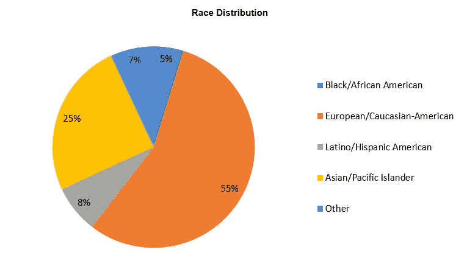

## 二。属性分析

> 约会中最重要的属性是什么？

在约会实验开始之前，参与者被要求根据他们在潜在约会中的重要性给下面的属性分配 100 分。总的来说，整个参与者群体认为吸引力是潜在约会中最重要的属性，其次是 T2 智力。

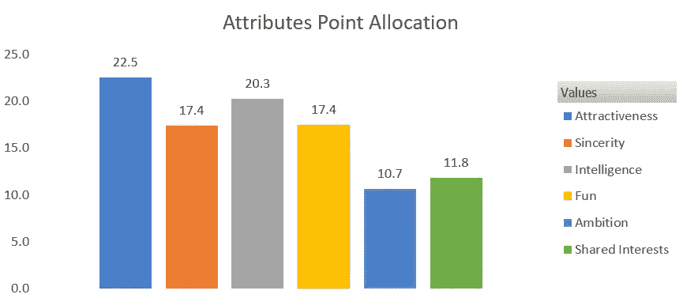

对女性来说，排名前三的属性是**智力**、**真诚**和**吸引力**，而对男性来说，则是**吸引力**、**智力**和**乐趣**。此外，男性倾向于有更独特的偏好，但女性的偏好似乎更均匀。

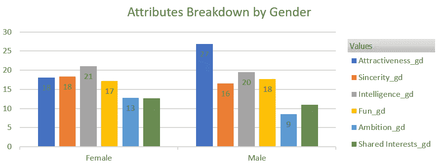

然而，当结果按种族分类时，我发现亚裔是唯一一个认为真诚比智慧更重要的种族。

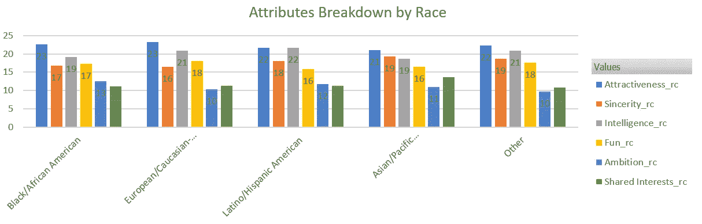

此外，当结果按工作行业细分时，我发现虽然许多群体认为智力比吸引力更重要，但建筑是唯一一个给予智力更高认可的群体。

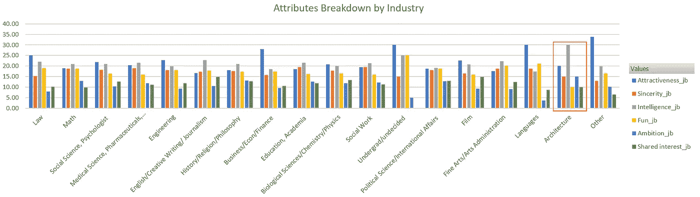

## 三。感知分析

在实验之前，参与者还被要求按照 1-10(1 =糟糕，10 =很好)的等级对这五个属性进行评级，不包括共同的兴趣。在每次四分钟的第一次约会后，他们被要求对他们的伴侣的六个特征进行评价。

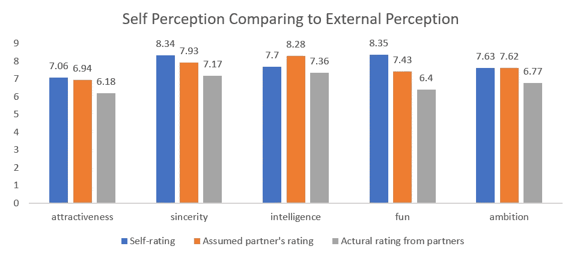

> 我们是否觉得自己总是被低估？

比较自我评级和参与者认为他们会得到的评级可能会引发许多社会学问题。人们是否有被低估的感觉或经历？他们是否倾向于夸大自己的优点，隐藏自己的缺点？结果显示，人们普遍认为伴侣低估了自己的属性，除了智力。这将是进一步研究的一个有趣点，是什么让人们相信他们的**智力**会被高估？此外，野心似乎是人们认为他们所表现出来的唯一属性。

> 我们真的高估了自己吗？

当比较自我评价和实际评价时，它表明参与者确实普遍高估了自己。他们最高估的属性是**乐趣**，而最不高估的属性是**智力**。有趣的是，当人们相信他们的智力会被高估时，其他人却知道他们实际上有多聪明！

> 当我们认为自己被低估时，我们真的被低估了吗？

当比较他们假设的伴侣的评价和实际的评价时，我发现虽然参与者知道他们被低估了，但他们对每个属性的评价甚至比他们想象的还要低。好难过！

> 是不是第一个永远是最好的？

由于参与者在每个实验中都遇到了几个伙伴，我做了一个**皮尔森相关分析**以了解会面顺序是否会影响人们的评级。首先，我发现顺序和他们喜欢自己伴侣的程度之间存在负相关。订单与四个属性之间的负相关也被证明，**真诚**、**聪明**、**有趣**和**野心**。比如，越晚遇到伴侣，越觉得伴侣不真诚。值得进行更多的研究，以了解更多的经验，人们是否表现出较少的真诚，或者只是感觉到来自他们的伴侣的较少的真诚，即使他们的伴侣同样真诚。

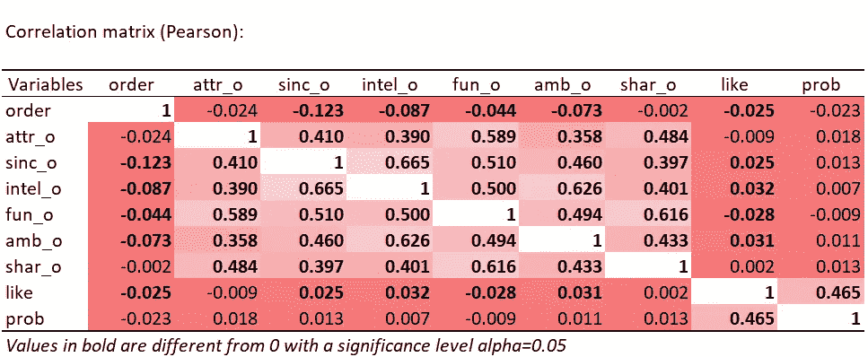

我还发现这些属性之间存在正相关关系。真诚和聪明的相关性最强，其次是聪明和野心，然后是乐趣和共同兴趣。

## 四。匹配分析

> 我们需要说多少个“是”才能听到一个“是”的回答？

在每次第一次约会后，参与者都要回答他们是否愿意再见他们的伴侣的问题。在这个实验中，他们发出 6 个“是”，平均得到 2 个匹配。换句话说，他们每尝试 3 次，总会得到 1 次“爱的回应”。

> 我们对爱情乐观吗？

实验结束后，参与者还被要求预测他们将得到多少个匹配，并收集实际的匹配数。平均来说，他们预测在每个实验中会有 3 次匹配，但实际上只有 2 次。

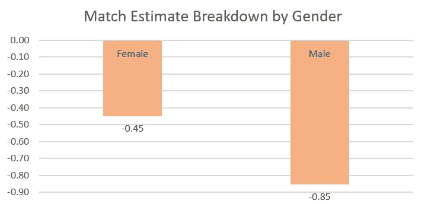

上面的数字是通过从匹配数中减去匹配估计值计算出来的。如图所示，男性参与者的预测往往比女性更乐观。

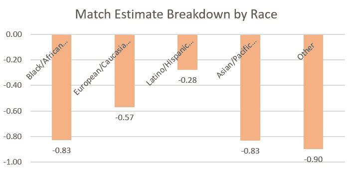

不考虑其他未定义的种族，**黑人/非洲裔美国人**和**亚裔美国人**似乎最乐观，而**拉丁裔/西班牙裔美国人**群体的预测最准确。

> 爱情可以实践吗？

平均来说，参与者每月约会两次。但是，更多的约会经验是否有助于他们获得更多的匹配，并更准确地预测他们的匹配？我做了一个皮尔逊相关分析，发现**约会的频率**与**匹配的数量**有轻微的正相关，但与**匹配估计的准确度**没有正相关。

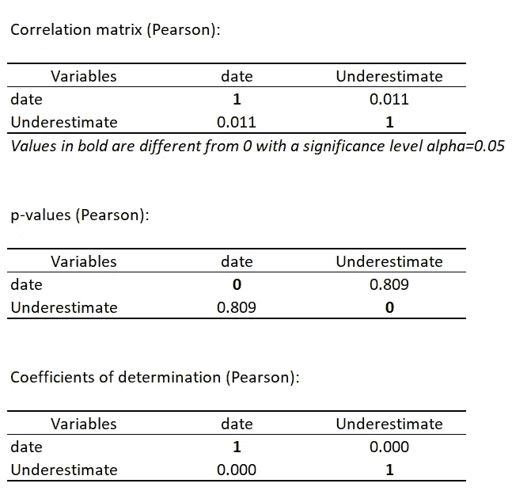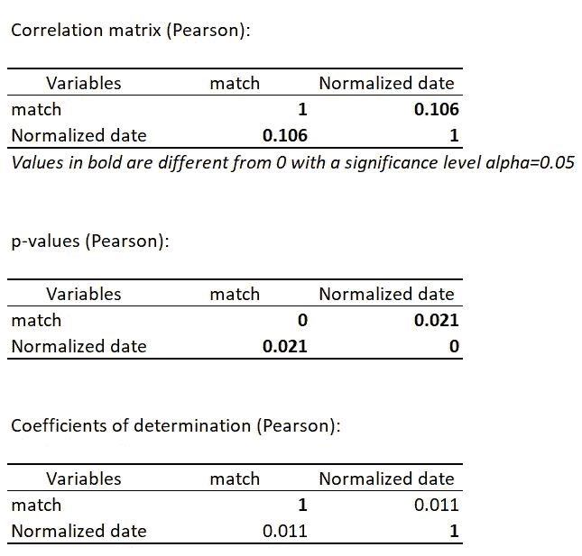

## 动词 （verb 的缩写）约会决策预测

我感兴趣的是建立一个约会决策模型，来预测人们在六个属性和种族上是否会再见他们的伴侣。因此，我使用了**逻辑回归分析**来建立这个有 7777 个条目的模型，并使用随机方法将训练集和验证集按 80:20 分开。对于缺失值，我用同一个类中的均值代替。例如，当一个人遇到了 10 个伴侣，得到了 9 个关于吸引力的评分，我用吸引力评分的平均值来代替缺失的那个。由于“否”的决定比“是”的决定多 15%,我也相应地修正了权重。最后，我用同样的方法建立了 5 次模型来检验性能的稳定性。

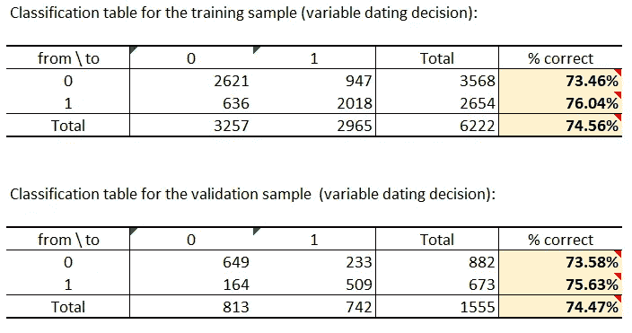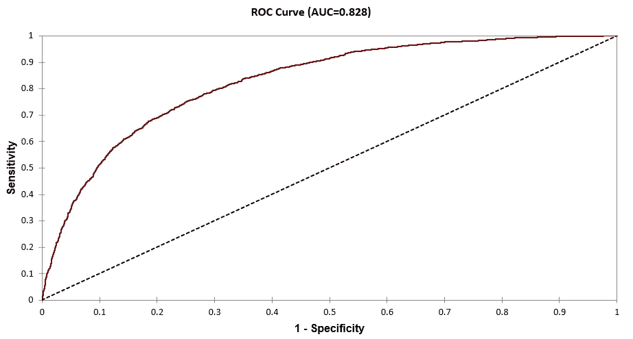

当预测日期决定为“是”或“否”时，曲线下的面积(0.828)证明了分类的良好性能。

虽然我们都知道爱情没有方程式，但至少我们有方程式来预测你和他/她约会的可能性:

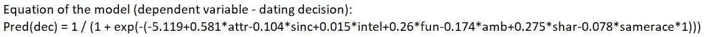

我发现，在实际的约会决策中，**吸引力**仍然是最重要的属性，其次是**共同兴趣**，然后是**乐趣**，这是出乎意料的，因为共同兴趣在参与者的偏好排名中似乎不是很重要。相反，在这种情况下，智力与决策没有多大关系。令人惊讶的是，当谈到实际的约会决定时，**野心**和**真诚**似乎是两个负面属性。此外，尽管跨种族伴侣似乎根本不会影响决定，但**同种族**与决定略有负相关。

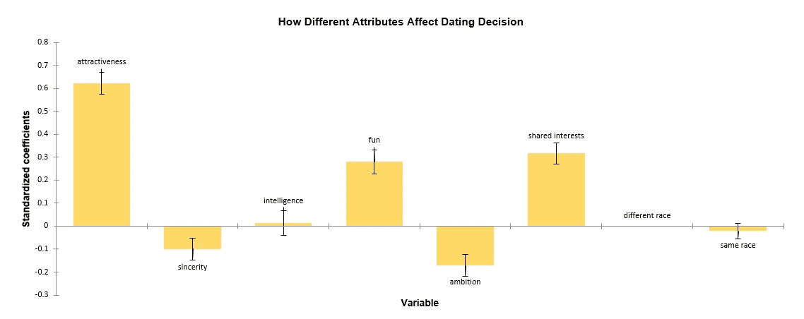

> 我们真的知道自己想要什么吗？

在我的属性分析的开始，它说明了潜在约会对参与者的重要性排序是吸引力、智力、真诚/有趣(它们是等价的)、共同的兴趣和雄心。然而，当人们做出实际的约会决定时，排名是不同的:吸引力，共同的兴趣，乐趣，智力，真诚，野心。人们似乎低估了共同利益，高估了真诚。

# 结论

总而言之，在约会时，吸引力是人们考虑的首要因素，而野心是最不重要的。我们希望我们的伴侣聪明、真诚，但是一旦我们更加了解对方，我们就会意识到共同的兴趣在潜在的关系中是多么重要。然而，不要被我们自己的感知所迷惑，因为当我们遇到更多的人时，它也会受到影响。有时我们可能对爱情过于乐观，对自己过于自信，但事实证明是令人失望的。我们应该放弃吗？不要！因为即使更多的约会经历不会让我们在寻找灵魂伴侣时变得更聪明，我们仍然有更高的几率不期而遇❤.