# 深入探究深层网络背后的数学

> 原文：<https://towardsdatascience.com/https-medium-com-piotr-skalski92-deep-dive-into-deep-networks-math-17660bc376ba?source=collection_archive---------1----------------------->

## 神经网络之谜第一部分

如今，有了许多高级的、专门的库和框架供我们使用，如 [Keras](https://keras.io/) 、 [TensorFlow](https://www.tensorflow.org/) 或 [PyTorch](https://pytorch.org/) ，我们不需要经常担心我们的权重矩阵的大小或记住我们决定使用的激活函数的导数公式。通常我们创建一个神经网络所需要的，即使是一个非常复杂的结构，也只是一些导入和几行代码。这节省了我们搜索 bug 的时间，并简化了我们的工作。然而，关于神经网络内部正在发生什么的知识对诸如架构选择、超参数调整或优化等任务有很大帮助。

**注:**承蒙[荣格林逸](https://medium.com/@jungyilin?source=responses---------6----------------)的礼遇，你也可以用中文阅读这篇[文章](http://wp.mlab.tw/?p=2613)。多亏了达维·坎迪多的帮助，你还可以查看文本的葡萄牙语版本。在我的 [GitHub](https://github.com/SkalskiP/ILearnDeepLearning.py) 上可以找到用于创建本文中使用的可视化效果的源代码。

## 介绍

为了进一步了解神经网络是如何工作的，我决定今年夏天花些时间来看看隐藏在表面下的数学。我还决定写一篇文章，一篇给我自己——整理新学到的信息，一篇给别人——帮助他们理解这些有时很难的概念。对于那些对代数和微分学感觉不太舒服的人，我会尽量温和，但正如标题所示，这将是一篇有很多数学的文章。

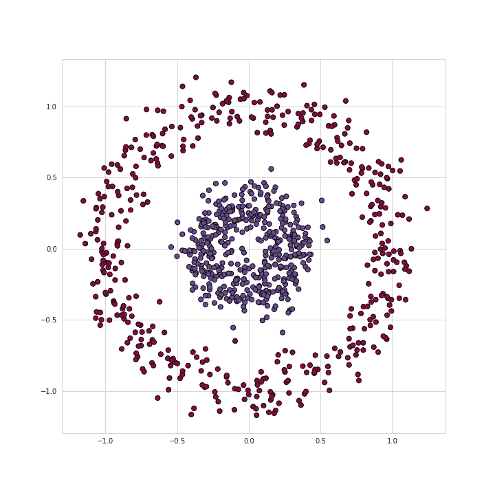

Figure 1\. Visualization of the training set.

作为的一个例子，我们将解决数据集的二元分类问题，如图 1 所示。以上。属于两个类别的点形成圆——这种排列对于许多传统的 ML 算法来说是不方便的，但是一个小的神经网络应该工作得很好。为了解决这个问题，我们将使用图 2 所示结构的神经网络。—五个完全连接的层，具有不同数量的单元。对于隐藏层，我们将使用 ReLU 作为激活函数，Sigmoid 作为输出层。这是一个非常简单的架构，但足够复杂，可以作为我们讨论的有用示例。

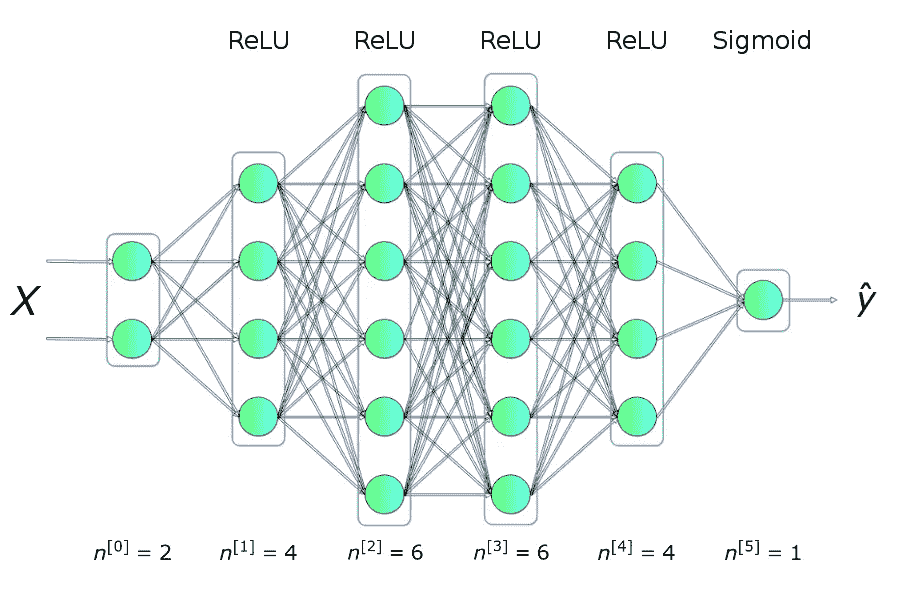

Figure 2\. Neural network architecture

## 克拉斯溶液

首先，我将介绍一个使用最流行的机器学习库之一——KERAS 的解决方案。

就这样。正如我在介绍中提到的，几个导入和几行代码就足以创建和训练一个模型，然后该模型能够以几乎 100%的准确率对来自我们测试集的条目进行分类。我们的任务归结为根据所选择的架构提供超参数(层数、层中神经元的数量、激活函数或时期的数量)。现在让我们看看幕后发生了什么。哦…还有我在学习过程中创造的一个很酷的视觉效果，希望它能让你不至于睡着。

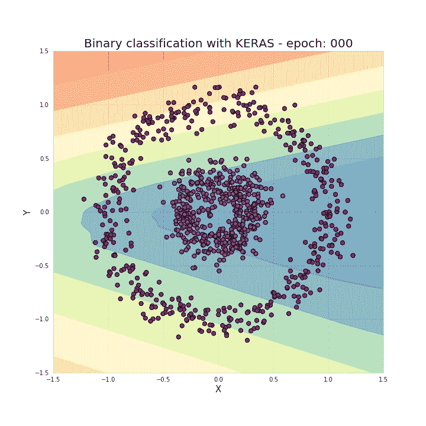

Figure 3\. Visualization of areas qualified for appropriate classes during training

## 什么是神经网络？

L 让我们从回答这个关键问题开始:**什么是神经网络？**这是一种受生物启发的构建计算机程序的方法，能够学习并独立发现数据中的联系。如图 2 所示。如图所示，网络是分层排列的软件“神经元”的集合，以允许通信的方式连接在一起。

## 单个神经元

E 每个神经元接收一组 x 值(从 1 到 n 编号)作为输入，并计算预测的 y-hat 值。向量 **x** 实际上包含来自训练集的 *m* 个示例之一中的特征值。此外，每个单元都有自己的一组参数，通常称为 **w** (权重的列向量)和 b(偏差)，它们在学习过程中会发生变化。**在每次迭代中，神经元基于其当前权重向量 **w** 计算向量 x** 的值的加权平均值，并添加偏差。最后，这个计算的结果通过一个非线性的激活函数 g 传递。我将在文章的下一部分提到一些最流行的激活函数。

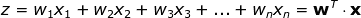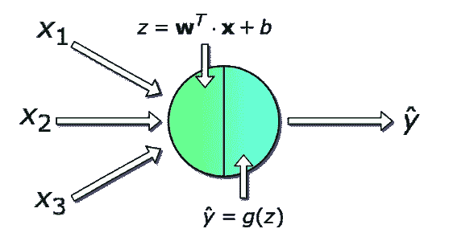

Figure 4\. Single neuron

## 单层

现在让我们缩小一点，考虑如何对神经网络的整个层进行计算。我们将利用我们对单个单元内发生的事情的了解，并跨整个层进行矢量化，以将这些计算合并到矩阵方程中。为了统一符号，将为所选层*【l】*编写方程。顺便说一下，下标 *i* 标记了该层中一个神经元的索引。

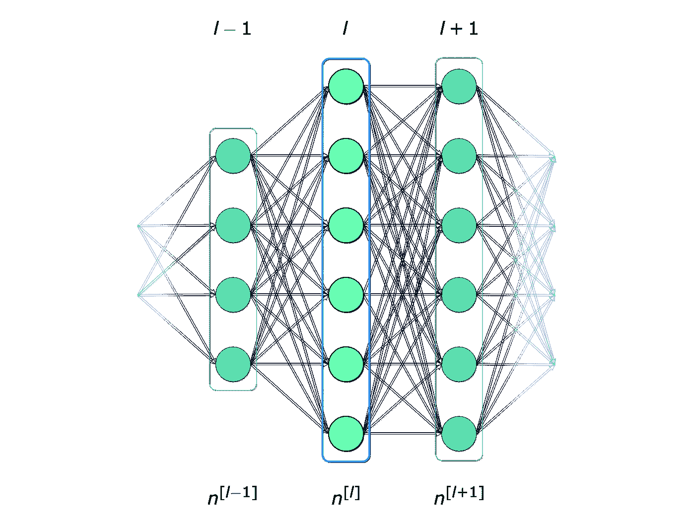

Figure5\. Single layer

**还有一个重要的备注:**我们写单个单元的方程时，用的是 **x** 和 y-hat，分别是特征的列向量和预测值。当切换到层的一般符号时，我们使用向量**a**——表示相应层的激活。因此, **x** 矢量是层 0——输入层的激活。该层中的每个神经元根据以下等式执行类似的计算:

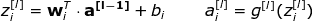

为了清楚起见，让我们以第 2 层为例写下方程式:

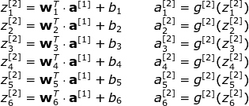

正如你所看到的，对于每一层，我们必须执行一些非常相似的操作。为此使用 for-loop 不是很有效，所以为了加快计算速度，我们将使用矢量化。首先，通过将权重的水平向量 **w** (转置)堆叠在一起，我们将构建矩阵 **W** 。类似地，我们将叠加层中每个神经元的偏差，创建垂直向量 **b** 。现在，没有什么可以阻止我们建立一个单一的矩阵方程，允许我们一次对该层的所有神经元进行计算。让我们也写下我们用过的矩阵和向量的维数。

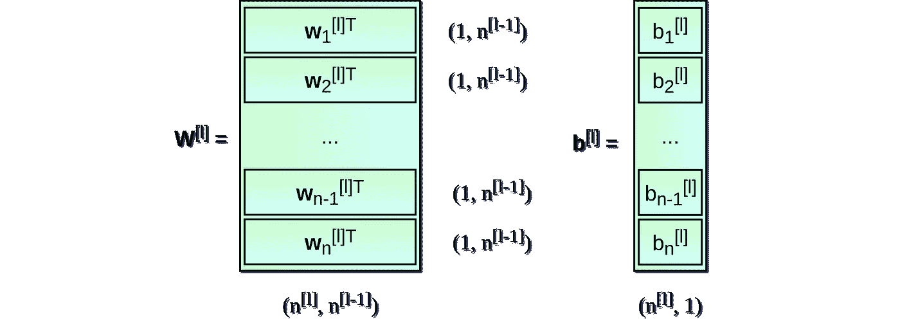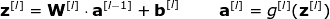

## 跨多个示例进行矢量化

到目前为止，我们所拟定的方程式只涉及一个例子。在神经网络的学习过程中，您通常会处理大量的数据，多达数百万个条目。因此，下一步将是跨多个示例的矢量化。假设我们的数据集有 *m* 个条目，每个条目有 *nx* 个特征。首先，我们将把每层的垂直向量 **x** 、 **a** 和 **z** 放在一起，分别创建 **X** 、 **A** 和 **Z** 矩阵。然后，我们重写之前的布局方程，考虑新创建的矩阵。

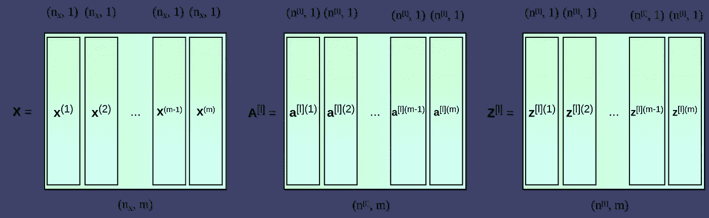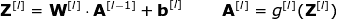

## 什么是激活功能，我们为什么需要它？

激活函数是神经网络的关键元素之一。**没有它们，我们的神经网络就会变成线性函数的组合，所以它本身就只是一个线性函数**。我们的模型具有有限的扩展性，不超过逻辑回归。非线性元件允许在学习过程中更大的灵活性和复杂函数的创建。激活函数对学习速度也有显著影响，这是选择它们的主要标准之一。图 6 显示了一些常用的激活功能。目前，最流行的隐藏层可能是 ReLU。当我们处理二元分类并且希望从模型返回的值在 0 到 1 的范围内时，我们有时仍会使用 sigmoid，尤其是在输出层。

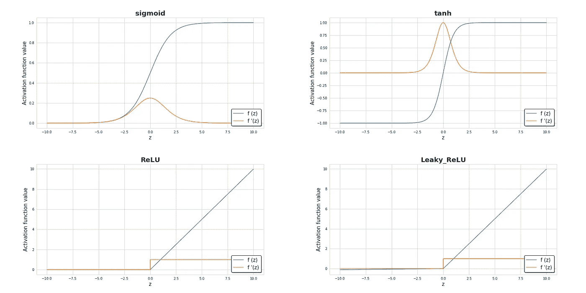

Figure 6\. Diagrams of the most popular activation functions together with their derivatives.

## 损失函数

T 学习过程进度的基本信息来源是损失函数值。一般来说，损失函数旨在显示我们离“理想”解决方案有多远。在我们的例子中，我们使用了二元交叉熵，但是根据我们处理的问题，可以使用不同的函数。我们使用的函数由以下公式描述，其值在学习过程中的变化如图 7 所示。它显示了随着每一次迭代，损失函数值是如何降低的，而精度是如何提高的。

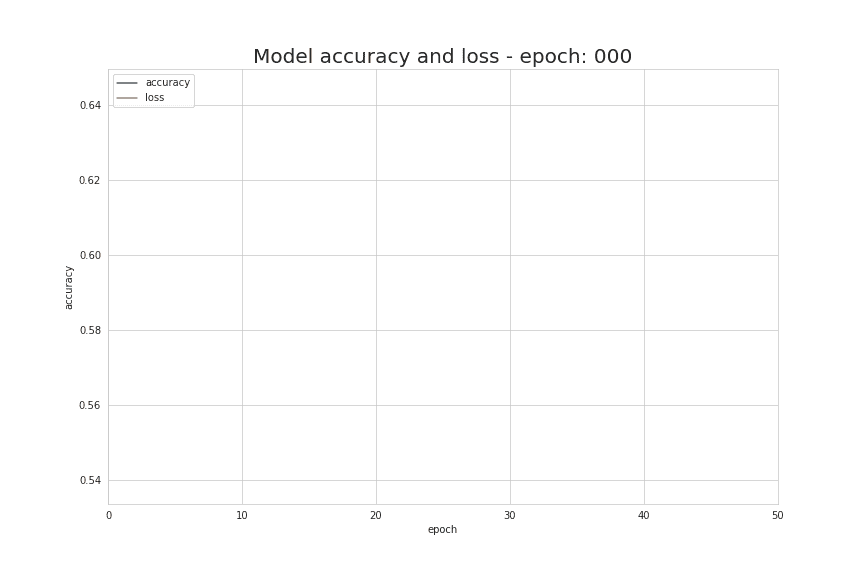

Figure 7\. Change of accuracy and loss values during learning process

## 神经网络是如何学习的？

T 学习过程是关于改变参数 **W** 和 **b** 的值，从而使损失函数最小化。为了实现这一目标，我们将求助于微积分和**使用梯度下降法找到一个函数最小值**。在每次迭代中，我们将计算损失函数相对于神经网络每个参数的偏导数的值。对于那些不太熟悉这类计算的人，我只想说导数有一种神奇的能力来描述函数的斜率。由于这一点，我们知道如何操纵变量，以便在图表中向下移动。为了直观地了解梯度下降是如何工作的(并阻止你再次入睡),我准备了一个小的可视化。你可以看到每一个连续的时代我们是如何走向最小值的。在我们的神经网络中，它以同样的方式工作——每次迭代计算的梯度向我们显示我们应该移动的方向。主要的区别在于，在我们的示例性神经网络中，我们有更多的参数要处理。正是…怎么计算这么复杂的导数？

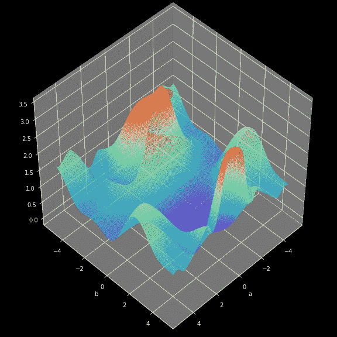

Figure 8\. Gradient descent in action

## 反向传播

ackpropagation 是一种允许我们计算非常复杂的梯度的算法，就像我们需要的那样。根据以下公式调整神经网络的参数。

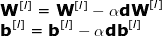

在上面的等式中，α代表学习率——一个超参数，它允许你控制执行调整的值。选择一个学习率是至关重要的——我们设置得太低，我们的神经网络将学习得非常慢，我们设置得太高，我们将无法达到最小值。 **dW** 和 **db** 使用链式法则计算，损失函数相对于 **W** 和 **b** 的偏导数。 **dW** 和 **db** 的尺寸分别与 **W** 和 **b** 的尺寸相同。图 9。显示了神经网络中的操作序列。我们清楚地看到前向和后向传播是如何一起优化损失函数的。

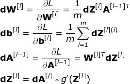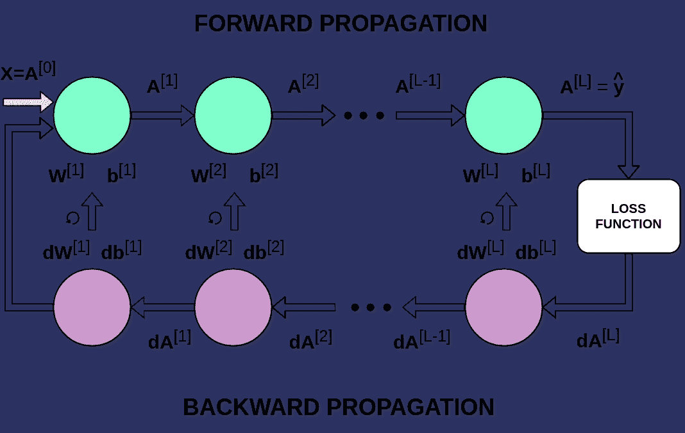

Figure 9\. Forward and Backward Propagation

## 结论

我已经成功地向你们解释了发生在神经网络内部的数学。在使用神经网络时，至少了解这个过程的基本知识会很有帮助。我认为我提到的事情是最重要的，但它们只是冰山一角。我强烈推荐尝试自己编程这么小的神经网络，不使用高级框架，只用 Numpy。

如果你设法来到这里，恭喜你。这当然不是最容易的阅读。如果你喜欢这篇文章，请在 [Twitter](https://twitter.com/PiotrSkalski92) 和 [Medium](https://medium.com/@piotr.skalski92) 上关注我，并在 [GitHub](https://github.com/SkalskiP) 和 [Kaggle](https://www.kaggle.com/skalskip) 上查看我正在进行的其他项目。本文是“神经网络的奥秘”系列的第二部分，如果你还没有机会，请阅读[其他文章](/preventing-deep-neural-network-from-overfitting-953458db800a)。保持好奇！

