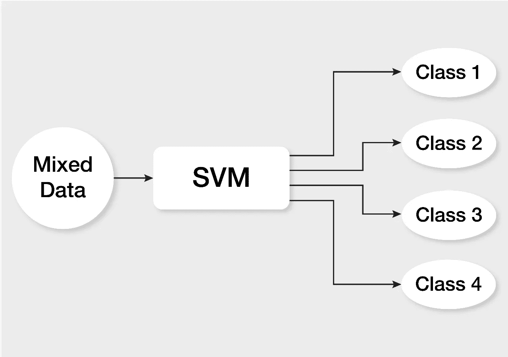
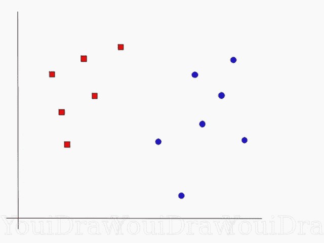
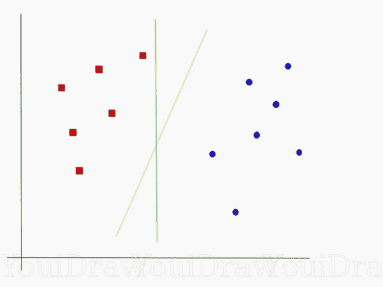
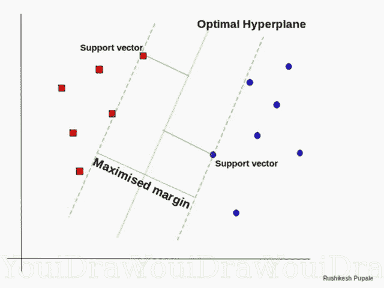
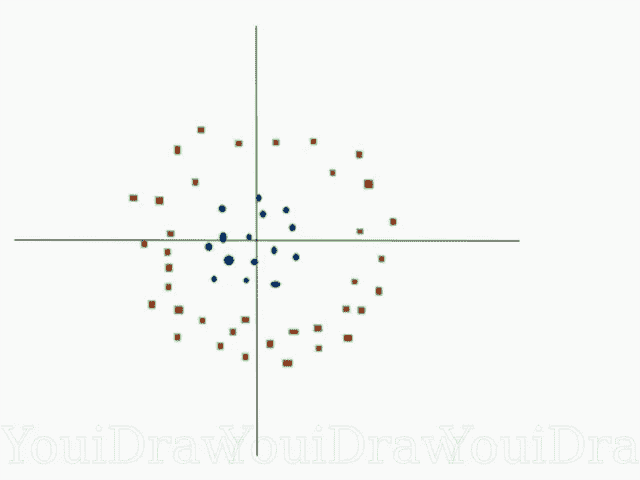
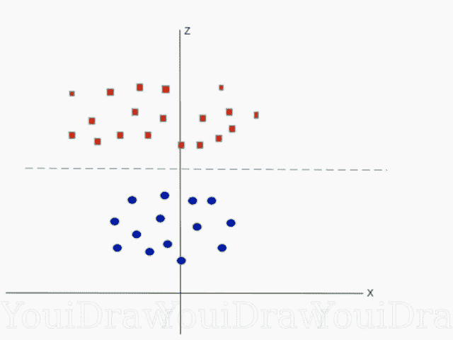
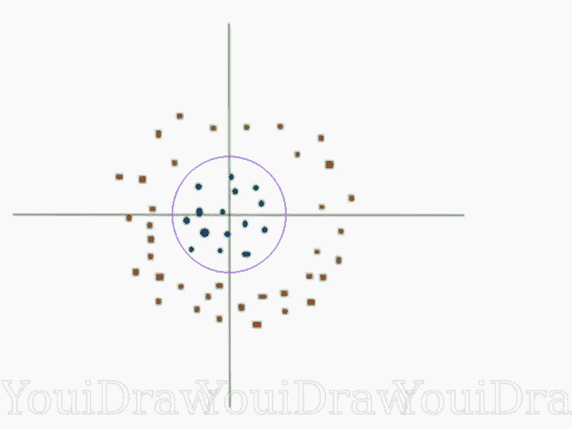
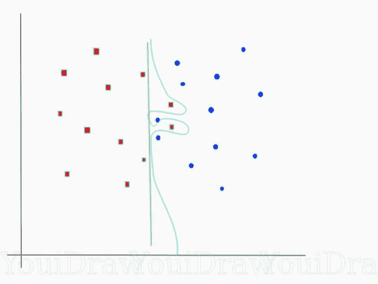

# 支持向量机(SVM)——概述

> 原文：<https://towardsdatascience.com/https-medium-com-pupalerushikesh-svm-f4b42800e989?source=collection_archive---------1----------------------->



SVM classifier

机器学习涉及预测和分类数据，为此，我们根据数据集采用各种机器学习算法。

SVM 或支持向量机是用于分类和回归问题的线性模型。它可以解决线性和非线性问题，并能很好地解决许多实际问题。SVM 的想法很简单:算法创建一条线或一个超平面，将数据分类。

在这篇博文中，我打算提供一个关于支持向量机的高层次概述。我将讨论支持向量机背后的理论，它在非线性可分数据集上的应用，以及用 Python 实现支持向量机的一个快速示例。在接下来的文章中，我将探索算法背后的数学，并挖掘引擎盖下。

> ***论***

在第一级近似下，支持向量机所做的是找到两类数据之间的分隔线(或超平面)。SVM 是一种算法，它将数据作为输入，如果可能的话，输出一条线来分隔这些类。

让我们从一个问题开始。假设您有一个如下所示的数据集，您需要将红色矩形从蓝色椭圆中分类出来(让我们从负面中找出正面)。所以你的任务是找到一条理想的线，将这个数据集分成两类(比如红色和蓝色)。



Find an ideal line/ hyperplane that separates this dataset into red and blue categories

不是什么大任务，对吧？

但是，正如您注意到的，并没有一个独特的行来完成这项工作。事实上，我们有一条无限长的线可以把这两个阶级分开。那么 SVM 是如何找到理想伴侣的呢？？？

让我们采取一些可能的候选人，自己找出答案。



Which line according to you best separates the data???

这里有两条候选线，绿色的线和黄色的线。根据你的说法，哪条线最适合分隔数据？

如果你选择了黄线，那么恭喜你，因为那是我们正在寻找的线。在这种情况下，黄线分类更好，这在视觉上非常直观。但是，我们需要一些具体的东西来固定我们的线。

上图中的绿线与红色类相当接近。虽然它对当前数据集进行分类，但它不是一条一般化的线，在机器学习中，我们的目标是获得一个更一般化的分隔符。

> ***SVM 寻找最佳路线的方法***

根据 SVM 算法，我们从两个类中找到最接近直线的点。这些点称为支持向量。现在，我们计算直线和支持向量之间的距离。这个距离叫做边缘。我们的目标是利润最大化。边缘最大的超平面是最优超平面。



Optimal Hyperplane using the SVM algorithm

因此，SVM 试图以这样一种方式做出一个决定边界，即两个阶级(那条街)之间的间隔尽可能宽。

很简单，不是吗？让我们考虑一个有点复杂的数据集，它不是线性可分的。



Non-linearly separable data

这个数据显然不是线性可分的。我们无法画出一条直线来对这些数据进行分类。但是，这些数据可以转换成高维的线性可分数据。让我们增加一个维度，称之为 z 轴。让 z 轴上的坐标受约束支配，

z = x +y

所以，基本上 z 坐标是该点到原点距离的平方。让我们把数据标在 z 轴上。



Dataset on higher dimension

现在数据显然是线性可分的。设高维空间中分隔数据的紫线为 z=k，其中 k 为常数。因为，z=x +y 我们得到 x+y = k；这是一个圆的方程式。所以，我们可以用这种变换，把高维空间中的线性分隔符投射回原始维度。



Decision boundary in original dimensions

因此，我们可以通过向数据添加一个额外的维度来对数据进行分类，使其成为线性可分的，然后使用数学变换将决策边界投影回原始维度。但是为任何给定的数据集找到正确的转换并不容易。谢天谢地，我们可以在 sklearn 的 SVM 实现中使用内核来完成这项工作。

> ***超平面***

现在我们理解了 SVM 逻辑，让我们正式定义超平面。

> **n 维欧几里得空间中的超平面是该空间的平坦的 n-1 维子集，它将该空间分成两个不相连的部分。**

例如，让我们假设一条线是我们的一维欧几里得空间(也就是说，我们的数据集位于一条线上)。现在在这条线上选择一个点，这个点将这条线分成两部分。线有 1 维，而点有 0 维。所以一个点就是这条线的超平面。

对于二维，我们看到分隔线是超平面。类似地，对于三维，具有二维的平面将 3d 空间分成两部分，因此充当超平面。因此，对于一个 n 维空间，我们有一个 n-1 维的超平面把它分成两部分

> ***代码***

```
import numpy as np
X = np.array([[-1, -1], [-2, -1], [1, 1], [2, 1]])
y = np.array([1, 1, 2, 2])
```

我们在 X 中有我们的点，在 y 中有它们所属的类。

现在我们用上面的数据集训练我们的 SVM 模型。对于这个例子，我使用了线性核。

```
from sklearn.svm import SVC
clf = SVC(kernel='linear')
clf.fit(X, y)
```

预测新数据集的类别

```
prediction = clf.predict([[0,6]]) 
```

> ***调谐参数***

参数是在创建分类器时传递的参数。以下是 SVM 的重要参数-

**1】C:**

它控制平滑决策边界和正确分类训练点之间的折衷。大的 c 值意味着你将正确地得到更多的训练点。



Smooth decision boundary vs classifying all points correctly

考虑一个如上图所示的例子。我们可以为这个数据集绘制许多决策边界。考虑一条直线(绿色)决策边界，这非常简单，但代价是几个点被错误分类。这些错误分类的点称为异常值。我们也可以做一些更摇摆不定的东西(天蓝色的决策边界),但我们可能会得到所有正确的训练点。当然，像这样非常错综复杂的东西的代价是，它很可能不能很好地推广到我们的测试集。因此，如果你着眼于精度，更简单、更直接的方法可能是更好的选择。较大的 c 值意味着你将得到更复杂的决策曲线来拟合所有的点。弄清楚你有多希望有一个平滑的决策边界，而不是一个正确的决策边界，是机器学习艺术的一部分。因此，为您的数据集尝试不同的 c 值，以获得完美平衡的曲线并避免过度拟合。

**2】伽玛:**

它定义了单个训练示例的影响范围。如果伽马值较低，则意味着每个点都有很远的范围，反之，伽马值较高，则意味着每个点都有很近的范围。

如果γ值非常高，那么决策边界将只取决于非常靠近该线的点，这实际上会导致忽略一些离决策边界非常远的点。这是因为更近的点得到更多的权重，这导致了曲线的摆动，如上图所示。另一方面，如果伽玛值很低，即使远点也会得到相当大的权重，我们会得到更线性的曲线。

> **中的*即将出现*中的**

我将探索 SVM 算法和最优化问题背后的数学。

> ***结论***

我希望这篇博文有助于理解支持向量机。 ***写下你的想法、反馈或建议*** 如果有的话。

**Connect with the Raven team on** [**Telegram**](https://t.me/ravenprotocol)