# 重启随机梯度下降新手指南

> 原文：<https://towardsdatascience.com/https-medium-com-reina-wang-tw-stochastic-gradient-descent-with-restarts-5f511975163?source=collection_archive---------3----------------------->

简单地找到一个学习率来经历梯度下降将有助于最小化神经网络的损失。但是，还有其他方法可以使这一过程更顺利、更快速、更准确。

第一种技术是重启随机梯度下降(SGDR)，这是学习率退火的一种变体，它通过训练逐渐降低学习率。

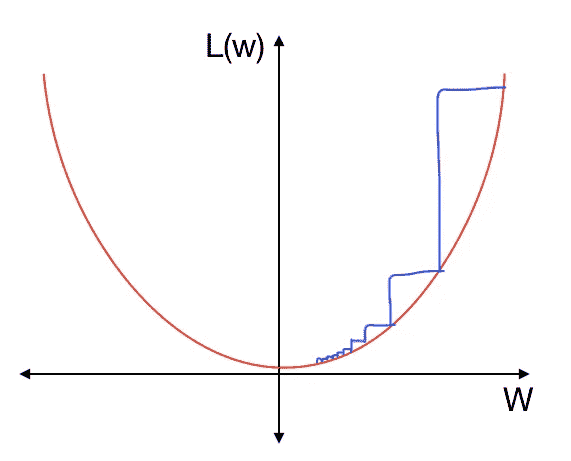

Image 1: Each step decreases in size

有不同的退火方法，不同的减小步长的方法。一种流行的方法是逐步降低学习率:在最初的几次迭代中简单地使用一个学习率，然后在接下来的几次迭代中降低到另一个学习率，然后在接下来的几次迭代中进一步降低学习率。另一种变型是随着每次迭代线性降低学习速率。

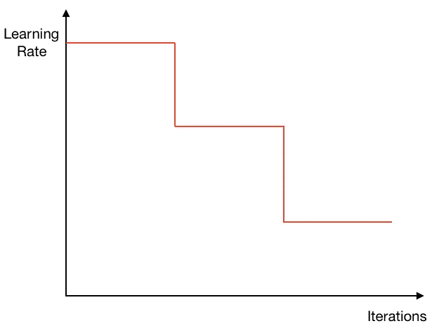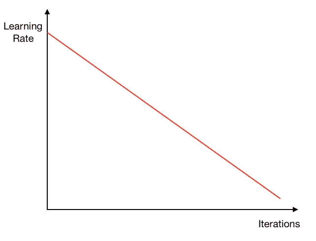

Left: Decrease learning rate by steps; Right: Linearly decrease learning rate

SGDR 使用*余弦退火*，以半余弦曲线的形式降低学习率，就像这样:

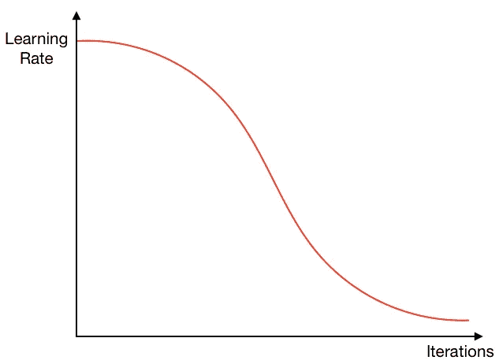

Image 4: Cosine Annealing

这是一个好方法，因为我们可以在开始时以相对较高的学习速率开始几次迭代，以快速接近局部最小值，然后随着我们接近最小值而逐渐降低学习速率，以几次小的学习速率迭代结束。

然而，我们可能会发现自己处于局部极小值，其中权重的小变化会导致损失的大变化。在下面这个损失函数中，通过训练，我们已经降落在局部最小值。

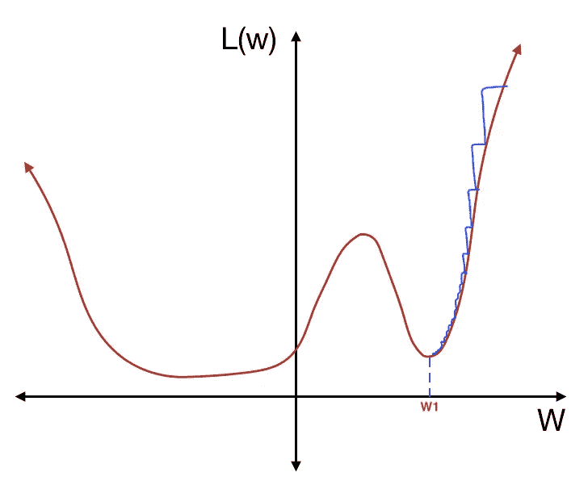

Image 5: Approaching a local minimum

但是，如果我们在不同的数据集上测试这个网络，损失函数可能会略有不同。在这个局部最小值中损失函数的小移动将导致损失的大变化:

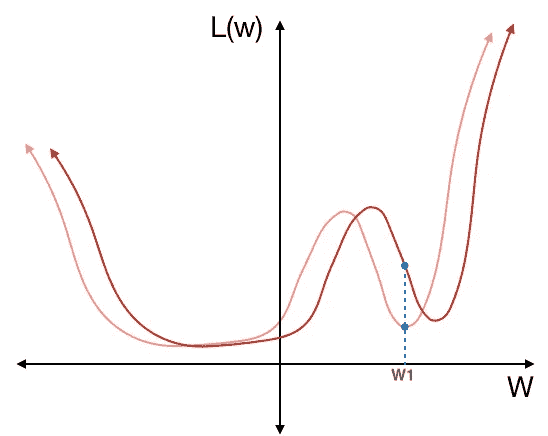

Image 6: Slight shift in loss function resulting in a large change in loss

突然间，这个局部最小值成了一个可怕的解决方案。另一方面，如果我们在这个更平坦的槽中找到了解决方案:

Image 7: Approaching a more stable local minimum

即使不同的数据集稍微改变了损失函数，损失也会保持相对稳定:

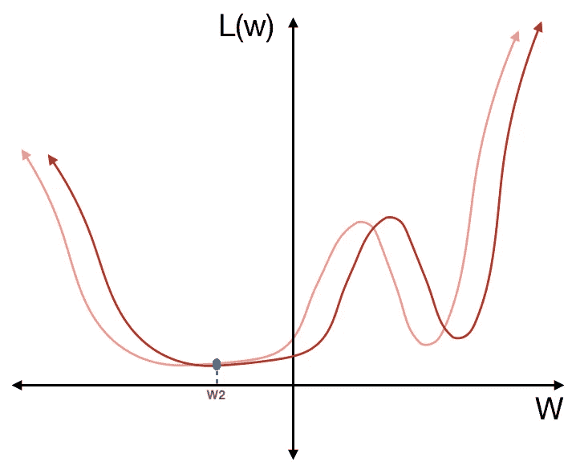

Image 8: Slight shift in loss function doesn’t impact loss as much

这种更平的槽更好，因为它提供了精确和稳定的解决方案。它更多的是*广义*；也就是对新数据有更高的反应能力。为了找到更稳定的局部最小值，我们可以不时地增加学习率，鼓励模型在处于陡峭的低谷时从一个局部最小值“跳到”另一个局部最小值。这是 SGDR 的“重新开始”。

Image 9: Increasing the learning rates every few iterations to “restart” the gradient descent // [Source](http://course.fast.ai)

在上图的第一个“半余弦”周期中，我们下降到局部最小值，如下所示:

Image 10: Descending into local minimum

突然，我们提高了学习率，在下一次迭代中迈出了一大步:

Image 11: “Restarting”

在第二个“半余弦”周期，我们下降到另一个局部最小值。

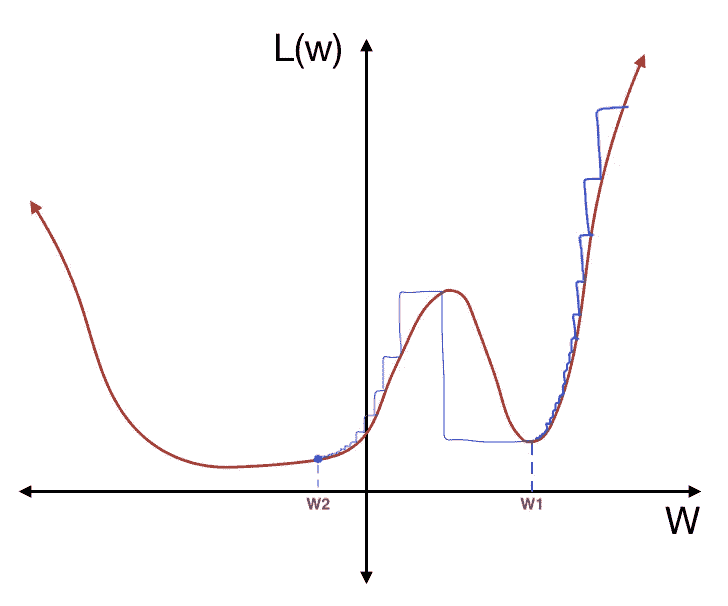

Image 12: Descending into a more stable local minimum

然后我们再次大幅提高学习率。只是这一次，因为我们处于损失函数的一个更稳定的区域，这种“重新开始”并没有把我们带出局部最小值:

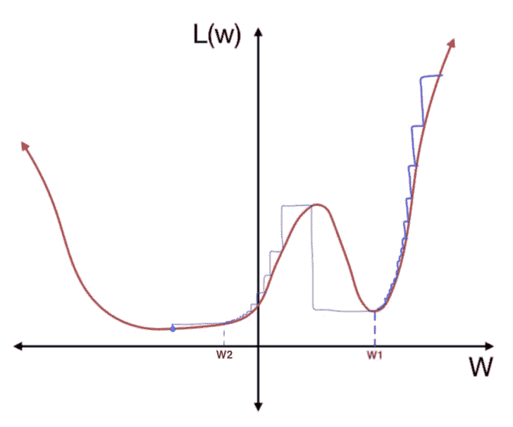

Image 13: “Restarting” doesn’t take us out of this local minimum

最后，我们再次逐渐降低学习率，直到我们最小化损失函数，找到稳定的解决方案。

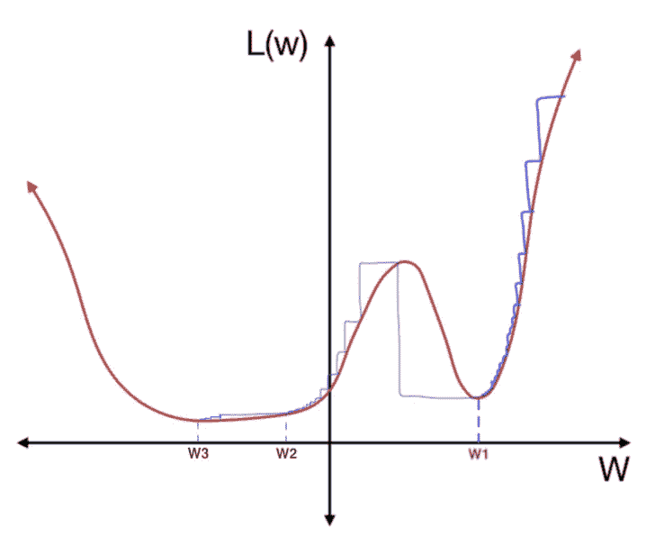

Image 14: Settling into this local minimum

这些“周期”中的每一个都被称为一个*周期*，在训练我们的神经网络时，我们可以自己选择周期的数量和每个周期的长度。还有，既然我们是逐渐降低学习率，那么最好从略大于最优学习率的学习率开始(你是怎么确定最优学习率的？点击[这里](https://thisgirlreina.wordpress.com/2018/07/10/gradient-descent-and-learning-rate/)。选择一个足够大的学习率也很重要，以允许函数在“复位”时跳到不同的最小值。

为了在 3D 中可视化，这里有两个模型:

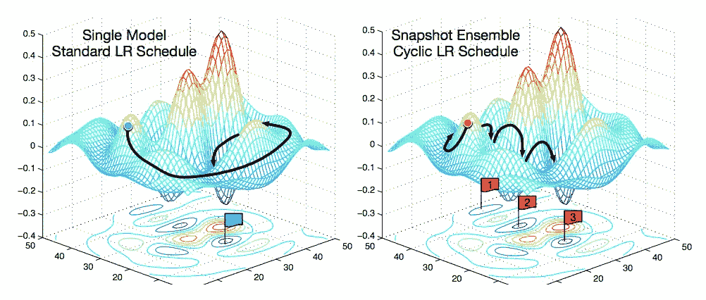

Image 15: Stochastic Gradient Descent with Restarts // [Source](https://arxiv.org/pdf/1704.00109.pdf)

左边的模型缓慢下降到一个局部最小值，而右边的模型在几个局部最小值之间跳跃，寻找一个更稳定的。

您也可以在每次循环后增加循环长度，如下所示:

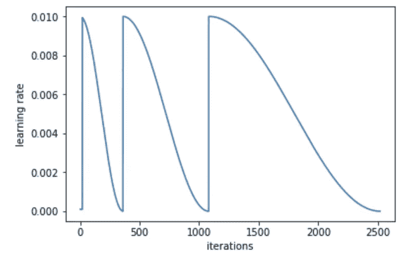

Image 16: Increasing cycle length // [Source](http://course.fast.ai)

这似乎输出了更好、更准确的结果，因为它允许我们更精确地找到稳定区域中的最小值点。