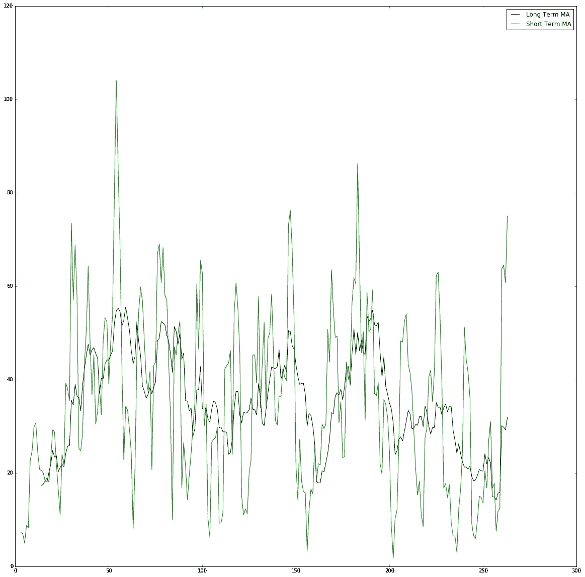
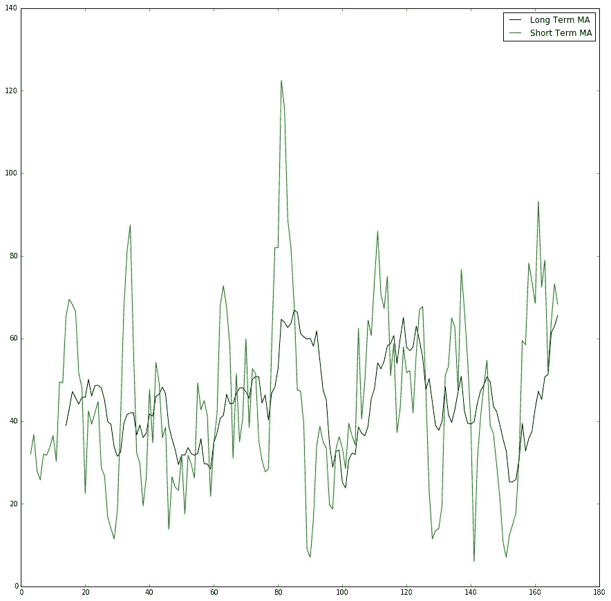

# 用移动平均法确定板球比赛中击球手的状态

> 原文：<https://towardsdatascience.com/https-medium-com-satnalikamayank12-using-moving-averages-to-determine-batsmen-form-d165c08be809?source=collection_archive---------0----------------------->


尝试在板球领域使用简单的算法交易策略来确定击球手的当前形式。

**滚动平均值:**它是从数据值的连续段中得到的一系列平均值，或者更简单地说，平均值是通过取一些前几天的值计算出来的，比如说过去 10 天(对于短期移动平均值)或者过去 50 天(对于长期移动平均值)。第二天的移动平均值通过排除第一天的值并包括今天或当前日期的最新值来计算。10 日均线是通过找出前 10 天的收盘价作为第一个数据点。下一个数据点将删除最早的价格，添加第 11 天的价格，然后取平均值。MAs 最常见的应用是识别趋势方向，即价值是上升还是下降。

**股票交易中的交叉策略:**投资者使用移动平均线作为指标来检测股票价格的运动，即它是上涨还是下跌。涉及均线的一个基本策略是交叉技术。

取 2 MA 的一个长期(比如 50 天)和一个短期(比如 10 天)。交叉点是曲线相交的点，即短期移动平均线高于长期移动平均线的点，反之亦然。

当短期移动平均线越过长期移动平均线(短期移动平均线>长期移动平均线)时，买入信号被触发，这表明股价开始上涨。同样，当短期均线穿过长期均线下方时，就会触发卖出信号(短期< Long Term MA) indicating prices are starting to go down and the investor should steer clear from the stock and sell the stocks if any.

**将其应用于击球手**:击球手通常被称为状态良好(表现良好)或状态不佳(表现不佳)。可以用股票市场和板球生态系统来进行类比，玩家类似于股票公司，他们的得分类似于股票价格。在板球比赛中使用的策略没有什么不同。我们计算 2 个 MAs:一个短期(比如 4 局)和一个长期(比如 15 局)。我们用击球手在特定局中的得分来代替价格。

如果有一个交叉，其中短期移动平均线变得高于长期移动平均线，这表明击球手将处于良好状态，并将在接下来的几局中取得好成绩，并将处于良好状态。类似地，如果出现交叉，短期移动平均线变得低于长期移动平均线，击球手在接下来的几场比赛中表现不佳。

导入所需的模块

```
import pandas as pd
import numpy as np
import matplotlib.pyplot as plt
%matplotlib inline
```

读取记录并计算 15 局(长)和 4 局(短)的移动平均值。

```
df1 = pd.read_csv("51880batting.csv")
#player 51880 from statsguru is Chris Gayle
maLong  = df1['runs'].rolling(window = 15, center = False).mean()
maShort = df1['runs'].rolling(window = 4, center = False).mean()
```

绘图:

```
plt.plot(df1['runs'].rolling(window=15,center=False).mean(),color = 'k')
plt.plot(df1['runs'].rolling(window=4,center=False).mean(), color= 'g')
plt.show()
```



Long Term and Short Term MAs for Chris Gayle (WI Batsman)



Long Term and Short Term MAs for Virat Kohli (IND Batsman)

如果短期均线大于长期均线(相当于买入信号)，找出交叉点，计算接下来 3 局的平均值。

```
sp = 0 
snp = 0
playCnt = 0
noplayCnt = 0
x = 15               #long term averages begin from index 15
while( x <= 260):    #number of innings is 263 
 if(maLong[x] < maShort[x]):
  if(maLong[x+1] > maShort[x+1]):   #crossover detected
    print ‘no play at’ , x
    snp= snp +df1[‘runs’][x+1] + df1[‘runs’][x+2] + df1[‘runs’][x+3]
    noplayCnt = noplayCnt+3

 if(maLong[x] > maShort[x]):
  if(maLong[x+1] < maShort[x+1]):   #crossover detected
   print ‘play at’ ,x
   sp = sp + df1[‘runs’][x+1] + df1[‘runs’][x+2] + df1[‘runs’][x+3] 
   playCnt = playCnt+3
 x = x+1
```

计算和显示平均值:

```
#overall career average
overallAvg = df1[‘runs’].mean()#average over the next 3 innings after positive or 'BUY' signal
playAvg = sp/playCnt#average over the next 3 innings after negative or 'SELL' signal noPlayAvg = snp/noplayCnt print 'Career average: ', overallAvg
print 'Positive Signal average: ', playAvg
print 'Negative Signal average: ', noPlayAvg 
```

克里斯·盖尔的结果

> 职业生涯平均:34.928030303
> 正信号平均:48
> 负信号平均:32

Virat Kohli 的结果:

> 职业平均:45.0595238095
> 正信号平均:59
> 负信号平均:30

在击球手状态良好的比赛中，平均得分(48 分和 59 分)分别比职业生涯平均得分(35 分和 45 分)高得多。这可能会进一步发展使用 WMA(加权移动平均)，其中最近几局被赋予更高的权重年龄，同时计算平均值，我相信会给出更好的结果。

完整的代码和数据集，请访问我的 [Github 简介](https://github.com/mayanksatnalika)。

所用数据来源于[criinfo stats guru](http://stats.espncricinfo.com/ci/engine/stats/index.html)。

要进一步了解移动平均线和交叉策略，请访问 Investopedia 上的[链接。](http://www.investopedia.com/university/movingaverage/movingaverages4.asp)

如果你喜欢这篇文章，请点击下面的小心形按钮。