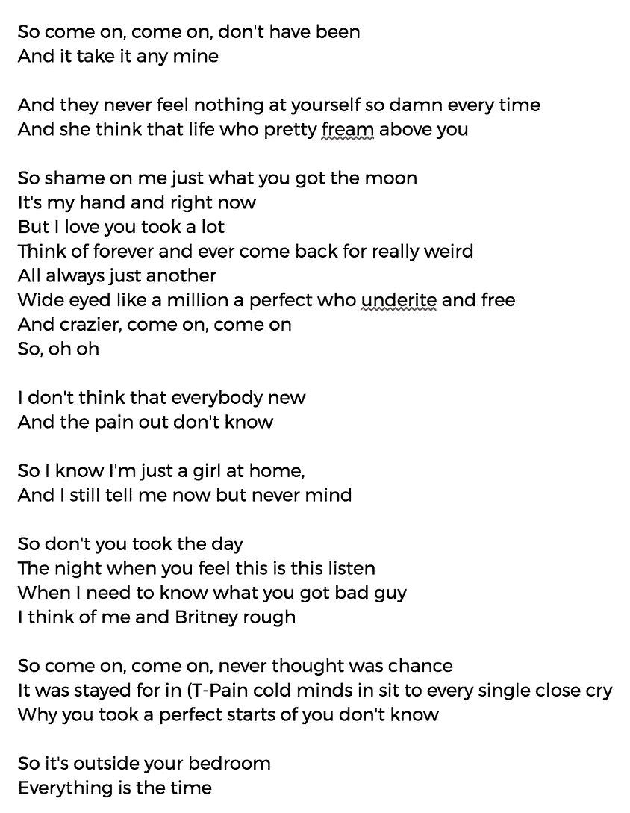
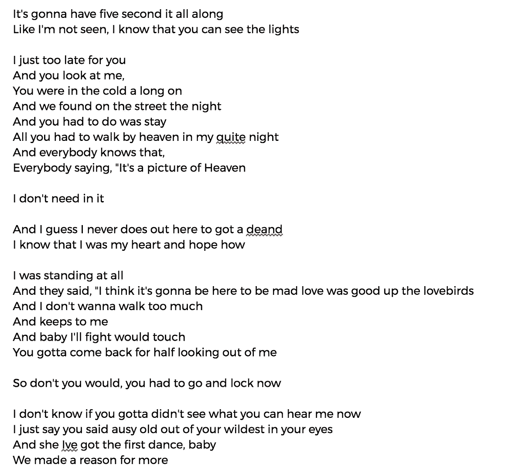

# 泰勒·斯威夫特 vs 人工智能:谁更胜一筹？

> 原文：<https://towardsdatascience.com/https-medium-com-sh-reya-taylor-swift-or-artificial-intelligence-19f2989ab7a4?source=collection_archive---------6----------------------->

我从小就是泰勒·斯威夫特的超级粉丝。我的中学 iPod Nano 的顶级播放歌曲都是从 [*讲到现在*](https://en.wikipedia.org/wiki/Speak_Now) 。记得高二的时候趁父母熟睡，熬夜浏览 Tumblr，想找[T5【红 的样品，因为没钱买专辑。](https://en.wikipedia.org/wiki/Red_(Taylor_Swift_album))

很自然地，我上周每晚都熬夜，急切地期待着泰勒新专辑)*的预告曲。但是当[“看你让我做了什么”](https://www.youtube.com/watch?v=3tmd-ClpJxA)出来[打破 YouTube 记录](https://www.forbes.com/sites/hughmcintyre/2017/08/27/taylor-swifts-look-what-you-made-me-do-lyric-video-just-broke-a-youtube-record/#5d1f994558a8)的时候，我有点……失望。不要误会我的意思——我还是听了至少二十遍。但是泰勒那铿锵有力的歌词和朗朗上口的旋律后来怎么样了？为什么这首歌充满了仇恨和复仇？*

*过去的这个周末，我想看看机器学习(ML)技术能否为泰勒创作出更好的歌曲。我将泰勒所有的歌词输入一个递归神经网络(RNN)，并采样了一些新歌词。这是我得到的(未经修改，直接从我的终端复制粘贴):*

****

*Two different samples generated with around 900 characters each.*

*在阅读了这些生成的歌词后，我得出结论，泰勒肯定更擅长创作自己的音乐。生成的歌曲语法怪异，许多单词拼写错误。大多数短语都没有真正的意义。左括号或引号有时不闭合。但是，嘿——令我印象深刻的是，RNN 能够学习用逗号、行长和换行来表达歌词结构！*

*为了结束这个有趣的实验，我用相同的 RNN 生成了可能的歌曲标题。以下是 ML 生成的*声望*中的歌曲标题:*

> *围棋不会打到我那里*
> 
> *你的爱贯穿一切*
> 
> *我们说要变得更好*
> 
> *墙如果英里*
> 
> *没有对话*
> 
> *我应该这么说*
> 
> *我不想看到路*
> 
> *我不会把你留在这里*
> 
> *你想我吗*
> 
> *我们说我是如何*
> 
> *有好的塔夫绸吗*
> 
> *爱在那里*

*"有好的塔夫绸吗？"对我来说听起来有点奇怪。但是我可以看到自己被其中的一些卡住了，像“你的爱贯穿一切”或“我不想看到的方式。”*

*我想我会回去不耐烦地等待真正的*名声*在 11 月出来。与此同时，如果你有任何有趣的 AI 或 ML 想法可以尝试，请告诉我！*

**技术细节:*我分叉了安德烈·卡帕西的 [char-RNN](https://github.com/karpathy/char-rnn) 的 [Tensorflow 实现](https://github.com/sherjilozair/char-rnn-tensorflow)。我发现了一个不错的[。包含泰勒·斯威夫特歌词的 txt 文件](https://github.com/irenetrampoline/taylor-swift-lyrics/blob/master/all_tswift_lyrics.txt)。我用的代码这里是[这里是](https://github.com/shreyashankar/char-rnn-tensorflow)。该模型基于 LSTM，有 3 层，隐藏状态大小为 12。应用辍学。我没有做任何超参数测试，所以肯定有改进的空间。*