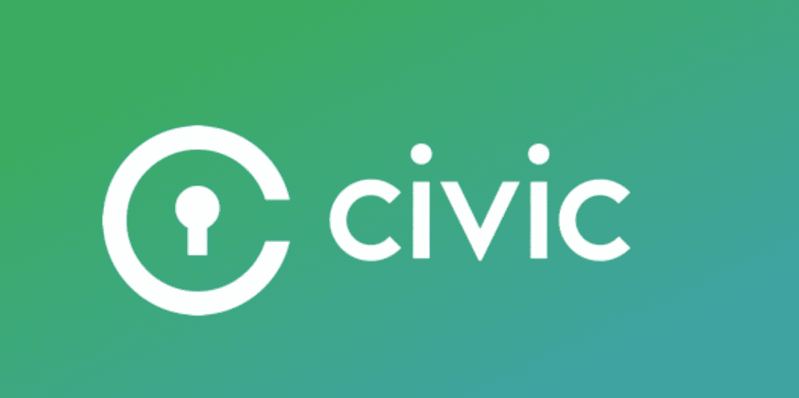
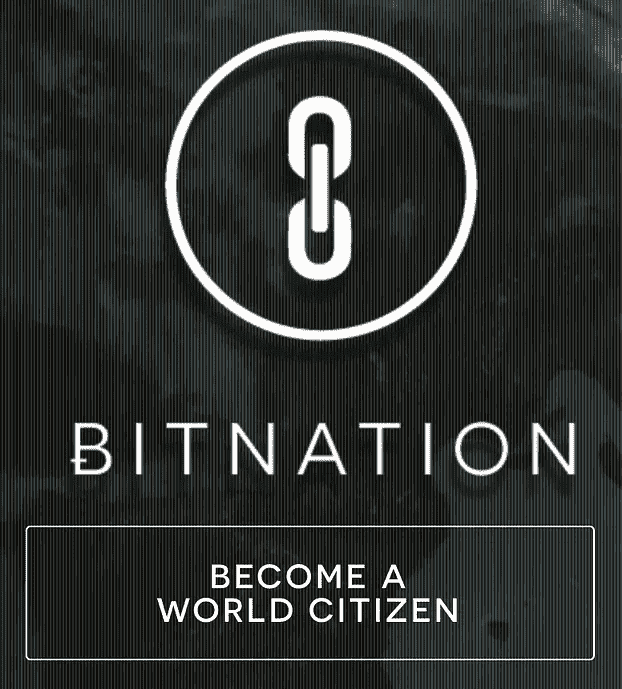
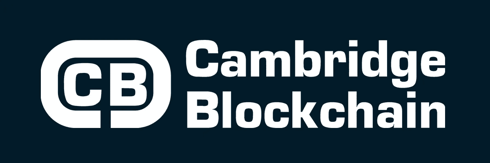

# 区块链和数字身份

> 原文：<https://towardsdatascience.com/https-medium-com-shaanray-how-blockchains-will-solve-privacy-88944f3c67f0?source=collection_archive---------2----------------------->

Digital Identity.

每当我们在互联网上交易时，我们都会留下全面的数字足迹。我们使用的平台越多，留下的数字痕迹就越多。处理金融交易的互联网平台包括 Paypal、信用卡处理器、直销银行、谷歌钱包、Apple Pay、亚马逊支付、Square、Stripe、Venmo 和加密货币。用户必须公开个人和财务数据才能使用这些服务。

一个人的数据通常存储在各种不同的数据库中，并在不同的时间生成。这些个人数据中的一些会随着时间的推移而变化(例如，居住地址)，因此在数据库之间并不相同。结果是一个人的多个“数字克隆”存在于不同的数据库中。

当前的身份管理系统存在许多问题。用户在几个在线平台和网站上输入数据和注册，并且必须创建和记住大量密码。人们不能同时更新他们所有的凭证和数字身份。这破坏了安全性和便利性。此外，正如 Equifax 黑客事件所显示的那样，不良分子只需侵入一个主要数据库，就能获取每个用户的信息。

简而言之，当前的数据身份实践是不可持续的。

Similar but not the same.

**政府 id**

爱沙尼亚和印度政府已经试验了集中式数字身份证。个人身份证可以用来投票、报税、从银行提款、登记财产以及遵守其他政府报告要求。由于数字身份证是由政府颁发的，收集的信息存储在一个中央数据库中。数据的集中存储会产生单点故障。为了保证此类数据的安全，需要实施极其严格的控制和协议。

A specimen government ID.

**区块链解决方案**

区块链技术以去中心化、可信和不可变的方式存储数据。区块链可以确保用户的单一数字身份存储在一个安全和廉洁的方式。这种单一的数字身份可以始终与最新的用户信息保持同步。

鉴于这一潜力，各公司正争相开发基于区块链的数字身份管理和认证解决方案。这个领域的早期参与者包括 Bitnation、Civic、Cambridge Blockchain LLC、BlockAuth 和 Existence ID。

Bitnation 的治理平台寻求提供与政府相同的服务。它的用户被称为比特国家的“公民”。

专注于减少欺诈和防止身份盗窃的 Civic 去年 7 月推出了极其成功的 ICO。

Cambridge Blockchain LLC 正在与金融机构合作开发一种直观、用户友好的数字身份解决方案，该解决方案完全符合隐私法规。为了赢得企业客户的信任，解决方案必须强大。

IBM 和 SecureKey Technologies 也为消费者推出了一个基于区块链的数字身份网络。它将建立在 Linux 基金会的 Hyperledger Fabric v1.0 之上。Hyperledger Fabric 是一个许可的区块链(这意味着其网络参与者可以限制谁可以参与区块链的共识机制)。许可的区块链将允许用户分配谁可以访问他们的数字身份数据的权限。

Early movers working on blockchain enabled digital identity solutions.

**网络效应**

如果没有消费者的认可，任何数字身份区块链解决方案都无法为互联企业和机构所用。许多希望采用基于区块链的身份管理解决方案的行业都受到高度监管，例如银行、信用卡公司和医疗保健提供商。项目的数据隐私机制、节点的分布和开发团队将是成功的关键。

**结论**

未来，我们每个人都将拥有一个最新的数字克隆体。基于区块链的数据加密将防范身份盗窃。我们将能够跨不同的商务和合规事务渠道选择与谁共享哪些数据。哪些基于区块链的数字身份管理平台将达到临界质量并利用网络效应是一个开放的问题。

—

[沙安雷](http://www.shaanray.com/)

关注媒体上的 Lansaar Research ，了解最新的新兴技术和新的商业模式。