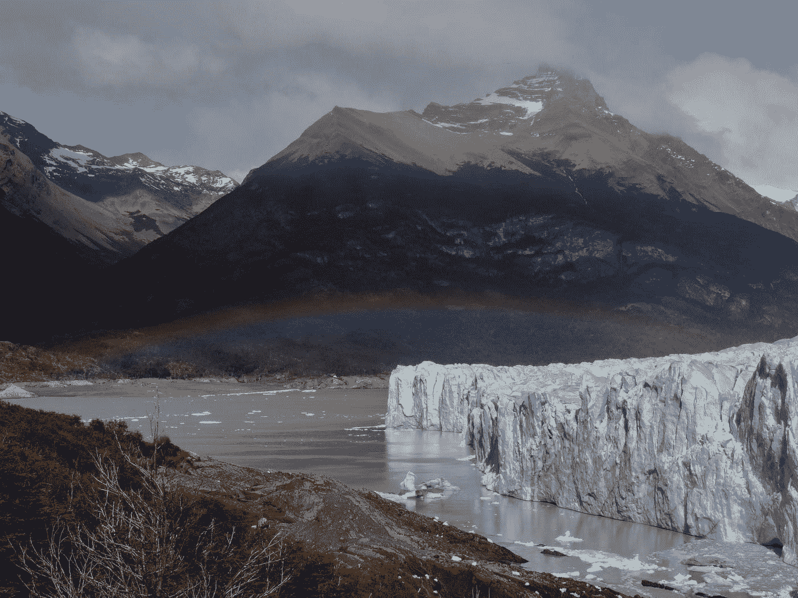
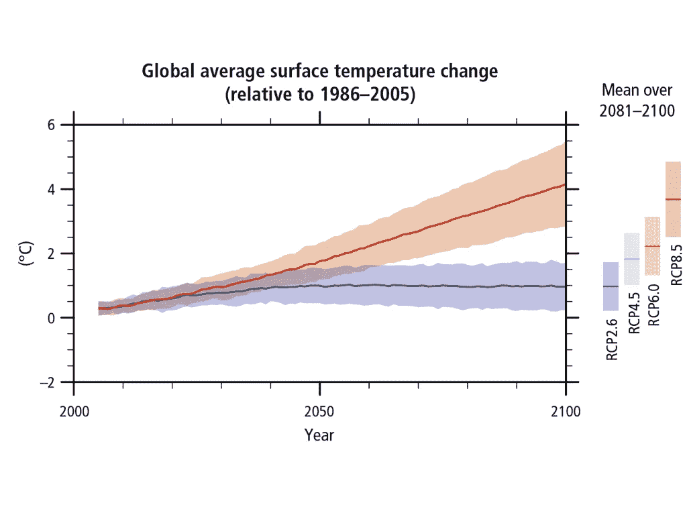
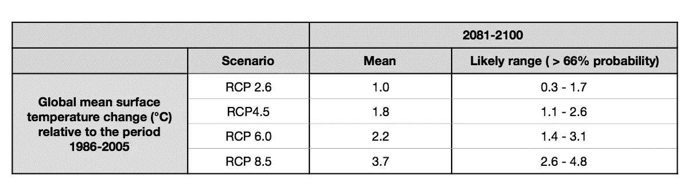
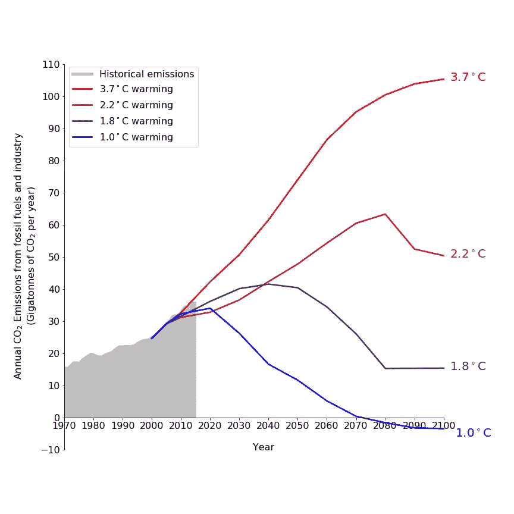
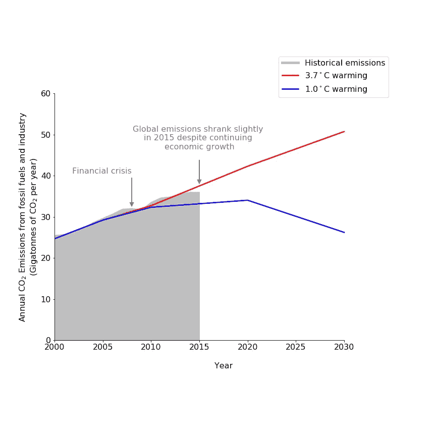
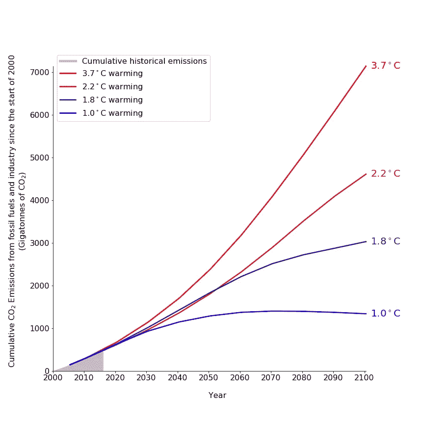
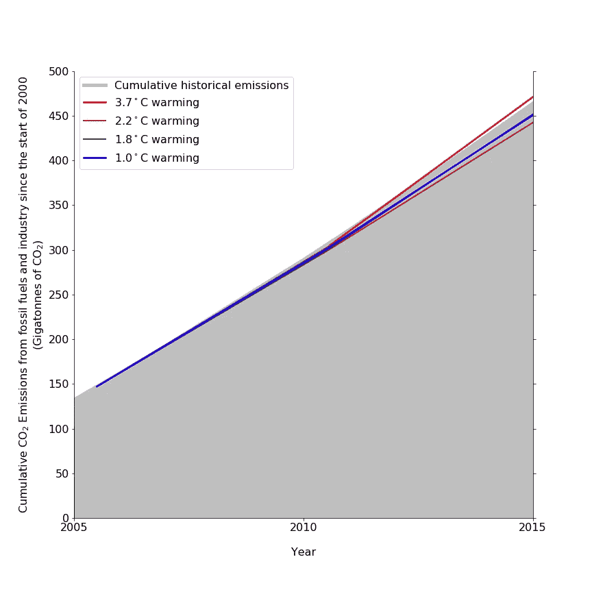

# 关于气候

> 原文：<https://towardsdatascience.com/https-medium-com-stephaniewillis808-concerning-climate-5a6b923eb8eb?source=collection_archive---------11----------------------->

## 为什么我们不能放弃减缓气候变化，以及对迄今为止进展情况的分析。

Photo by [NOAA](https://unsplash.com/@noaa?utm_source=medium&utm_medium=referral) on [Unsplash](https://unsplash.com?utm_source=medium&utm_medium=referral)

# 动机

当我想到气候变化以及我们可以做些什么来缓解它时，我常常会对这一切感到绝望。它看起来如此重要，却又如此难以解决。

排放大量的二氧化碳给了我们不可思议的生活方式。当我们排放时，没有即时的反馈机制——我们无法直接感受到排放的成本。更何况费用大多是其他人承担的。巨大的直接利益和缺乏直接的负面反馈使得我们很难说服自己或我们的政府来抑制排放。事实上是如此之难，以至于我认为放弃这份糟糕的工作并继续我们的生活是很诱人的。我们觉得我们的政府和行业没有机会做出必要的改变，以满足巴黎协定将全球变暖限制在“比工业化前水平高出 2 摄氏度以下”的目标——所以我们放弃了。

但是我们不应该。因为 2 C 比 3 C 好，3 C 比 4 C 好。我认为这是一个被忽略的关键点。排放的二氧化碳越多，温度就越高，后果就越严重。已故的大卫·麦凯——我的英雄——将二氧化碳排放量与时间的图表下的面积描述为等于“痛苦”。面积越大，苦难越多。因此，我们应该尽我们所能来限制这些排放和由此带来的痛苦，即使我们怀疑气温上升将达到 2 摄氏度。

在深入研究我们应该采取什么行动之前，我认为有必要了解我们现在的处境。气候变化已经造成了多大的破坏，还会造成多大的破坏？我们在减排方面做得怎么样？这些问题(以及我目前的失业和无限时间的状态)促使我做了一些研究和数据分析。总的来说，我尝试使用开源数据集来产生我自己的数据。有时我没有做到这一点，所以复制了其他人的数据——在这种情况下，我会在说明中这样说。如果你想在阅读文章时看到数据操作和绘图的代码，你可以在这里做[。](https://github.com/StephanieWillis/concerning_climate/blob/master/Motivation_and_measuring_progress.ipynb)

# 气候影响

政府间气候变化专门委员会的最新报告(T0)和最近公布的美国全球变化计划(US Global Change Programme)的气候科学特别报告(T2)描述了气候变化已经造成的影响。这些变化包括:从 1850-1900 年到 2003-2012 年，气温上升了约 0.78 摄氏度(气专委)；1901-2010 年期间全球平均海平面上升约 19 厘米(气专委)；世界大部分大陆地区极端温度和强降水事件的强度和频率增加。

这些报告还包括对不同排放情景下气候变化未来影响的预测。IPCC 使用了四种被称为“代表性浓度途径”(RCP)的情景。它们是 RCP2.6、RCP 4.5、RCP 6.0 和 RCP 8.5。名字中的数字代表“辐射力”——大气中的气体如何影响地球吸收的能量和辐射回太空的能量之间的平衡。这个数字越大，辐射进来和辐射出去的比例就越大——所以温度就越高。具体来说，这些数字与 2100 年每种情况下的辐射作用力有关。在这四种情况下，化石燃料使用和工业的二氧化碳年排放量如下所示。

*Annual emissions of CO2 from fossil fuels and industry under the 4 RCP scenarios. Data and citations for scenario development* [*here*](https://tntcat.iiasa.ac.at/RcpDb/dsd?Action=htmlpage&page=download)*.*

在 RCP 8.5 中，年度 CO2 排放量继续增加。高人口和适度的技术变革导致了长期的高需求和高排放。

在 RCP 6.0 中，二氧化碳年排放量在 2080 年达到峰值，然后下降。人口稳定，增长相对缓慢，经济的能源强度(二氧化碳排放量/美元)逐渐改善。

在 RCP 4.5 中，二氧化碳年排放量在 2040 年达到峰值，然后下降。缓慢的增长和随后的减排是通过大规模采用核能和碳捕获与封存(CCS)以及大规模植树造林来实现的。

在 RCP 2.6 中，二氧化碳年排放量在 2020 年达到峰值，然后下降，2070 年后变为负值。这一情景在很大程度上依赖于 CCS 和生物燃料的使用来实现碳负发电(通过种植植物，燃烧它们，然后捕获和储存过程中排放的 CO2)。这是一项未经证实的技术。

下图显示了每个 RCP 下预计的全球温度变化。显示的温度变化是相对于 1986-2005 年的平均值而言的。值得一提的是，这不是《巴黎协定》所指的“前工业化”基线。我对“前工业化”基线做了更多的研究，并在这里写下了相关内容。结论是，如果我们希望它们相对于工业化前的水平，我们需要将下面报告的温度变化增加 0.55°C 至 0.8°C。

*Projected global temperature increase relative to 1986–2005 under each of the emissions scenarios as determined by multi model simulations. Time series are shown on the left for RCP 2.6 and RCP 8.5\. On the right the projected temperature change to the period 2081–2100 is shown for all 4 scenarios. The solid line indicates the mean of multiple different models and the shading indicates the 5 to 95% range of the model outputs. This plot is taken directly from the* [*IPCC’s latest report*](https://www.ipcc.ch/pdf/assessment-report/ar5/syr/SYR_AR5_FINAL_full_wcover.pdf) *as I was unable to find a tractable data set from which to make my own plot.*

*Projected global temperature increase (°C) from 1986–2005 to 2081–2100 under the 4 scenarios. This table summarizes the key numbers from the plot above. ‘Mean’ in this context refers to the average result of many different climate models. The likely range of temperatures under each scenario is shown on the right. The IPCC uses the word ‘likely’ to describe something which has a greater than 66% probability of happening.*

将 0.55℃和 0.8℃之间的温度变化加到报告的温度变化上，我们看到，即使我们遵循 RCP2.6，到 2010 年，我们可能会超过 2℃的变暖。在高排放情景下，变暖的规模和速度是可怕的。我不知道到 2100 年再变暖 3.7 摄氏度会是什么样子，但我对 0.78 摄氏度的变暖已经导致[(饥荒、](https://www.nytimes.com/2017/03/27/world/africa/famine-somalia-nigeria-south-sudan-yemen-water.html?mcubz=1)[洪水、](http://www.dw.com/en/how-climate-change-is-increasing-forest-fires-around-the-world/a-19465490)[飓风](https://www.bloomberg.com/news/articles/2017-09-06/hurricane-irma-was-made-worse-by-climate-change-scientists-say))的痛苦有所了解。看着这些温度估计，我强烈希望我们远离 RCP 8.5。

# 现状核实

记住这些温度变化，让我们看看数据。在过去的几年里，毫无疑问，我们一直在努力减少二氧化碳的排放，他们取得了哪些成效？我们似乎在遵循哪种情景？

RCP 方案始于 2000 年。截至 2015 年，化石燃料和工业二氧化碳排放量的详细数据已经公布。因此，历史数据和“未来情景”之间有 15 年的重叠。这种重叠让我们能够弄清楚现实与场景相比是如何形成的。在下图中，我绘制了 4 种情景下的历史排放量和预测排放量。我已经用每个场景的平均温度上升估计值替换了场景名称(来自上表)。我发现温度变化的估计比辐射力的估计更容易理解。但是请注意，温度数值只是模型的平均输出。它们没有涵盖每种情况下可能的温度上升的全部范围。

*Comparison of* [*historical*](http://edgar.jrc.ec.europa.eu/overview.php?v=CO2ts1990-2015) *and* [*projected*](https://tntcat.iiasa.ac.at/RcpDb/dsd?Action=htmlpage&page=download) *annual CO*2 *emissions from fossil fuel use and industry. Each scenario is labelled with the average predicted increase in temperature between the period 1986–2005 and the period 2081–2100 under that scenario. For a explanation of why only emissions from fossil fuels and industry are being analyzed see the end of this article.*

*A zoomed in look at the previous figure. The intermediate emissions scenarios have been omitted for clarity.*

令人沮丧的是，全球二氧化碳排放量似乎很大程度上遵循了 RCP 8.5——有增无减的增长情景。然而，最近排放量增长已经放缓，并偏离了 RCP 8.5 的设想。2015 年，尽管国内生产总值增长了 3%,二氧化碳排放量[却下降了 0.1%](http://edgar.jrc.ec.europa.eu/news_docs/jrc-2016-trends-in-global-co2-emissions-2016-report-103425.pdf),因此脱碳努力似乎产生了一些影响。

我们每年排放的准确轨迹不需要完全遵循这些情景中的任何一个——它们仅仅是一些可能的未来的指示。最重要的是二氧化碳的总排放量，而不是我们的排放量随时间变化的确切方式。下图显示了自 2000 年以来的累计排放量，并与各种情景下的累计排放量进行了比较。

*Comparison of* [*historical*](http://edgar.jrc.ec.europa.eu/overview.php?v=CO2ts1990-2015) *and* [*projected*](https://tntcat.iiasa.ac.at/RcpDb/dsd?Action=htmlpage&page=download) *cumulative CO*2 *emissions from fossil fuel use and industry. Each scenario labelled with the average predicted increase in temperature between the period 1986–2005 and the period 2081–2100 under that scenario. See below for a zoomed in version.*

*A zoomed in version of the previous figure. The huge cumulative emissions under the 3.7°C scenario dwarfs current emissions and makes current differences seem small. They are not! We saw in the annual plots that a year’s worth of emissions is of the order of 30 Gtonnes so the difference between the 3.7°C and the 1.0°C scenario is almost a whole years worth of global emissions.*

所以我们的累积排放量超过了低温情况下的排放量。因此，将我们的年排放量与较低温度情景下的排放量保持一致是不够的。为了弥补我们已经做出的承诺，我们需要比这些情景所显示的更大幅度地减少我们的年排放量。这意味着我们越是拖延控制排放的时间，排放限制就需要变得越严格。我们需要想出如何大幅减少排放，而且我们需要尽快行动。如果我们不这样做，我们很可能会看到比我们目前敢于考虑的更大的温度上升。

*在以后的文章中，我会更深入地研究几个主要国家的排放量，并试图找出不同的政策措施对二氧化碳排放量的影响。希望这些结果能告诉我们一些关于如何务实地向前推进，以最小化变得更热的程度。*

# 后记:为什么只有化石燃料和工业排放的 CO2？

*这项分析只关注化石燃料使用和工业过程中的二氧化碳排放。我没有研究其他人为的二氧化碳来源，比如土地使用的变化。除了二氧化碳，我也没有研究其他温室气体。RCP 方案包括对其他排放类型的预测，但我无法找到它们的最新历史数据集。因此，我在分析中省略了它们。为了了解这种忽略是否合理，我查看了人为温室气体排放的明细。下图显示了 2010 年的细分情况。*

*Breakdown of anthropogenic greenhouse gas emissions (gigatonne of CO*2*-equivalent (GtCO*2 eq) *per year ) in 2010\. The equivalence of different greenhouse gases is based on their 100 year global warming potential — as calculated in the* [*IPCC’s 5th Assessment report*](https://www.ipcc.ch/pdf/assessment-report/ar5/syr/SYR_AR5_FINAL_full_wcover.pdf)*. Data is also from the IPCC’s 5th Assessment report Note that there are very large uncertainties about CO*2 *emissions due to forestry and other land use change.*

*化石燃料和工业排放的二氧化碳构成了大部分人为温室气体排放。土地使用变化产生的甲烷排放和二氧化碳排放也是重要因素，观察它们如何演变将是有趣的。然而，在缺乏最新的排放数据的情况下，我认为忽略它们并关注最大的因素是合理的。*