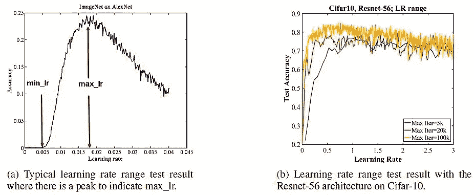
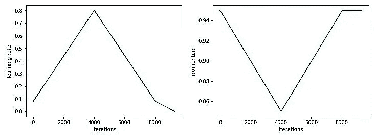
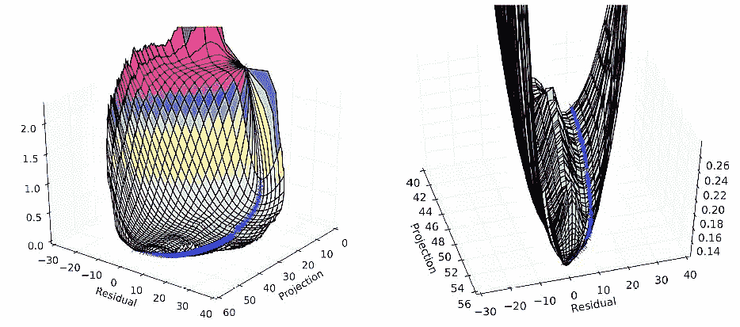
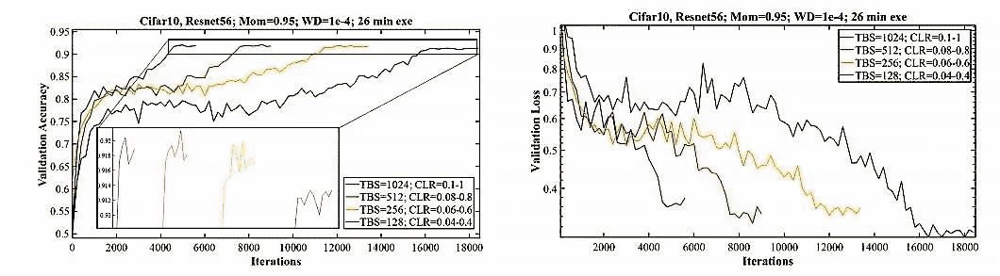
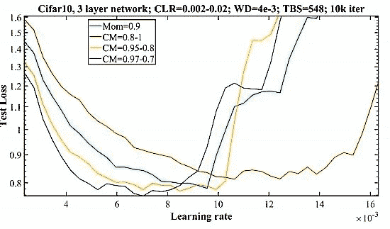
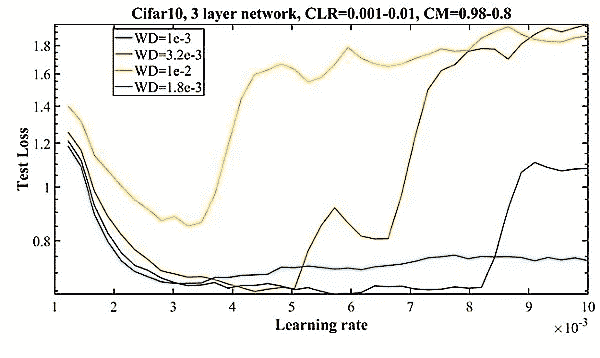

# 超收敛:使用大学习速率非常快速地训练神经网络

> 原文：<https://towardsdatascience.com/https-medium-com-super-convergence-very-fast-training-of-neural-networks-using-large-learning-rates-decb689b9eb0?source=collection_archive---------4----------------------->

Photo by [Mike Enerio](https://unsplash.com/@mikeenerio?utm_source=medium&utm_medium=referral) on [Unsplash](https://unsplash.com?utm_source=medium&utm_medium=referral)

这篇文章概述了一种叫做 ***【超级收敛】*** 的现象，与传统的训练方法相比，我们可以更快地训练一个深度神经网络。其中一个关键要素是使用具有最大可能学习率的 ***【单周期策略】*** 来训练网络。我鼓励你看看这篇 [***精彩的论文***](https://arxiv.org/abs/1708.07120) 了解更多细节。

> 在训练中允许“超级收敛”的一个见解是使用大的学习率来正则化网络，因此需要减少所有其他形式的正则化，以保持欠拟合和过拟合之间的平衡。

## 动机:

斯坦福大学最近组织了一场名为 [**DAWNBench**](https://dawn.cs.stanford.edu/benchmark/) 的比赛。获胜的参赛作品是 by， [fast.ai](https://www.fast.ai/) 他们训练 CIFAR10 在 3 分钟内达到 94%的测试准确率。他们使用了很多很酷的技巧，避免坚持传统的训练技巧。

你可能想知道，在大约 75 个周期内训练一个模型在 CIFAR10 上达到 94% (高)测试精度是没有意义的，因为最先进的技术已经超过 98%。但是你不认为，**“最先进水平”**准确性是一个病态的目标，因为在这个问题上投入*更大的模型、更多的超参数调整、更多的数据扩充或更长的训练时间*通常会导致准确性的提高，使不同作品之间的公平比较成为一项微妙的任务。此外，超收敛的存在与理解深度网络的泛化有关。

> 上图展示了 CIFAR10 数据集上的“超级收敛”。我们可以很容易地观察到，与典型的训练(91.2%)相比，使用修改的学习率时间表，我们实现了更高的最终测试准确度(92.1%)，并且也只是在几次迭代中。

Super-Convergence of Neural Nets

## 超收敛:

因此，让我们快速进入正题，讨论我们如何在少得多的训练迭代次数中实现这些最先进的结果。许多人仍然认为用最佳超参数训练深度神经网络是一种魔法，因为有太多的超参数需要调整。*遵循什么样的学习率策略，为架构选择什么样的内核大小，什么样的权重衰减和丢失值对于正则化来说是最优的？*所以，让我们打破这种刻板印象，尝试释放一些这些黑色艺术。

> 我们将从 **LR 范围测试**开始，它可以帮助你找到最大的 ***学习率*** ，你可以用它来训练你的模型(最重要的超参数)。然后，我们将运行**网格搜索 CV** 来搜索剩余的参数( ***权重衰减&下降*** )，以找到它们的最佳值。

## 学习率查找器:

Leslie Smith 在他的论文中首次介绍了这种技术来寻找 max learning，这篇论文更加详细地介绍了使用**循环学习率**和**循环动量的好处。我们以很小的学习率开始预训练，然后在整个跑步过程中线性(或指数)增加。这提供了我们在一个学习率范围内训练网络有多好的一个概览。在学习率较低的情况下，网络开始收敛，随着学习率的增加，网络最终变得过大，导致测试精度/损失突然发散。**

Max LR is the peak value in the graph after which accuracy starts decreasing!

> 典型的曲线看起来类似于上面所附的曲线，第二个图说明了训练迭代次数和达到的精度之间的独立性。

## 单周期政策:

为了实现超收敛，我们将使用“单周期”学习率策略，该策略要求指定最小和最大学习率。Lr 范围测试给出最大学习率，最小学习率通常为最大值的 1/10 或 1/20。一个循环由两个步长组成，一个是 Lr 从最小值增加到最大值，另一个是从最大值减少到最小值。在我们的例子中，一个周期将比迭代/时期的总数小一点，并且在剩余的迭代中，我们将允许学习率比其初始值小几个数量级。下图更好地说明了单周期策略——左图显示了循环学习率，右图显示了循环动力。

**Cyclical Learning rate and Cyclical Momentum**

> “一个周期”策略的动机如下:学习率开始时很小，以允许收敛开始，但是随着网络穿过平坦的谷，学习率变大，以允许更快地通过谷。在训练的最后阶段，当训练需要进入局部最小值时，学习率再次降低到一个小值。

**Loss function topology**

左图显示了训练如何跨越损失函数拓扑的可视化，而右图显示了优化结束时的特写。

> ***为什么一个大的学习率表现得像一个正则化者？***
> 
> LR 范围测试通过结果显示了正则化的证据，其显示了当使用 Cifar-10 数据集和 Resnet-56 架构进行训练时，训练损失增加且测试损失减少，而学习率从大约 0.2 增加到 2.0，这意味着在使用这些大的学习率进行训练时正则化正在发生。此外，该定义称正则化是我们对学习算法进行的任何修改，旨在减少其泛化错误。

## 批量大小:

众所周知，小批量会导致正则化效应，一些人还显示 CIFAR-10 的最佳批量约为 80，但与之前的工作相反，本文建议在使用单周期策略时使用更大的批量。批量大小应该只受内存约束的限制，而不受任何其他因素的限制，因为较大的批量大小使我们能够使用较大的学习速率。尽管如此，较大批量的好处在某一点后逐渐消失。

批量大小对测试损失/准确度的影响

> 左图显示了批次大小对测试准确度的影响，右图显示了测试损失。在这里，我们可以观察到，与其他相比，批量大小为 1024 在最少的训练迭代次数中实现了最佳的测试准确性。

将测试损失与测试准确度进行对比也很有趣。*虽然较大的批量在训练早期获得较低的损失值，但最终的损失值仅在较小的批量时最小，这与准确度结果完全相反。*

## 周期性动力:

动量和学习速率对训练动力学的影响是密切相关的，因为它们是相互依赖的。动量被设计为加速网络训练，但是它对更新权重的影响与学习速率的大小相同(可以容易地显示为随机梯度下降)。

最佳的训练程序是增加的循环学习率和减少的循环动量的组合。循环动量情况下的最大值可以在对几个值(如 0.9、0.95、0.97、0.99)进行网格搜索后选择，并选择一个给出最佳测试精度的值。作者还观察到，最终结果几乎与动量的最小值无关，0.85 就可以了。

> 上图显示了动量对采用 ResNet56 体系结构的 CIFAR10 数据的测试精度的影响。

*在增加学习速率的同时减少动量提供了三个好处:*

*   较低的测试损耗，
*   更快的初始收敛，
*   在更大的学习速率范围内更大的收敛稳定性。

*还有一点需要注意的是，先减小动量，然后再增大动量，这比反过来会产生更好的结果。*

## 重量衰减:

这是最后一个值得讨论的重要超参数。正则化的量必须针对每个数据集和架构进行平衡，权重衰减的值是调整正则化的关键旋钮。这需要对几个值进行网格搜索，以确定最佳幅度，但通常不需要搜索一个以上的有效数字。

利用数据集和架构的知识，我们可以决定测试哪些值。例如，更复杂的数据集需要更少的正则化，因此测试更小的权重衰减值，如 104、105、106 和 0 就足够了。浅架构需要更多的正则化，因此测试更大的权重衰减值，如 102、103、104。在网格搜索中，我们经常使用 3.18e-4 这样的值，选择 3 而不是 5 的原因是考虑了指数的二等分，而不是幅度本身的二等分(即，在 104 和 103 之间，一等分为 103.5 = 3.16×104)

> 从上面的图中我们可以看到，1.8e-3 的权重衰减(再次平分指数 b/w -0.5 和-1，即 10^-0.75)允许我们使用更大的学习速率，加上与其他值相比给出最小的测试损失。

*现在，按照这个学习率时间表和一个明确定义的程序来做网格搜索 CV 将会给你带来更好的结果，在训练迭代中几乎减少 50%。*

> ***感谢阅读！我会尽力多写一些这样的博客。我的***[***Linkedin***](https://www.linkedin.com/in/adi-iitd/)***简介。你可以关注我的*** [***推特***](https://twitter.com/Aadi__gupta) ***太。***