# 掌握新一代梯度推进技术

> 原文：<https://towardsdatascience.com/https-medium-com-talperetz24-mastering-the-new-generation-of-gradient-boosting-db04062a7ea2?source=collection_archive---------1----------------------->

Catboost

**梯度提升决策树**和随机森林是我最喜欢的表格异构数据集的 ML 模型。这些模型是在 [Kaggle](https://www.kaggle.com/) 比赛中表现最好的，并在行业中广泛使用。

**Catboost** ，这个街区的新小子，到现在已经有一年多一点的时间了，它已经在威胁 *XGBoost* 、 *LightGBM* 和 *H2O* 。

# 为什么选择 Catboost？

## 更好的结果

Catboost 在基准测试中取得了最好的结果，这很好，但是我不知道我是否会仅仅为了对数损失改进的一小部分而替换一个工作的生产模型(特别是当进行基准测试的公司对 Catboost 有明显的兴趣时😅).
然而，当你看到**分类特征发挥巨大作用的数据集**时，比如*亚马逊*和*互联网*数据集，这种改进变得显著且不可否认。

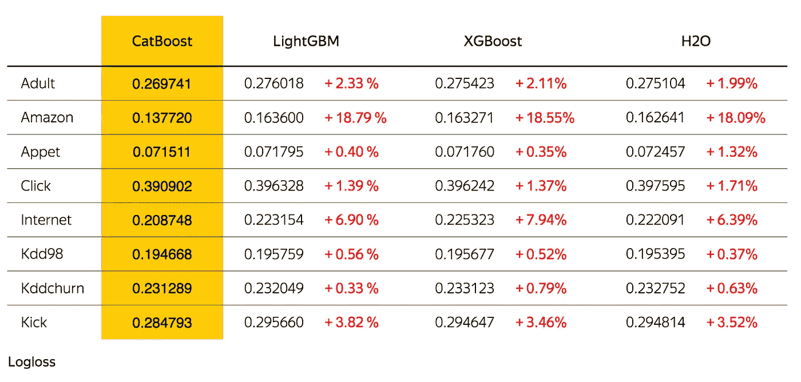

GBDT Algorithms Benchmark

## 更快的预测

虽然训练时间可能比其他 GBDT 实现要长，但根据 Yandex 基准测试，预测时间比其他库快 13-16 倍。

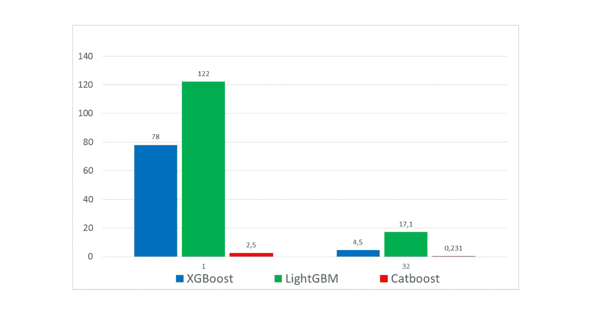

Left: CPU, Right: GPU

## 含电池

与其他 GBDT 算法相比，Catboost 的默认参数是一个更好的起点。对于想要一个即插即用模型来开始体验树合奏或 Kaggle 比赛的初学者来说，这是一个好消息。
然而，我们必须解决一些非常重要的参数，我们稍后会谈到这些参数。

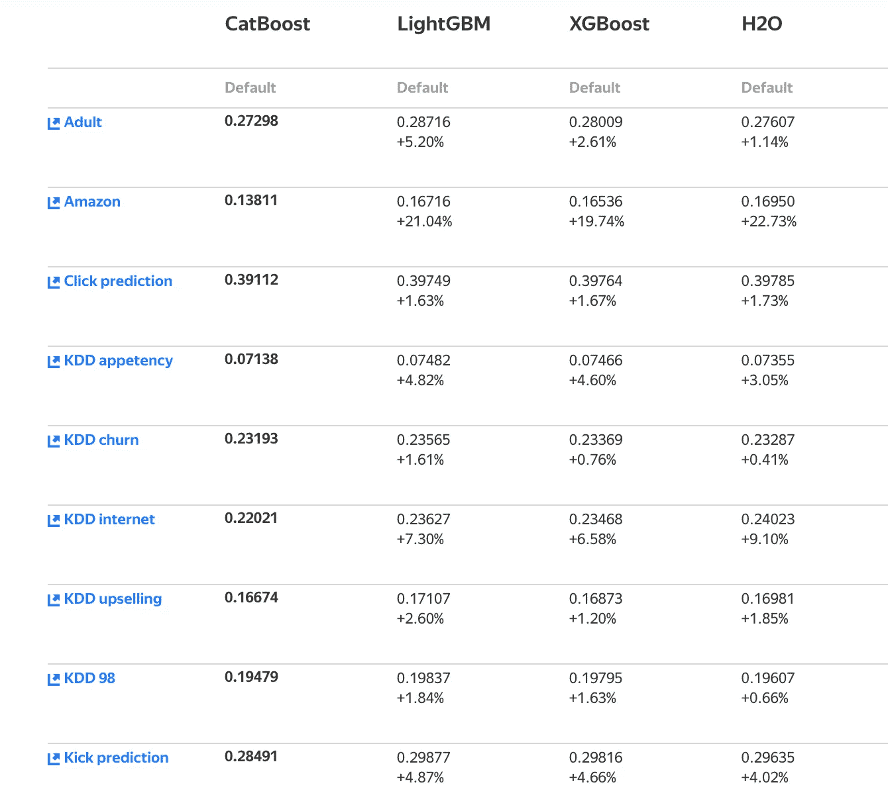

GBDT Algorithms with default parameters Benchmark

Catboost 的一些更值得注意的改进是功能交互、对象重要性和快照支持。

除了分类和回归，Catboost 支持开箱即用的**排名**。

## 经过战斗考验

Yandex 严重依赖 Catboost 进行排名、预测和推荐。这种模式每月为 7000 多万用户提供服务。

> CatBoost 是决策树上**梯度提升的算法。它由 Yandex 的研究人员和工程师开发，是公司内部广泛用于任务排名、预测和提出建议的 [**MatrixNet 算法**](https://yandex.com/company/technologies/matrixnet/) 的继任者。它是通用的，可以应用于广泛的领域和各种问题。**

# 该算法

## 经典梯度增强

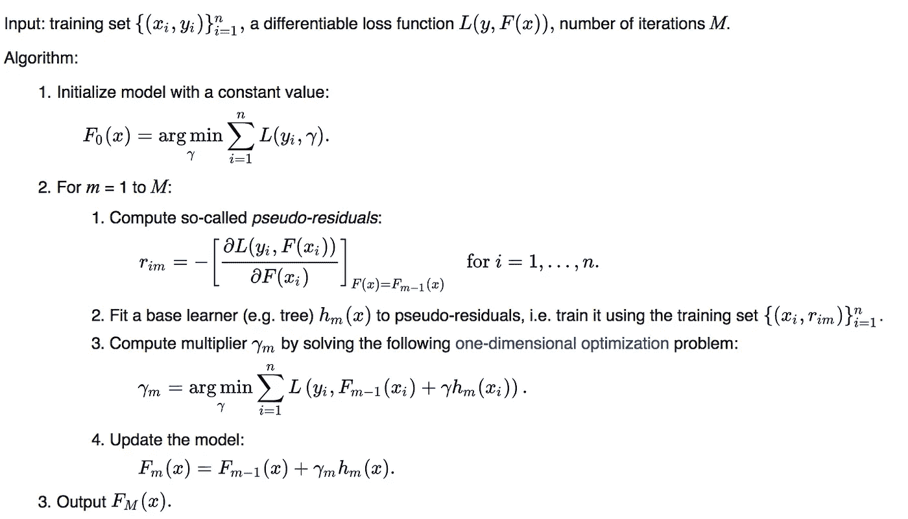

Gradient Boosting on Wikipedia

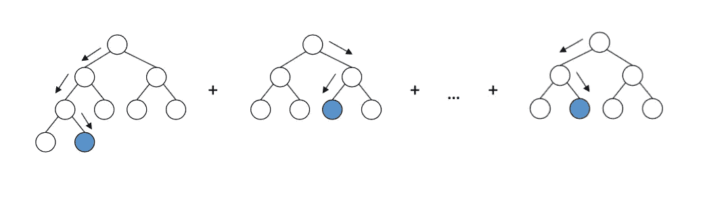

# Catboost 秘制酱

Catboost 引入了两个关键的算法进步——实现了**有序提升**,这是一种替代经典算法的置换驱动算法，以及一种用于处理分类特征的创新算法**。
这两种技术都使用训练样本的随机排列来对抗*预测偏移*，这种偏移是由一种特殊的*目标泄漏*引起的，这种泄漏出现在梯度增强算法的所有现有实现中。**

# **卡特彼勒**电气特征处理

## 有序目标统计

大多数 GBDT 算法和 Kaggle 竞争对手已经熟悉了目标统计(或目标均值编码)的使用。
这是一种简单而有效的方法，其中我们用类别条件下的预期目标 y 的估计值对每个分类特征进行编码。
事实证明，不小心应用这种编码(y 在具有相同类别的训练示例上的平均值)会导致目标泄漏。

为了对抗这种*预测转变* CatBoost 使用了一种更有效的策略。它依赖于排序原则，并受到在线学习算法的启发，该算法按时间顺序获取训练样本。在这种设置下，每个示例的 TS 值仅依赖于观察到的历史。
为了使这种想法适应标准的离线设置，Catboost 引入了一个人工“时间”——训练示例的随机排列 *σ1* 。
然后，对于每个示例，它使用所有可用的“历史”来计算其目标统计。
注意，仅使用一个随机排列，导致前面的例子比后面的例子具有更高的目标统计方差。为此，CatBoost 对梯度增强的不同步骤使用不同的排列。

## 一个热编码

Catboost 对所有具有最多 *one_hot_max_size* 唯一值的特征使用一键编码。默认值为 2。

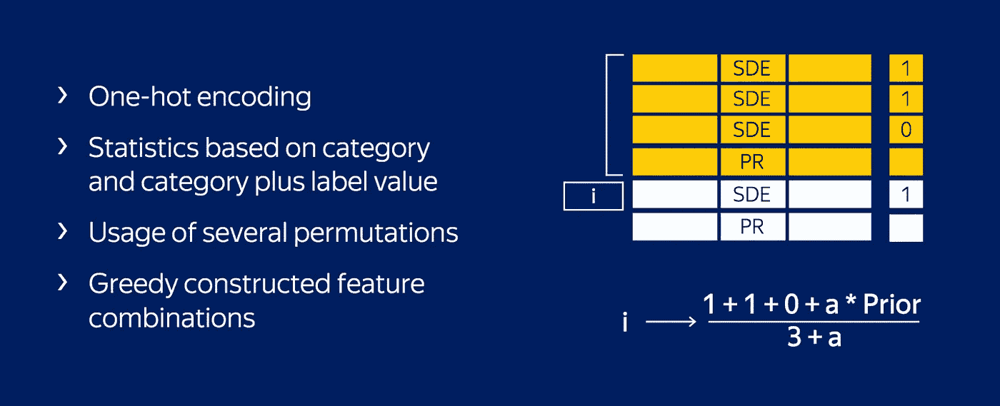

Catboost’s Secret Sauce

# 有序推进

CatBoost 有两种选择树结构的模式，有序和简单。**普通模式**对应于标准 GBDT 算法与有序目标统计的组合。
在**有序模式**提升中，我们执行训练示例的随机排列- *σ2，*并维护 n 个不同的支持模型- *M1。。。，Mn* ，使得仅使用排列中的第一个 *i* 样本来训练模型 *Mi* 。
在每一步，为了获得第 *j* 个样本的残差，我们使用模型*mj1*。
遗憾的是，由于需要维护 n 个不同的模型，这种算法在大多数实际任务中并不可行，增加了 n 倍的复杂度和内存需求。Catboost 在梯度推进算法的基础上实现了对该算法的修改，使用了所有要建立的模型共享的一个树结构。

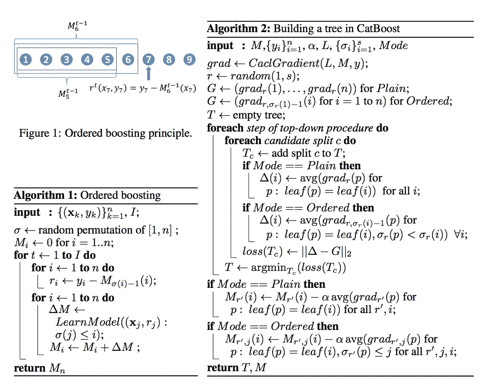

Catboost Ordered Boosting and Tree Building

为了避免*预测偏移*，Catboost 使用排列使得 *σ1* = *σ2* 。这保证了目标 *yi* 不用于训练 *Mi* ，既不用于目标统计计算，也不用于梯度估计。

# 把手放在某物或者某人身上

对于这一部分，我们将使用 [*亚马逊数据集*](https://www.kaggle.com/c/amazon-employee-access-challenge/data) ，因为它很干净，并且非常强调分类特征。

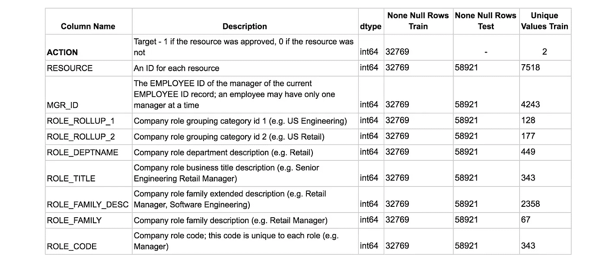

Dataset in a brief

# 调谐 Catboost

## 重要参数

`cat_features` —为了利用 Catboost 对分类特征的预处理，该参数是必需的，如果您自己对分类特征进行编码，并且没有将列索引作为 *cat_features* 传递，那么您就错过了 Catboost 的精髓*。*

`one_hot_max_size` —如前所述，Catboost 对所有具有最多 *one_hot_max_size* 唯一值的特征使用 one-hot 编码。在我们的例子中，分类特征有许多唯一值，因此我们不会使用一个热编码，但根据数据集调整该参数可能是个好主意。

`learning_rate`&`n_estimators`—learning _ rate 越小，利用模型需要的 n 个估计量就越多。通常，方法是以相对高的*学习率*开始，调整其他参数，然后降低*学习率*，同时增加*n _ 估计量*。

`max_depth` —基树深度*，*该参数对训练时间*有很大影响。*

`subsample` —行的采样率，不能用于*贝叶斯*增强类型设置。

`colsample_bylevel, colsample_bytree, colsample_bynode` —列的采样率。

`l2_leaf_reg` — L2 正则化系数

`random_strength` — 每一次分裂都会得到一个分数，random_strength 为分数增加了一些随机性，这有助于减少过度拟合。

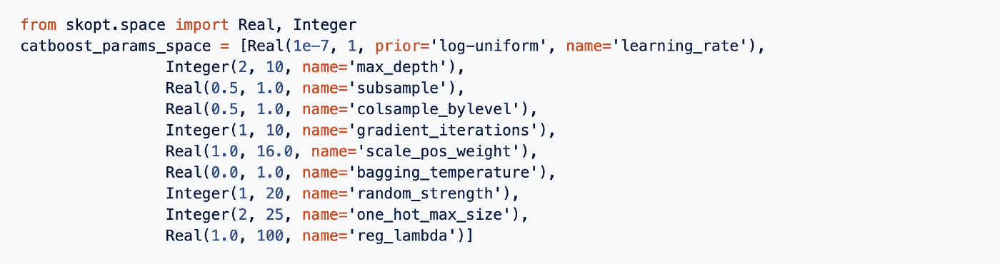

Check out the recommended spaces for tuning [here](https://github.com/talperetz/hyperspace/tree/master/GBDTs)

# 使用 Catboost 进行模型探索

除了 GBDT 模型非常流行的特性重要性之外，Catboost 还提供了**特性交互**和**对象(行)重要性**

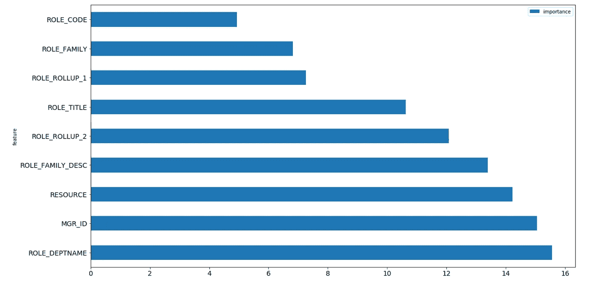

Catboost’s Feature Importance

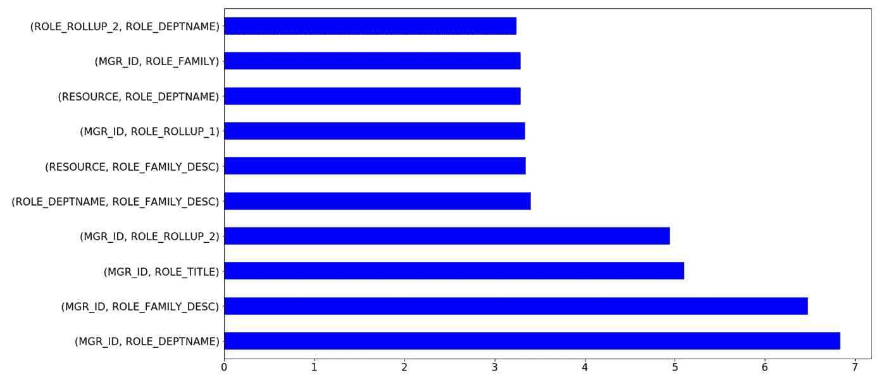

Catboost’s Feature Interactions

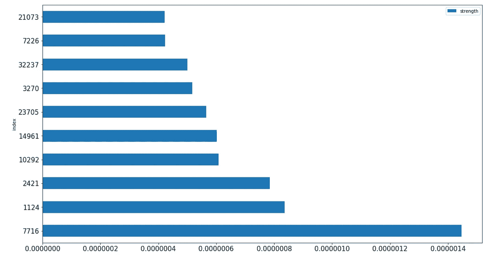

Catboost’s Object Importance

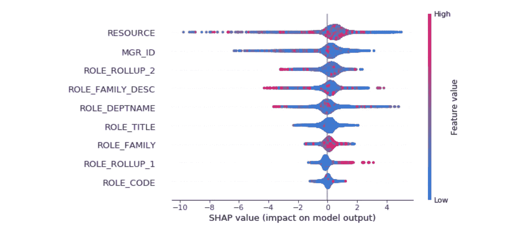

[SHAP](https://catboost.ai/news/new-ways-to-explore-your-data) values can be used for other ensembles as well

# 完整的笔记本

查看一些有用的 Catboost 代码片段

Catboost Playground Notebook

# 结果

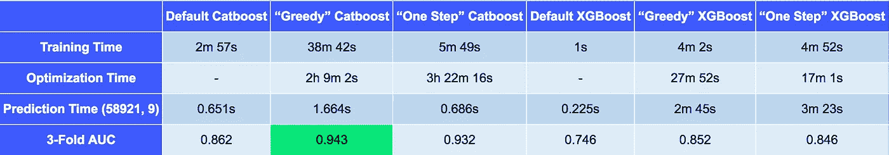

Catboost vs. XGBoost (default, greedy and exhaustive parameter search)

# 拿走

*   Catboost 的构建方法和属性与“老”一代 GBDT 车型相似。
*   Catboost 的强大之处在于它的**分类特征预处理**、**预测时间**和**模型分析**。
*   Catboost 的弱点是它的**训练和优化时间**。
*   不要忘记将 ***cat_features*** 参数传递给分类器对象。没有它，你就不能真正利用 Catboost 的能力。
*   尽管 Catboost 在默认参数下表现良好，但有几个参数在优化时可以显著改善结果。

# 进一步阅读

*   [Catboost 文档](https://tech.yandex.com/catboost/doc/dg/concepts/about-docpage/)
*   [Catboost Github](https://github.com/catboost/catboost)
*   [Catboost 官网](https://catboost.ai/)
*   我强烈推荐您深入研究 arXiv 上的 [CatBoost:带有分类特征的无偏增强论文。](https://arxiv.org/abs/1706.09516)
*   [Catboost 游乐场笔记本](https://gist.github.com/talperetz/6030f4e9997c249b09409dcf00e78f91)
*   [SHAP 值](https://github.com/slundberg/shap)

非常感谢 Catboost 团队负责人[安娜·维罗妮卡·多罗古什](https://medium.com/u/bdf771da88f3?source=post_page-----db04062a7ea2--------------------------------)。

如果你喜欢这篇文章，请按下鼓掌键👏🏽如果你对接下来的帖子感兴趣，一定要关注我

**中:**[**https://medium.com/@talperetz24**](https://medium.com/@talperetz24) **推特:**[**https://twitter.com/talperetz24**](https://twitter.com/talperetz24) **领英:**[**https://www.linkedin.com/in/tal-per/**](https://www.linkedin.com/in/tal-per/)

像每年一样，我想提一下[data hack](https://www.datahack.org.il/)——最好的数据驱动黑客马拉松。今年，我和דור פרץ在我们的项目中使用了 Catboost，并获得了第一名🏆。