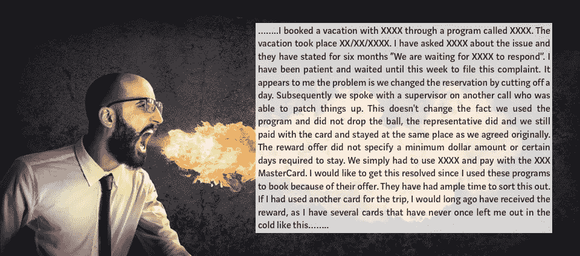
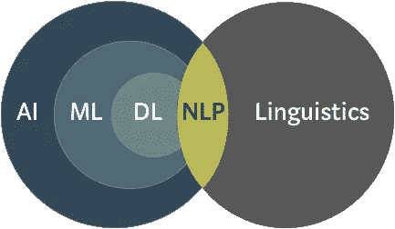
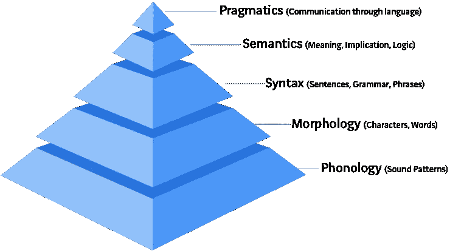
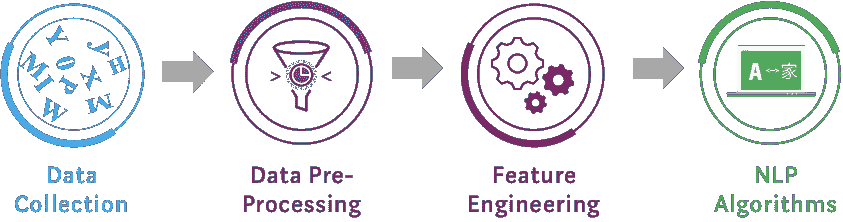
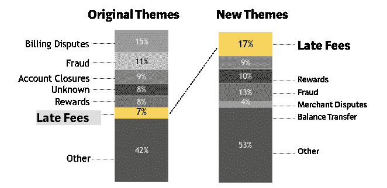
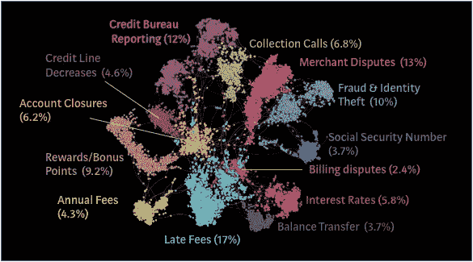
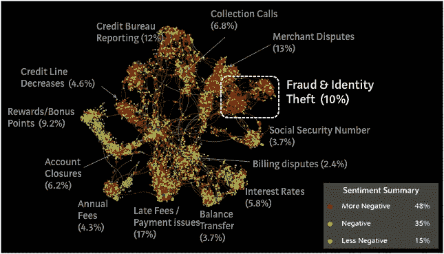
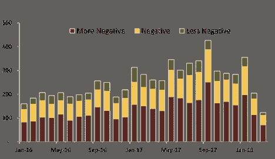

# 使用 NLP 算法人性化客户投诉

> 原文：<https://towardsdatascience.com/https-medium-com-vishalmorde-humanizing-customer-complaints-using-nlp-algorithms-64a820cef373?source=collection_archive---------3----------------------->

Image Source: Adobe Stock

去年圣诞节，作为一名消费者，我经历了最令人沮丧的经历。我正在做一些最后一分钟的假日购物，在排了很长的队后，我终于到达了受祝福的收银台，却发现我的借记卡被封了。我能感觉到收银台的老太太眯着眼睛打量着我。感觉非常尴尬，我马上给银行打了电话。令我惊恐的是，他们告诉我，我的储蓄账户被黑了，几千美元已经不见了！

*“天哪！这种事怎么会发生在我身上？”*

最初的震惊平息后，我决定马上解决这个问题。我不得不拨打另一个号码，证明我的身份，并提出正式投诉，拿回我的钱希望渺茫。打了一个小时的电话后，我挂断了。我太生气了！五分钟后，我看到我的银行发来一条短信，问我:在我们银行工作开心吗？我的第一反应是一些措辞，然后是更多的沮丧和怀疑。

*“他们怎么能这样问我？他们不知道刚刚发生了什么吗？他们只是假装关心我吗？对他们来说我只是一个数据点吗？沧海一粟？”*

在众多的问题中，出现了一个明显的认识。我意识到，作为一名数据科学专业人员，我也在做同样的事情。在我的组织中，我们以同样的冷漠对待我们自己的客户投诉。只是另一个数据点；只是沧海一粟。我有什么不同吗？

> 我们需要人性化的客户数据。

即使在数据科学中，人类的情感也很重要，这一观点在我脑海中生根发芽。我开始痴迷于分析和解读客户投诉数据。在花了几个月的时间进行内部研究后，我们发现了一个鲜为人知的关于投诉叙述的非结构化数据源。举个例子，让我们来看一个向[消费者金融保护局](https://www.consumerfinance.gov/) (CFPB)登记的关于信用卡计划的实际投诉。

Anonymized Customer Complaint from [CFPB Complaint Database](https://www.consumerfinance.gov/data-research/consumer-complaints) (Image Source: Adobe Stock)

我打赌你读了 3-4 行后就不再读了，对吗？我们只是把这样的描述性叙述扔掉，仅仅是因为我们不知道该怎么处理它。传统的统计方法相当无用，我们之前的文本分析工作(也称为词云)没有产生任何可操作的消费者洞察。此外，我们通常会收到数以千计的此类投诉。因此，对如此庞大的数据进行全面分析被认为是不可能的。输入 NLP 算法！

# 自然语言处理

NLP 是机器理解和分析人类语言的能力。它是人工智能(AI)领域的一部分，与语言学有很大的重叠。

然而，自然语言是极其复杂的系统。想象一个人体。它由 11 个独立的系统组成(如神经系统、消化系统等。)相互协同工作。类似地，人类语言有几个子系统，如音韵学、形态学和语义学，它们彼此无缝协作。

不同子系统之间复杂的相互作用使得学习一门新语言变得困难。如果你的母语是英语，你可能需要 2000 多个课时才能说一口流利的普通话。那是几年的学习价值！这就是为什么与机器学习和人工智能的其他领域相比，NLP 的进展缓慢的原因。

# NLP 流程:

典型的 NLP 流程有以下步骤:

**1)数据收集:**数据挖掘或 ETL (extract-transform-load)过程收集非结构化数据的语料库。

**2)数据预处理:**

*   [分词](https://en.wikipedia.org/wiki/Lexical_analysis#Tokenization):将连续文本分割成单词。
*   [词尾变化](https://en.wikipedia.org/wiki/Lemmatisation):去除词尾变化以返回基本形式。
*   [词性标注](https://en.wikipedia.org/wiki/Part-of-speech_tagging):将单词识别为名词、动词、形容词等。

**3)特征工程:**

*   [单词嵌入](https://en.wikipedia.org/wiki/Word_embedding):将文本转换成有意义的向量或数字数组。
*   [N 元语法](https://en.wikipedia.org/wiki/N-gram):一元语法是文档中的一组单词；二元语法是文档中两个相邻单词的集合。
*   [TF-IDF 值](https://en.wikipedia.org/wiki/Tf%E2%80%93idf):Term-Frequency-Inverse-Document-Frequency 是一个数字统计量，表示一个单词对文档集合中的一个文档有多重要。

**4)自然语言处理算法的应用:**

*   [潜在狄利克雷分配](https://en.wikipedia.org/wiki/Latent_Dirichlet_allocation):从文档集合中检测抽象主题的主题建模算法。
*   [支持向量机](https://en.wikipedia.org/wiki/Support_vector_machine):底层消费者情感检测的分类算法。
*   [长短期记忆网络](https://en.wikipedia.org/wiki/Long_short-term_memory):谷歌翻译中用于机器翻译的一种递归神经网络。

现在，我们来看几个关于实际客户投诉的真实案例研究。

# 案例研究#1:主题建模

**问题:**在提交投诉时，要求客户选择投诉类别或主题。然而，客户不知道商业术语，所以他们经常选择错误的类别。这对于我们来说是一个大问题，超过 20%的投诉被错误分类和错误发送。这导致了长时间的等待和客户投诉的不完全解决。

**解决方案:**我们利用 TF-IDF 和 LDA 等主题算法，根据投诉中使用的确切语言对客户投诉进行重新分类。如下图所示，原始主题(客户主导的)和新主题(NLP 推荐的)之间存在一些差异。特别是，NLP-themes 将“滞纳金”确定为客户投诉的主要原因(17%)，大大高于之前的估计。

这种分析更快、更准确地确定了投诉的根本原因。尽管有了这一突破，我们仍在努力以 100%的准确率对投诉进行分类。有时，一个投诉有多个方面，可归因于几个类别，这导致不准确的分类和不适当的解决工作。为了提高准确性，我们使用[余弦相似度](https://en.wikipedia.org/wiki/Cosine_similarity)度量标准构建了所有投诉的定制知识图或网络图，该度量标准可作为各个投诉之间的引力。此外，[力定向图](https://en.wikipedia.org/wiki/Force-directed_graph_drawing)被用于更好的可视化。

Knowledge Graph based on ~18K complaints from [CFPB Complaints Database](https://www.consumerfinance.gov/data-research/consumer-complaints) (powered by Quid)

我知道你在想什么！是的，它看起来确实像一种奇怪的海洋珊瑚！但这个知识图中的每一个节点都是一个个体的抱怨。相似的投诉根据使用的确切语言聚集在一起，并用不同的颜色表示。通过这一分析，我们能够获得以下见解:

*   多个投诉主题:一个典型的投诉有 2 或 3 个不同的主题。通过知识图表示投诉可以更好地识别集群中的重叠主题和异常值。
*   中心主题与边缘主题:在上图中，“账户关闭”是一个中心主题，改善关闭体验可以让其他主题受益。相比之下,“社会保障”投诉存在于它们自己的岛屿上，因此需要用单独的解决策略来处理它们。
*   隐藏的主题:知识图可以揭示非结构化数据中隐藏的关系，并帮助识别新的主题。

**结果:**基于这些认识，我们确定“客户费用”是一个比以前认为的更大的问题。我们免除了大约 150 万客户的国外交易费用。我们还修改了滞纳金政策，实施了更多以客户为中心的标准，并免除了每年约 3 万名客户的滞纳金。这些努力最终使我们在过去 4 年中获得了最高的客户满意度得分和最低的投诉率。

# 案例研究#2:情感分析

**问题:**历史上，我们忽略了客户投诉中的潜在情绪。显然，投诉都与负面的客户体验有关，但重要的是要弄清楚客户是否在质疑某项政策，或者他们是否有原本应该避免的真正可怕的体验。本质上，我们需要量化客户的“恼火”因素，以优先处理和上报需要立即处理的投诉。

**解决方案:**对于情感分析，我们维护了一个标准的 NLP 工作流程，并增加了一些关键步骤。首先，有一个情感检测步骤，其中利用一个[单词袋](https://en.wikipedia.org/wiki/Bag-of-words_model)模型通过基于词汇的方法来确定文本是否属于客观事实或观点。其次，通过机器学习算法来确定情绪的极性(积极或消极)。我们测试了几种分类算法，包括随机森林、支持向量机和梯度推进。深度学习算法，特别是长短期记忆( [LSTM](https://en.wikipedia.org/wiki/Long_short-term_memory) )网络，能够忘记无关信息，也显示出很大的前景。一旦消费者情绪被汇总，它们就被映射回知识图，以便更好地可视化。

Sentiment Analysis based on ~18K complaints from [CFPB Complaints Database](https://www.consumerfinance.gov/data-research/consumer-complaints/) (powered by Quid)

如你所见，“欺诈和身份盗窃”主题与最负面的消费者情绪相关。其他有问题的投诉主题是“商家纠纷”和“信用额度下降”。此外，通过开发一个情感仪表板，可以随时跟踪客户情感。这样做主要是因为业务主管喜欢仪表盘！下面是一个例子。

An Example of Sentiment Dashboard for Customer Complaints

**结果:**该分析促使我们对防欺诈计划进行了全面的审查和后续改进，并改进了商户争议/信贷实践。重要的是，采取这些措施来加强我们的客户倡导计划，使我们在 [2018 年 J.D. Power 满意度调查中从第 7 名升至第 3 名。](https://www.jdpower.com/business/press-releases/2018-credit-card-satisfaction-study)

# 吸取的教训:

**1)数据是我们最大的资产:**我们扔掉了投诉文本数据，但它变成了宝贵知识的金矿。我敢打赌，如果你足够努力地寻找，你会在自己的企业中发现这样的原石。

投诉=洞察力:客户投诉通常与很多耻辱联系在一起。我们不喜欢谈论抱怨，因为根据定义，这些都是失败的故事。这就是为什么，通常情况下，他们会被掩盖起来。重要的是要改变我们的态度，开始将投诉视为可操作的消费者洞察力的来源。

> "你最不满意的顾客是你最大的学习来源."
> 
> 比尔·盖茨

**3)人类的情感是非常强大的:**最好的品牌总是与他们的消费者联系在一起，并诉诸人类的情感。情感分析不仅是增强客户体验的强大工具，也是品牌管理、营销策略和新产品开发计划的强大工具。

**4) NLP 将是未来 AI 的基石:**随着 AI 的出现，预计到 2022 年，非结构化数据将占到数字宇宙中所有数据的 [93%。NLP 算法将是释放非结构化数据真正潜力的关键，可以帮助企业为自己发展长期竞争优势。](https://www.cio.com/article/3269009/big-data/shed-light-on-your-dark-data-before-gdpr-comes-into-force.html)

最后，感谢我的同事 [Jeorge Corotan](https://www.linkedin.com/in/jeorge-corotan-a8649519/) 和 [Anurag Setty](https://www.linkedin.com/in/venkatsetty/) 完成了这项惊人的工作并分享了我的困扰！请让我知道你是否有任何反馈，或者在下面分享你自己关于 NLP 算法的经验。