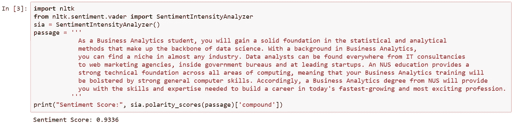
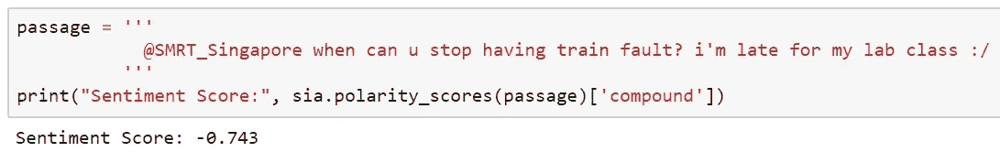
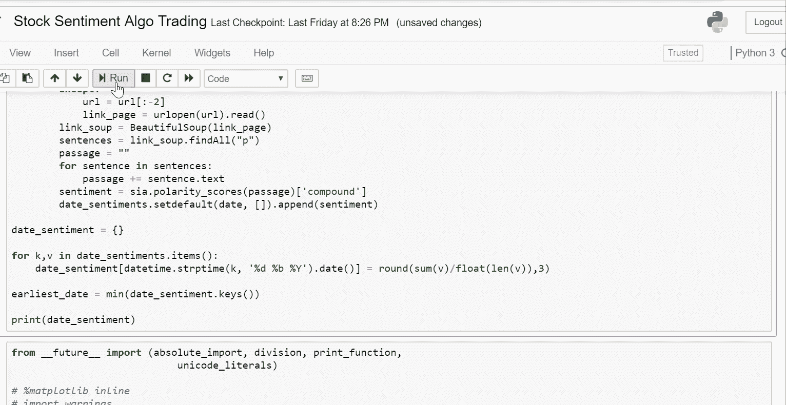
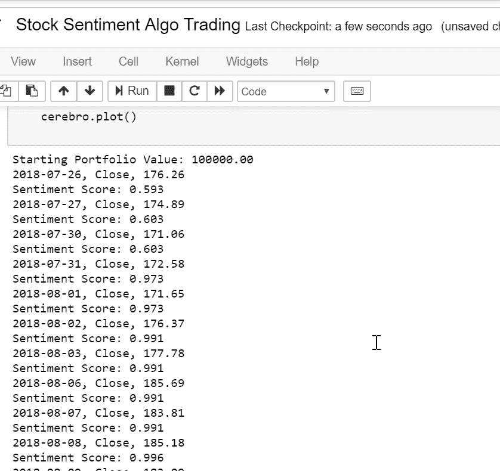
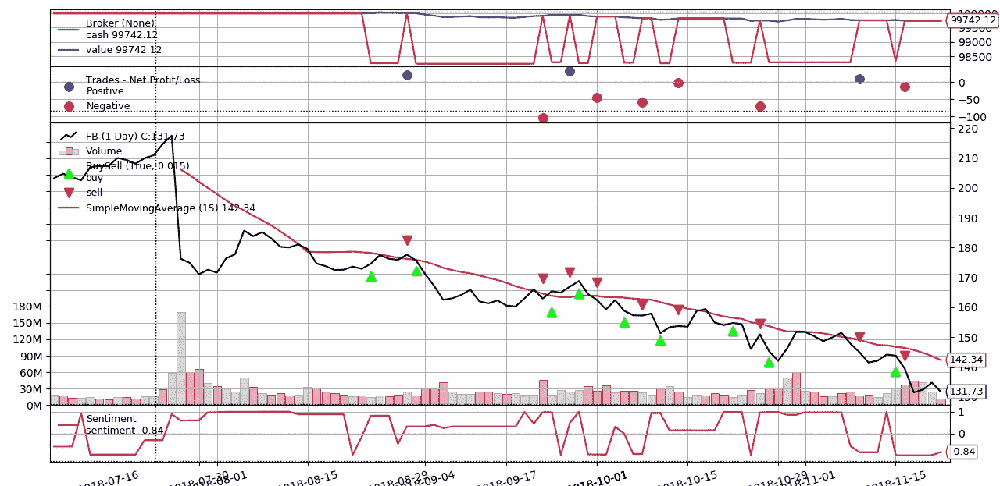

# 在新闻文章上使用情感分析的算法交易

> 原文：<https://towardsdatascience.com/https-towardsdatascience-com-algorithmic-trading-using-sentiment-analysis-on-news-articles-83db77966704?source=collection_archive---------4----------------------->

嗯，我应该为我的考试而学习，但我很想在我休息的时候探索这个。我意识到，我可以使用我以前项目中的元素来做这件事。我之前写了关于通过网络抓取实现社交媒体竞赛自动化的文章，我还写了关于 T2 生成新加坡式文本信息的文章，我在那里处理文本数据。这一切是如何重叠的，难道不有趣吗？

# **算法交易**

Algo trading 通过根据一套定义的规则快速准确地执行订单，实现了金融市场交易流程的自动化。它们消除了人为错误(假设算法是在没有人为错误的情况下开发的)，也消除了根据情绪采取行动的危险。生产中使用的算法可能相当复杂，并且需要针对低延迟系统进行大量优化。

我将对一只股票实施一个非常基本的策略(基于趋势)。使用简单的技术指标，如均线，趋势跟踪策略通常简单明了。有趣的是，我们将在算法中加入与公司相关的新闻中的定性元素(讽刺的是，这是基于情感的行为)。

# **情感分析**

情感分析或观点挖掘是指使用 NLP、文本分析和计算语言学来确定主观信息或作者/主题/话题的情绪状态。它通常用于评论，为企业节省了大量手动阅读评论的时间。



Why bother reading the entire description on [https://www.comp.nus.edu.sg/programmes/ug/ba/](https://www.comp.nus.edu.sg/programmes/ug/ba/) when you could just mine a sentiment score out of it?



Why should you dampen your mood from reading unconstructive comments on your FB page?

就像算法交易一样，情绪分析也可以作为一个领域深入发展。除了给出积极/消极的情绪，我们还可以理解文本有多主观，不同情绪的强度(兴奋、沮丧等)。)，如何莎士比亚式或特朗普式的文本，等等。

# 方法学

脸书最近面临很多反弹，我认为观察股票如何随着新闻情绪波动会很有趣。

这个想法很简单。我们在[商业时报](https://www.businesstimes.com.sg/search/facebook?page=1)上搜索任何与脸书相关的文章，挖掘文本，获得每天的总体情绪，如果情绪上升 0.5，就买入 10 股，如果情绪下降 0.5，就卖出。请记住，情绪范围从-1 到 1，0 是中性的，我们使用前一天的情绪在当天交易。

## 擦

与我之前关于网络抓取的文章类似，我使用了同样的想法，从搜索页面中提取 URL，并访问每篇文章来挖掘其前一天的情绪。



Scraping Business Times articles related to Facebook

情感存储在字典中，例如`{datetime.date(2018,7,5):-0.59,...,}`

## VADER 情感分析

VADER(用于情感推理的效价感知词典)是一个预建的情感分析模型，包含在 **NLTK** 包中。它可以给出积极/消极(极性)以及文本的情感强度(强度)。它以规则为基础，严重依赖人类通过亚马逊机械土耳其人(Amazon Mechanical Turk)对文本进行评级。亚马逊机械土耳其人是一个众包电子平台，利用人类智能来完成计算机目前无法完成的任务。这实际上意味着其他人已经为我们做了建立情感词汇的脏活。对我们来说，这些是*单词或任何文本形式的交流，通常根据它们的语义取向被标记为正面或负面)*。


Throwback to the good old days of Human Calculators

文本的情感得分可以通过对文本中每个词的强度求和，然后归一化得到。维达的人类评分员使用 5 种试探法来分析情绪:

1.  **标点** —我爱披萨 vs 我爱披萨！！
2.  **大写** —我饿了！！vs 我饿了！！
3.  **程度修饰语(强化词的使用)** —我要吃饭！！VS 我好想吃！！
4.  **连词(情感极性的转变，随后决定极性)** —我爱披萨，但我真的讨厌必胜客(差评)
5.  **先于三元组**(通过检查词汇特征之前的三元组来识别相反的极性——加拿大比萨饼**其实并没有** *那么好。*

然而，VADER 专注于社交媒体和短文本，不像财经新闻，它们几乎是相反的。我在笔记本中加入了一大块内容，用来自其他来源/词典的词汇+情绪来更新 VADER 词典，例如[拉夫兰-麦克唐纳金融情绪词汇列表](https://sraf.nd.edu/textual-analysis/resources/#LM%20Sentiment%20Word%20Lists)。

有了这样一个简单的代码，我们可以很容易地从一篇文章中获得情感。

```
from nltk.sentiment.vader import SentimentIntensityAnalyzernltk.download('vader_lexicon')
sia = SentimentIntensityAnalyzer()
polarity_scores(passage)['compound']
```

## 执行战略

最后，通过使用 **backtrader** 包，我们有了一个方便的框架来回溯测试和编写我们的交易策略。我使用了文档中的[快速入门代码](https://www.backtrader.com/docu/quickstart/quickstart.html)作为基础，并对其进行了修改，以包括我们的情感分数。

我指定了从 Yahoo Finance 获取的“FB”股票源，设置了 10 万美元的初始金额，每笔交易 10 手的固定规模，0.1%的佣金，以及一个简单的策略，如果前一天的情绪得分比前一天增加 0.5，就买入，如果减少 0.5，就卖出。

# 结果



Results from backtest with Day, Close, Sentiment Score, Details of Trade

我以 10 万美元开始，以 99742 美元结束。哈哈。对此我什么都不会说。



From top to bottom panels: 1) Cash Value across time 2) Net Profit/Loss 3) Buy/Sell orders executed at Green/Red markers 4) Sentiment Score.

好吧，这个结果有点出乎意料，因为现实比我们的模型要复杂得多。注意当情绪得分波动时，交易是如何执行的。事实上，这个模型/我肯定非常愚蠢，我们总是落后，在“炒作”之后立即执行交易。但你可以看到这一点，我们肯定可以通过纳入更多的技术指标来建立战略，甚至通过在更多相关的金融新闻上训练我们自己的模型(可以使用 NLTK)来改善情绪分析。

我希望你们都喜欢这本书，这次我对可读性和简洁性更加谨慎了。如果您有任何意见、反馈和想法，请留下。我真的很感激。下次见！

[链接到项目回购](https://github.com/jasonyip184/StockSentimentTrading)

在 LinkedIn 或通过 jasonyip184@gmail.com 与我进一步讨论！

**参考文献**

[http://datameetsmedia . com/Vader-情操-分析-解释/](http://datameetsmedia.com/vader-sentiment-analysis-explained/)