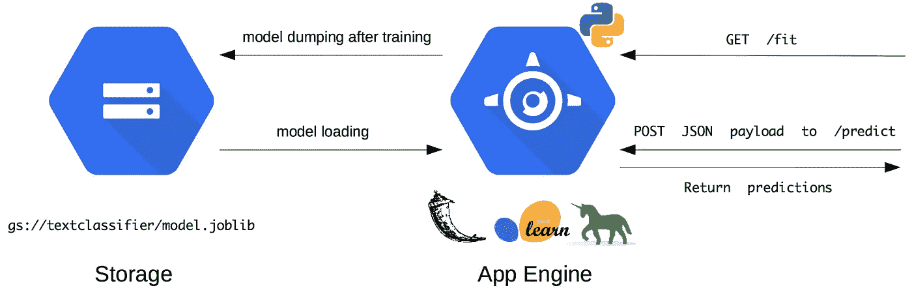

# 部署机器学习从未如此容易

> 原文：<https://towardsdatascience.com/https-towardsdatascience-com-deploying-machine-learning-has-never-been-so-easy-bbdb500a39a?source=collection_archive---------4----------------------->

## 使用 Google App Engine 快速启动您的 sklearn 代码并在云中运行🚀

对于数据科学从业者来说，第一次从概念验证到实际工作产品可能会令人望而生畏。幸运的是，不断发展的云服务可以提供帮助。迈出部署的第一步并不像过去那样困难。

*在这篇文章中，我将通过一个基于* [*sklearn*](http://scikit-learn.org/stable/) *框架的例子来演示如何借助谷歌应用引擎轻松实现这一点。*


A bartender spraying a cloud of App Engine smoke on a whiskey drink, making it ready for serving

当谈到为公司的需求构建机器学习应用程序时，工程师可能会热衷于遵循某些最佳实践。我个人的灵感来自于[谷歌的 ML 规则](https://developers.google.com/machine-learning/guides/rules-of-ml/)，特别是:

> ***规则#4*** *:保持* ***模型简单*** *和* ***架构*** *正确*

来自一个以研究为导向的学术背景，我承认这是一个我很容易忽略的规则。与研究环境不同，在公司工作会让机器学习工程师面对其他类型的利益相关者，主要是:

*   *:对于工程师来说，能够提出可解释的结果、可解释的算法以及能够就此进行交流是很重要的。无论是哪种情况，黑匣子被批准和实际使用的机会总是较小，因为在监控它们时会出现困难。*
*   ****其他工程师*** :对于机器学习模型来说，不仅要以离线模式运行来描述过去的事件，还要提供预测能力，这些可能需要与公司 IT 基础设施的其余部分进行通信(*例如*在电子商务平台上提供实时建议，或者在打车应用程序上提供驾驶员的预计到达时间)。实现这一点的一种方法是将每个模型视为一个微服务，并使其通过 REST API 接口进行通信。*

*基础设施即服务( *IaaS* )和平台即服务( *PaaS* )提供商的大规模增长，使得机器学习工程师更容易部署实时产品，并确保估计器管道的可靠性。*

*在您可以用来部署模型的云工具中，值得一提的有:*

*   ****【亚马逊网络服务(AWS)*** :弹性容器服务，SageMaker，Lambda*
*   ****【谷歌云平台(GCP)*** :计算引擎、App 引擎、云 ML、云功能*
*   ****其他*** : Heroku，Algorithmia*

*在这篇文章中，我将展示如何利用云服务部署和服务一个简单的机器学习模型。*

*我将重点介绍 PaaS Google App Engine，它是一个完全托管的多功能工具，允许工程师构建几乎任何类型的应用程序。App Engine 附带了大多数流行语言(Java、PHP、Node.js、Python、C#)的标准运行时。Net，Ruby，Go)。它还支持定制运行时的 Docker 容器部署。*

# *该项目*

*它是关于基于 Python 包 sklearn 中可用的 [20Newsgroups 公共数据集](http://scikit-learn.org/stable/datasets/twenty_newsgroups.html)部署文本分类器。*

*该数据集由论坛文本消息组成，从 20 个论坛/主题中取样。主题被同等地表示，每个论坛消息被分配给恰好一个主题。*

*文本分类器被设计成将字符串列表作为输入，并为每个字符串返回前 3 个最可能的论坛主题，以及置信度得分。*

**

# *哪些工具*

*虽然 [Google Cloud ML 提供了 sklearn](https://cloud.google.com/ml-engine/docs/scikit/) ，但是只支持纯 sklearn 模型。包装的 sklearn 型号[尚不支持](https://stackoverflow.com/questions/50086673/can-a-custom-sklearn-model-be-uploaded-to-gcloud-ml-engine/50111742#comment90054000_50111742)。*

*因此，我们将使用多功能工具 App Engine 来训练包装的文本分类器，将其二进制表示转储到 Google 云存储中，从那里加载并交付预测。*

*我们将使用 Python、Google Cloud Python SDK、Flask/Gunicorn 进行应用部署，使用 sklearn 进行模型规范。*

# *基础设施*

*这是我们将要构建的云基础架构的概述。*

**

*because an article on Google Cloud is not really one without a flow chart*

# *1 |设置您的 Google 云项目*

*为了能够在 GCP 上部署应用程序，您首先需要**设置一个项目*** 。特别是，你必须安装谷歌云软件开发工具包(T21)，它允许你从命令行与 GCP 服务进行交互。*

*在撰写本文时，谷歌提供了 12 个月的试用期，价值 300 美元。更多信息 [*此处*](https://console.cloud.google.com/getting-started) *。**

# *2 |编写 sklearn-Flask 应用程序*

*完整的资源库可以在 [Github](https://github.com/syltruong/sklearn-gae-sample) 上找到。其组织结构如下:*

```
*/ 
|_ core.py           # sklearn estimator definition
|_ main.py           # Flask app definition
|_ requirements.txt  # Python dependencies
|_ app.yaml          # AppEngine config file*
```

## *一些代码亮点*

*`core.py`为一个(文本矢量器，分类器)`Pipeline`定义一个包装器类。它的`fit`方法**获取**20 个新闻组数据集**，并在其上安装**一个 20 类分类器。*

*Custom `sklearn` wrapped estimator*

*`main.py`定义烧瓶应用程序。特别是，它有两个处理器`/fit`和`/predict`以及一个初始化处理器`_load_model`。*

*   *`_load_model` **检查**在环境变量`GCS_BUCKET`和`GCS_BLOB`指定的路径下是否有模型二进制文件，如果有**加载它**:*

*   *`fit_model` **适合**一个`TextClassifier`**转储**到谷歌云存储:*

*   *`predict_from_model` **返回基于文本输入参数的预测**，假定`TextClassifier`已经预先加载到内存中:*

# *3 |配置*

*AppEngine 服务的所需配置通过`app.yaml`文件进行通信。特别是，您可以指定运行时、环境变量、实例资源以及一个`entrypoint`。这个项目的`entrypoint`基于我们的 Flask 应用程序启动了一个 [Gunicorn](http://gunicorn.org/) 服务器。*

*App Engine configuration*

# *4 |部署*

*如果你已经安装了 Google Cloud SDK，你可以`cd`进入项目的根目录并调用*

```
*$ gcloud app deploy*
```

*如果部署成功，返回消息应该是这样的(注意项目名称):*

```
*Deployed service [textclassifier] to [https://textclassifier-dot-*my-project-name*.appspot.com]You can stream logs from the command line by running: $ gcloud app logs tail -s textclassifier To view your application in the web browser run: $ gcloud app browse -s textclassifier*
```

> *让我们做些测试，好吗？或者`*curl*` 它喜欢贝克汉姆⚽️*

*我们使用优秀的命令行工具`curl`向我们刚刚部署的端点发出 HTTP 请求。*

## *测试 1:训练模型并将其转储到 GCS*

```
*curl --request GET [https://textclassifier-dot-*my-project-name*.appspot.com/fit](https://textclassifier-dot-*my-project-name*.appspot.com/fit)*
```

*几秒钟后返回*

```
*Model successfully fitted and dumped to gs://textclassifier/model.joblib*
```

## *测试 2:获得预测*

*输入字符串是*

*   *`"My car wont start."`*
*   *`"I have been having a sore throat for a month"`*

```
*content_type="Content-Type: application/json"
request="POST"
data='{"text":["My car wont start.", "I have been having a sore throat for a month"]}'
http="https://textclassifier-dot-sephora-analytics.appspot.com/predict"curl --header "$content_type" \ --request POST \ --data "$data" \ $http*
```

*返回*

```
*[
  [
    { "label" : "rec.autos" "score" : 0.20318951690486 },
    { "label" : "rec.motorcycles", "score" : 0.0730013311549759 },
    { "label" : "misc.forsale", "score" : 0.0593155469643825 }
  ],
  [ 
    { "label" : "sci.med", "score" : 0.119263497157416 },
    { "label" : "sci.crypt", "score" : 0.0616682653727299 },
    { "label" : "talk.politics.guns", "score" : 0.0599605990114599 }
  ]
]*
```

# *我们所看到的*

*我们在 sklearn 和 Flask 之上构建了一个简单的 Python 应用程序。我们使用 Google App Engine 进行模型部署和服务，使用 Google Cloud Storage 进行模型二进制存储。这个例子已经尽可能的通用，以适应其他的用例，所以你没有理由不…*

## ***开始建造**🔨！*

**图片来源:*[*Artem Pochepetsky*](https://unsplash.com/@fo0x?utm_source=medium&utm_medium=referral)*和*[*Annie Spratt*](https://unsplash.com/@anniespratt?utm_source=medium&utm_medium=referral)*[*Unsplash*](https://unsplash.com?utm_source=medium&utm_medium=referral)**