# 马尔科夫蓝调:使用 VLMMs 和 PST 为 12 小节蓝调人工生成的旋律

> 原文：<https://towardsdatascience.com/https-towardsdatascience-com-markovian-blues-ba35ce9f21d4?source=collection_archive---------11----------------------->

想象一下，当你感到穷困潦倒时，你唯一的解决办法就是沉浸在一些忧郁中。你拿出吉他，开始弹奏 12 小节蓝调，很快意识到如果你的生活依赖于它，你就不能即兴创作，甚至不能唱歌。你站起来，砸碎你的吉他，反复观看柯基犬的视频，让自己感觉更好。

有了可变长度马尔可夫模型(VLMMs)和预测后缀树(PST ),你再也不必经历这一悲剧事件。使用这些算法，你可以人工生成你自己的蓝调旋律，而不必担心你缺乏天赋！

## 动机

当在作曲过程中遵循基于规则的方法时，音乐创作本身可以是相当算法化的。音乐理论的数学本质允许在对某些音乐作品或流派建模时进行非常有趣的分析。这让我们可以训练算法，可以为我们生成音乐！

许多机器学习算法被用于模拟音乐的序列方面。简单的基于规则的编程和复杂的深度学习技术已经被用来人工生成听起来非常自然的歌曲。在这个项目中，我们设计了一个简单的方法来模拟和生成 12 小节蓝调旋律。

## **将音乐建模为马尔可夫链**

为旋律建模的一个简单方法是将其视为马尔可夫链。一阶马尔可夫链具有下面的 [*马尔可夫性质*](https://en.wikipedia.org/wiki/Markov_property) 或 [*无记忆性质*](https://en.wikipedia.org/wiki/Memorylessness) 。

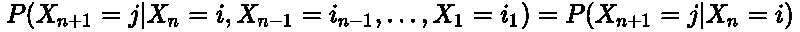

Markov Property

这就是说，序列中下一个状态的概率只是有条件地依赖于当前状态。在一段旋律中，下一个音符的值只取决于当前的音符，而不考虑之前旋律的其余部分。

考虑一下*的前两小节，玛丽有只小羊羔*

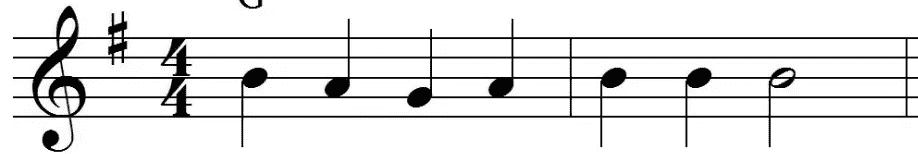

First two bars of Mary Had A Little Lamb

在这种情况下，我们有三种可能的状态:G，A，b。我们可以简单地用马尔可夫链来模拟这个旋律。

如果我们相信这个序列遵循马尔可夫性质，我们可以创建下面的转移矩阵 A:

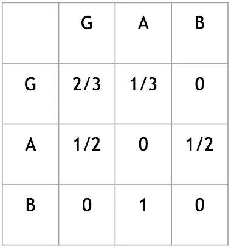

Transition Matrix of 1st two bars of Mary Had A Little Lamb

当看这个表时，我们感兴趣的是从状态 i → j 或行→列转换的概率。比如从**音符 G** 到**音符 A** 的概率是 1/3。
(即 P(A|G) = 1/3)

请注意，下一个状态 j 仅依赖于当前状态 I，而不考虑之前的所有状态(即 i-1，i-2，… i = 1)。

在忽略历史的情况下，一阶马尔可夫链当然是对旋律建模的一种非常幼稚的方法。实际上，序列中的音符不仅依赖于之前的音符，还依赖于之前的 *L* 音符。这就把我们引向了一个叫做*高阶马尔可夫链的马尔可夫链的扩展。*

高阶马尔可夫链使用这种*有限存储器 L* 的思想，其中序列中的下一个状态取决于当前状态和 L-1 个先前状态。在音乐中，如果我们设置 L=3，我们可以说下一个音符有条件地依赖于前面的三个音符。

## 这样够好了吗？

不要！L 阶马氏链的缺点是关键字*有限*。在一阶马氏链的类似情况下，我们不能假设下一个音符只是条件依赖于前一个固定长度的 L 个音符。实际上，下一个音符取决于*上下文、*或实际序列本身。

这激发了*灵活*内存的概念。在过去的不同部分影响未来的情况下，我们将上下文大小 L 设置为变量*而不是有限的。比方说，我们有一段音乐，它的上升[全音阶](https://en.wikipedia.org/wiki/Diatonic_scale)序列和[琶音](https://en.wikipedia.org/wiki/Arpeggio)序列具有相同的最小值和最大值。我们可以假设，平均来说，全音阶序列的上下文会比琶音序列长。*

## 可变长度马尔可夫模型

VLMMs 允许比马尔可夫链或高阶马尔可夫链更真实的序列建模。他们能够在序列中封装模式，这是以前的模型所缺乏的。为了训练 VLMM，我们必须指出 L 的最大上下文长度和要考虑的序列应该出现的最小次数(nmin)。本质上，我们存储的是 0

## *Suffix Tries → Suffix Trees →Prediction Suffix Trees*

*The data structure that efficiently builds and stores VLMMs is a *预测后缀树的所有 I 阶马尔可夫链。*要建立理解的基础，我们必须描述一下*后缀 Trie* 。*

*回到玛丽有只小羊羔的前两小节，我们有这样的顺序:
G→A→B→A→G→G→G→G*

*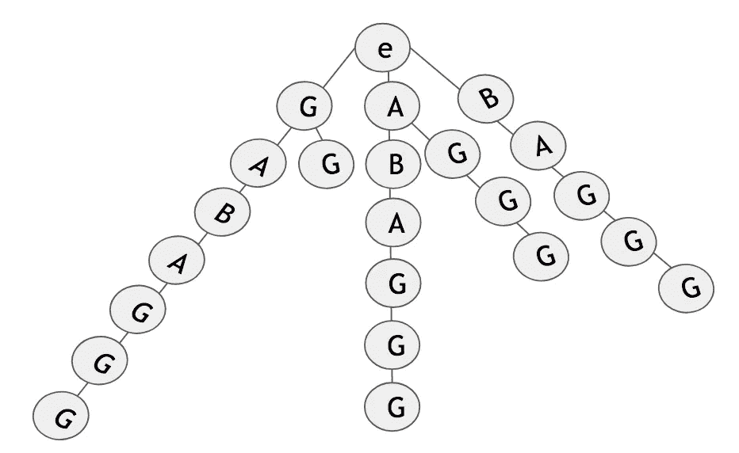*

*Suffix Trie for first two bars of Mary Had A Little Lamb*

*下面的后缀 trie 可以从这个序列中创建。构建这棵树相当简单。从序列的开头开始，为整个序列创建一个节点路径。然后从序列的第二个音符开始，为该后缀创建一个节点路径。如果还没有为给定的符号创建根节点的子节点，则添加该子节点。否则，沿着路径，直到给定的序列还没有出现在树中；然后将其添加到相应的节点。我们这样做，直到我们到达序列的最后一个音符。*

*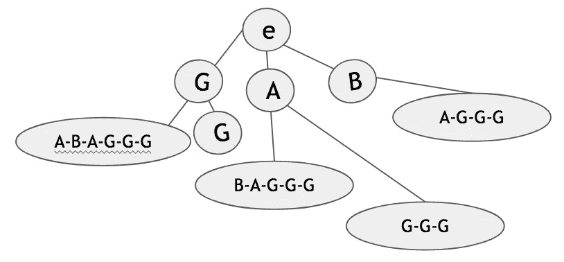*

*Suffix Tree for first two bars of Mary Had A Little Lamb*

*后缀 trie 可以很容易地转换成后缀树。前面的后缀 trie 被转换成下面的后缀树。后缀 trie 和后缀树之间的唯一区别是，后者将非分支路径折叠成具有单个节点的单条边。*

*现在我们对后缀树有了一个概念，让我们来看一下预测/概率后缀树。考虑下面的后缀树。*

*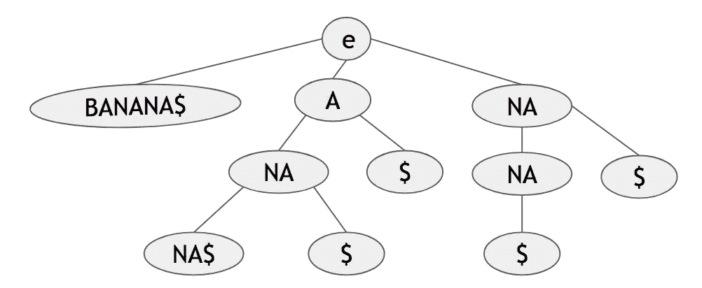*

*Suffix tree for BANANA$*

*该树遵循香蕉$序列。我们使用$来表示序列的结束，这样更容易在树中定位结束序列节点。现在，PST 不再像传统后缀树那样自顶向下存储序列，而是以不同的方式构建。*

*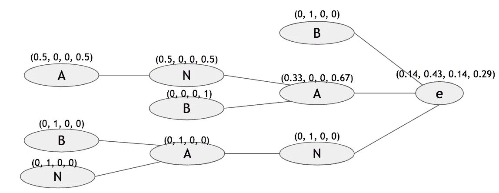*

*PST for BANANA$ with respective probabilities for symbols ($, A, B, N) respectively. L = 3 and nmin = 1*

*出于视觉目的，当 PST 侧放时更容易观察。该树按原样从左→右读取，如果垂直显示，则从下→上读取。终端节点代表后缀的开始。从根开始的直接子代是每个后缀的最后一个符号。*

*该 PST 的最大 L = 3，nmin = 1。此外，每个节点还保存后缀中的下一个符号的概率，这取决于它之前的后缀路径。比如 P($|A-N) = 0.33。根 e 包含生成任何序列的第一个符号的概率。*

> *注意:$不会作为节点出现在这个树中，因为它出现在序列的末尾，没有任何后续状态。此外，请记住，树将根据参数设置(即 L 和 nmin)而变化。增加 L 将创建具有更长路径的树，增加 nmin 将创建稀疏树。*

## *PST 的平滑参数*

*当使用 VLMMs 进行分类时，避免对序列的训练集过度拟合是很重要的。此外，如果您的目标是人工生成，我们当前的 PST 将只生成它所输入的数据中的序列。为了解决这个问题，我们设置了任意序列的最小概率(ymin)。在下图中，我们设置 ymin = 0.01。*

*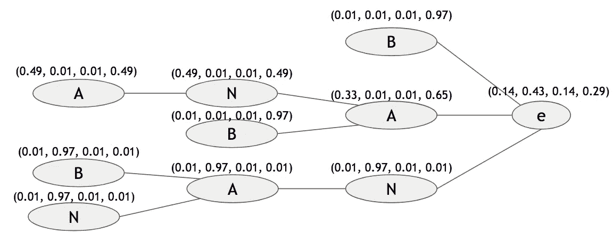*

*PST for BANANA$ with L = 3, nmin = 1 and ymin=0.01*

*该平滑参数的添加将减少分类模型的方差，使得它对模型未被训练的观察不敏感。该参数还允许在音乐生成的上下文中有一些艺术自由度。*

## *修剪 PST*

*像在[决策树](https://en.wikipedia.org/wiki/Decision_tree_learning)中一样，我们有能力修剪我们的概率后缀树。我们的重点是从底层到根的子节点的序列分布。从终端节点开始，我们检查与没有前缀的上下文相比，具有这个*前缀*是否提供了关于最后符号的条件概率的更多信息。例如，与 A|A 相比，A|N-A 能为我们提供多少信息？为了正式确定是否修剪节点，我们执行以下计算。*

*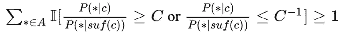*

*Pruning equation*

*等等什么？这个看似复杂的方程，本质上很简单。我们来分解一下！*

*首先，分数确定后缀的概率分布是否与其父后缀相似，其中相似性由值 C 控制。参数 C 本质上约束了概率商。方括号外的大“I”是一个指示函数，如果计算结果为真，则产生 1，否则产生 0。指示器确定如果给定任何序列 *c* 和没有其第一个符号 *suf(c)* 的相同序列，在序列末尾的任何新符号的概率在两者之间是否会显著不同？然后我们加起来有多少新符号是真的(因此是求和符号)。如果对于至少一个新符号这是真的(≥1 项)，那么我们将保留该节点。否则，修剪！*

*修剪将通过移除不提供显著信息增益的节点来减轻 PST 的复杂性(我们可以没有它们)。此外，如果您的 L、nmin 和 ymin 的初始设置创建了一个非常复杂的树，修剪将简化它！但是，您仍然应该花时间来适当地优化这些初始参数。*

# *创作蓝调*

*马尔可夫链或 VLMMs 的结构本身并不复杂。困难在于试图实际定义什么是状态。到目前为止，我们只是在模型中使用旋律的音高值作为状态。下一节将揭示这种方法的缺点，并解释创建状态的更好的方法。然后，我们解释了一个旋律是如何产生的，并证明了 12 小节蓝调旋律使用多个 PST 模型的合理性。*

## *编码状态*

*分析旋律序列时，考虑每个音符的音高和持续时间是很重要的。如果我们把音高和音长结合在一起，我们会有一个巨大的状态空间。例如，如果我们将粒度级别的持续时间视为至少 1/4(四分音符)的值，我们将有四种不同类型的持续时间值要考虑(即，1/4:四分之一、1/2:一半、3/4:点分四分之一和 1:整)。考虑到四个不同的持续时间值和 12 个音高，我们最终得到 48 个状态。进一步分解持续时间将会成倍地增加我们的状态空间。*

*为了简化我们的模型，并保持一个较小的状态空间，我们决定将各个时间段视为状态，而不是各个音符。我们把每首歌分解成持续一个酒吧⅛的时间段；一首 12 小节蓝调基本上包含 12*8 = 96 个事件。每个事件用音调值与二进制值的组合来编码(即，S =停留，L =离开)。*

*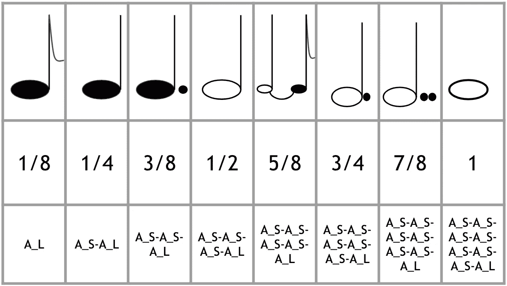*

*All durations and encodings of note A*

*使用这种编码，我们总共有 26 种不同的状态！这来自 12 个不同的音高、1 个休止符和两个延音符号(即 _S 和 _L)。对于我们来说，生成所需长度的序列也容易得多。在具有相同长度的序列固有地具有不同持续时间的情况下，我们以前的方法会很困难。*

## *数据集*

*歌曲的主体来自老式爵士乐标准假书，其中包括 20 世纪早期到中期的数百个爵士乐标准的铅表。标志性的 12 小节蓝调结构推动了低音线，刺激了架子鼓，触动了象牙，并拉伸了大多数歌曲的声带。在任何调中遵循 12 小节布鲁斯结构的任何线都包含在数据集中。*

*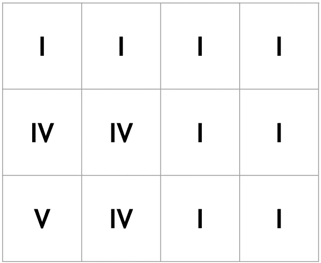*

*12-Bar Blues Chord Structure*

*手动对导音表进行数字编码，记录每个音符及其在旋律中各自的持续时间。我们的语料库继续增长，但目前有 22 个 12 小节蓝调旋律序列，每个序列包含 96 个事件！*

## *建模方案*

*有了这组 12 小节的蓝调旋律以及编码状态的方法，我们应该如何构建模拟蓝调旋律的模型呢？*

*注意 12 小节蓝调的严格结构。几乎所有的和弦都不止出现一次。主和弦 *I* 在这个和弦进行中最多出现八次。此外，当有多个部分具有相同的基本和弦时，旋律的小部分肯定会重复。例如，在现代音乐中，韵文和合唱总是分别有相似的旋律。*

*如果我们要将原始的 12 小节蓝调分割成两小节部分，我们将得到以下小节序列。*

*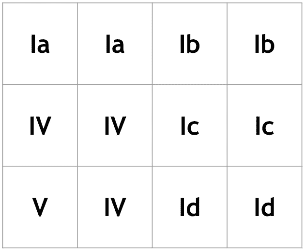*

*12-Bar Blues Structure with two-bar segments*

*然后我们决定为每首歌的每两个小节建立一个单独的模型。这给了我们总共六个不同的模型。我们计算了六个部分的 PST 分布之间的成对散度测量。这类似于比较两个分布之间相似性的 [KL 散度度量](https://en.wikipedia.org/wiki/Kullback%E2%80%93Leibler_divergence)。在信息论中，KL 散度通常用于评估压缩某些文件并确保它包含与原始文件一样多的信息的效率。*

*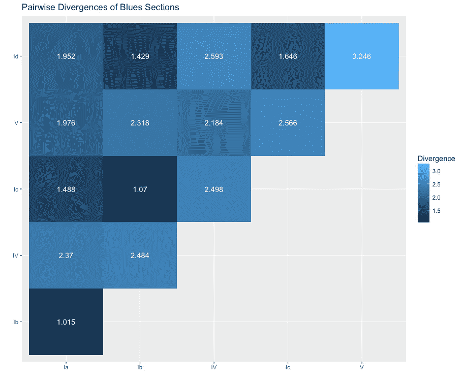*

*在我们的例子中，成对散度的低值表示分布非常相似，反之亦然。这意味着我们可以在不丢失信息的情况下互换使用它们。热图显示，Ia、Ib、Ic 和 Id 部分具有相似的分布。因此，我们可以删除六个模型中的三个，只保留第一个 Ia 模型，将其视为通用 I 模型。*

## *产生旋律*

*我们剩下三个模型:Ia、IV 和 v。要创建旋律，我们只需从每个模型生成一个两小节序列，并将它们连接在一起。多亏了我们的编码方法，生成双条码序列变得很容易！我们需要做的就是创建长度为 16 的序列，因为每个符号都有一个音高和 1/8 的持续时间值。I 模型的输出将重复四次，以模拟 12 小节蓝调的结构。瞧啊。我们有一段 12 小节的蓝调旋律。*

*让我们来点刺激的！使用 GarageBand，我添加了一个节奏部分，还将时髦的电脑发声旋律设置到了*干净吉他*乐器设置中。*

# *摘要*

*这个项目描述了一种使用可变长度马尔可夫模型生成 12 小节蓝调旋律的方法。修剪的概率后缀树被很好地构造以适合 VLMM，这有助于我们分析和生成新的序列。我们用精心编码的 1/8 音符状态填充 PST，以考虑音高和持续时间。我们还证明了只需要 3 个不同的模型来生成完整的 12 小节旋律。*

# *未来的工作*

*这种方法可以应用于任何遵循重复和弦进行的音乐流派。许多现代歌曲遵循类似的和弦结构，其旋律可以用 VLMMs 和 PST 来建模。我们甚至可以模拟不同的乐器部件，甚至和弦结构本身！VLMMs 也是 NLP 的很好的模型，所以创作歌词也是可能的。那我们就有了一个完全人工生成的乐队！*

*所有生成你自己旋律的数据和代码都可以在这里找到。下载回购协议后，只需运行 [generateFunction 中的脚本。R](https://github.com/Ljfernando/MarkovBlues/blob/master/generateFunction.R) 文件，用合适的参数调用 *generateMelody()* 函数。在 *generated_melodies/wav/* 路径下会创建一个 wav 文件。保持原样或者添加到*generated _ melodies/midi/blues _ backing 中的背景音轨。**

> *要进一步了解 VLMMs 和 PST，请参考本[文件](https://projecteuclid.org/download/pdf_1/euclid.aos/1018031204)。用于构建 PSTs 的 R 包的文档在这里是。
> 这里有一个帮助[理解 PST 和使用 R 包的指南](https://www.jstatsoft.org/article/view/v072i03)。*
> 
> *如有任何问题，请随时联系我。希望你喜欢这篇文章！*