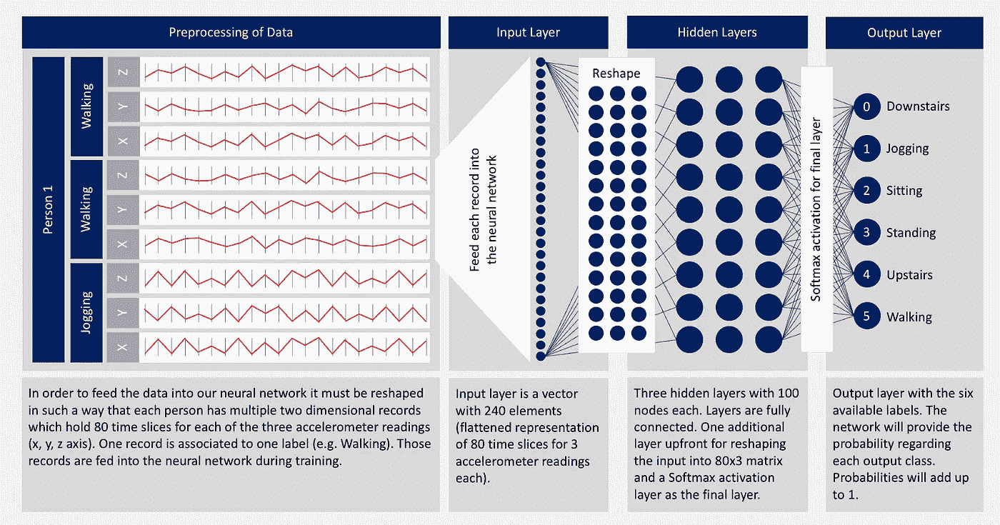
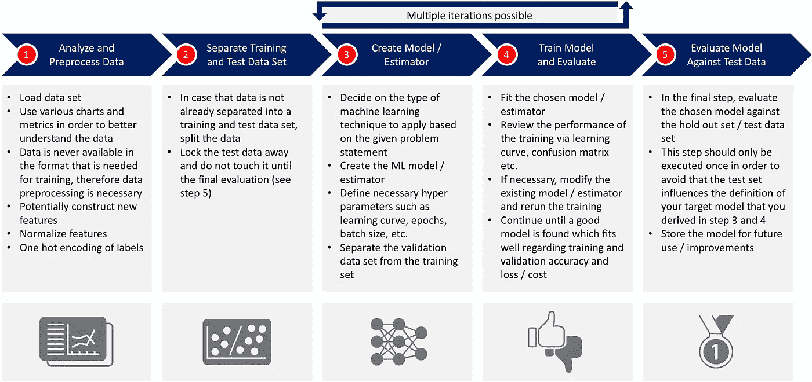
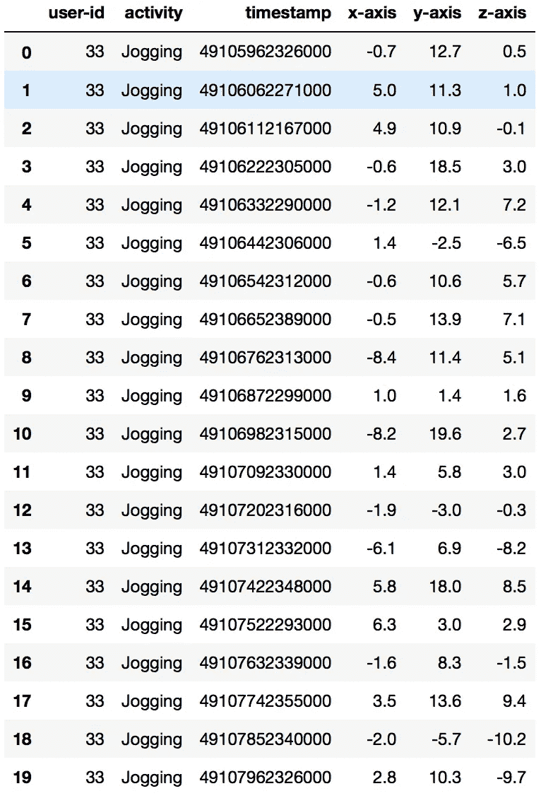
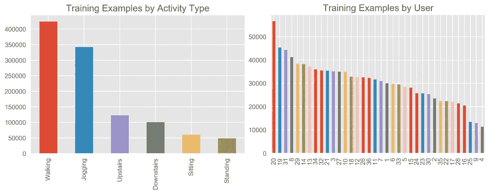
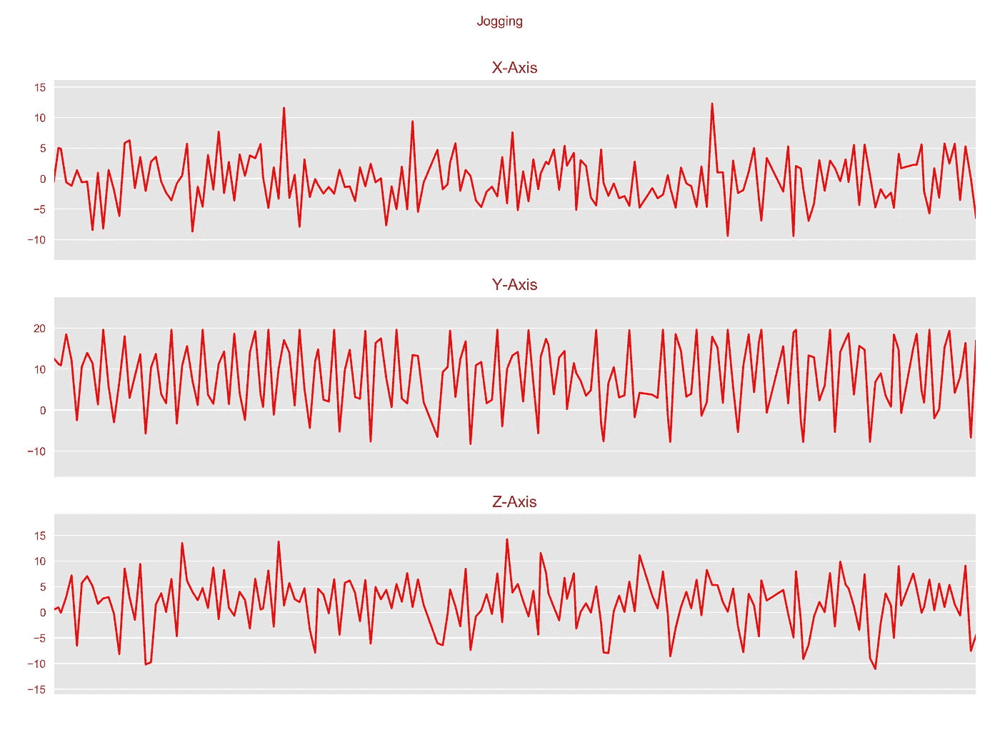
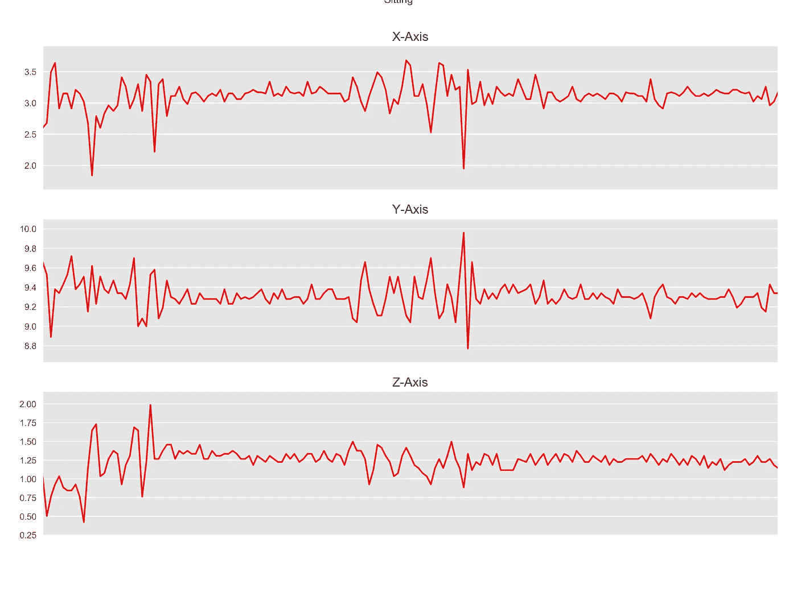
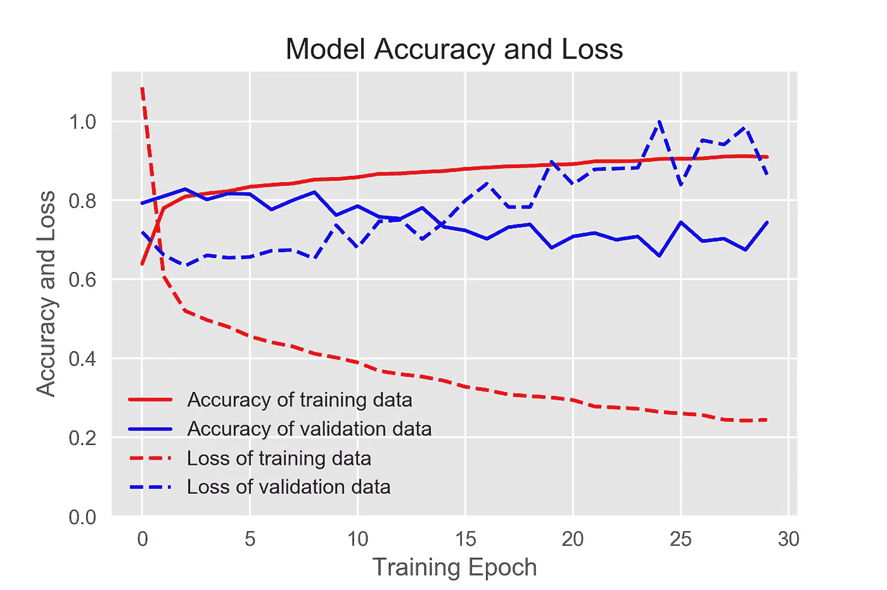
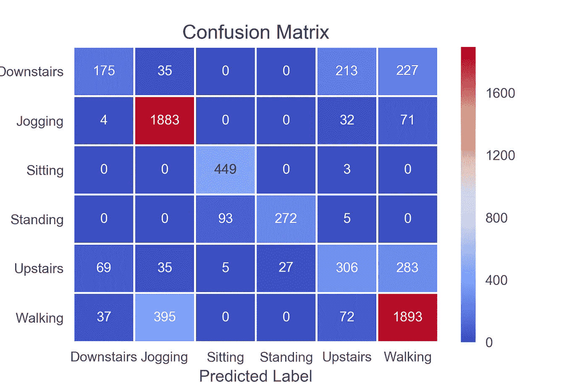

# 人体活动识别(HAR)教程(第 1 部分)

> 原文：<https://towardsdatascience.com/human-activity-recognition-har-tutorial-with-keras-and-core-ml-part-1-8c05e365dfa0?source=collection_archive---------0----------------------->

## 如何将 Keras 模型加载到您的 iOS 项目中的分步指南


Photo: a-image/Shutterstock

如果你想在任何 iOS 设备上快速部署神经网络，Keras 和苹果的 Core ML 是一个非常强大的工具集。大多数其他教程侧重于图像识别的流行的 MNIST 数据集。我们将超越这个广泛覆盖的机器学习例子。相反，您将学习如何处理时间分片的多维传感器数据。

更具体地说，我们将训练一个深度神经网络(DNN)，以识别运动的类型(行走、跑步、慢跑等)。)基于来自围绕人的腰部携带的移动设备的一组给定的加速度计数据。在本教程中，我们将使用 WISDM 数据集( [WISDM](http://www.cis.fordham.edu/wisdm/dataset.php) )。

本文介绍的方法应该适用于您在物联网(IOT)中可能遇到的任何其他传感器数据。本文将带您完成以下步骤:

*   从 WISDM 数据集中加载加速度计数据
*   将加速度计数据转换并重新格式化为时间片表示
*   可视化加速度计数据
*   重塑多维表格数据的形状，使其被 Keras 接受
*   将数据集分成训练集、验证集和测试集
*   在 Keras 中定义一个深度神经网络模型，该模型稍后可以由苹果的核心 ML 处理
*   为人体活动识别数据训练深度神经网络
*   使用学习曲线和混淆矩阵，对照测试数据验证训练好的 DNN 的性能
*   为核心 ML 导出训练好的 Keras DNN 模型
*   通过在 Python 中进行样本预测，确保核心 ML 模型被正确导出
*   在 Xcode 中创建一个游乐场，并导入已经训练好的 Keras 模型
*   使用 Apple 的核心 ML 库，以便使用 Swift 预测给定数据集的结果

执行本文中解释的所有步骤的先决条件(包括测试代码的版本号):

*   Python(版本 3.6.5)
*   Keras(版本 2.1.6)
*   张量流(版本 1.7.0)
*   Coremltools(版本 2.0)

**不在本文讨论范围之内:**为这种类型的问题语句创建具有最高性能的完美机器学习模型不是本演练的重点。

您可能想知道为什么本文选择 Keras 而不是其他框架，即 TensorFlow。有两个主要原因:

*   Keras 非常容易学习，并且拥有比 TensorFlow 更现代、更直观的 API，同时仍然在后端利用 TensorFlow 的功能
*   有多个 TensorFlow APIs 在尝试使用更方便的估算器 API(这也是 TensorFlow 团队推荐的——你可以在这里找到更多信息[这里](https://www.tensorflow.org/guide/estimators))时，我在将经过训练的估算器转换为核心 ML 时遇到了编译问题

# 概念概述

在我们介绍 Python 和 Xcode 中的不同步骤之前，让我们简要地看一下问题陈述和我们的解决方案。我们使用的数据集是从智能手机上采集的加速度计数据，不同的人在进行六种不同的运动(下楼、慢跑、坐着、站着、上楼、走路)时随身携带该智能手机。对于每个练习，测量 x、y 和 z 轴的加速度，并用时间戳和个人 ID 捕获。

有了这些可用的数据，我们想训练一个神经网络，以了解一个人携带智能手机是否正在进行这六种活动中的任何一种。一旦神经网络根据现有数据进行了训练，它应该能够在给定以前看不到的数据时，正确预测一个人正在进行的活动类型。

这个问题的解决方案是深度神经网络。基于可用的数据，它将学习如何区分六种活动中的每一种。然后，我们可以向神经网络显示新数据，它会告诉我们用户在任何特定时间点正在做什么。这个问题的解决方案如下图所示。



“Deep Neural Network Example” by Nils Ackermann is licensed under Creative Commons [CC BY-ND 4.0](https://creativecommons.org/licenses/by-nd/4.0/)

下面描述了解决机器学习问题的典型步骤。在整篇文章中，我们将经历一个非常相似的过程。



“Machine Learning Workflow” by Nils Ackermann is licensed under Creative Commons [CC BY-ND 4.0](https://creativecommons.org/licenses/by-nd/4.0/)

# 导入库

首先，我们需要导入所有必要的 python 库。如果您缺少其中一些，请使用 pip 安装程序安装它们。

导入库之后，让我们设置一些标准参数并打印出我们已经安装的 Keras 版本。WISDM 数据集包含六个不同的标签(楼下、慢跑、坐着、站着、上楼、走路)。因为我们将多次使用标签列表，所以我们为它们创建一个常量(标签)。下一个常量 TIME_PERIODS 存储时间段的长度。常量 STEP_DISTANCE 确定两个连续时间段之间的重叠量。

```
keras version  2.1.6
```

# 加载、检查和转换加速度计数据

接下来，你需要在这里下载[的数据集并保存在本地。重要的文件是 WISDM_ar_v1.1_raw.txt，在进行导入之前，我们先定义几个方便的函数，以便读取数据和显示数据的一些基本信息。](http://www.cis.fordham.edu/wisdm/dataset.php)

数据成功加载到数据帧中。现在，我们可以显示数据帧的前 20 条记录，并进一步了解数据的分布情况。

```
Number of columns in the dataframe: 6
Number of rows in the dataframe: 1098203
```



正如我们所看到的，我们有更多关于步行和慢跑活动的数据，而不是其他活动。我们还可以看到有 36 个人参与了实验。

接下来，让我们来看看所有六个可能活动的三个轴的加速度计数据。数据以 20 赫兹的采样率记录(每秒 20 个值)。因为我们显示了前 180 条记录，所以每个图表显示了六个活动中每个活动的 9 秒间隔(计算:0.05 * 180 = 9 秒)。我们将使用两个函数(我从[这里借用了](http://aqibsaeed.github.io/2016-11-04-human-activity-recognition-cnn/))来绘制数据。



正如所料，与坐着相比，慢跑和散步等活动的加速度更高。在我们继续之前，我们将在数据帧中再添加一个名为“ActivityEncoded”的列，其中包含每个活动的编码值:下楼、慢跑、坐着、站着、上楼、散步

这是必要的，因为深度神经网络不能与非数字标签一起工作。有了 LabelEncoder，我们能够轻松地转换回原来的标签文本。

# 将数据分成训练集和测试集

将整个数据集分成训练集和测试集是很重要的。通常，您会看到数据分割方式上的错误。无论您决定如何分割数据，您都不希望来自测试集的信息渗透到您的训练集中。这可能对您的模型在训练期间的整体性能有很大帮助，然后根据测试集进行验证。但是你的模型不太可能很好地概括它还没有见过的数据。

分裂背后的想法是:我们希望我们的神经网络从几个经历过实验的人那里学习。接下来，我们想看看我们的神经网络预测以前没有见过的人的运动有多好。

## 要避免的数据分割

仅仅担心每个活动至少有几个示例记录是不够的。您将冒这样的风险:在训练集中，您可能有三个关于人 5 的活动“行走”的记录，而在测试集中，有一个关于人 5 的活动“行走”的记录。当然，在这种情况下，您的模型会表现得很好，因为它已经在训练期间看到了第 5 个人的移动模式。始终对 DNN 的性能持批评态度，这可能是因为一开始就进行了错误的数据分割。

## 更好的分割方法

在我们的例子中，让我们根据用户 id 进行划分。我们将保留 ID 为 1 到 28 的用户用于训练模型，ID 大于 28 的用户用于测试集。

# 规范化培训数据

接下来，我们需要在训练数据中标准化我们的特征。当然，有各种各样的方法来标准化。请记住，以后在向神经网络输入新数据时，您会使用相同的归一化算法。否则你的预测将会是错误的。除了标准化之外，我们还将对这三个特征进行舍入。

# 将数据重组为片段，并为 Keras 做准备

数据帧中包含的数据尚未准备好输入神经网络。因此，我们需要重塑它。让我们为此创建另一个名为“创建 _ 段 _ 和 _ 标签”的函数。该函数将接收数据帧和标签名称(我们在开始时定义的常量)以及每个记录的长度。在我们的例子中，让我们进行 80 步(参见前面定义的常数)。考虑到 20 Hz 的采样率，这等于 4 秒的时间间隔(计算:0.05 * 80 = 4)。除了对数据进行整形之外，该函数还会将要素(x-加速度、y-加速度、z-加速度)和标注(相关活动)分开。

现在，你应该在 x 列车和 y 列车上都有 20.868 的记录。x_train 中的 20.868 个记录中的每一个都是形状为 80x3 的二维矩阵。

```
x_train shape:  (20868, 80, 3)
20868 training samples
y_train shape:  (20868,)
```

为了构建我们的深度神经网络，我们现在应该存储以下维度:

*   时间段数:这是一个记录中的时间段数(因为我们希望有 4 秒的时间间隔，所以在我们的例子中这个数字是 80)
*   传感器数量:这是 3 个，因为我们只使用 x、y 和 z 轴上的加速度
*   类别数量:这是神经网络中输出层的节点数量。因为我们希望我们的神经网络预测活动的类型，我们将从我们之前使用的编码器中获取类的数量。

```
['Downstairs', 'Jogging', 'Sitting', 'Standing', 'Upstairs', 'Walking']
```

我们希望输入网络的数据是二维的(80x3)。不幸的是，Keras 和 Core ML 不能同时处理多维输入数据。因此，我们需要将输入层的数据“展平”到神经网络中。我们将输入一个包含 240 个值的列表，而不是一个形状为 80x3 的矩阵。

```
x_train shape: (20868, 240)
input_shape: 240
```

在继续之前，我们需要将所有特征数据(x_train)和标签数据(y_train)转换成 Keras 接受的数据类型。

我们几乎完成了数据的准备工作。我们需要做的最后一步是对我们的标签进行一次性编码。请只执行这一行一次！

```
New y_train shape:  (20868, 6)
```

# 在 Keras 中创建深度神经网络模型

到现在为止，你已经完成了你这边所有的负重。数据以这样的格式准备好了，Keras 将能够处理它。我已经决定创建一个具有 3 个隐藏层的神经网络，每个隐藏层有 100 个完全连接的节点(可以随意改变网络的形状，甚至切换到更复杂的网络，如卷积神经网络)。

重要提示:正如您所记得的，我们已经将输入数据从 80x3 矩阵重新整形为长度为 240 的向量，以便 Apple 的 Core ML 可以稍后处理我们的数据。为了扭转这种情况，我们在神经网络中的第一层将把数据重塑为“旧”格式。最后两层将再次展平数据，然后运行 softmax 激活函数来计算每个类的概率。请记住，在我们的案例中，我们使用了六个类别(下楼、慢跑、坐着、站着、上楼、走路)。

```
_________________________________________________________________
Layer (type)                 Output Shape              Param #   
=================================================================
reshape_2 (Reshape)          (None, 80, 3)             0         
_________________________________________________________________
dense_5 (Dense)              (None, 80, 100)           400       
_________________________________________________________________
dense_6 (Dense)              (None, 80, 100)           10100     
_________________________________________________________________
dense_7 (Dense)              (None, 80, 100)           10100     
_________________________________________________________________
flatten_2 (Flatten)          (None, 8000)              0         
_________________________________________________________________
dense_8 (Dense)              (None, 6)                 48006     
=================================================================
Total params: 68,606
Trainable params: 68,606
Non-trainable params: 0
_________________________________________________________________
None
```

# 在 Keras 中拟合 DNN 模型

接下来，我们将使用之前准备的训练数据来训练模型。我们将定义一个关于训练准确性的早期停止回调监视器:如果训练在连续两个时期内未能提高，那么训练将以最佳模型停止。用于训练的超参数非常简单:我们将使用 400 个记录的批量大小，并将训练 50 个时期的模型。对于模型训练，我们将使用 80:20 分割来分离训练数据和验证数据。就这么简单。所以让我们继续训练我们的模型。不同的超参数有一些很好的解释，比如这里的[和](/epoch-vs-iterations-vs-batch-size-4dfb9c7ce9c9)。

这款简单的 DNN 性能还可以。我们的验证准确率约为 74%。这肯定可以改进，也许通过进一步的超参数调整，特别是通过修改神经网络设计。在我们继续测试验证之前，我们将打印训练和验证数据集的学习曲线。



```
precision    recall  f1-score   support

        0.0       0.70      0.42      0.53      1864
        1.0       0.98      0.98      0.98      6567
        2.0       0.99      0.99      0.99      1050
        3.0       0.99      0.99      0.99       833
        4.0       0.66      0.63      0.64      2342
        5.0       0.85      0.93      0.89      8212

avg / total       0.87      0.87      0.87     20868
```

# 对照测试数据进行检查

让我们继续这个模型，看看它在我们之前保留的测试数据中表现如何。在我们的例子中，我们将根据模型尚未看到的六个用户的运动来检查性能。

```
6584/6584 [==============================] - 1s 128us/step

Accuracy on test data: 0.76

Loss on test data: 1.39
```

测试数据的准确率为 76%。这意味着我们的模型对尚未见过的人有很好的推广性。让我们看看我们的模型在哪里错误地预测了标签。



```
 precision    recall  f1-score   support

          0       0.61      0.27      0.37       650
          1       0.80      0.95      0.87      1990
          2       0.82      0.99      0.90       452
          3       0.91      0.74      0.81       370
          4       0.48      0.42      0.45       725
          5       0.77      0.79      0.78      2397

avg / total       0.74      0.76      0.74      6584
```

正如您所看到的，模型的精度对于预测慢跑(1)、坐着(2)、站着(3)和行走(5)是很好的。该模型对于清楚地识别楼上和楼下的活动有问题。

当然，改进模型仍有很大的潜力，例如，通过使用更先进的神经网络设计，如卷积神经网络(CNN)或长短期记忆(LSTM)。我可能会在以后的文章中探讨这个问题。对于我们展示端到端流程的目的来说，这个结果已经足够好了。

# 冻结核心 ML 的 Keras 模型

如果您对该模型及其性能满意，您应该现在就将其转换，以便与 Core ML 一起使用。convert 函数只接受几个参数:

*   对您的 Keras 模型的引用
*   要为输入数据指定的名称；在我们的例子中，我们将加速度数据输入网络
*   要分配给输出的名称
*   “人类可读的”标签名称；你可以再次使用我们在开始时定义的标签常数

```
input {
  name: "acceleration"
  type {
    multiArrayType {
      shape: 240
      dataType: DOUBLE
    }
  }
}
output {
  name: "output"
  type {
    dictionaryType {
      stringKeyType {
      }
    }
  }
}
output {
  name: "classLabel"
  type {
    stringType {
    }
  }
}
predictedFeatureName: "classLabel"
predictedProbabilitiesName: "output"
```

# 将 Keras 预测与核心 ML 预测进行比较

在使用您的核心 ML 模型之前，让我们确保导出是成功的，并且当给定一个随机数据集时，我们的 Keras 模型和核心 ML 模型提供相同的预测。

```
Prediction from Keras:
Jogging

Prediction from Coreml:
Jogging
```

好消息！对于索引为 1 的记录，Keras 和 Core ML 都预测相同的标签，即慢跑。我们现在可以在任何 iOS 设备上使用我们的核心 ML 模型了。

# 总结和下一步

在本文中，您已经学习了如何加载和转换复杂的加速度计数据，并通过 Keras 中的深度神经网络运行它。您将训练好的模型导出到一个核心 ML 文件中。在我的[下一篇文章](https://medium.com/@nils.ackermann/human-activity-recognition-har-tutorial-with-keras-and-core-ml-part-2-857104583d94)中，我将向您介绍在一个简单的 Swift 程序中使用这一经过培训的核心 ML 模型的必要步骤。然后，您可以使用这些知识将 DNN 部署到任何 iOS 设备上。

本文的 Jupyter 笔记本可以在 [github](https://github.com/ni79ls/har-keras-coreml) 上获得。

# 链接和参考

*   官方[巨蟒](https://www.anaconda.com/)网站
*   官方网站
*   官方 [TensorFlow](https://www.tensorflow.org/) 网站
*   苹果官方[核心 ML](https://developer.apple.com/documentation/coreml) 文档
*   苹果官方 [coremltools](https://github.com/apple/coremltools) github 仓库
*   很好的概述来决定哪个框架适合你: [TensorFlow 还是 Keras](https://medium.com/implodinggradients/tensorflow-or-keras-which-one-should-i-learn-5dd7fa3f9ca0)
*   Aaqib Saeed 关于人类活动识别的卷积神经网络(CNN)的好文章(也使用 WISDM 数据集)
*   另一篇文章也使用了通过 TensorFlow 实现的 WISDM 数据集和由[维尼林·瓦尔科夫](https://medium.com/@curiousily/human-activity-recognition-using-lstms-on-android-tensorflow-for-hackers-part-vi-492da5adef64)撰写的更复杂的 LSTM 模型

# 放弃

本网站上的帖子是我个人的，不一定代表我的雇主的帖子、策略或观点。