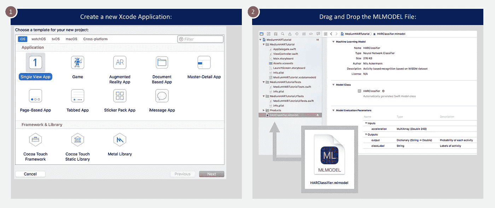
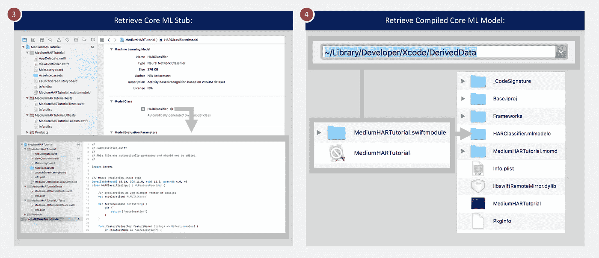
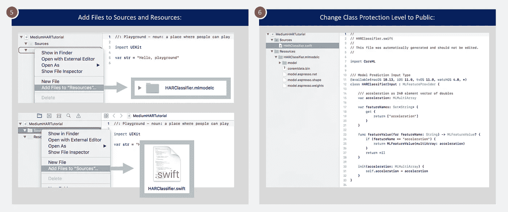

# 使用 Keras 和 Core ML 的人体活动识别(HAR)教程(第 2 部分)

> 原文：<https://towardsdatascience.com/human-activity-recognition-har-tutorial-with-keras-and-core-ml-part-2-857104583d94?source=collection_archive---------9----------------------->

## 如何将 Keras 模型加载到您的 iOS 项目中的分步指南


Photo: a-image/Shutterstock

我之前的[文章](https://medium.com/@nils.ackermann/human-activity-recognition-har-tutorial-with-keras-and-core-ml-part-1-8c05e365dfa0)讲述了在 Python 中使用苹果的 Core ML 工具从 Keras 创建一个多维深度神经网络的核心 ML 文件(DNN)。如果你想知道如何在不创建完整的 iOS 应用程序的情况下，在 Swift 操场上快速测试这个模型，请继续阅读。本文将涵盖以下步骤:

*   将核心 ML 模型文件加载到 Xcode 中
*   检索生成的核心 ML 存根源和编译的核心 ML 模型
*   创建一个 Xcode 游乐场，并导入核心 ML 存根源和编译的核心 ML 模型
*   写几行 Swift 代码，以便对多维传感器数据进行预测

# 将核心 ML 文件加载到 Xcode 中

为了在 Swift 操场上使用任何 Core ML 模型，首先需要创建一个常规的 Xcode 项目(例如，单视图应用程序)。一旦项目被创建，搜索文件`HARClassifier.mlmodel`，这是你在我上一篇文章中作为最后一步创建的。将文件拖放到您创建的 Xcode 项目中。



Drag and drop the mlmodel file into Xcode

如果您单击 Xcode 中的`HARClassifier.mlmodel`，模型评估参数将与我们在 Keras 中定义的输入和输出相匹配:

*   **输入:**这是一个包含 240 个条目的多数组(原始 80 x 3 矩阵的平面向量)
*   **输出:**输出参数将六项活动中每一项的概率存储为字典；classLabel 参数是一个字符串，包含给定输入的最可能活动的名称

接下来，您需要两件工艺品来为您的游乐场做准备:

*   **核心 ML 存根来源:**在“模型评估参数”部分上方，您将看到一个名为“模型类”的部分。核心 ML 模型的导入也创建了必要的 Swift 代码，以便在操场上使用该模型。如果单击类名 HARClassifier 旁边的箭头，您可以查看已生成的代码。
*   **核心 ML 模型的编译版本:**继续构建并运行您的应用程序。一旦您的应用程序已经构建并且模拟器已经启动，您必须检索编译的`.mlmodelc`文件。打开取景器并按下`CMD-Shift-G`，然后进入以下路径`~/Library/Developer/Xcode/DerivedData`。导航到为您的应用程序创建的文件夹。在那里，进入文件夹`Build/Products/Debug-iphonesimulator`，显示程序`MediumHARTutorial`的包内容(或者你给你的 Xcode 项目取的任何名字)。最后，在这里你会找到文件夹`HARClassifier.mlmodelc`。这是模型的编译版本。



Retrieve the model class and the compiled Core ML model

有了这两件艺术品，你现在就可以创建你的 Swift 游乐场了。

# 创建一个新的 Swift 游乐场

返回 Xcode，创建一个新的(空白)playground 文件。在 playground 中，将编译后的核心 ML 模型添加到`Resources`文件夹中，将 Swift 源文件添加到`Sources`文件夹中。



Add model class and compiled Core ML model to the playground

在导入核心 ML 模型期间创建的存根源都有一个内部保护级别。您需要将所有三个类及其成员都改为`public`(文件在本文末尾引用)，以便在您的游戏中使用它们。生成的三个类是:

*   定义类型`MLFeatureProvider`的模型预测输入的类。
*   定义类型`MLFeatureProvider`的模型预测输出的类。
*   该类提供对核心 ML 模型的访问，主要用于通过`prediction`函数进行推理。

# 做预测

现在，是时候在 Swift 中最终做出预测了。为此，您只需要几行代码。

实际上，您可以直接从加速度计加载传感器数据，并进行与训练期间相同的归一化预处理。出于简单的原因，您可以简单地将选定的传感器序列从 Python 复制并粘贴到 XCode 中，然后处理结果。

Swift Core ML example code to make predictions for accelerometer data

XCode Playground 中的输出显示了概率最高的预测标签以及所有其他标签的概率。

```
Predicted label: Upstairs
Probability per label: ["Sitting": 2.0439521186688125e-09, "Jogging": 0.00010426577500766143, "Upstairs": 0.49756348133087158, "Standing": 1.2845226184804437e-12, "Walking": 0.11116743087768555, "Downstairs": 0.39116477966308594]
```

# 摘要

在前一篇文章和本文中，我们经历了在 Keras 中创建机器学习模型、将其导入 Xcode 并使用 Swift 编程语言在 iOS 中进行预测的端到端过程。操场文件和 Jupyter 笔记本(来自上一篇文章)可以在 [Github](https://github.com/ni79ls/har-keras-coreml) 上获得。

# 放弃

*本网站上的帖子是我个人的，不一定代表我的雇主的帖子、策略或观点。*