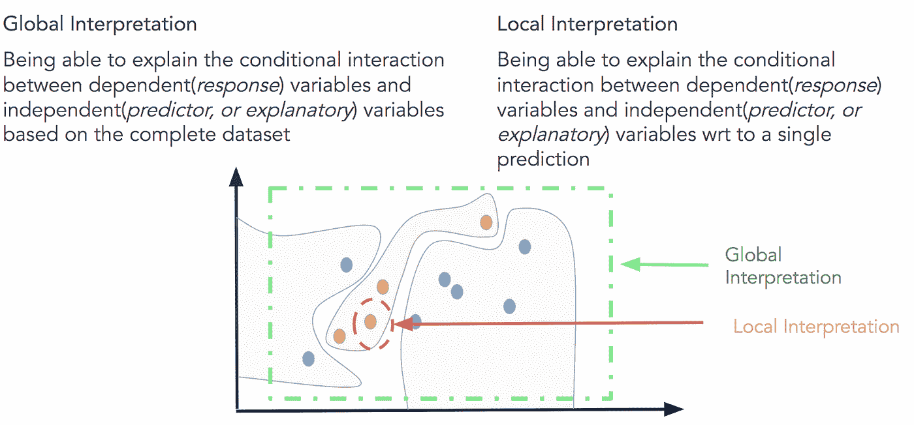

# 人类可解释的机器学习的重要性

> 原文：<https://towardsdatascience.com/human-interpretable-machine-learning-part-1-the-need-and-importance-of-model-interpretation-2ed758f5f476?source=collection_archive---------1----------------------->

## 可解释的人工智能(第一部分)

## 人类可解释机器学习和模型解释简介

# 介绍

本文是我针对 ***【可解释的人工智能(XAI)】***系列文章的第一篇。由机器学习和深度学习推动的人工智能领域在过去十年中经历了一些惊人的变化。最初只是一个纯学术和研究导向的领域，我们已经看到广泛的行业采用了不同的领域，包括零售，技术，医疗保健，科学和更多。数据科学和机器学习在 21 世纪的主要目标不再只是进行实验室实验来发表研究论文，而是转变为处理和解决现实世界的问题，自动化复杂的任务，让我们的生活变得更加轻松和美好。更多时候，机器学习、统计或深度学习模型的标准工具箱保持不变。像 [*胶囊网络*](https://en.wikipedia.org/wiki/Capsule_neural_network) 这样的新模式确实出现了，但行业采用同样的模式通常需要几年时间。因此，在行业中，数据科学或机器学习的主要关注点更多的是 ***【应用】*** 而不是理论，在正确的数据上有效应用这些模型以解决复杂的现实世界问题至关重要。

机器学习模型本身由一种算法组成，该算法试图从数据中学习潜在的模式和关系，而不是硬编码的固定规则。因此，向业务解释模型如何工作总是会带来一系列挑战。在该行业的一些领域，特别是在保险或银行等金融领域，数据科学家最终往往不得不使用更传统的机器学习模型(线性或基于树的模型)。原因是模型的可解释性对于解释模型所采取的每一个决策是非常重要的。但是，这通常会导致牺牲性能。这就是像集成和神经网络这样的复杂模型通常给我们更好和更准确的性能的地方(因为真实的关系在本质上很少是线性的)。然而，我们最终无法对模型决策做出正确的解释。为了解决和讨论这些差距，我将写一系列文章，在这些文章中，我们将深入探索可解释的人工智能(XAI)和人类可解释的机器学习的一些挑战。

# 本系列的大纲

我们将在这一系列文章中涉及的一些主要领域包括。

## 第 1 部分:人类可解释的机器学习的重要性

*   理解机器学习模型解释
*   机器学习模型解释的重要性
*   模型解释方法的标准
*   模型解释的范围

## 第 2 部分:模型解释策略

*   模型解释的传统技术
*   传统技术的挑战和局限
*   准确性与可解释性的权衡
*   模型解释技术

## 第 3 部分:动手模型解释——综合指南

*   关于使用最新的模型解释框架的实践指南
*   使用 ELI5、Skater 和 SHAP 等框架的特点、概念和示例
*   探索概念并观察它们的实际应用——特征重要性、部分相关图、替代模型、用石灰的解释和说明、SHAP 值
*   基于监督学习示例的机器学习模型解释

## 第 4 部分:实践高级模型解释

*   非结构化数据集上的动手模型解释
*   深度学习模型的高级模型解释

如上所述，这些内容将在本系列的几篇文章中涉及，以保持简洁和有趣，这样每个人都可以从每篇文章中获得一些关键的收获。

# 动机

作为该行业的一名数据科学家和该领域的指导人员，我看到数据科学仍然经常被视为一个黑匣子，能够表演魔术或炼金术，为人们提供他们想要的东西。然而，残酷的现实是，如果没有对机器学习模型或数据科学管道如何工作的合理理解，现实世界的项目很少会成功。考虑现实世界中的任何数据科学项目，通常会有业务方面和技术或解决方案方面。现在，数据科学家通常致力于构建模型并为业务提供解决方案。然而，企业可能不知道模型如何工作的复杂细节。但是由于这个模型最终会为他们做很多决定，他们有权利提出这个问题，“我怎么能相信你的模型？” 或者 ***“你的模型到底是怎么做决策的？”回答这些问题是数据科学从业者和研究人员多年来一直在尝试的事情。***

数据科学从业者会知道，存在一个典型的 [***模型可解释性与模型性能的权衡***](https://www.ncbi.nlm.nih.gov/pubmed/21554073) 。这里要记住的一点是，模型性能不是运行时或执行性能，而是模型在做出决策时的准确性。有几种模型，包括简单的线性模型，甚至是基于树的模型，它们可以很容易地解释模型做出的决定，以达到特定的洞察力或预测，但您可能需要牺牲模型的性能，因为由于高偏差(线性模型)或高方差的内在问题，它们总是不会产生最佳结果，从而导致过度拟合(完全生长的树模型)。更复杂的模型，如集成模型和最近的深度学习模型家族，通常会产生更好的性能，但被视为黑盒模型，因为很难解释模型可能如何在幕后真正做出决策。

有些人可能会说，如果某样东西(暂时)运行良好，为什么要质疑它是如何工作的呢？然而，作为人类，逻辑和推理是我们在大多数决定中坚持的东西。因此，向人工智能(AI)决策的范式转变无疑会受到质疑。在许多现实世界的场景中，有偏见的模型可能会产生非常不利的影响。这包括 [*预测潜在罪犯*](https://www.propublica.org/article/machine-bias-risk-assessments-in-criminal-sentencing) *，* [*司法判决风险评分*](https://www.propublica.org/article/making-algorithms-accountable) ，*信用评分、欺诈检测、健康评估、贷款借贷、自动驾驶*以及其他许多模型理解和解释至关重要的领域。著名数据科学家和作家 Cathy O' Neil 在她广受好评的书中强调了这一点， [***【数学毁灭的武器】***](https://weaponsofmathdestructionbook.com/) 。

 [## 主要的

### 《摧毁数学的武器》已经入围国家图书奖！书籍简介:前华尔街…

weaponsofmathdestructionbook.com](https://weaponsofmathdestructionbook.com/) 

著名研究员兼作家凯特·克劳福德(Kate Crawford)在 NIPS 2017 主题演讲中谈到了机器学习中偏见的含义及其对社会的影响的这些方面， [***【偏见的麻烦】***](https://www.facebook.com/nipsfoundation/videos/1553500344741199) 。

感兴趣的读者还应该看看她在《纽约时报》上的著名文章，[***【人工智能的白人问题】***](https://www.nytimes.com/2016/06/26/opinion/sunday/artificial-intelligences-white-guy-problem.html) ，她向我们展示了机器学习应用的例子，包括图像分类、犯罪风险预测、送货服务可用性以及更多对黑人社区不利的结果。所有这些现实世界的场景都暗示了模型解释应该有多重要，以及我们是否想要利用机器学习来解决这些问题。

 [## 观点|人工智能的白佬问题

### 根据科技界一些知名人士的观点，人工智能对……构成了迫在眉睫的生存威胁

www.nytimes.com](https://www.nytimes.com/2016/06/26/opinion/sunday/artificial-intelligences-white-guy-problem.html) 

在过去的一年里，我看到了在解决行业问题的同时对模型解释的需求，在我写我最近的书[***‘用 Python 进行实用的机器学习’***](https://github.com/dipanjanS/practical-machine-learning-with-python)时也是如此。在这段时间里，我有机会与 DataScience.comT21[的优秀员工互动，他们非常清楚机器学习模型中人类可解释性的必要性和重要性。他们一直在积极寻找解决方案，并开源了流行的 python 框架](https://www.datascience.com/)[***Skater***](https://github.com/datascienceinc/Skater)。在这一系列的文章中，我们将深入研究溜冰者，并做一些实际的模型解释。除此之外，我们还将全面覆盖其他模型解释框架，如[***【ELI5】***](https://github.com/TeamHG-Memex/eli5)**！**

# **理解机器学习模型解释**

**机器学习只是在最近几年才在行业中得到广泛采用。因此，模型解释作为一个概念仍然主要是理论性的和主观的。**

> **任何机器学习模型的核心都有一个响应函数，该函数试图映射和解释自变量(输入)和因变量(目标或响应)之间的关系和模式。**

**当模型预测或发现我们的洞察力时，它会做出某些决定和选择。模型解释试图理解和解释响应函数做出的这些决定，即什么、为什么和如何。模型解释的关键是透明性、质疑的能力以及人类理解模型决策的容易程度。模型解释的三个最重要的方面解释如下。**

1.  **驱动模型预测的因素是什么？我们应该能够查询我们的模型，并找出潜在的功能交互，以了解哪些功能在模型的决策制定策略中可能是重要的。这保证了模型的*的公平性。***
2.  *****为什么模型会做出某种决定？**我们还应该能够验证和证明为什么某些关键特征会在预测过程中驱动模型做出某些决定。这保证了 ***问责*** 和模型的可靠性。***
3.  **我们如何相信模型预测？我们应该能够评估和验证任何数据点，以及模型如何对其做出决策。对于关键的利益相关者来说，这应该是可演示的并且容易理解的，即模型如预期的那样工作。这保证了模型的 ***透明性*** 。**

> ****机器学习模型的可解释性**通常也被称为**人类可解释的解释(HII)** 是人类(包括非机器学习专家)能够理解模型在其决策过程中所做选择(如何、为什么和什么)的程度。**

**当比较模型时，除了模型性能之外，如果一个模型的决策比另一个模型的决策更容易被人理解，则该模型比另一个模型具有更好的可解释性。**

# **机器学习模型解释的重要性**

**当处理机器学习问题时，数据科学家往往倾向于关注模型性能指标，如准确度、精确度和召回率等(这无疑很重要！).这在大多数围绕数据科学和机器学习的在线竞赛中也很普遍。然而，指标仅仅讲述了模型预测决策的一部分。随着时间的推移，由于环境中各种因素导致的模型概念漂移，性能可能会发生变化。因此，最重要的是理解是什么驱动一个模型做出某些决定。**

**我们中的一些人可能会说，如果一个模型工作得很好，为什么还要深入挖掘呢？请始终记住，在现实世界中解决数据科学问题时，为了让企业信任您的模型预测和决策，他们会不断地问这个问题， ***“我为什么要信任您的模型？”*** 这很有道理。如果一个人患有癌症或糖尿病，如果一个人可能对社会构成风险，甚至如果一个客户会流失，你会对一个仅仅预测和做出决定的模型感到满意吗( ***什么*** )也许不是，如果我们能更多地了解模型的决策过程(为什么****如何*** )，我们可能会更喜欢。这让我们更加透明地了解为什么模型会做出某些决定，在某些情况下什么可能会出错，随着时间的推移，这有助于我们建立对这些机器学习模型的一定程度的信任。***

**本节的关键要点是，现在是我们停止将机器学习模型视为黑盒的时候了，我们不仅要尝试分析数据，还要尝试分析模型如何做出决策。事实上，通往这条道路的一些关键步骤是由著名的论文 [*“我为什么要相信你？”解释任何分类器的预测*](http://www.kdd.org/kdd2016/papers/files/rfp0573-ribeiroA.pdf) 作者:M. T. Ribeiro，S. Singh 和 C. Guestrin，SIGKDD 2016，其中他们引入了 LIME(局部可解释模型不可知解释)的概念，我们将在下一篇文章中详细介绍。**

**他们在论文中提到了一些值得记住的要点。**

> **然而，理解预测背后的原因在评估信任时非常重要，如果一个人计划根据预测采取行动，或者在选择是否部署新模型时，信任是最基本的。**
> 
> **无论人类是直接使用机器学习分类器作为工具，还是在其他产品中部署模型，一个至关重要的问题仍然存在:如果用户不信任模型或预测，他们就不会使用它。**

**感兴趣的人也可以看看他们在 KDD 会议上关于模型解释的论文。**

**这是我们在本文中多次讨论过的内容，也是决定行业中数据科学项目成功与否的关键区别之一。这推动了围绕模型解释的需要和重要性的紧迫性。**

# **机器学习模型解释方法的标准**

**有特定的标准可以用来对模型解释方法进行分类。克里斯托夫·莫尔纳尔(Christoph Molnar)2018 年的 [*《可解释的机器学习，让黑盒模型变得可解释的指南》*](https://christophm.github.io/interpretable-ml-book/) 中提到了一个很好的指南**

*   ****内在的还是事后的？**内在可解释性是指利用本质上可内在解释的机器学习模型(如线性模型、参数模型或基于树的模型)。事后可解释性是指选择和训练一个黑盒模型(集成方法或神经网络)，并在训练后应用可解释性方法(特征重要性、部分相关性图)。在我们的系列文章中，我们将更多地关注事后模型可解释方法。**
*   ****特定于模型还是与模型无关？**特定于模型的解释工具非常特定于固有的模型解释方法，这些方法完全依赖于基于每个模型的能力和特性。这可以是系数、p 值、与回归模型相关的 AIC 分数、来自决策树的规则等等。与模型无关的工具与事后方法更相关，可以用于任何机器学习模型。这些不可知的方法通常通过分析(和输入的扰动)特征输入和输出对来操作。根据定义，这些方法无法访问任何模型内部，如权重、约束或假设。**
*   ****本地还是全球？**这个解释的分类讲的是解释方法是解释单个预测还是整个模型行为？还是范围介于两者之间？我们将很快更多地讨论全局和局部解释。**

**这并不是对可解释方法进行分类的一套详尽的标准，因为这仍然是一个新兴的领域，但这可以是比较和对比多种方法的一个很好的尺度。**

# **机器学习模型解释的范围**

**我们如何定义可解释性的范围和界限？一些有用的方面可以是模型的透明性、公平性和责任性。*全局*和*局部*模型解释是定义模型解释范围的明确方式。**

****

**Summarizing Global and Local Interpretation (Source: DataScience.com)**

## **全球诠释**

**这一切都是为了试图理解 ***“模型是如何做出预测的？”*** 和 ***“模型的子集如何影响模型决策？”。为了立刻理解和解释整个模型，我们需要全局可解释性。全局可解释性是指能够根据完整数据集上的因变量(响应变量)和独立变量(预测变量)之间的条件交互来解释和理解模型决策。试图理解特性的相互作用和重要性总是理解全局解释的一个好的步骤。当然，当试图分析交互时，在超过两个或三个维度之后可视化特征变得相当困难。因此，经常查看可能影响全局知识模型预测的模块化部件和特征子集会有所帮助。全局解释需要模型结构、假设和约束的完整知识。*****

## **本地解释**

**这都是为了试图理解 ***“为什么模型为单个实例做出特定的决策？”*** 和 ***“为什么模型会对一组实例做出具体的决策？”*** 。对于局部可解释性，我们不关心模型的内在结构或假设，我们把它当作一个黑盒。为了理解单个数据点的预测决策，我们特别关注该数据点，并查看该点周围的特征空间中的局部子区域，并尝试基于该局部区域理解该点的模型决策。局部数据分布和特征空间可能表现完全不同，并且给出与全局解释相反的更准确的解释。局部可解释模型不可知解释(LIME)框架是一种优秀的方法，可用于模型不可知的局部解释。我们可以使用全局和局部解释的组合来解释一组实例的模型决策。**

## **模型透明度**

**这一切都是为了理解 ***“一个模型是如何从算法和特征中创建出来的？”。*** 我们知道，通常情况下，机器学习模型都是利用数据特征之上的算法来构建一种将输入映射到潜在输出(响应)的表示。模型的透明性可以试图理解更多的技术细节，如模型是如何构建的，以及什么可能影响它的决策。这可以是神经网络的权重、CNN 滤波器的权重、线性模型系数、决策树的节点和分裂。然而，由于企业可能不太精通这些技术细节，试图用不可知的局部和全局解释方法来解释模型决策有助于展示模型的透明性。**

# **结论**

**模型解释是可以成就或破坏行业中真实世界机器学习项目的东西，并帮助我们向可解释的人工智能(XAI)迈进了一步。让我们努力实现人类可解释的机器学习和 XAI，为每个人揭开机器学习的神秘面纱，并帮助增加对模型决策的信任。**

# **下一步是什么？**

**在本系列的第 2 部分中，我们将涉及可解释人工智能的以下方面，涉及机器学习模型解释。**

*   **模型解释的传统技术**
*   **传统技术的挑战和局限**
*   **准确性与可解释性的权衡**
*   **模型解释技术**

**感谢 [***马修【梅奥】***](https://www.linkedin.com/in/mattmayo13) 的编辑和转载本文于[***KD nuggets***](https://www.kdnuggets.com/2018/06/human-interpretable-machine-learning-need-importance-model-interpretation.html)。**

**感谢所有在[DataScience.com](https://www.datascience.com/)的出色的人们，特别是[*Pramit Choudhary*](https://www.linkedin.com/in/pramitc/?lipi=urn%3Ali%3Apage%3Ad_flagship3_search_srp_top%3Bi7sMwalBRG69UVr8ck4n%2BA%3D%3D&licu=urn%3Ali%3Acontrol%3Ad_flagship3_search_srp_top-search_srp_result&lici=LV1csX2ATFSqPNbcebrjvQ%3D%3D)为我构建了一个令人惊叹的模型解释框架，[***Skater***](https://www.datascience.com/resources/tools/skater)*为我提供了这个系列的一些精彩内容。***

***我在我的书中涵盖了很多机器学习模型解释的例子， [***《用 Python 进行实用的机器学习》***](https://github.com/dipanjanS/practical-machine-learning-with-python) 。为了您的利益，代码是开源的！***

**如果你对我的文章或数据科学有任何反馈、评论或有趣的见解要分享，请随时通过我的 LinkedIn 社交媒体频道联系我。**

** [## Dipanjan Sarkar -数据科学家-英特尔公司| LinkedIn

### 查看 Dipanjan Sarkar 在世界最大的职业社区 LinkedIn 上的个人资料。Dipanjan 有 5 份工作列在…

www.linkedin.com](https://www.linkedin.com/in/dipanzan/)**