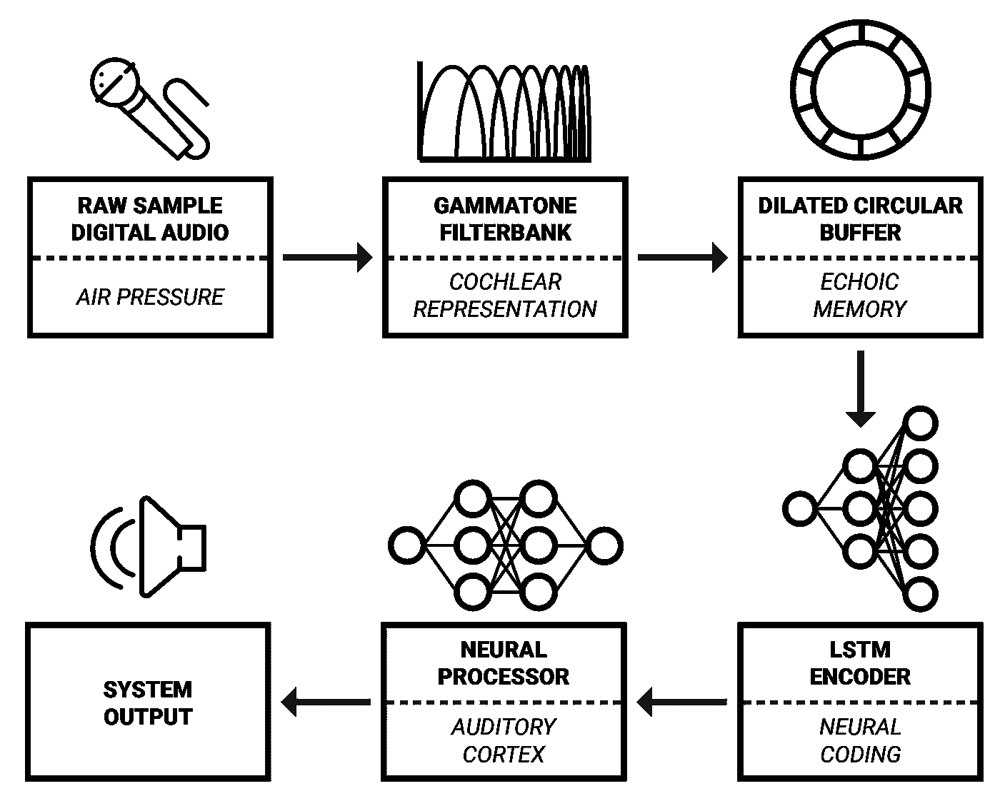
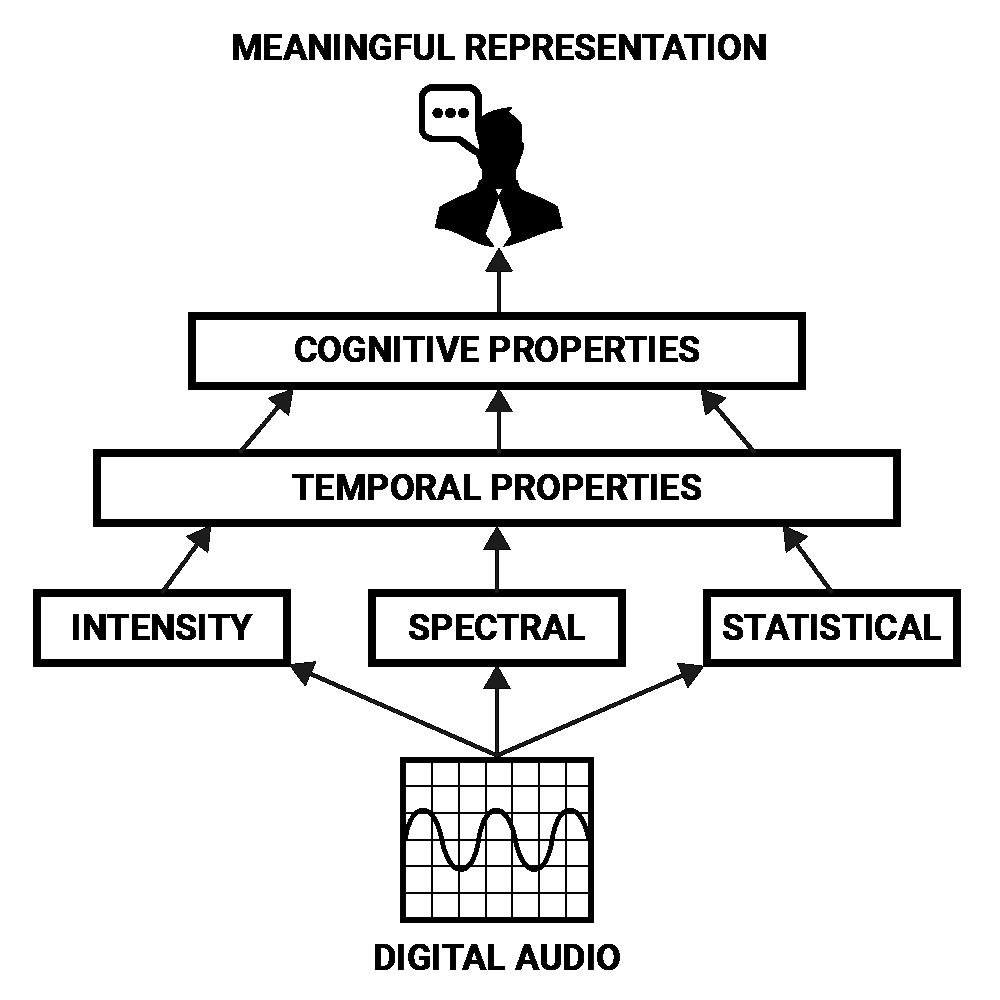
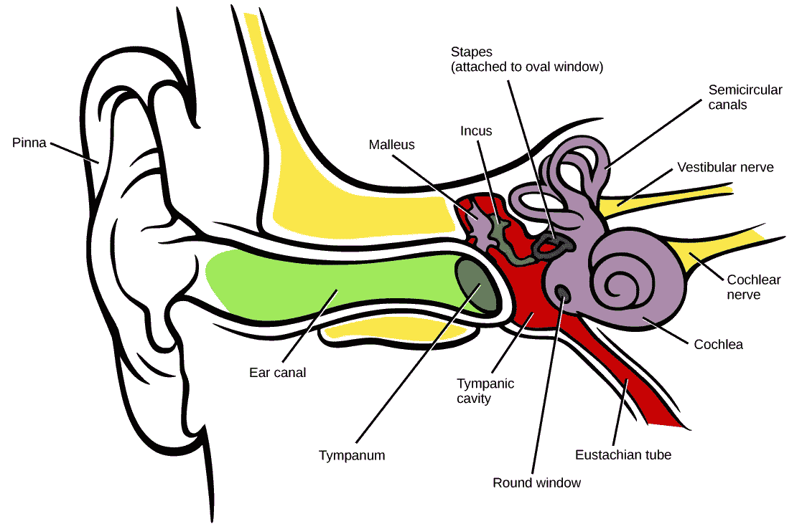
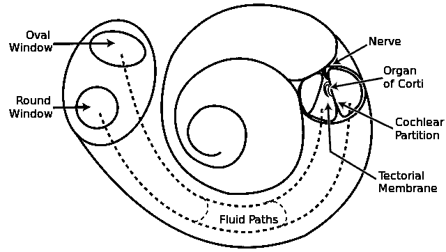
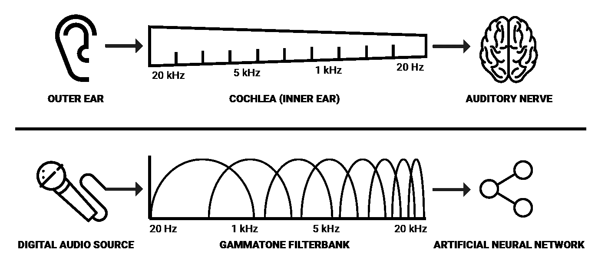
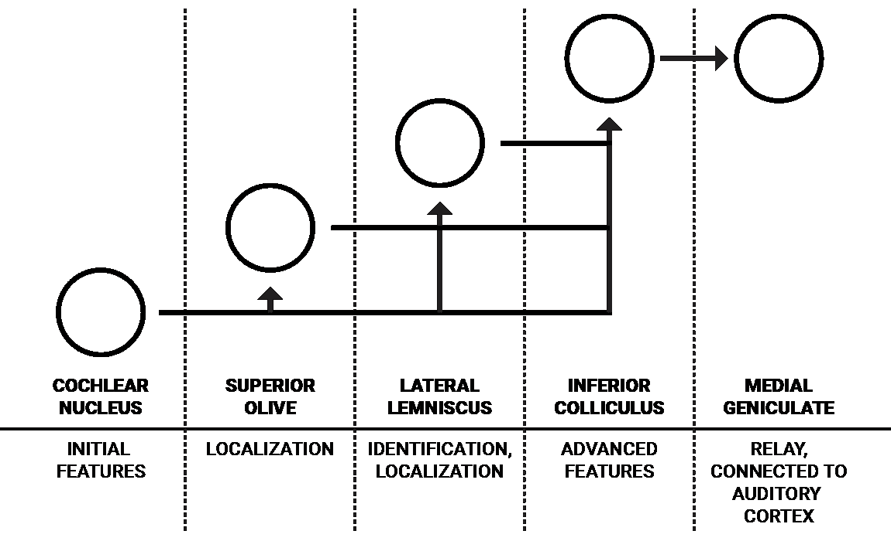
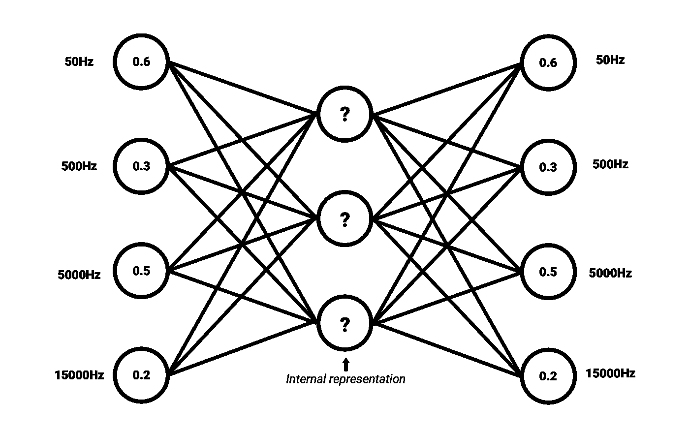

# 具有人工智能的类人机器听觉(1/3)

> 原文：<https://towardsdatascience.com/human-like-machine-hearing-with-ai-1-3-a5713af6e2f8?source=collection_archive---------4----------------------->

Photo credit: [Jonathan Gross](https://www.flickr.com/photos/jonathangrossphotography/)

## 神经网络在实时音频信号处理中的应用

人工智能技术的重大突破是通过模拟人类系统实现的。虽然人工神经网络(NNs)是与实际人类神经元的功能方式仅松散耦合的数学模型，但它们在解决复杂和模糊的现实世界问题方面的应用已经非常广泛。此外，在神经网络中对大脑的结构深度进行建模，为学习更有意义的数据表示提供了广泛的可能性。

如果您错过了其他文章，请点击下面的链接了解最新情况:

**背景**:[AI 在音频处理上的承诺](/the-promise-of-ai-in-audio-processing-a7e4996eb2ca)
**批评**:[CNN 和 spectrograms 做音频处理有什么问题？](/whats-wrong-with-spectrograms-and-cnns-for-audio-processing-311377d7ccd)
**第二部分** : [具有人工智能的仿人机器听觉(2/3)](/human-like-machine-hearing-with-ai-2-3-f9fab903b20a)

在图像识别和处理方面，[CNN](https://neurdiness.wordpress.com/2018/05/17/deep-convolutional-neural-networks-as-models-of-the-visual-system-qa/)视觉系统中复杂且更具空间不变性的细胞所带来的灵感也极大地改进了我们的技术。如果你对在音频频谱图中应用图像识别技术感兴趣，可以看看我的文章*[*“CNN 和频谱图在音频处理中有什么问题？”*](/whats-wrong-with-spectrograms-and-cnns-for-audio-processing-311377d7ccd) 。*

*只要人类的感知能力超过机器，我们就能从理解人类系统的原理中获益。当谈到感知任务时，人类非常熟练，人类理解和人工智能现状之间的反差在机器听觉领域变得尤为明显。考虑到从人类视觉处理系统中获得灵感所带来的好处，我建议我们从具有神经网络的机器听觉中获得类似的过程。*

**

**An overview of the framework which will be proposed during this article series.**

***在本系列文章中，我将详细介绍与** [**奥胡斯大学**](http://www.au.dk/en/) **和智能扬声器制造商**[**Dynaudio A/S**](https://www.dynaudio.com/)合作开发的 AI 实时音频信号处理框架。它的灵感主要来自认知科学，认知科学试图结合生物学、神经科学、心理学和哲学的观点，以更好地了解我们的认知能力。*

## *认知声音属性*

*也许声音最抽象的领域是我们人类如何感知它。虽然信号处理问题的解决方案必须在低水平的强度、频谱和时间属性的参数内操作，但最终目标通常是认知目标:以改变我们对信号所含声音的感知的方式来转换信号。*

*例如，如果希望通过编程来改变录制的语音的性别，那么在定义其低级特征之前，有必要用更有意义的术语来描述这个问题。说话者的性别可以被认为是一种认知属性，由许多因素构成:声音的音高和音色、发音差异、词汇和语言选择的差异以及对这些属性如何与性别相关的共同理解。*

*这些参数可以用较低层次的特征来描述，如强度、光谱和时间属性，但只有在更复杂的组合中，它们才能形成高层次的表示。**这形成了一个音频特征的层次结构，从中可以导出声音的*含义*。**代表人类声音的认知属性可以被认为是声音强度、频谱和统计属性的时间发展的组合模式。*

**

**A hierarchy of features that can be used to derive meaning from digital audio.**

*神经网络擅长提取数据的抽象表示，因此非常适合检测声音的认知属性。为了建立一个用于此目的的系统，让我们检查声音在人类听觉器官中是如何表示的，我们可以用它来启发用神经网络处理声音的表示。*

## *耳蜗表现*

*人类的听觉始于外耳，外耳首先由*耳廓*组成。耳廓充当了一种频谱预处理的形式，其中传入的声音根据其相对于听者的方向而被修改。然后，声音通过耳廓的开口进入*耳道*，耳道进一步通过共振来修改传入声音的频谱属性，从而放大 1-6 kHz 范围内的频率[1]。*

**

*An illustration of the human auditory system.*

*当声波到达耳道末端时，它们会刺激耳膜，听小骨(人体内最小的骨头)附着在耳膜上。这些骨头将压力从耳道传递到内耳中充满液体的*耳蜗*。**耳蜗在引导 NNs 的声音表达方面有很大的兴趣，因为这是负责将声振动转换成人类神经活动的器官。***

*它是一个盘管，沿其长度被两层膜分开，这两层膜是*赖斯纳膜*和*基膜*。沿着耳蜗的长度，有一排大约 3500 个内毛细胞[1]。当压力进入耳蜗时，它的两层膜被压下。基底膜在底部窄而硬，但在顶部松而宽，因此沿其长度的每个地方对特定频率的响应更强烈。*

*简单来说，基膜可以被认为是一个连续的带通滤波器阵列，沿着膜的长度，用于将声音分离成它们的光谱成分。*

**

*An illustration of the human cochlea.*

*这是人类将声压转化为神经活动的主要机制。因此，有理由假设音频的频谱表示将有利于用人工智能对声音感知进行建模。由于沿着基底膜的频率响应呈指数变化[2]，对数频率表示可能被证明是最有效的。一种这样的表示可以使用**伽马通滤波器组**来导出。这些滤波器通常应用于模拟听觉系统中的频谱滤波，因为它们近似人类听觉滤波器的脉冲响应，该脉冲响应来自测量的听觉神经纤维对白噪声刺激的响应，称为*“revcor”*函数【3】。*

**

**A simplified comparison between human spectral transduction and a digital counterpart.**

*由于耳蜗有大约 3500 个内毛细胞，人类可以检测到长度低至大约 2-5 ms 的声音间隙[1]，分成 2 ms 窗口的 3500 个伽马通滤波器的光谱分辨率似乎是在机器中实现类似人类的光谱表示的最佳参数。然而，在实际场景中，我假设较低的分辨率仍然可以在大多数分析和处理任务中实现理想的效果，同时从计算的角度来看更可行。*

*许多用于听觉分析的软件库可以在线获得。一个著名的例子是 Jason Heeris 的 [*Gammatone 滤波器组工具包*。它提供了可调节的滤波器，以及使用 gammatone 滤波器对音频信号进行类似声谱图分析的工具。](https://github.com/detly/gammatone)*

## *神经编码*

*当神经活动从耳蜗移动到听觉神经和上行听觉通路时，在到达听觉皮层之前，脑干核团中应用了许多过程。*

*这些过程形成了一个代表刺激和感知之间接口的神经代码。关于这些核的具体内部工作的许多知识仍然是推测性的或未知的，所以我将只在它们更高的功能水平上详细描述这些核。*

**

**A simplified illustration of the ascending auditory pathway (for one ear) and its assumed functions.**

*人类的每只耳朵都有一组相互连接的细胞核，但为了简单起见，我只展示了一只耳朵的流程。*耳蜗核*是来自听觉神经的神经信号的第一个编码步骤。它由各种具有不同属性的神经元组成，用于执行声音特征的初始处理，其中一些神经元指向与声音定位相关的*上橄榄*，而其他神经元则指向通常与更高级特征相关的*侧丘系*和*下丘*[1]。*

*J.J. Eggermont 在*“在声音和感知之间:回顾对神经代码的搜索”*中详细描述了来自耳蜗核的这种信息流如下:*“腹侧[耳蜗核] (VCN)提取并增强在[听觉神经]纤维的放电模式中多路复用的频率和定时信息，并通过两条主要路径分发结果:声音定位路径和声音识别路径。VCN (AVCN)的前部主要服务于声音定位方面，其两种类型的浓密细胞为上橄榄复合体(SOC)提供输入，在此为每个频率分别绘制耳间时差(itd)和水平差(ILD)。**

*声音识别路径所携带的信息是诸如元音的复杂频谱的表示。这种表现主要是由被称为*“斩波器”*(*)神经元的特殊类型单元在耳蜗腹侧核中产生的[4]。这些听觉编码的细节很难详细说明，但**它们向我们表明，输入频谱的一种“编码”形式可以提高对低水平声音特征的理解**，并使声音印象在 NNs 中的处理成本更低。**

## **频谱声音嵌入**

**我们可以应用无监督的[自动编码器神经网络架构](https://deeplearning4j.org/deepautoencoder)来尝试学习与复杂光谱相关的共同属性。就像[单词嵌入](https://www.tensorflow.org/tutorials/word2vec)，在代表声音精选特征的频谱中找到共性是可能的(或者一个更紧密浓缩的*意为*)。**

**自动编码器被训练成将输入编码成压缩表示，该压缩表示可以被重构回与输入具有高度相似性的表示。这意味着自动编码器的目标输出是输入本身[5]。如果一个输入可以在没有很大损失的情况下被重建，那么网络已经学会以这样一种方式对它进行编码，即压缩的内部表示包含足够多的有意义的信息。这种内部表现就是我们所说的嵌入。自动编码器的编码部分可以与解码器分离，以便为其他应用程序生成嵌入。**

****

**A simplified illustration of an autoencoder architecture for spectral sound embeddings.**

**嵌入还有一个好处，那就是它们通常比原始数据的维度更低。例如，自动编码器可以将总共有 3500 个值的频谱压缩成长度为 500 个值的向量。简而言之，这种向量的每个值可以描述更高级别的频谱因子，例如元音、刺耳或和谐度——这些只是示例，因为由自动编码器导出的统计公共因子的含义可能通常难以用简单的语言来标注。**

**在下一篇文章中，我们将通过增加内存来扩展这一思想，为音频频谱的时间发展产生嵌入。**

**这是我关于人工智能音频处理系列文章的第一部分。接下来，我们将讨论声音中感觉记忆和时间依赖性的基本概念。**

**如果你喜欢这篇文章，请随时关注并留下你的掌声。**

## **参考**

**[1] C. J. Plack，《听觉》，第二版。心理学出版社，2014。**

**[2] S. J. Elliott 和 C. A. Shera，“作为智能结构的耳蜗”，智能材料。结构。，第 21 卷，第 6 期，第 64001 页，2012 年 6 月。**

**[3] A.M. Darling，“gammatone 滤波器的特性和实现:指南”，言语听力和语言，伦敦大学学院，1991 年。**

**[4] J. J. Eggermont，“在声音和感知之间:回顾对神经代码的研究。，“听到了。《研究报告》，第 157 卷，第 1-2 期，第 1-42 页，2001 年 7 月。**

**[5]t . p . Lilli rap 等，学习 AI 的深度架构，第 2 卷，第 1 期。2015.**