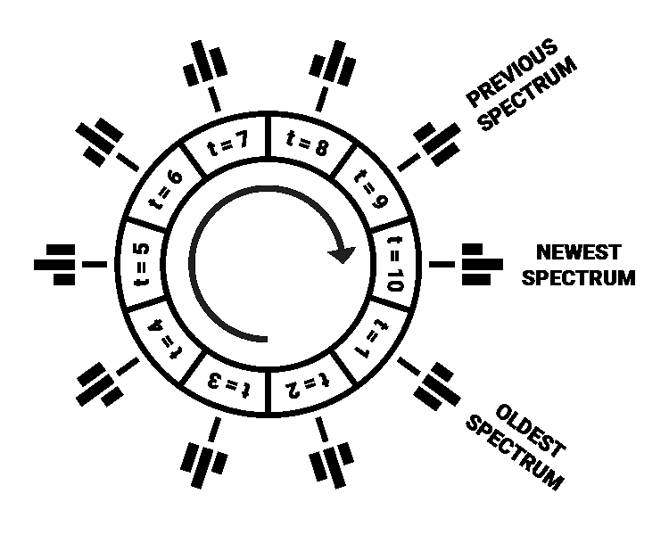
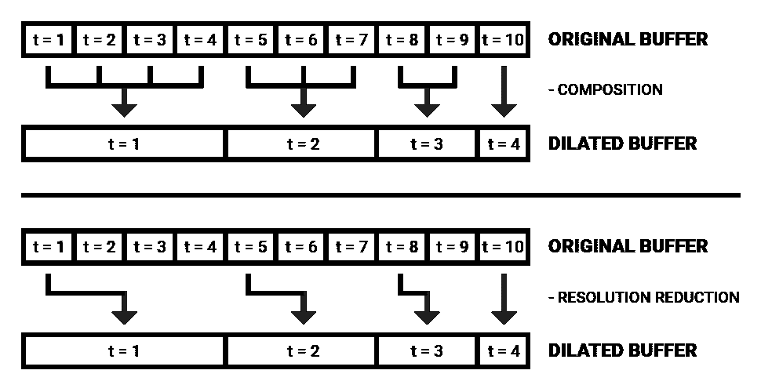
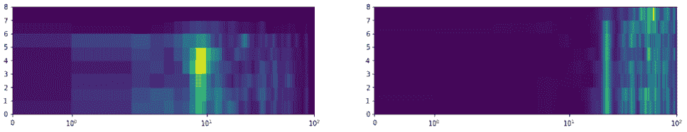
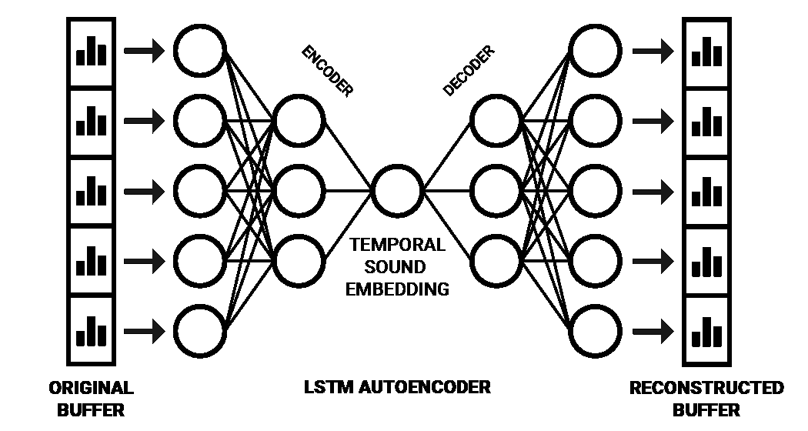
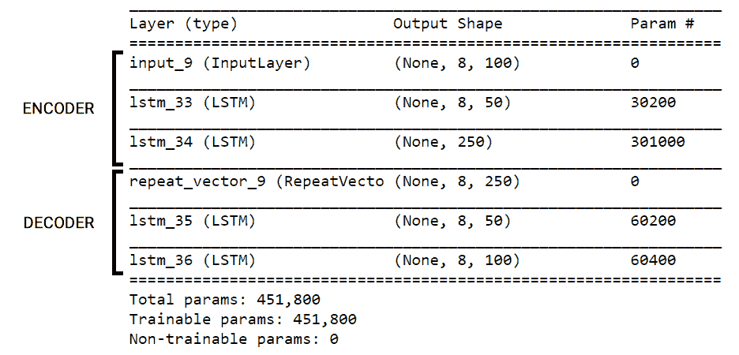
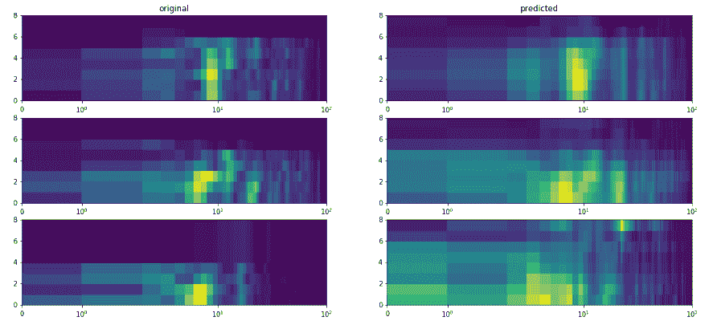

# 具有人工智能的类人机器听觉(2/3)

> 原文：<https://towardsdatascience.com/human-like-machine-hearing-with-ai-2-3-f9fab903b20a?source=collection_archive---------7----------------------->


Photo credit: [rawpixel](https://unsplash.com/@rawpixel?utm_source=medium&utm_medium=referral)

## 记忆的重要性

嗨，欢迎回来！本系列文章详细介绍了我与[奥胡斯大学](http://www.au.dk/en/)和智能扬声器制造商[丹拿](https://www.dynaudio.com/)合作开发的一个人工智能实时音频信号处理框架。

如果您错过了之前的文章，请点击下面的链接了解最新情况:

**背景**:[AI 在音频处理上的承诺](/the-promise-of-ai-in-audio-processing-a7e4996eb2ca)
**批评**:[CNN 和 spectrograms 做音频处理有什么问题？](/whats-wrong-with-spectrograms-and-cnns-for-audio-processing-311377d7ccd)
**第一部分** : [具有人工智能(1/3)的仿人机器听觉](/human-like-machine-hearing-with-ai-1-3-a5713af6e2f8)

在前面的部分中，我们描绘了人类如何体验声音的基本原理，即在耳蜗中形成的光谱印象，然后由脑干核序列进行“编码”。这篇文章将探讨我们如何在产生频谱声音嵌入时将*记忆*与用于声音理解的人工神经网络相结合。

## 回声记忆

> 声音事件的*含义*在很大程度上源于频谱特征之间的时间相互作用。

这方面的一个证据是，人类的听觉系统根据时间背景以不同的方式对语音的相同音素进行编码[1]。这意味着一个音素 */e/* 在神经学上对我们来说可能意味着不同的东西，这取决于它之前的东西。

记忆对于进行声音分析至关重要，因为只有将“那一刻”的印象与之前的印象进行比较才是可能的，前提是它们确实存储在某个地方。

人类的短期记忆是由一系列整合了感觉记忆和工作记忆的成分组成的。在对声音感知的检查中，已经在人类中发现了*听觉感觉记忆*(有时也称为*回声记忆*)。c .阿兰等人。艾尔。将听觉感官记忆描述为*“听觉感知中的关键第一阶段，允许听者将传入的声音信息与先前听觉事件的存储表征进行整合”*【2】。

> 从计算上来说，我们可以把回声记忆看作是即时听觉印象的短暂缓冲。

关于回声记忆的持续时间一直存在争议。在纯音和口语元音掩蔽研究的基础上，D. Massaro 论证了大约 250 ms，而 A. Treisman 基于两耳分听实验论证了大约 4 秒[3]。为了将回声记忆的想法与神经网络相结合，我们可能不需要确定感觉存储的固定持续时间，但我们可以在几秒钟的范围内对记忆进行实验。

## 兜圈子

用数字光谱表示法实现感觉记忆可能相当简单。我们可以简单地分配一个*循环缓冲器*来存储先前时间步的预定数量的光谱。



*An illustrated circular buffer for holding spectral memory (where t denotes the timestep).*

> 循环缓冲区是一种数据结构，由一个被视为循环的数组组成，当数组长度达到后，其索引循环回 0[4]。

在我们的例子中，这可能是一个多维数组，其长度为所需的内存量，循环缓冲区的每个索引保存特定时间步长的完整频谱。计算新光谱时，会将它们写入缓冲区，如果缓冲区已满，则会覆盖最早的时间步长。

随着缓冲区的填充，两个指针被更新:一个*尾指针*标记最新添加的元素，一个*头指针*标记最老的元素，因此也是缓冲区的开始[4]。

下面是一个 Python 中循环缓冲区的例子，改编自[埃里克·威瑟](https://github.com/eric-wieser/numpy_ringbuffer):

```
import numpy as npclass CircularBuffer():
    # Initializes NumPy array and head/tail pointers
    def __init__(self, capacity, dtype=float):
        self._buffer = np.zeros(capacity, dtype)
        self._head_index = 0
        self._tail_index = 0
        self._capacity = capacity # Makes sure that head and tail pointers cycle back around
    def fix_indices(self):
        if self._head_index >= self._capacity:
            self._head_index -= self._capacity
            self._tail_index -= self._capacity
        elif self._head_index < 0:
            self._head_index += self._capacity
            self._tail_index += self._capacity # Inserts a new value in buffer, overwriting old value if full
    def insert(self, value):
        if self.is_full():
            self._head_index += 1 self._buffer[self._tail_index % self._capacity] = value
        self._tail_index += 1
        self.fix_indices()

    # Returns the circular buffer as an array starting at head index
    def unwrap(self):
        return np.concatenate((
            self._buffer[self._head_index:min(self._tail_index, self._capacity)],
            self._buffer[:max(self._tail_index - self._capacity, 0)]
        )) # Indicates whether the buffer has been filled yet
    def is_full(self):
        return self.count() == self._capacity # Returns the amount of values currently in buffer
    def count(self):
        return self._tail_index - self._head_index
```

## 减少输入大小

为了以每时间步 5 ms 的分辨率存储完整的第二个频谱，需要容量为 200 个元素的缓冲器。这些元素中的每一个都包含一个频率幅度数组。如果需要类似人类的光谱分辨率，这些数组将包含 3500 个值。对于总共 200 个时间步长，要处理 700，000 个值。

如果传递给人工神经网络，长度为 700，000 个值的输入存在计算开销大的风险。这种风险可以通过降低光谱和时间分辨率或在内存中保持较短的光谱信息持续时间来减轻。

我们还可以从 *Wavenet* 架构中获得灵感，该架构利用*扩展因果卷积*来优化对原始样本音频中大量顺序数据的分析。正如 A. Van Den Oord 等人在*中所解释的，“扩张卷积(也称为á trous，或带孔卷积)是一种卷积，其中通过跳过某个步长的输入值，在大于其长度的区域上应用滤波器”* [5]。

假设最近输入的频率数据是瞬时声音分析的最大决定因素，那么*扩展频谱缓冲器*可能是减少计算内存大小的有用工具。



*Two methods for dimensionality reduction with dilated spectral buffers (in this figure unrolled for clarity).*

通过与原始缓冲区成比例地将新缓冲区中的每个时间步长扩大某个比例(例如， *2^t* 的指数增加)，维度可以显著减少，同时保持最近时间步长的光谱发展的高分辨率。可以通过简单地越来越向后查找单个值来从原始缓冲区获得扩展缓冲区的值，但是也可以通过提取持续时间内的平均或中值频谱来组合要折叠的时间步长的数量。

> 扩展光谱缓冲区背后的驱动概念是将最近的光谱印象保留在内存中，同时以有效的方式保留一些关于“大画面”上下文的信息。

下面是使用 Gammatone 滤波器组制作扩展频谱帧的简化代码片段。注意，这个例子使用离线处理，但是滤波器组也可以实时应用，将频谱帧插入到循环缓冲器中。

```
from gammatone import gtgram
import numpy as np

class GammatoneFilterbank:
    # Initialize Gammatone filterbank
    def __init__(self, 
                 sample_rate, 
                 window_time, 
                 hop_time, 
                 num_filters, 
                 cutoff_low):
        self.sample_rate = sample_rate
        self.window_time = window_time
        self.hop_time = hop_time
        self.num_filters = num_filters
        self.cutoff_low = cutoff_low # Make a spectrogram from a number of audio samples
    def make_spectrogram(self, audio_samples):
        return gtgram.gtgram(audio_samples,
                             self.sample_rate,
                             self.window_time,
                             self.hop_time,
                             self.num_filters,
                             self.cutoff_low) # Divide audio samples into dilated spectral buffers
    def make_dilated_spectral_frames(self, 
                                     audio_samples, 
                                     num_frames, 
                                     dilation_factor): spectrogram = self.make_spectrogram(audio_samples)
        spectrogram = np.swapaxes(spectrogram, 0, 1)
        dilated_frames = np.zeros((len(spectrogram), 
                                  num_frames, 
                                  len(spectrogram[0])))

        for i in range(len(spectrogram)):
            for j in range(num_frames):
                dilation = np.power(dilation_factor, j)

                if i - dilation < 0:
                    dilated_frames[i][j] = spectrogram[0]
                else:
                    dilated_frames[i][j] = spectrogram[i - dilation]

        return dilated_frames
```



*Result: Two examples of dilated spectral buffers visualized as a quadrilateral mesh.*

## 嵌入缓冲区

在人类记忆的许多模型中，*选择性注意*被应用在感觉记忆之后，作为一种过滤器，以防止短期记忆中的信息过载【3】。由于人类的认知资源有限，将注意力分配给某些听觉以优化精神能量的消耗是有利的。

这个过程可以通过扩展*自动编码器*神经网络架构来实现。使用这种架构，可以将声音的感官记忆与选择性注意力的瓶颈结合起来，方法是向其提供扩展的频谱缓冲区以产生嵌入，而不是仅提供瞬时频率信息。为了处理顺序信息，可以使用一种称为*序列到序列自动编码器*的特殊类型架构【6】。

序列到序列( *Seq2Seq* )模型通常使用 LSTM 单位将一个数据序列(例如，一个英语句子)编码为一个内部表示，其中包含该序列作为一个整体的压缩“含义”。然后，这种内部表达可以被解码成一个序列(同样的句子，但以西班牙语为例)[7]。

> 以这种方式嵌入声音的一个特点是，它使得使用简单的前馈神经网络来分析和处理声音成为可能，这种网络运行起来更便宜。

在训练如下图所示的网络之后，右半部分(解码部分)可以被“切断”，从而生成用于将时间频率信息编码到压缩空间中的网络。Y. Chung 等人在这一研究领域取得了良好的成果。艾尔。通过应用 Seq2Seq 自动编码器架构[6]，成功地生成了描述声音记录的顺序语音结构的嵌入。随着输入数据更加多样化，也有可能产生以更通用的方式描述声音的嵌入。



*A simplified illustration of a sequential autoencoder which produces temporal sound embeddings.*

## 用 Keras 倾听

使用上述方法，我们可以用 Keras 实现 Seq2Seq 自动编码器来产生音频嵌入。我称之为**监听器** **网络**，因为它的目的是*“监听”传入的声音序列，并将其简化为更紧凑、更有意义的表示，以便我们进行分析和处理。*

*为了训练这个网络，使用了来自 [UrbanSound8K](https://urbansounddataset.weebly.com/) 数据集的约 3 小时的音频。该数据集包含一组分为不同类别的环境声音剪辑。使用 Gammatone 滤波器组处理声音，并将其分割成 8 个时间步长的扩展频谱缓冲区，每个缓冲区有 100 个频谱滤波器。*

```
*from keras.models import Model
from keras.layers import Input, LSTM, RepeatVectordef prepare_listener(timesteps,
                     input_dim,
                     latent_dim,
                     optimizer_type,
                     loss_type):
    *"""Prepares Seq2Seq autoencoder model

        Args:* ***:param*** *timesteps: The number of timesteps in sequence* ***:param*** *input_dim: The dimensions of the input* ***:param*** *latent_dim: The latent dimensionality of LSTM* ***:param*** *optimizer_type: The type of optimizer to use* ***:param*** *loss_type: The type of loss to use

        Returns:
            Autoencoder model, Encoder model
    """* inputs = Input(shape=(timesteps, input_dim)) encoded = LSTM(int(input_dim / 2), 
                   activation="relu", 
                   return_sequences=True)(inputs) encoded = LSTM(latent_dim, 
                   activation="relu", 
                   return_sequences=False)(encoded) decoded = RepeatVector(timesteps)(encoded) decoded = LSTM(int(input_dim / 2), 
                   activation="relu", 
                   return_sequences=True)(decoded) decoded = LSTM(input_dim, 
                   return_sequences=True)(decoded)

    autoencoder = Model(inputs, decoded)
    encoder = Model(inputs, encoded)

    autoencoder.compile(optimizer=optimizer_type, 
                        loss=loss_type,  
                        metrics=['acc'])

    return autoencoder, encoder*
```

***对于我的数据，这段代码生成了下面的网络架构:***

**

*在 NVIDIA GTX 1070 GPU 上使用*均方误差*和 *Adagrad* 优化对这个监听器网络进行了 50 个时期的训练，达到了 42%的重建精度。训练花了一段时间，所以我很早就停止了，尽管进度似乎还没有停滞。我非常有兴趣看到这样一个具有更大数据集和更多计算能力的模型的性能。*

*这里当然有改进的空间，但是下面的图像显示了序列的粗略结构是在将输入压缩了 3.2 倍之后捕获的。*

**

**Some examples of original data and predictions by the autoencoder to illustrate reconstruction fidelity.**

*这是我关于神经网络音频处理系列文章的第二部分。在最后一篇文章中，我们将把这些概念用于创建一个分析音频嵌入的网络。*

*如果你喜欢这篇文章，请随时关注并留下你的掌声。*

## *参考*

*[1] J. J. Eggermont，**“在声音和感知之间:回顾对神经代码的探索。，"**听到。《研究报告》，第 157 卷，第 1-2 期，第 1-42 页，2001 年 7 月。*

*[2] C. Alain、D. L. Woods 和 R. T. Knight，**“人类听觉感觉记忆的分布式皮层网络”，**《大脑研究》，第 812 卷，第 1-2 期，第 23-37 页，1998 年 11 月。*

*[3] A .温菲尔德，**《工作记忆和认知资源模型的进化》，**耳听。，第 37 卷，第 35S–43S 页，2016 年。*

*[4] **“在嵌入式 C 中实现循环/环形缓冲区”**，Embedjournal.com，2014。【在线】。可用:[https://embed journal . com/implementing-circular-buffer-embedded-c/。](https://embedjournal.com/implementing-circular-buffer-embedded-c/.)*

*[5] A .范登奥尔德等人，**“wave net:原始音频的生成模型。”***

*[6] Y.-A. Chung、C.-C. Wu、C.-H. Shen、H.-Y. Lee 和 L.-S. Lee，**“音频词 2Vec:使用序列到序列自动编码器的音频段表示的无监督学习”，**国际语音通信协会年会论文集，2016 年，第 765-769 页。*

*[7] F. Chollet，**《Keras 中序列对序列学习的十分钟介绍》**，Blog.keras.io，2018。【在线】。可用:[https://blog . keras . io/a-ten-minute-introduction-to-sequence-to-sequence-learning-in-keras . html](https://blog.keras.io/a-ten-minute-introduction-to-sequence-to-sequence-learning-in-keras.html.)*