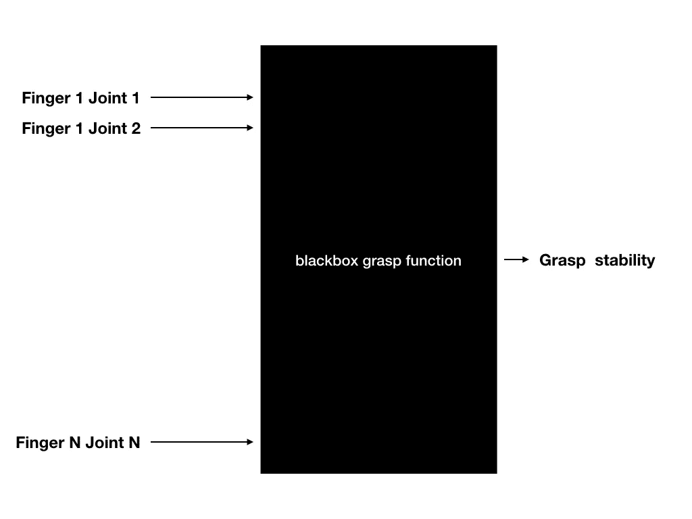
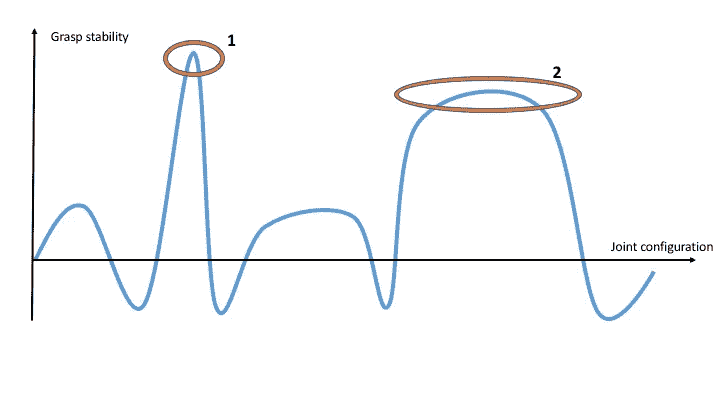
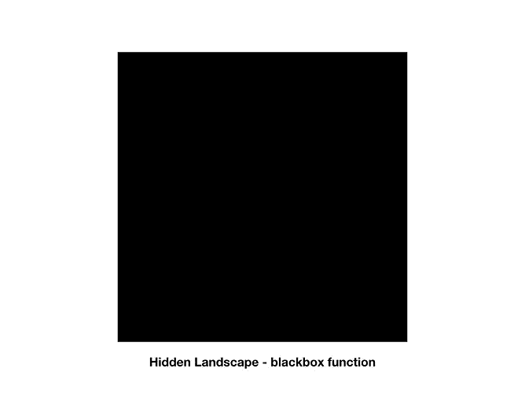
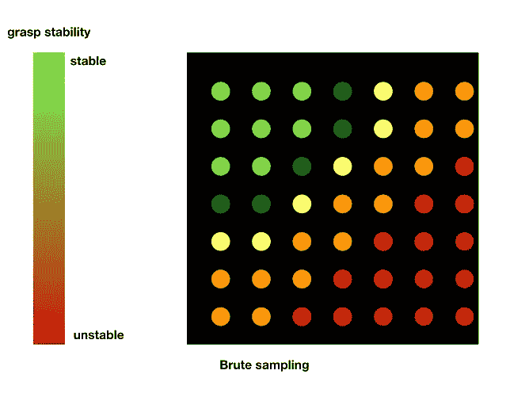
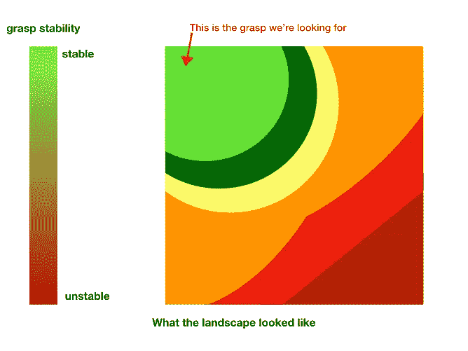
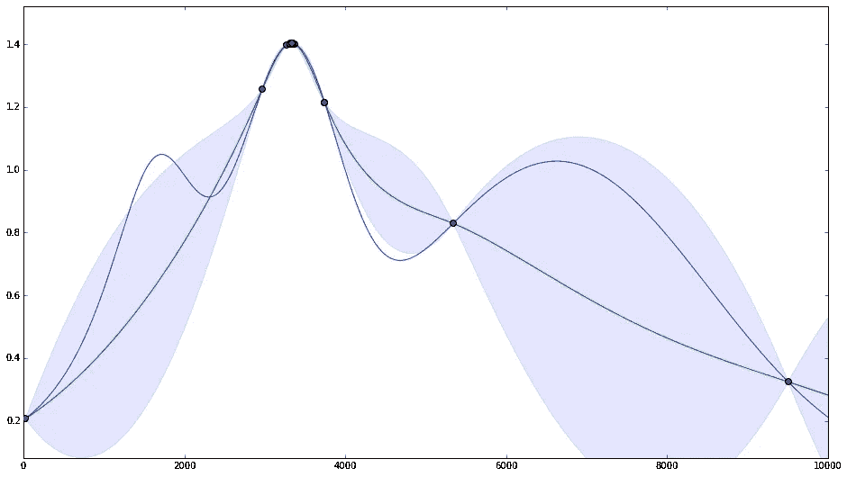
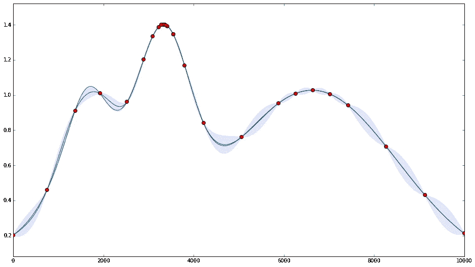

# 有人类在身边很方便

> 原文：<https://towardsdatascience.com/humans-are-handy-to-have-around-4e6b7a7acff7?source=collection_archive---------4----------------------->

作为影子机器人公司的首席技术架构师，我一直在寻找令人兴奋的方法，让非机器人专家更容易抓取和操纵。示范教学是解决这一问题的众多方法之一。

Teaching by demonstration: folding paper. *Research from the* [*CITEC group*](https://www.cit-ec.de/en) *at Bielefeld University.*

这个想法很简单，你向你的机器人展示如何做某事——在我的例子中——如何抓住一个给定的物体。机器人将从演示中学习，完善它所展示的内容，直到它“工作”良好。

就我的目的而言，梦想的目标是展示一个足够好的抓取:手动塑造机器人手围绕物体，然后让机器人自己尝试几次，直到抓取真正稳定。这通常被称为一次性示范学习。

在这个故事中，我将集中在一个非常简单的方法来解决这个问题，使用贝叶斯优化。

# 抓取被认为是一种数学功能

[贝叶斯优化](https://github.com/fmfn/BayesianOptimization)是你工具箱中一个非常有用的工具，可以用来优化黑盒函数。有多种方法可以考虑抓取物体的问题。其中之一是将其视为一个函数优化问题:给定我的输入——例如，我每个关节的关节角度——我如何才能获得最高的输出——即最稳定的抓力。

Considering the grasp problem as a black box optimisation problem

客观地看，将抓取视为一个优化问题就像试图寻找风景中的最高峰一样。在抓取时，我经常寻找一个足够高且相当宽的峰，而不是一个又高又窄的峰。如果我的峰值太窄，那么我将很难准确地处于那个配置中，所有的不确定性加起来甚至是最先进的机器人。

In grasping, I’m often looking for peak #2 instead of peak #1\. It is much easier to reach that peak in an uncertain world.

# 粗暴的方法

在我的抓取案例中，让我们记住我想找到最高的——也是最宽的——山峰，但是我不知道风景是什么样子。正如你在下面看到的，估算这一景观的一个非常简单的方法是在空间的任何地方取样。这意味着用关节目标的每一种可能的组合来抓取物体，并获得相关的抓取鲁棒性。即使它能很好地工作，但它肯定不是最佳方法。

Brute force sampling an unknown landscape. From left to right: my black box landscape / Brute sampling the landscape in a grid to estimate my landscape / The actual landscape with the stable region we are looking for at the top left.

在我当前的问题中，我也可以利用人类所展示的理解能力。以此为起点，我可以缩小搜索范围。如下图所示，我将只在附近寻找。如果我仍然在考虑一个蛮力的方法，这将意味着我需要少得多的样本来猜测我的风景的形状。

Restricting my search space.

# 更加智能地采样

尽管上面描述的搜索区域在我的图上看起来很小，但你必须记住我是在一个高维空间中:我有很多关节。所以探索那个地区会花很多时间。我们需要的是一种更好的方式来采样我的空间。

贝叶斯抽样是一种经过充分研究的方法，它可以最大限度地收集每次取样的信息。主要的想法是收集尽可能多的关于峰值的信息，同时不要花太多时间在抓地力不好的地方取样。

在这个方法中，我还可以调整在**探索**和**开发**上花费了多少努力。更多地关注**开发**——正如你在左图中看到的那样——将在峰值周围收集更多的数据。因此，这留下了更多的不确定性:我可能会错过一些峰值，但我最稳定的抓地力的联合目标将非常精确。如果我转而关注于**探索**——右边的图表——我将在我的空间周围收集更多的数据，减少我在任何地方的不确定性。但是我最稳定的把握的联合目标将会不那么精确。

Exploitation — on the right — vs. exploration — on the left. Red dots are samples taken, blue line is the actual function, green line is the approximation I built, blue surfaces represent the uncertainty. Source: [bayesian-optimization library](https://github.com/fmfn/BayesianOptimization/blob/master/examples/exploitation%20vs%20exploration.ipynb).

# 完善模拟中的把握

在模拟中运行优化非常类似于我用来[收集数据集以预测抓取质量的过程](https://medium.freecodecamp.org/teaching-my-robot-to-think-my-grasp-sucks-5e3d5a908745)。在模拟中，我用贝叶斯过程给我们的联合目标抓住我的对象，然后举起对象，并记录一个客观的抓住质量。这种抓握质量与手掌和物体之间距离的变化成比例。这是一个非常简单的想法:如果我移动手，并且抓握稳定，则物体随之移动！

对于贝叶斯优化的每一次迭代，我都使用新的联合目标进行采样。我的黑盒函数的输出是从摇动物体测量的抓握质量。这给了我一个新的黑盒函数值，减少了给定区域的不确定性！

在这个过程的最后，我们有了比最初更强有力的把握。我在 Shadow 的同事甚至在真实的机器人上测试了抓地力，正如你在下面看到的那样，它非常稳定。

Testing the refined grasp on the real robot — an early prototype of our Smart Grasping System.

如果你想看看用于此的代码，你可以在 github 上找到[。](https://github.com/shadow-robot/smart_grasping_sandbox/blob/master/smart_grasping_sandbox/notebooks/Grasp%20Bayesian%20Optimization.ipynb)

# 最后的话

如果我可以很容易地在模拟中导入对象，这个过程会非常好。在模拟层面上还有很多工作要做，才能有一个更接近真实机器人的模拟。这是一个很大的挑战，尤其是当你处理抓取和操作问题的时候。

这种优化也可以在真实的机器人上运行。为此，我需要能够在真实的机器人上复制我的客观抓握质量，这不是一个简单的任务。一旦[抓地力预测算法](https://medium.freecodecamp.org/teaching-my-robot-to-think-my-grasp-sucks-5e3d5a908745)工作良好，虽然…

利用人类的智慧来帮助机器人做得更好是推动事情向前发展的一个很好的方式。这项工作的大部分是由在 Shadow 实习的[帕万](https://www.linkedin.com/in/dagrol)完成的。谢谢帕万！

*随时连接* [*上推特*](http://twitter.com/ugocupcic) *！*