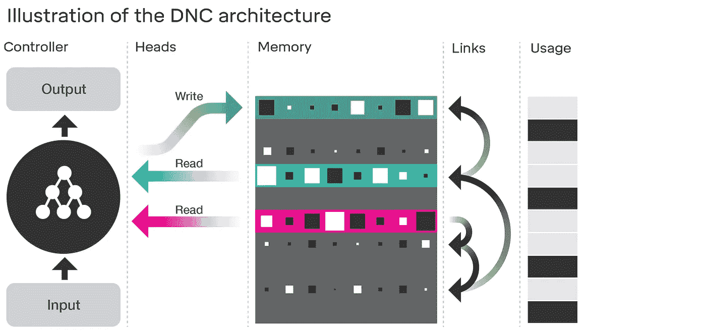
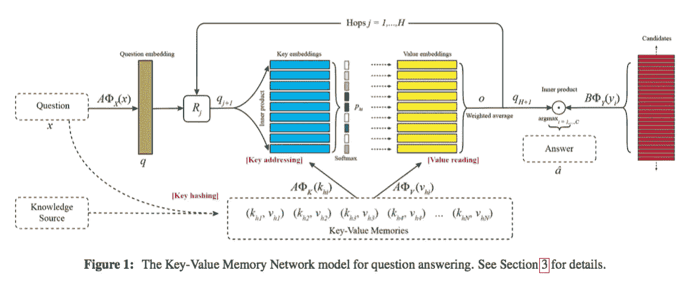

# 可微分神经计算机(DNCs)——自然文章思考

> 原文：<https://towardsdatascience.com/humphrey-sheil-differentiable-neural-computers-dncs-nature-article-thoughts-bd22939c2d97?source=collection_archive---------5----------------------->

2016 年 10 月 17 日

当我们将人工神经网络与冯·诺依曼 CPU 架构相比较时，人工神经网络(ann)中工作记忆的添加是一个明显的升级，并且是去年 NIPS 的 RAM(推理、注意力、记忆)研讨会中出现的一个(挤满了人)。显而易见和建筑然而是两回事..

[谷歌 Deepmind](http://www.nature.com/articles/nature20101.epdf?author_access_token=ImTXBI8aWbYxYQ51Plys8NRgN0jAjWel9jnR3ZoTv0MggmpDmwljGswxVdeocYSurJ3hxupzWuRNeGvvXnoO8o4jTJcnAyhGuZzXJ1GEaD-Z7E6X_a9R-xqJ9TfJWBqz) 最近发表的关于可分化神经计算机(DNCs)的论文代表了在人工神经网络中添加工作记忆的旅程中又迈出了重要的一步，因此值得更深入地研究一下。

# 这是一个变化的时代

为了向新晋的[诺奖得主](https://www.theguardian.com/music/2016/oct/15/bob-dylan-deserves-nobel-laureate-literature-singular-talent)鲍勃·迪伦致敬，我们用他 1964 年的经典书名来引起人们对目前神经网络格局重构的惊人变化的关注。

[Movidius](http://www.movidius.com/) 被英特尔收购——他们的口号“物联网视觉传感”为他们的重点提供了线索——他们的 VPU 或视觉处理单元可以执行 TensorFlow 或 Caffe 神经网络模型。

英特尔自己正在[为新的 x86 指令准备 Linux 内核](https://twitter.com/soumithchintala/status/786569573365538816)，致力于在 CPU 而不是 GPU 上运行神经网络(英特尔在这一领域已经落后英伟达很长时间了)。

就采用和公共性能而言，英伟达仍然是明确的硬件领导者——他们在深度学习上下了很大的赌注，在今年的 GTC 2016 上，它是大会的基石——从 [DGX-1](https://blogs.nvidia.com/blog/2016/07/11/how-nvidia-built-dgx-1/) 到[CUDA 8](https://devblogs.nvidia.com/parallelforall/cuda-8-features-revealed/)/[cud nn 5 . x](https://developer.nvidia.com/cudnn)版本。

最后，我们知道 Google 有他们自己的 TPU(张量处理单元),但不太了解它们，也不知道它们如何达到 GPU 或 CPU。

简而言之，硬件正在变形，以更有效地运行更大的神经网络，并使用更少的功率。现在每个主要的软件公司都与学术机构有联系，并积极致力于将深度学习/神经计算应用到他们的平台和产品中。

这种水平的硬件和软件活动在神经计算领域是前所未有的，而且没有减弱的迹象。那么，民主党全国委员会的文件如何在所有这些活动中发挥作用，如果有的话？

# 可微分神经计算机

那么，什么是 DNC 呢？分解这张纸，我们得到以下要点:

*   本质上，DNC“只是”一个递归神经网络(RNN)。
*   然而，该 RNN 被允许读取/写入/更新存储器(M)中的位置——RNN 存储大小为 W 的数据的向量或张量，其中 M 具有大小为 W 的 N 行，因此 M = N*W
*   DNC 使用*可区分注意力*来决定从哪里读取/写入/更新内存中的现有行。这是一个关键点，因为这现在使得诸如随机梯度下降(SGD)的充分理解的学习算法能够用于训练 DNC。
*   存储体 M 是关联的——实现使用余弦相似性，从而支持部分匹配和精确匹配。
*   还有另一个数据结构(名为 L ),它独立于内存 m。L 用于通过记住内存读取和写入的顺序来提供临时上下文和链接。因此“L”只是一个链表，它允许 DNC 记住它向“M”读取或写入信息的顺序。

最后，我发现在论文中提到认知计算/生物合理性很有趣(在这个领域并不常见——20 世纪 90 年代连接主义与计算主义[辩论](https://en.wikipedia.org/wiki/Connectionism#Connectionism_vs._computationalism_debate)的遗留物——多次提到 DNC 和海马体之间的相似性，或者突触如何编码时间上下文和链接。

下图摘自 Deepmind 的博客文章，清楚地显示了 RNN、读写头、N*W 内存(M)和编码 M，l 中的时间关联的链表

# 韦斯顿等人的记忆网络呢？

脸书的韦斯顿等人也一直在这一领域努力工作。下图来自他们 2016 年 6 月的 [Arxiv 论文](https://arxiv.org/abs/1606.03126)，这篇论文是追溯到 2014 年的一系列内存网络工作的最新成果，或许内存组件受到了早期关于 [WSABIE](http://www.thespermwhale.com/jaseweston/papers/wsabie-ijcai.pdf) 的工作的启发/激励。

Nature 论文更好地阐述了他们解决方案的通用性(涵盖文档分析和理解、对话、图形规划等。)，但这并不一定意味着*的方法*更好。

# 影响和相关性

在我看来，DNCs / RAM 代表了自 LSTM 以来循环架构的最大进步。内存的增加，加上定义明确的机制来区分并训练它，显然提高了 rnn 执行更复杂任务的能力，如规划，正如关于 [bAbl 数据集](https://research.facebook.com/research/babi/)或伦敦地铁任务的论文所证明的那样。

业务应用程序可以充分利用 DNC 和类似的架构。规划或更好地理解大型文档的能力对于决策支持系统、数据分析、项目管理和信息检索具有重大意义。不难想象，比如 ElasticSearch 和 Solr 的 DNC 插件，或者微软 Project Server 的 DNC 版。

将软件支持与对张量中心运算的新兴本机 CPU 指令集支持相结合，再加上正在进行的 GPU 改进和 TPUs，神经计算的未来将越来越光明。

# 未来工作？

[wino grad 的 SHRDLU](https://en.wikipedia.org/wiki/SHRDLU) 被广泛认为是人工智能的一个高点，于 1972 年达到，自那以来没有实质性的改进或复制([梁，2015 幻灯片 100–105](http://icml.cc/2015/tutorials/icml2015-nlu-tutorial.pdf))。《自然》杂志文章第三页引用的迷你 SHRDLU 方块拼图实验是否指向 Deepmind 的下一个实质性研究领域——提高 1972 年以来 SHRDLU 的性能？

*最初发表于*[*humphreysheil.com*](http://humphreysheil.com/blog/differentiable-neural-computers-dncs-nature-article-thoughts)*。*