# 飓风佛罗伦萨——建立一个简单的风暴路径预测模型

> 原文：<https://towardsdatascience.com/hurricane-florence-building-a-simple-storm-track-prediction-model-1e1c404eb045?source=collection_archive---------10----------------------->

**Hurricane Florence (2018) — As seen from International Space Station (Credit: NASA)**

**飓风佛罗伦萨**是 [2018 大西洋飓风季](https://en.m.wikipedia.org/wiki/2018_Atlantic_hurricane_season)的第一个主要飓风。8 月 30 日，从佛得角[附近的源头开始，佛罗伦萨行进了近 4100 英里，于美国东部时间 9 月 14 日上午 7 点 15 分左右在北卡罗来纳州莱特斯维尔海滩附近登陆。这种缓慢移动的风暴最初被预测为 4 级飓风，阵风 140 英里/小时，然后以 1 级风暴的形式登陆。尽管减弱为 1 级风暴，佛罗伦萨仍然有足够的风速造成重大的生命损失，家庭和社区的破坏，财产损失，以及北卡罗来纳州沿海的其他经济损失。根据穆迪分析，佛罗伦萨的初步损失估计在 170-220 亿美元之间。由于佛罗伦萨历史上的降雨和洪水的影响仍在继续，预计佛罗伦萨的成本将大幅上调是合理的。](https://en.wikipedia.org/wiki/Cape_Verde)

自 8 月 30 日成立以来，[国家飓风中心](https://www.nhc.noaa.gov/data/#tcr) (NHC)一直在跟踪佛罗伦萨的路径，并发布关于飓风当前和预计路径的报告和建议。准确预测飓风的路径使我们能够制定减灾战略，最大限度地减少飓风的经济影响，拯救生命。NHC 保留了一份不同复杂程度和结构的预测模型列表，可以用来预测飓风的路径。

在这项研究中，我们将使用大西洋飓风数据库( [HURDAT2](https://www.nhc.noaa.gov/data/#hurdat) )建立一个简单的风暴路径预测模型。然后，我们将使用开发的模型对飓风佛罗伦萨路径进行集合预测，并将模型结果与佛罗伦萨经过的实际路径进行比较。在我们深入研究模型之前，让我们首先加载数据并进行一些探索性的数据分析。

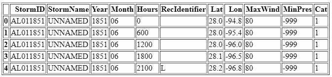

**Snapshot of Processed HURDAT Dataset**

# 探索性数据分析

**低频率-高强度风暴:**Hurd at 数据集有 1792 个命名风暴。按类别绘制风暴计数显示频率分布遵循指数/负二项式分布。虽然有 1485 个 1 级风暴，但只有四个风暴的风速达到 5 级(>155 英里/小时)。

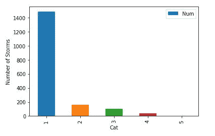

**Count of Storms by Category**

季节性:北大西洋季节通常发生在 6 月 1 日至 11 月 30 日之间。绘制飓风的季节分布图显示，9 月是最活跃的月份，在某些情况下，飓风季节早在 1 月就开始了。

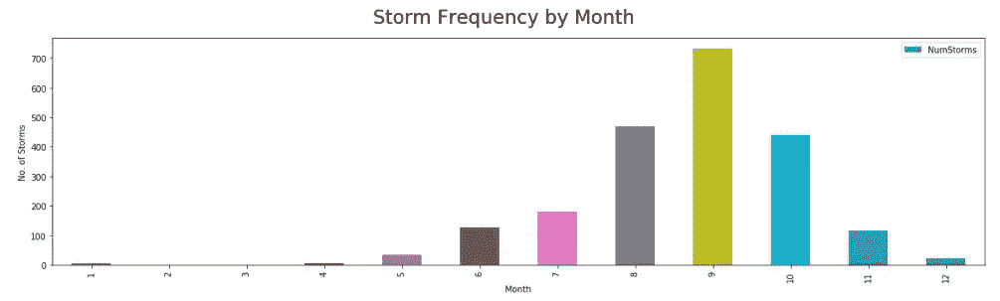

**Count of Storms by Month**

**周期性:**平均每个季节有近 10 次风暴发生，2005 年是最活跃的季节，有 28 次风暴。数据显示，在过去的几十年里，飓风的频率和强度都有明显的增加。气候变化是我们在 2017 年目睹的飓风严重性增加和聚集效应的原因吗？绘制 10 年和 25 年的移动平均线显示了几十年的振荡。

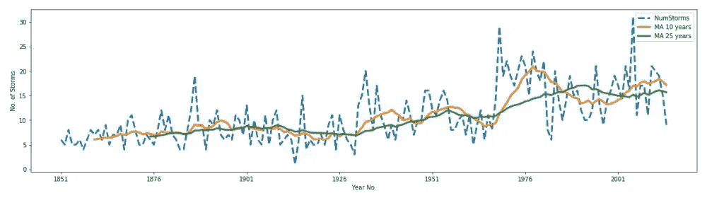

**Count & Moving Averages on Storm Frequency by Year**

**风暴成因:**影响热带风暴发展的主要因素有:(1)温暖的海表温度，(2)大气不稳定，(3)高湿度，(4) [科里奥利力](https://en.wikipedia.org/wiki/Coriolis_force)，(5)低垂直风切变，(6)预存扰动。从 HURDAT 数据集推断，大多数风暴起源于大西洋温暖的水域和 10 度以上的纬度。赤道纬度 10 度以内的地区不会受到科里奥利力的影响，科里奥利力是热带气旋形成的一个重要因素。

**历史风暴轨迹:**在 HURDAT 数据集中绘制历史风暴轨迹显示了飓风在热带地区生成后向西传播。北大西洋飓风的顺时针旋转和全球信风使飓风沿着副热带高压脊向西北方向移动。

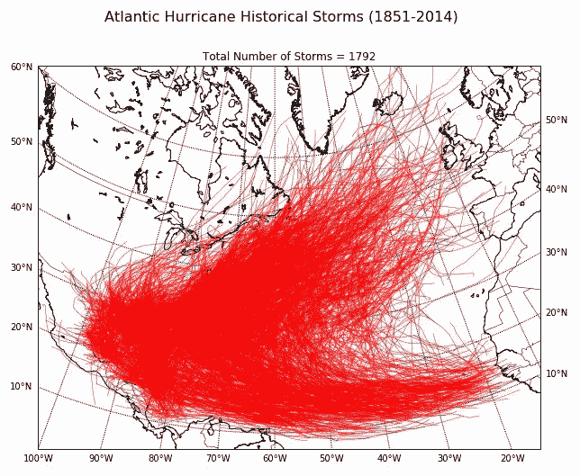

**登陆风暴:**在大西洋盆地形成的风暴中，只有三分之一真正登陆。有时，飓风可以多次登陆，这取决于它们可能遵循的不可预测的轨迹(环形和发夹弯)。例如，卡特里娜飓风(AL122005)在佛罗里达州的哈兰代尔海滩首次登陆时为 1 级风暴，在密西西比州的格尔夫波特第二次登陆时为 3 级飓风。

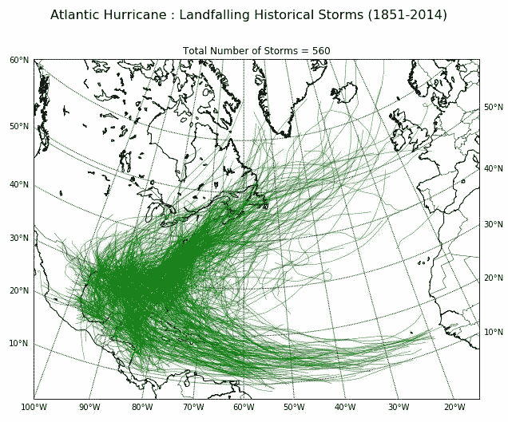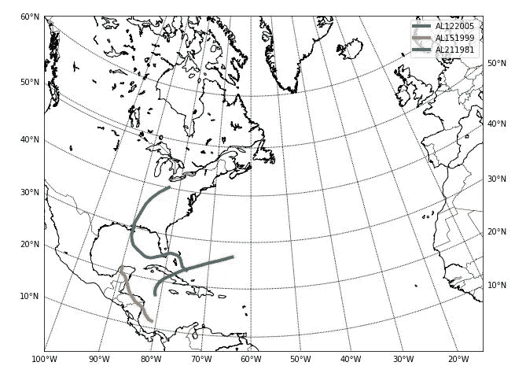

**Path of Storms Named “Katrina” in the HURDAT dataset**

**风速与气压:**风速和气压是 HURDAT 数据库中提供的两个附加属性。等值线图显示风速和气压呈反向相关。

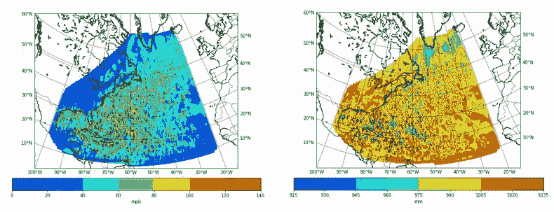

Wind Speed (left) and Pressure (right) Contour Maps

# 马尔可夫转移模型

构建马尔可夫转移模型有五个步骤:

1.  创建覆盖建模领域的网格网络
2.  将历史风暴轨迹覆盖在网格上，并计算转移概率矩阵
3.  给定起源点，使用步骤 2 中开发的转移概率矩阵，预测风暴的下一个位置
4.  使用步骤 3 中的预测位置来预测下一时间步的位置
5.  重复步骤 4，重复预定的次数

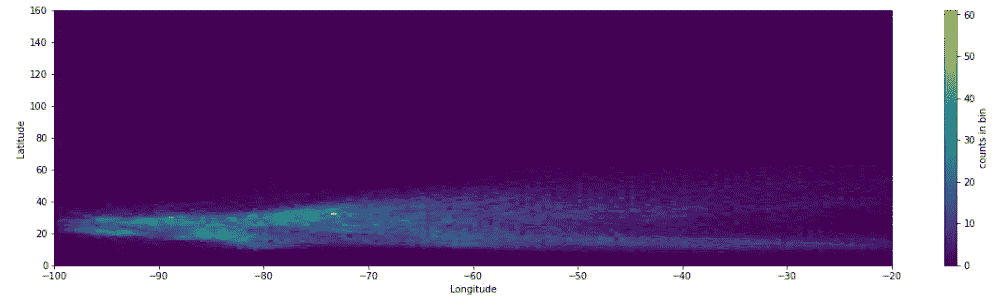

**2-D Histogram of Historical Location of Storms Overlaid on Computation Grid**

# **验证模型**

在使用该模型生成佛罗伦萨飓风的风暴轨迹之前，让我们验证一下安德鲁飓风(1992 年)的模型。下图显示了 Andrew 的实际路径(黑线)，以及马尔可夫转移模型生成的路径集合(大小=10)。模拟轨迹形成的包络线与飓风安德鲁经过的实际路径吻合得很好。

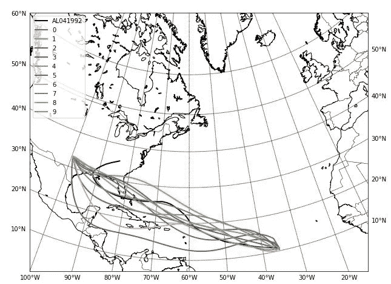

**Historical & Simulated Storm Tracks for Andrew (1992)**

# 预测飓风佛罗伦萨的路径

大多数起源于佛得角的风暴向北弯曲，错过了美国。飓风佛罗伦萨(路径如下所示)采取了不同寻常的轨迹，没有向北弯曲，而是缓慢向西移动，在北卡罗来纳州登陆。

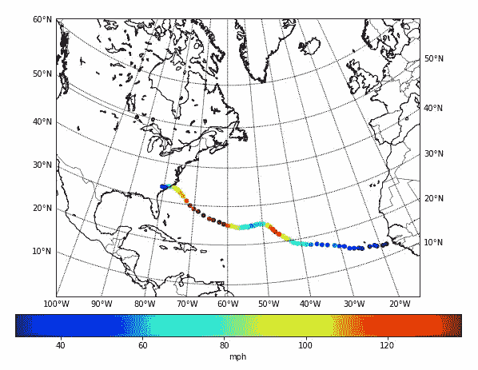

**Actual Path and Wind Speed of Hurricane Florence (2018)**

这项研究中开发的马尔可夫转移模型被用来预测佛罗伦萨从其起源点可能采取的合理路径。运行了十个模拟的集合，结果轨迹显示在下图中。第八次模拟的结果相当好地模拟了佛罗伦萨的路径和登陆位置。总之，马尔可夫转移模型是一种简单(有趣)的方法，可以用最少的数据(仅仅是起源点)来预测飓风的路径。

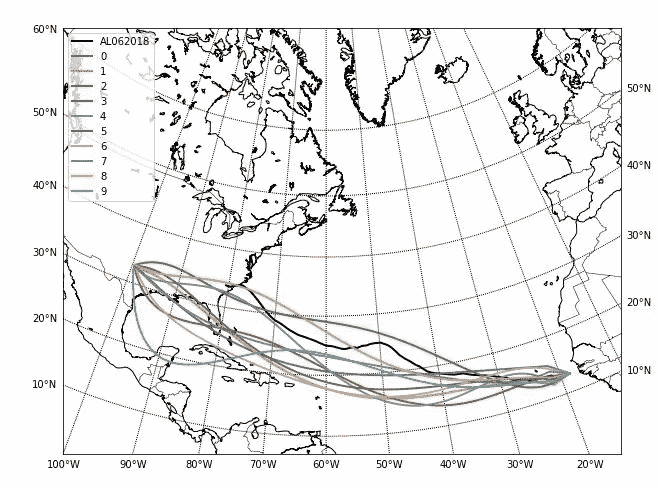

**Historical & Simulated Storm Tracks for Florence (2018)**

# **简单越好？—奥卡姆剃刀**

这当然是一个非常简单的路径预测模型。但是简单总是更好吗？为了回答这个问题，为了提醒 2018 年大西洋飓风季节，我将使用这个简单的模型来预测任何新飓风的路径，并将结果与复杂的全球环流模型公布的轨迹进行比较。

要了解我们如何使用深度学习进行风暴路径预测，请参见我最新的博客:

 [## 使用深度学习的飓风路径预测

### 每年 6 月 1 日到 11 月 30 日之间的时间窗标志着北大西洋飓风季节。在此期间…

medium.com](https://medium.com/@kap923/hurricane-path-prediction-using-deep-learning-2f9fbb390f18)