# 哈维飓风保险技术案例研究；视觉智能正在改变索赔响应时间。

> 原文：<https://towardsdatascience.com/hurricane-harvey-insurtech-case-study-visual-intelligence-is-transforming-claim-response-times-3275042fbd8d?source=collection_archive---------6----------------------->

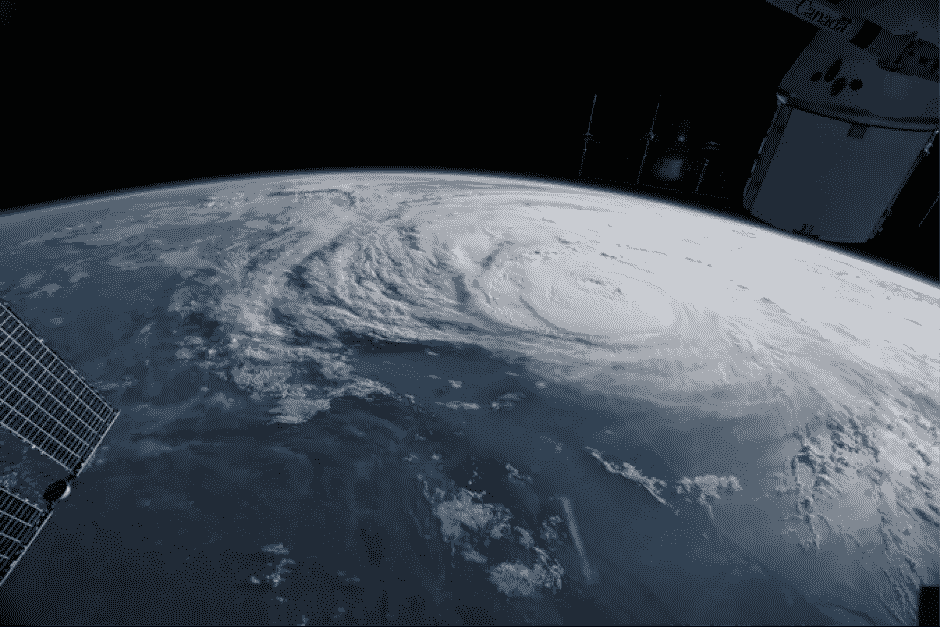

Hurricane Harvey as seen from the International Space Station

过去几周，前所未有的风暴袭击了美国和加勒比海地区，造成的损失估计高达数百亿美元。

根据美国国家海洋和大气协会(NOAA)的数据，自 1980 年以来，仅美国就经历了 212 次自然灾害，总损失达 1.2 万亿美元。

作为一名对金融科技感兴趣的风险投资者，我看到相当多的创新型保险科技初创企业希望成为保险业的下一个大事件。这些企业几乎没有一家专注于改善索赔管理。这是为什么呢？

或许索赔被认为是保险业最不“性感”的一面，如果你愿意的话，这是一种必要的邪恶。优秀的保险公司知道索赔经历是保险最重要的部分之一。毕竟，保险是在发生事故时赔偿损失的承诺。

自然灾害是残酷的。它们使人们变得脆弱和暴露，保险公司的快速解决方案对客户体验至关重要，有助于留住客户，还能节省保险公司的时间和资金。

说起来容易，但在哈维和伊尔玛飓风这样的大规模事件发生后，对索赔做出动态响应可不是一件容易的事。在相当长的一段时间内，人们通常不可能进入这些地区，此时风暴潮已经平息，索赔可能更难评估。

一家为保险公司积极应对这一挑战的公司是 [Geospatial Insight](https://www.geospatial-insight.com/) 。venture one[最近宣布对他们](http://venturesone.com/venturesone-fuels-geospatial-insight/)进行增长型股权投资，我和他们在英国的团队在一起。他们刚刚提供了关于飓风哈维的令人难以置信的详细视觉情报，使保险公司和他们的企业客户能够了解基层的情况，并对索赔迅速做出反应。

自然灾害发生后，保险公司可以通过采用视觉智能服务来应对三大挑战:

1)事件可能导致的大致总索赔额。

2)受事件影响的区域的准确地图，以防止欺诈性索赔。

3)索赔的近因与事件直接相关。

围绕机器学习、大数据和无人机等先进技术的可能性有很多炒作，但我很少看到它们如何结合起来带来好处的切实例子，所以这里有一个现实生活中的例子。

# **哈维飓风案例研究**

8 月 25 日，4 级飓风哈维在德克萨斯州洛克波特附近登陆。

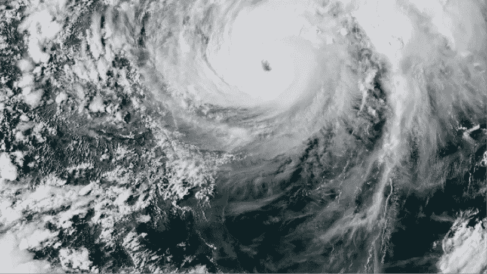

哈维造成了灾难性的洪水，在一些地区降雨量超过 50 英寸(美国热带气旋的记录)。哈维在 72 小时内覆盖了 20，000 多平方英里，转移了 30，000 人。

**情境分析**

第一步是对受灾地区进行初步评估，并对预期的保险客户需求进行快速审查。大休斯敦人口密集的住宅和商业区被设定。

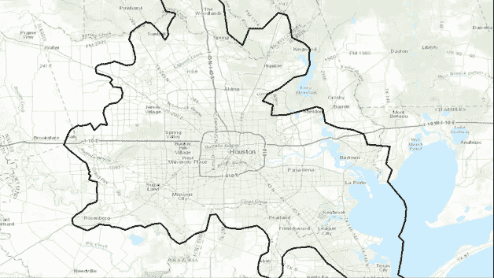

**大数据采集、处理&分析**

尽管哈维在周五登陆，但在接下来的几天里，暴雨天气仍在持续。据估计，截至周三 30 日，令人难以置信的 24.5 万亿加仑的雨水从墨西哥湾倾泻到休斯顿和德克萨斯州南部。

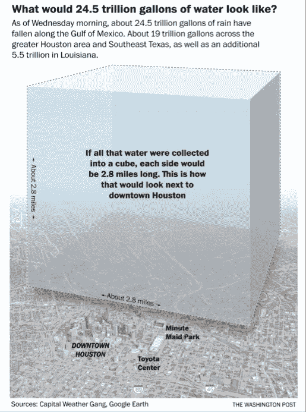

为了获得尽可能全面的了解，对各种数据集进行了整理，包括地形数据、卫星图像、来自社交媒体的无人机镜头以及独立委托的轻型飞机和专业高分辨率相机图像。

该团队使用从空中和社交网络收集的数据来校准用于生成哨兵足迹的阈值。然后，Geospatial Insight 使用专有算法将检测到的积水区域聚类为洪水淹没区域

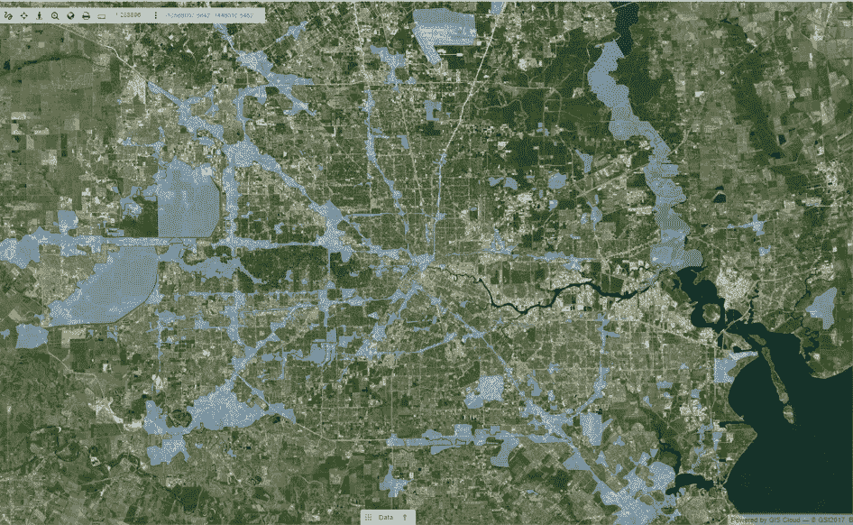

为了了解哈维对住宅和商业建筑的可能影响，我们将多个数据集结合起来，以深入了解洪水的范围。下面的彩色编码图像显示了不同的数据源。

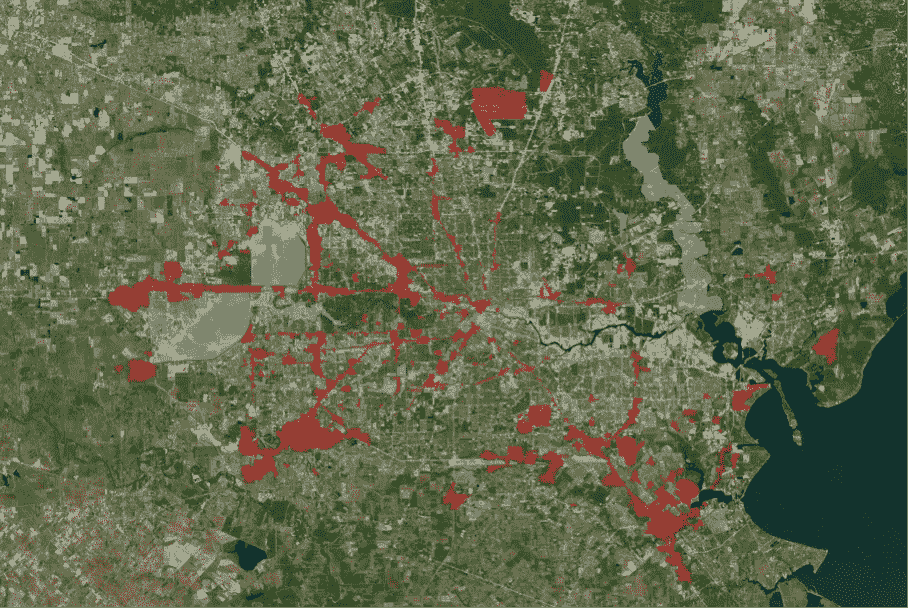

蓝色来自美国国家海洋和大气协会(NOAA)的图像和使用 Midas 倾斜相机系统进行的航空勘测。

红色的是哨兵 1 号雷达卫星，它可以穿透云层识别积水区域。

黄色的小口袋来自 Geospatial Insight 的社交媒体抓取工具，用于查找事件的照片和视频，然后可以对这些照片和视频进行映射，以根据视频证据构建范围。通常，该团队使用他们的全球许可无人机运营商网络，按照商定的 SLA 使用无人机绘制洪水地区的地图，然而，由于紧急服务使用该空域进行救援等，无人机在此期间被禁止在休斯顿上空飞行。

像下面的例子这样的镜头被识别出来，然后飞行路线和洪水范围被专业地绘制出来。

**为什么洪水如此严重？**

你可以清楚地看到休斯顿西部的两个大型蓝色水库，10 号州际公路北部的 Addicks 和南部的 Barker。它们旨在保护休斯顿免受洪水的侵袭，两个大坝都通向布法罗湾。水库周围都是公园和住宅区，到周一晚上，水位已经达到创纪录的水平，在阿迪克斯(北部)测得 105 英尺，在巴克(南部)测得 99 英尺。

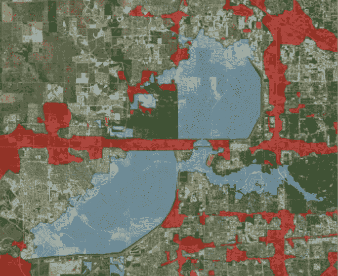

当地官员希望通过在周二和周三缓慢释放阿迪克大坝和巴克大坝的水来防止溢出。然而，风暴潮是如此之大，工程师们不得不提前通过大坝闸门放水，否则可能会溢出并对房屋造成进一步破坏。周一早上早些时候，已经向家庭发出了疏散警告，然而，周日晚上决定释放压力，许多居民被困在由此产生的海浪中。

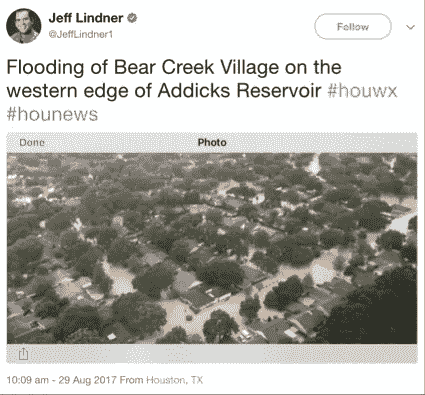

**利用视觉智能加速索赔**

为了提供快速处理保险索赔所需的情报，地理空间洞察团队需要首先理解大量的非结构化数据。

不仅是各种图像源，还有保险客户的客户信息和企业责任数据，如员工的家庭住址，以映射受影响的客户和员工。

这些数据被快速映射，多个图像源被应用为图层，以允许企业客户通过地理空间洞察专用客户门户访问和理解信息。

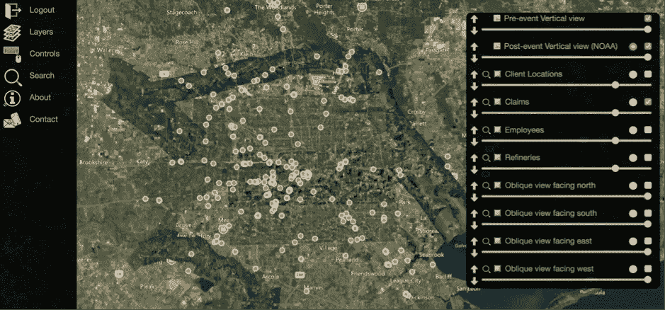

上图显示了用黄色标识的索赔位置点的客户端门户。

高分辨率卫星图像可能是一个很好的指标，但它们是自上而下的视图，因此很难准确了解财产的损坏程度。需要倾斜角度的图像来帮助在广阔的区域内对此进行量化，因此 Geospatial Insight 委托了一架配备 Midas 5 相机的轻型飞机来绘制受灾最严重地区的高分辨率图像。

下图展示了这款相机如何能够同时捕捉四个方向的倾斜角度(以及俯视图)。

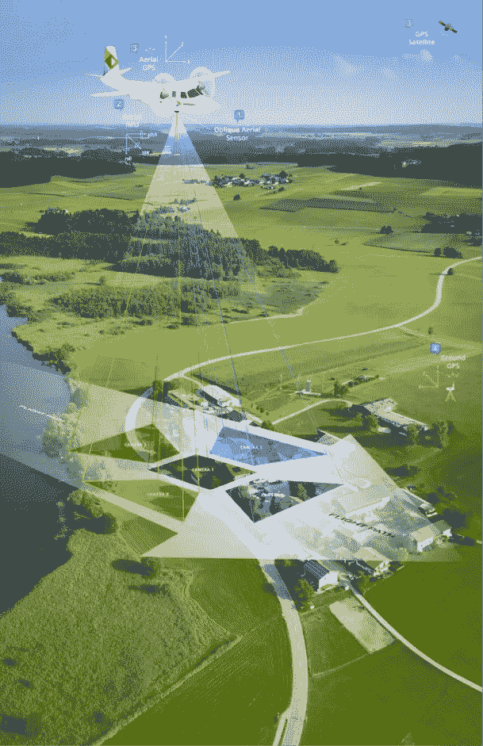

利用这种技术，可以对大面积地区进行高分辨率成像，然后绘制成地图，提供东、西、南、东、西四个方向的倾斜图像，以便准确分析已确定的索赔地点。

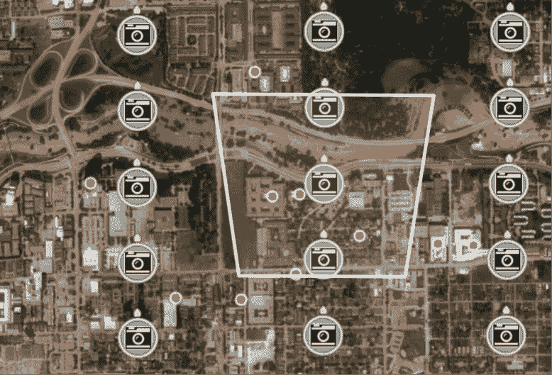

凭借这种分辨率和大量数据，地理空间洞察团队可以识别洪水的证据，如房屋外的残留水、沉积物和废物，即使洪水已经排干。下图是一个展示家居用品被处理的例子。你可以清楚地看到，与那些被风暴潮毁坏的游泳池相比，凸起的游泳池仍然保持干净和蓝色。

**灾后重建**

可悲的是，休斯顿的许多居民似乎没有保险，面临着在没有任何形式的保险赔付的情况下重建他们的生活。对于那些有保障的人来说，快速获得资金将会有所不同。

通过采用上述部署的技术，保险公司可以在帮助居民、企业和社区尽快恢复元气方面发挥重要作用。

— — — — — — — —

关于公司的更多信息，你可以访问[www.geospatial-insight.com](http://www.geospatial-insight.com/)或者给我发消息，我很乐意为你介绍这个团队。