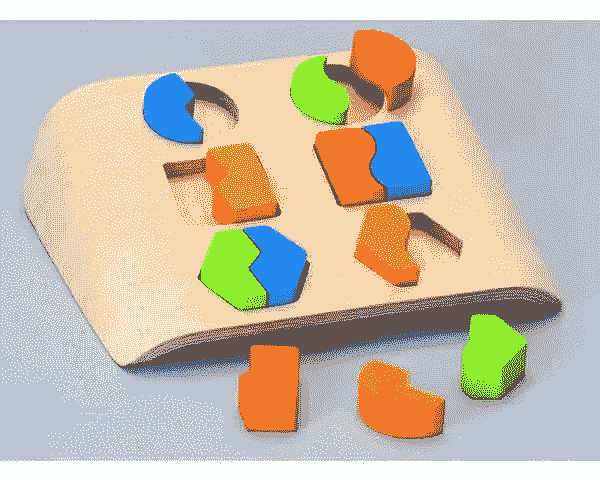
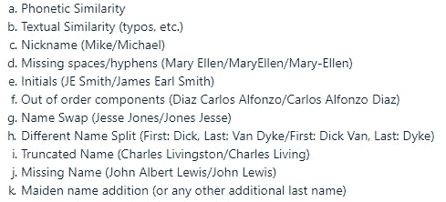
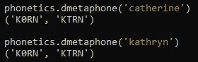
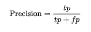
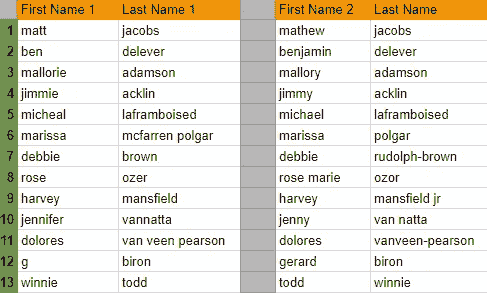

# 混合模糊名称匹配

> 原文：<https://towardsdatascience.com/hybrid-fuzzy-name-matching-52a4ec8b749c?source=collection_archive---------8----------------------->



# 介绍

我的工作场所使用大规模数据库，其中包含关于人的数据。对于数据库中的每个人，我们都有一个唯一的标识符，它由人的名字、姓氏和邮政编码组成。我们在数据库中保存了大约 500 万人，如果人名有一点变化，基本上可能会有重复。例如，罗布·罗森和罗伯特·罗森(邮政编码相同)将被视为两个不同的人。我想指出的是，如果我们为同一个人获得额外的时间，我们只需更新记录的时间戳，因此没有必要进行这种重复数据删除。此外，我还要感谢我的同事 Jonathan Harel，他在这个项目的研究中帮助了我。

# 问题是

我用不同的方法清理数据库。我将描述最有趣的一个，它在这种情况下对数据库进行了很好的重复数据消除。这里我们只尝试匹配两个拥有相同邮政编码的标识符。对于数据库的很大一部分，我们保存性别数据和年龄数据，但是这些信息经常丢失。所以我基本上只剩下真实的名字了。那么我怎么确定两个名字是同一个人的呢？

# **救援用的机器学习**

这说起来容易做起来难。这里可以用来输入到机器学习模型中的特征到底是什么？

有些功能相对直观，有些则需要彻底研究。起初，我显然是在考虑某种字符串相似性(针对拼写错误等)。)，也可能是我有名字和名字的昵称的情况(如 Ben/Benjamin)。我进行了数据探索，看看我是否能加强我的想法或找到名字相似性的其他想法。这是一个好的开始，但我需要更多。经过大量的研究，我找到了下面这些名字相似的例子:



Name Similarities

## 特征抽出

假设我有两个邮政编码相同的人，我想给他们的“接近”程度打分。如前所述，在某些情况下，我有年龄和/或性别的数据，但通常情况并非如此。当然，这也作为特征输入到模型中。所以对于这些想法中的每一个，我需要提取它们相应的特征(因此我选择了这个名字:“*混合*”):

*   对于昵称**,我收集了多个名字和昵称的大型列表，然后用这些数据创建了一个 Python 字典。给定两个名字，first_name1 和 first_name2，以及昵称字典，我构建了以下函数，该函数创建一个二元特征，如果一个人的名字是另一个人名字的昵称，则该特征标记为 1:**

```
def is_nickname(first_name1, first_name2, nickname_dict):
    first_name1_dict_vals = nickname_dict.get(first_name1)
    first_name2_dict_vals = nickname_dict.get(first_name2)
    if first_name1_dict_vals:
        if first_name2 in first_name1_dict_vals:
            return 1
    if first_name2_dict_vals:
        if first_name1 in first_name2_dict_vals:
            return 1
    return 0
```

*   **想法 **e.** 到 **k.** 也是基于脚本所做的测试的特性，以检查在某个比较中情况是否为真(或者“相对真实”，我们将在下面的代码中看到)。例如，以下代码检查两个全名的组成部分之间的相似性:**

```
# Out of order components ('Diaz | Carlos Alfonzo', 'Carlos Alfonzo # | Diaz') / first_name_last_name_swap  ('jesse | jones', 'jones |  # jesse')full_name1_splits = re.split("\W+|_", full_name1)
full_name2_splits = re.split("\W+|_", full_name2)out_of_order_components_score = 
len(Counter(full_name2_splits) & Counter(full_name1_splits)) /           float(max(len(full_name1_splits), len(full_name2_splits)))
```

*   **为了文本的相似性，我使用了 [Jaro-Winkler 距离](https://en.wikipedia.org/wiki/Jaro%E2%80%93Winkler_distance)、 [Hamming 距离](https://en.wikipedia.org/wiki/Hamming_distance)、 [Damerau-Levenshtein 距离](https://en.wikipedia.org/wiki/Damerau%E2%80%93Levenshtein_distance)以及常规的 [Levenshtein 距离](https://en.wikipedia.org/wiki/Levenshtein_distance)。这是在测试了可用于这种情况的大量不同算法之后完成的，其中上述算法执行得最好。下面是我用于这些特性的(部分)代码片段:**

```
from pyjarowinkler.distance import get_jaro_distance
import editdistancejaro_score = get_jaro_distance(name1, name2)
levenshtein_distance_score = editdistance.eval(name1, name2)
```

*   **为了语音相似性，我最终确定了 [NYSIIS](https://en.wikipedia.org/wiki/New_York_State_Identification_and_Intelligence_System) 和[双变音](https://en.wikipedia.org/wiki/Metaphone)算法。这些算法背后的想法是，它们为英语单词创建一种编码。然后，我使用两种不同编码之间的字符串距离(这里特别是 Levenshtein 距离)。例如，双变音输出主要编码和第二编码。姓名 Catherine 和 Kathryn 的编码是这样的:**

****

**Double Metaphone Algorithm Example**

*   **为了使用 NYSIIS 算法提取语音相似性特征，我使用了以下代码(在该算法中，每个给定的名字只有一种编码):**

```
import editdistance
import fuzzynysiis_score = editdistance.eval(fuzzy.nysiis(name1), fuzzy.nysiis(name2))
```

## **有人有标签吗？**

**您现在可能已经在想:“这是一个分类问题吗？如果有，他从哪里有标注的数据？”**

**嗯，我不…实际上我自己给数据加了标签。我提取了匹配的案例(例如 Jennifer Williams/Jenny Williams；标记为 1)，是“接近”匹配的情况(例如，唐·安德森/丹尼尔·安德森；标记为 0)，并从数据中添加一个大的随机样本进行标记。“接近”匹配允许我建立一个健壮的模型，该模型可以很好地区分真实匹配和接近但实际上不匹配的匹配。这不是一件愉快的事，但它让这个项目变得可行:)**

## **建立模型**

**我现在准备训练一个模型。当然，我已经将数据分割为一个训练(分割它也是为了超参数优化)和测试集。我最关心的是精确度。让我们回忆一下精度是什么:**

****

**Wikipedia**

**这样做的原因是，在两个实际上不是同一个人的人之间匹配比错过两个实际上是同一个人的人之间的匹配要糟糕得多。除内部使用外，我们拥有的数据用于向数据合作伙伴导出。因此，出于商业原因，我们倾向于尽可能减少误报。**

**我决定选择不需要对其功能进行任何缩放的模型，所以我主要尝试了 Random Forest、GBM 和 XGBoost。我还使用 sklearn 的 GridSearchCV 进行了超参数优化:**

```
*import* numpy *as* np
*from* sklearn.ensemble *import* RandomForestClassifier
*from* sklearn.model_selection *import* GridSearchCV# Number of trees
n_estimators = [int(x) *for* x *in* np.linspace(start=5, stop=30, num=5)]
# Number of features to consider at every split
max_features = ['auto', 'sqrt']
# Maximum number of levels in tree
max_depth = [int(x) *for* x *in* np.linspace(3, 20, num=3)]
max_depth.append(None)
# Minimum number of samples required to split a node
min_samples_split = [2, 5, 10]
# Minimum number of samples required at each leaf node
min_samples_leaf = [1, 2, 4]
# Method of selecting samples for training each tree
bootstrap = [True, False]# Create the random grid
random_grid = {'n_estimators': n_estimators,
               'max_features': max_features,
               'max_depth': max_depth,
               'min_samples_split': min_samples_split,
               'min_samples_leaf': min_samples_leaf,
               'bootstrap': bootstrap}

grid_search = GridSearchCV(RandomForestClassifier(random_state=0), param_grid=random_grid, scoring='precision', n_jobs=-1, verbose=5)
grid_search.fit(train_features, y_train)
```

**注意，您可以改变 GridSearchCV 来根据精度分数进行优化，从而改变“score”参数。**

## **初步结果**

**在第一次运行优化的模型后，我在测试集上获得了 0.85 的精度分数。这很好，但我仍然希望在这里接近完美。由于我的模型可以输出一个概率，我试图找到提高精度的最佳阈值。由于召回大幅减少，这里有一个权衡。我可以把门槛降低很多，但最终的匹配数接近于零。**

**我决定分析我的模型出了什么问题，检查是否有什么东西联系了大多数或者所有的假阳性。我发现，在很多情况下，年龄的影响太大了(注意:数据是在过去几年中收集的，因此预计年龄不会完全相同)，例如:**

****

**False-Positive Example**

**那我在这里能做什么？我告诉模特他犯了一个大忌。我该怎么做？就像在现实世界中一样，我会一次又一次地告诉模型那是错的。我拿了大量的案例，其中年龄相似，并且其中一个名字是相同的(就像上面看到的)。这个思路可以认为类似于[主动学习](https://en.wikipedia.org/wiki/Active_learning_(machine_learning))的概念。**

## **决赛成绩**

**这对模型产生了巨大的影响。我设法在测试集上提高到 0.99 的精度，同时保持 0.8 的召回率。**

**在整个数据库上运行时，该模型发现了大约 50 毫米的匹配项，对数据库进行了 10%的重复数据删除！我当然没有检查所有这些匹配，但我随机选择了几千个，发现这里的精度也是大约 0.99。以下是一些很酷的配对例子:**

****

**Matches Achieved**