# 超参数在起作用！第一部分—激活功能

> 原文：<https://towardsdatascience.com/hyper-parameters-in-action-a524bf5bf1c?source=collection_archive---------0----------------------->

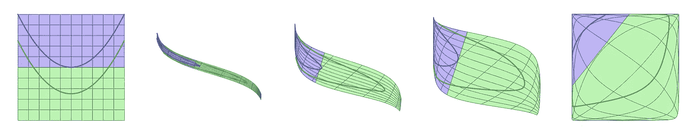

Sigmoid activation function in action!

# 介绍

这是一系列帖子的第一篇，旨在以清晰简洁的方式直观地展示训练神经网络的一些基本活动部分:超参数。

# 动机

深度学习是关于**超参数**！也许这是一种夸张，但对不同超参数对训练深度神经网络的影响有一个良好的理解肯定会让你的生活更容易。

在研究深度学习时，你可能会发现大量关于正确设置网络超参数重要性的信息: ***激活函数、权重初始化器、优化器、学习速率、小批量*** ，以及网络架构本身，如 ***隐藏层数*** 和 ***每层中单元数*** 。

所以，你学习所有的最佳实践，你建立你的网络，定义超参数(或者只是使用它的默认值)，开始训练并监控你的模型的 ***损失*** 和 ***指标*** 的进度。

也许实验没有你预期的那么顺利，所以你**对它进行迭代**，**调整**网络，直到你找到对你的特定问题有用的一组值。

# 寻找更深层次的理解(无意双关！)

你有没有想过引擎盖下到底发生了什么？我做了，事实证明一些简单的实验可能会对这个问题有所帮助。

以 ***激活功能*** 为例，本帖题目。你我都知道，激活函数的作用是引入一个**非线性**，否则整个神经网络可以简单地被一个相应的 [**仿射变换**](https://medium.com/hipster-color-science/computing-2d-affine-transformations-using-only-matrix-multiplication-2ccb31b52181) (即一个**线性变换**，比如**旋转**、**缩放**或**倾斜，**后跟一个**平移**

一个只有 ***线性*** ***激活*** (即**不激活**！)将很难处理像这样非常简单的分类问题(每条线有 1，000 个点，为在-1.0 和 1.0 之间等距分布的 *x* 值生成):

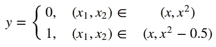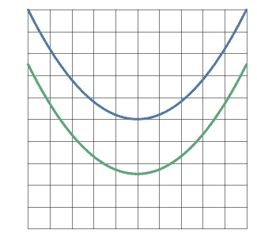

**Figure 1**: in this two-dimensional feature space, the blue line represents the negative cases (y = 0), while the green line represents the positive cases (y= 1).

如果网络唯一能做的事情是执行仿射变换，这可能是它能够提出的解决方案:

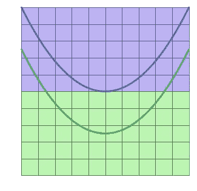

**Figure 2**: linear boundary — doesn’t look so good, right?

显然，这还远远不够！更好的解决方案的一些例子有:

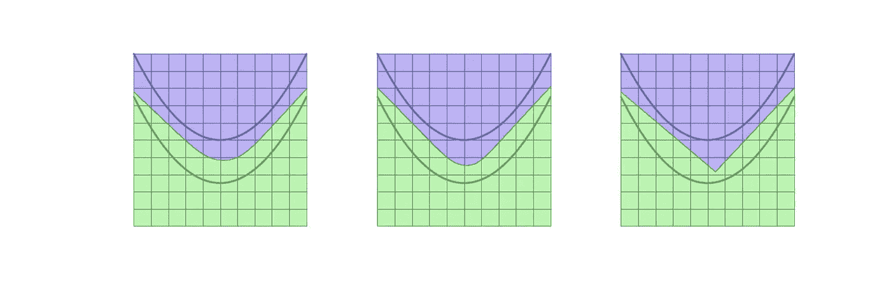

**Figure 3**: Non-linearities to the rescue!

这是 ***非线性激活函数*** 带来的三个很好的例子！你能猜出哪个图像对应于一个 ***ReLU*** 吗？

# 非线性边界(或者它们是？)

这些非线性边界是如何形成的？嗯，非线性的实际作用是**扭曲和旋转特征空间**，以至于边界变成… **线性**！

好了，现在事情变得越来越有趣了(至少，我第一次看到这个**很棒的**克里斯·奥拉的博客[帖子](http://colah.github.io/posts/2014-03-NN-Manifolds-Topology/)时是这样认为的，我从这个博客中获得了写这篇文章的灵感)。所以，我们再深入调查一下吧！

下一步是建立最简单的神经网络来解决这个特殊的分类问题。在我们的**特征空间**(***x1****和***x2****)*中有**两个维度**，网络有一个单独的隐层，有*两个单元，所以当涉及到隐层的输出时我们保留维度的数目( ***z1*****

**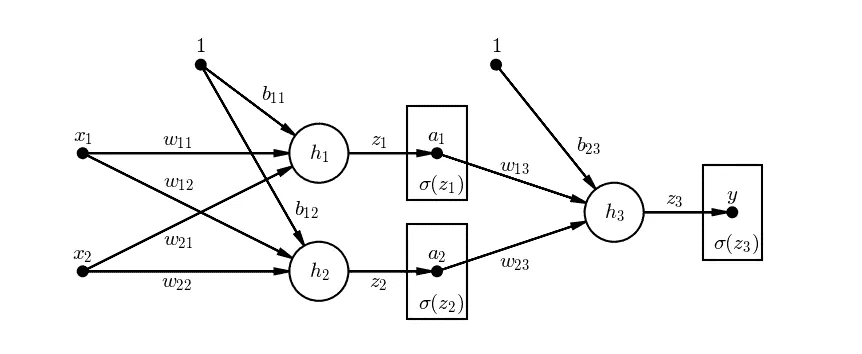**

****Figure 4**: diagram of a simple neural network with a single 2-unit hidden layer**

**到此为止，我们仍然在**仿射变换**的领域上……所以，是时候用一个 ***非线性激活函数*** 了，用希腊字母 **sigma** 表示，从而产生了**激活值** ( ***a1*** 和 ***a2*** )**

**这些**激活值**代表了我在本节第一段提到的**扭曲和旋转特征空间**。这是使用【This 形作为 ***激活功能*** 时的预览图:**

**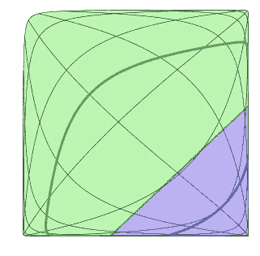**

****Figure 5**: two-dimensional feature space: twisted and turned!**

**如承诺的那样，边界是线性的！顺便说一下，上面的图对应于原始特征空间上具有非线性边界的最左边的解决方案(**图 3** )。**

# **神经网络的基本数学概述**

**为了确保你和我在同一页上，我在下面向你展示由神经网络执行的非常基本的矩阵算法的四种表示，直到隐藏层，**在**应用 ***激活函数*** 之前(即，只是一个**仿射变换**如 ***xW + b*** )**

****

**Basic matrix arithmetic: 4 ways of representing the same thing in the network**

**应用 ***激活功能*** 的时间，在网络图上用希腊字母 **sigma** 表示。**

**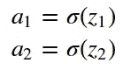**

**Activation function: applied on the results of the affine transformations**

**瞧！我们从**输入**到隐藏层的**激活值**！**

# **在 Keras 实施网络**

**对于这个简单网络的实现，我使用了 **Keras 顺序模型 API** 。除了不同的 ***激活功能*** 之外，每个被训练的模型都使用完全相同的**超参数**:**

*   *****权重初始值****:*Glorot(Xavier)法线(隐藏层)和随机法线(输出层)；**
*   *****优化器*** :随机梯度下降(SGD)；**
*   *****学习率***:0.05；**
*   *****小批量***:16；**
*   *****隐藏层数***:1；**
*   *****单位数*** (在隐藏层):2。**

**鉴于这是一个**二进制分类任务**,**输出层**有一个 ***单单元*** 有一个**s 形** ***激活函数*** 和 ***损失*** 由**二进制交叉熵**给出。**

**Code: simple neural network with a single 2-unit hidden layer**

# **激活功能正在发挥作用！**

**现在，对于有趣的部分— **在网络训练时可视化**扭曲的特征空间，每次使用不同的 ***激活函数***:**sigmoid**， **tanh** 和 **ReLU** 。**

**除了显示特征空间中的变化，动画还包含:**

*   ****阴性(蓝线)和阳性病例(绿线)的预测概率直方图**，错误分类的**病例显示在**红条**中(使用阈值= 0.5)；****
*   ****精度**和**平均损耗**的线图；**
*   ****数据集中每个元素的损失直方图**。**

# **乙状结肠的**

**让我们从最传统的 ***激活函数*****sigmoid**开始，尽管现在，它的使用仅限于分类任务中的输出层。**

**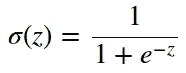****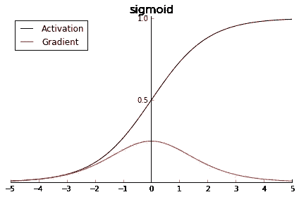**

****Figure 6**: sigmoid activation function and its gradient**

**从图 6 的**中可以看到，一个**的 sigmoid** ***激活函数****将*的输入值挤压到**的范围(0，1)** (同样的范围概率可以取，这也是它在输出层用于分类任务的原因)。此外，请记住，任何给定层的激活值都是下一层的输入，给定 **sigmoid** 的范围，**激活值**将是以 0.5** 为中心的**，而不是零(通常是归一化输入的情况)。****

**也可以验证其**梯度**峰值为 0.25(对于 *z* = 0)，并且当| *z* |达到值 5 时已经接近零。**

**那么，使用一个 **sigmoid** ***激活函数*** n 如何为这个简单的网络工作呢？让我们来看看动画:**

**Sigmoid in action!**

**有几点需要注意:**

*   ****时期 15–40**:可以注意到水平轴上发生典型的**s 形***挤压*；**
*   ****历元 40–65**:变换后的特征空间*停留在一个平台上，在纵轴上有一个“*加宽*”；***
*   ****epoch 65** :此时，**阴性病例**(蓝线)全部被**正确分类**，尽管其关联概率仍然分布到 0.5；而边缘上的**阳性病例仍为**误分类**；****
*   ****时期 65–100**:前述的*加宽*变得越来越强烈，几乎覆盖了所有的特征空间，而**损失**稳步下降；**
*   ****第 103 期**:由于*扩大*，所有**阳性病例**现在都位于**适当的边界**内，尽管仍有一些概率勉强超过 0.5 阈值；**
*   ****纪元 100–150**:现在垂直轴上也发生了一些*挤压*，损失**下降到似乎是一个新的平稳状态，除了一些积极的边缘情况，网络对其预测相当有信心**。******

****因此，**s 形*激活功能*** 成功分离两条线，但是 ***损耗*** 缓慢下降**，同时在**停滞**处停留相当一部分训练时间。******

******我们能否用一个**不同的*激活功能*** 做得更好？******

# ******双曲正切******

********tanh********

******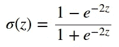******************

********Figure 7**: tanh activation function and its gradient******

******在**图 7** 中可以看到， **tanh** ***激活功能****将*输入值挤压到**范围(-1，1)** 。因此，由于**以零**为中心，激活值已经(在某种程度上)是下一层的归一化输入。******

******关于**梯度**，它有一个大得多的峰值 1.0(同样，对于 *z* = 0)，但是它的下降甚至更快，接近于零到值 *|z* |低至 3。这是所谓的**消失梯度**问题的根本原因，它导致网络的训练越来越慢。******

******现在，对于相应的动画，使用 **tanh** 作为 ***激活函数*** :******

******Tanh in action!******

******有几点需要注意:******

*   ********时段 10–40**:横轴上有一个**tanh***squashing*发生，虽然不太明显，而**损耗**停留在一个平台上；******
*   ********时期 40–55**:在 ***损失*** 上仍然没有改善，但是在纵轴上有一个变换后的特征空间的*加宽*；******
*   ********第 55 期**:此时，**阴性病例**(蓝线)都被**正确分类为**，尽管其关联概率仍然分布到 0.5；而边缘上的**阳性病例**仍为**误分类**；******
*   ********时期 55–65**:前述的*加宽*很快到达几乎所有特征空间再次被覆盖的点，而**损失**突然下降；******
*   ********纪元 69** :由于“*扩大*”，所有**阳性病例**现在都位于**适当的边界**内，尽管仍有一些概率勉强高于 0.5 阈值；******
*   ********时期 65–90**:现在垂直轴上也发生了一些*挤压*，损耗**持续下降，直到达到新的平稳状态，网络对所有预测显示出**高置信度**；********
*   ****时期 90–150:在这一点上，预测的概率只有很小的提高。****

****好了，好像好一点了……这个 **tanh** ***激活功能*** 达到了**正确分类**对于所有情况**更快**，随着 ***损耗*** 也下降**更快**(就是下降的时候)，但是它也在**停滞期**花费了很多时间。****

****如果我们**摆脱**所有的*挤压*会怎么样？****

# ****热卢****

******Re**activated**L**linear**U**nits，简称 **ReLUs** ，是目前 ***激活函数*** 的常见选择。一个 **ReLU** 解决了**消失渐变**的问题，这在它的两个前辈中很常见，同时也是**计算渐变最快的**。****

****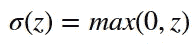************

******Figure 8**: ReLU activation function and its gradient****

****正如你在**图 8** 中看到的， **ReLU** 是一个完全不同的怪兽:它不会将值“挤压”到一个范围内——它只是**保留正值**并将所有的负值**变成零**。****

****使用 **ReLU** 的好处是它的**渐变**要么是 1(正值)，要么是 0(负值)——**不再有消失渐变**！这种模式导致网络的**更快收敛**。****

****另一方面，这种行为会导致所谓的**“死神经元”**，也就是说，神经元的输入始终为负，因此，其激活值始终为零。****

****最后一个动画的时间，与前两个有很大的不同，由于 **ReLU** ***激活功能*** 中的*挤压*的**缺席:******

****ReLU in action!****

****有几点需要注意:****

*   ******时段 0–10**:亏损从一开始就稳步下降****
*   ******历元 10** :此时，**阴性案例**(蓝线)全部被**正确分类**，尽管其关联概率仍然分布到 0.5；而边缘上的**阳性病例**仍为**误分类**；****
*   ******时期 10–60**:**损失**下降直至达到稳定状态，**自**时期 52** 以来，所有情况**已经被**正确分类**，并且网络已经对所有预测展现出**高置信水平**；****
*   ****时期 60–150:在这一点上，预测的概率只有很小的提高。****

****嗯，难怪 **ReLUs** 是如今**激活功能**事实上的*标准。 ***损失*** 使**从一开始就稳步下降**，只有**稳定在**接近零的水平，在**中所有情况下达到**正确分类**的时间约为**花费 **tanh** 的 75%。*****

# ***摊牌***

***动画很酷(好吧，我有偏见，是我做的！)，但是不太方便在**特征空间**上比较每一个不同的 ***激活函数*** 的**总体效果**。所以，为了便于你比较，它们并排在这里:***

***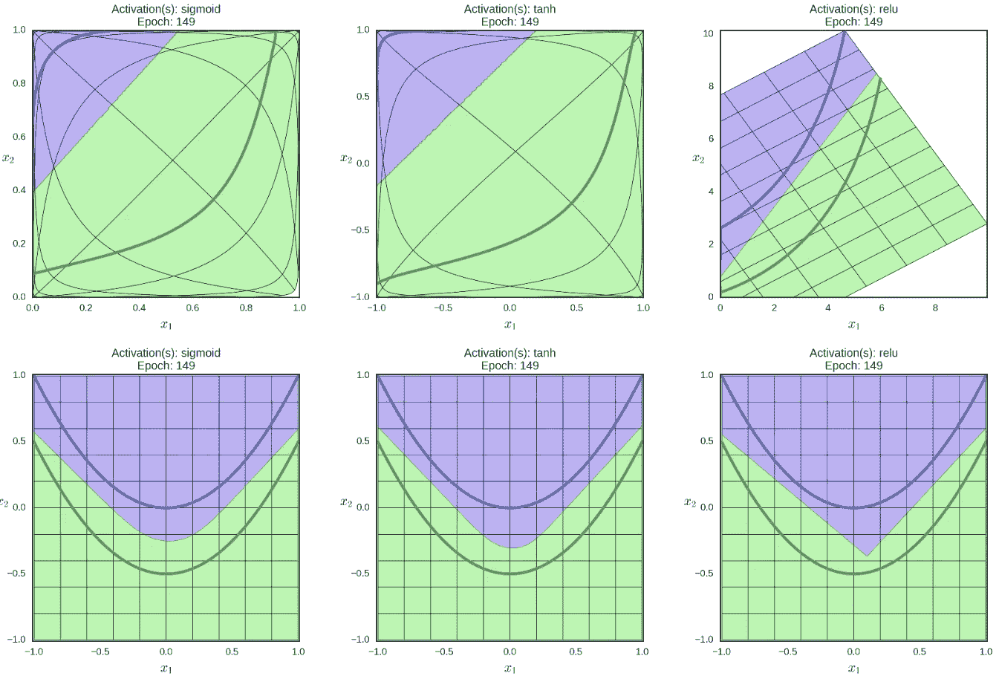***

*****Figure 9**: linear boundaries on transformed feature space (top row), non-linear boundaries on original feature space (bottom row)***

***那并排 ***准确度*** 和 ***损耗*** 曲线呢，这样我也可以对比一下训练速度？当然，我们开始吧:***

***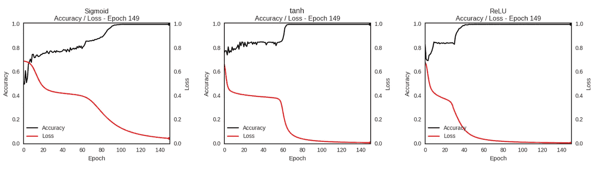***

*****Figure 10**: accuracy and loss curves for each activation function***

# ***最后的想法***

***我用来说明这篇文章的例子是尽可能简单的，动画中描述的**模式仅仅是为了给你一个**大概的概念**关于每一个 ***激活函数的**底层机制**。********

*况且我用我的 ***初始化权重*** 得到了*幸运*(也许用 [42](https://en.wikipedia.org/wiki/Phrases_from_The_Hitchhiker%27s_Guide_to_the_Galaxy#Answer_to_the_Ultimate_Question_of_Life,_the_Universe,_and_Everything_(42)) 做种子是个好兆头？！)并且所有三个网络都学会了在 150 个训练时期内对所有情况进行正确分类。事实证明，训练对初始化非常敏感，但这是以后文章的主题。*

*尽管如此，我真心希望这篇文章和它的动画能给你一些**见解**甚至一些**“啊哈！”**了解这个令人着迷的话题的时刻，这个话题就是**深度学习**。*

> *更新(2018 年 5 月 10 日)*
> 
> *现在你可以自己复制剧情和动画了:-)我已经发布了一个包——**deep replay**——在 [GitHub](https://github.com/dvgodoy/deepreplay) 及其对应的[帖子](/hyper-parameters-in-action-introducing-deepreplay-31132a7b9631)上查看一下。*
> 
> *感谢 [Jakukyo 弗列尔，](https://medium.com/@weakish)你还可以查看这篇帖子的[中文版](https://www.jqr.com/article/000161)。*
> 
> *修正了**图 10** 中的错别字:中间的图显示的是 **tanh** ，而不是 sigmoid。*

**如有任何想法、意见或问题，请在下方留言或联系我* [*推特*](https://twitter.com/dvgodoy) *。**