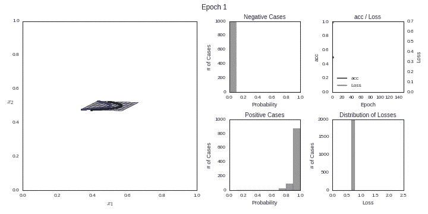
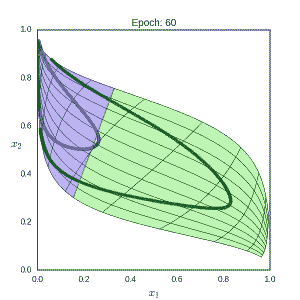
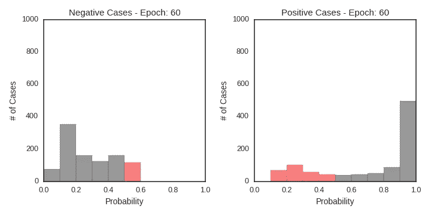
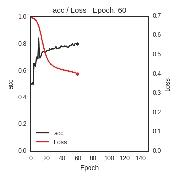
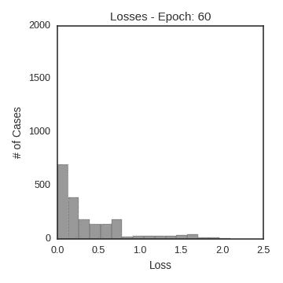
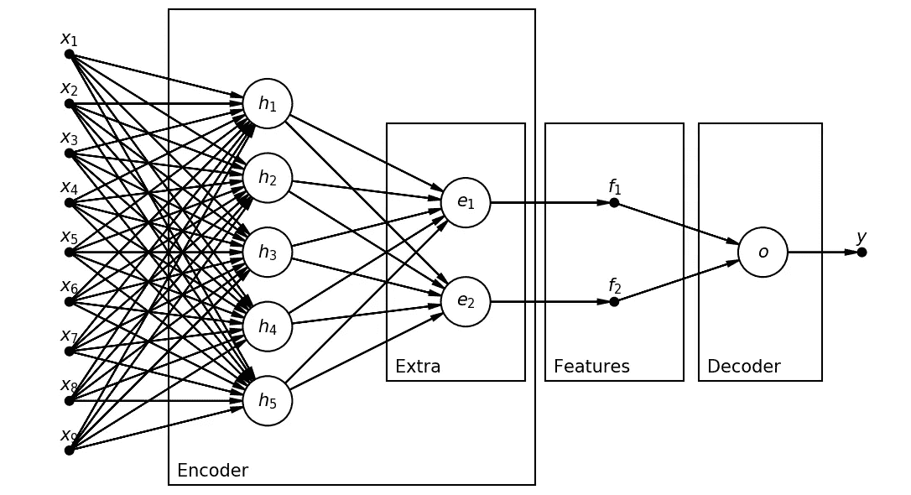

# 超参数在起作用！DeepReplay 简介

> 原文：<https://towardsdatascience.com/hyper-parameters-in-action-introducing-deepreplay-31132a7b9631?source=collection_archive---------1----------------------->

Photo by [Immo Wegmann](https://unsplash.com/@makroman?utm_source=medium&utm_medium=referral) on [Unsplash](https://unsplash.com?utm_source=medium&utm_medium=referral)

# 介绍

在我之前的[帖子](/hyper-parameters-in-action-a524bf5bf1c)中，我邀请你去好奇**当你训练一个神经网络的时候，在引擎盖下**到底发生了什么。然后我研究了 ***激活函数*** 的作用，用**图**和**动画**说明了它们对 ***特征空间*** 的影响。

现在，我邀请**你**在调查中发挥积极作用！

原来这些**情节**和**动画**引起了相当多的关注。所以我决定组织我的代码，把它构造成一个合适的 **Python 包**，这样**你**就可以绘制**你自己的深度学习模型**！

你会问，它们看起来怎么样？好吧，如果你还没有查看最初的[帖子](/hyper-parameters-in-action-a524bf5bf1c)，这里有一个快速浏览:

This is what animating with DeepReplay looks like :-)

所以，事不宜迟，我为你呈现… **深度回放**！

# 深度回放

这个包被称为 **DeepReplay** ，因为这正是它允许你做的事情:**重放**训练你的深度学习模型的过程，**绘制**和**动画制作**它的几个方面。

这个过程很简单，由**五个步骤**组成:

1.  这一切都从创建一个**回调**的实例开始！
2.  然后，一切照旧:构建并训练你的模型。
3.  接下来，将收集的数据加载到**重放**中。
4.  最后，创建一个图形，然后**将可视化效果**附加到它上面。
5.  **剧情**和/或**动画**吧！

让我们逐一完成这些步骤！

## 1.创建回调的实例

回调应该是 [**ReplayData**](http://deepreplay.readthedocs.io/en/latest/deepreplay.html#deepreplay.callbacks.ReplayData) 的一个实例。

**回调**将模型输入( ***X*** 和 ***y*** )以及 ***文件名*** 和 ***组名*** 作为参数，用于存储收集的训练数据。

要记住两件事:

*   对于玩具数据集，在你的模型拟合中使用相同的 ***X*** 和 ***y*** 就可以了。这些是将要绘制的示例-因此，如果使用较大的数据集，您可以选择数据集的随机子集来保持合理的计算时间。
*   数据存储在一个 HDF5 文件中，你可以多次使用 ***同一个文件*** **超过**，但是**永远不要*****同一个组*** ！如果你尝试使用同一个组名运行它两次，你会得到一个**错误**。

## 2.构建并训练您的模型

就像我说的，一切照常，这里没什么可看的…只是不要忘记在装配时**将您的回调实例**添加到回调列表中！

## 3.将收集的数据加载到重放中

所以，给整件事起名字的部分…是时候**重播**它了！

应该够简单了:创建一个 [**Replay**](http://deepreplay.readthedocs.io/en/latest/deepreplay.html#deepreplay.replay.Replay) 的实例，提供 ***文件名*** 和您在**步骤 1** 中选择的 ***组名*** 。

## 4.创建一个图形并附加可视化效果

实际上，这是事情变得有趣的一步。只需使用 **Matplotlib** 创建一个图形，就像示例中的图形一样简单，或者像 [*subplot2grid*](https://matplotlib.org/users/gridspec.html) 允许您创建的图形一样复杂，并开始从您的 **Replay** 对象向图形附加**可视化效果**。

上面的例子建立了一个 ***特征空间*** 基于层的输出命名，暗示性地， ***隐藏*** 。

但是有五种类型的可视化可用:

*   [**特征空间**](http://deepreplay.readthedocs.io/en/latest/deepreplay.html#deepreplay.replay.Replay.build_feature_space) :表示 ***扭曲旋转特征空间*** 的图形，对应一个**隐藏**层的输出(目前只支持 2 单元隐藏层)，包括二维输入的**网格线**；

*   [**判定边界**](http://deepreplay.readthedocs.io/en/latest/deepreplay.html#deepreplay.replay.Replay.build_decision_boundary) :表示 ***原始特征空间*** 的二维网格图，连同 ***判定边界*** (目前仅支持二维输入)；

*   [**概率直方图**](http://deepreplay.readthedocs.io/en/latest/deepreplay.html#deepreplay.replay.Replay.build_probability_histogram) : **两个**得到的**输入的分类概率**的直方图，每个类别一个，对应模型输出(目前只支持二元分类)；

*   [**损失和度量**](http://deepreplay.readthedocs.io/en/latest/deepreplay.html#deepreplay.replay.Replay.build_loss_and_metric) :损失**和选择的度量**的线图，计算所有作为回调参数传递的输入；

*   [**损失直方图**](http://deepreplay.readthedocs.io/en/latest/deepreplay.html#deepreplay.replay.Replay.build_loss_histogram) :对作为回调参数传递的所有输入计算的**损失**的直方图(目前仅支持二进制交叉熵损失)。

## 5.绘制和/或制作动画！

对于这个例子，用一个**单个** **可视化**，就可以直接使用它的 ***剧情*** 和 ***动画*** 方法。这些方法将分别返回一个图形和一个动画，然后您可以将它们保存到文件中。

如果您决定使用**多个同时可视化**，有两个**辅助方法**返回合成的情节和动画，分别是:[***compose _ plots***](http://deepreplay.readthedocs.io/en/latest/deepreplay.html#deepreplay.plot.compose_plots)和[***compose _ animations***](http://deepreplay.readthedocs.io/en/latest/deepreplay.html#deepreplay.plot.compose_animations)。

为了说明这些方法，这里有一个**要点**，它来自我在最初的帖子中使用的“*”[示例](https://github.com/dvgodoy/deepreplay/blob/master/examples/part1_activation_functions.py)。有**四个**可视化和**五个**图( ***概率直方图*** 有**两个图**，用于阴性和阳性情况)。*

*本帖开头的**动画 GIF** 其实就是**这个**构图动画的结果！*

## *限制*

*此时，你大概注意到了，两个**最酷的**可视化， ***特征空间*** *和* ***决策边界*** ，都被限制在**两个维度**。*

*我还计划在**三维**中添加可视化支持，但大多数数据集和模型要么有**更多输入**要么有**更多单元**的隐藏层。*

*所以，这些是你的选择:*

*   *2D 输入，2 单元隐藏层: ***特征空间*** 带可选网格(查看[激活函数](https://github.com/dvgodoy/deepreplay/blob/master/notebooks/part1_activation_functions.ipynb)示例)；*
*   *3D+输入，2 单元隐藏层: ***特征空间*** ，但无网格；*
*   *2D 输入，隐藏层用 3+单位: ***决定边界*** 用可选网格(查看[圆圈](https://github.com/dvgodoy/deepreplay/blob/master/notebooks/circles_dataset.ipynb)示例)；*
*   *没有什么是二维的:嗯…总有一个**解决方法**，对吗？*

# *围绕多维度工作*

*我们想要实现什么？因为我们只能做二维图，我们想要**二维输出**——很简单。*

***如何获得二维输出？**增加一个**额外隐藏层**用**两个单位**当然！好的，我知道这是**次优**，因为它实际上是在修改模型(*我提到过这是一个变通办法吗？！*)。然后我们可以使用这个额外图层的输出进行绘图。*

*你可以查看 [*月亮*](https://github.com/dvgodoy/deepreplay/blob/master/notebooks/moons_dataset.ipynb) 或者 [*UCI Spambase*](https://github.com/dvgodoy/deepreplay/blob/master/notebooks/UCI_spambase_dataset.ipynb) 笔记本，查看添加一个额外的隐藏层并绘制它的示例。*

> ***继续进行，风险自负:-)***

***不管怎样，我们对这个模型做了什么？**通过添加一个额外的隐藏层，我们可以认为我们的模型有**两个组件**:一个 ***编码器*** 和一个 ***解码器*** 。让我们稍微深入一点:*

*   ***编码器**:编码器从输入一直到我们的**额外隐藏层**。让我们把它的二维输出看作是**特征**并把它们叫做 ***f1*** 和 ***f2*** 。*
*   ***解码器**:在这种情况下，解码器只是一个简单明了的**逻辑回归**，它接受两个输入，比如说 ***f1*** 和 ***f2*** ，并输出一个分类概率。*

*让我试着用一个网络图来说得更清楚些:*

**

*Encoder / Decoder after adding an extra hidden layer*

*这是什么？一个 9 维输入，一个有 5 个单元的原始隐藏层，一个有两个单元的额外隐藏层，其对应的两个输出(特征)和一个单个单元输出层。*

*那么，**在输入**的过程中会发生什么？让我们看看:*

1.  *输入( ***x1*** 到***x9*** )被馈入 ***编码器*** 部分的模型。*
2.  *原**层**隐**层*曲折*层**层投入。隐藏层的**输出**也可以被认为是**特征**(这些将是图中单元****h1****到****H5****的输出)，但是这些被假定为 **n 维**，因此不适合绘图。到目前为止，一切如常。*****
3.  **然后是**额外的**隐藏层。它的**权重矩阵**具有形状 **(n，2)** (在图中， ***n = 5*** 并且我们可以在*和 ***e*** 节点之间计数 **10** 个箭头)。如果我们假设一个 ***线性激活函数*** ，这一层实际上是在执行一个**仿射变换，将点从一个 **n 维**映射到一个**二维**特征空间。这些是我们的功能，****【F2】******编码器的输出*** 部分。******
4.  ****既然我们假设一个 ***线性激活函数*** 用于额外的隐藏层，那么 ***f1*** 和 ***f2*** 将被直接馈送到 ***解码器*** (输出层)，也就是说，馈送到一个具有**的单个单元这是一个简单明了的逻辑回归。******

******这一切意味着什么？**意味着我们的模型也在学习一个 ***潜在空间*** 与 ***两个潜在因素*** ( ***f1*** 与 ***f2*** )现在！很奇特，是吧？！不过，不要被这些术语的花哨所吓倒……这基本上意味着模型学会了将信息最好地压缩为两个特征，给定手头的任务**——二进制分类。******

****这是 [**自动编码器**](/deep-inside-autoencoders-7e41f319999f) 的基本原理，主要区别在于自动编码器的任务是**重建其输入**，而不是以任何方式对其进行分类。****

# ****最后的想法****

****我希望这篇文章能吸引你尝试一下深度回放****

****如果你为不同的数据集，或者使用不同的网络架构或超参数，想出了**好看又酷的**可视化，请**在**评论**部分分享**它。如果有足够的兴趣，我正在考虑开始一个**画廊**页面。****

****有关 **DeepReplay** 包的更多信息，如安装、文档、示例和**笔记本**(你可以使用 **Google Colab** 来玩)，请访问我的 GitHub 资源库:****

**** [## DVD godoy/deep replay

### 深度回放-深度回放-生成可视化效果，如我的“超参数运行！”系列！

github.com](https://github.com/dvgodoy/deepreplay) 

祝你的模型动画制作愉快！:-)

*如果你有什么想法、评论或问题，请在下方留言或联系我* [*推特*](https://twitter.com/dvgodoy) *。*****