# 超参数在起作用！第二部分—权重初始值设定项

> 原文：<https://towardsdatascience.com/hyper-parameters-in-action-part-ii-weight-initializers-35aee1a28404?source=collection_archive---------0----------------------->

Photo by [Jesper Aggergaard](https://unsplash.com/@aggergakker?utm_source=medium&utm_medium=referral) on [Unsplash](https://unsplash.com?utm_source=medium&utm_medium=referral)

# 介绍

这是我关于**超参数**系列的第二篇文章。在这篇文章中，我将向你展示正确初始化你的深度神经网络的**权重**的**重要性**。我们将从一个**简单的初始化方案**开始，**解决它的问题**，就像**消失** / **爆炸渐变**，直到我们**(重新)发现**两个流行的初始化方案:**Xavier**/**Glorot**和 **He** 。

我假设你已经熟悉了一些关键概念(Z 值、激活函数及其梯度)，我在本系列的第一篇[帖子](/hyper-parameters-in-action-a524bf5bf1c)中已经提到过。

> 说明这篇文章的情节是用我的包 **DeepReplay** 生成的，你可以在 [GitHub](https://github.com/dvgodoy/deepreplay) 上找到它，并在这篇[文章](/hyper-parameters-in-action-introducing-deepreplay-31132a7b9631)上了解更多。

# 动机

在我寻求更深入地理解每一个不同的**超参数**对训练深度神经网络的影响时，是时候研究一下**权重初始化器**了。

如果您曾经搜索过这个特定的主题，您可能会遇到一些常见的**初始化方案**:

*   **随机**
*   **泽维尔** / **格洛特**
*   **何**

如果你挖得更深一点，你可能还会发现，如果激活函数是一个 **Tanh** ，那么应该使用 **Xavier / Glorot 初始化**，如果激活函数是一个 **ReLU** ，那么推荐使用 **He 初始化**。

顺便说一下，澄清一些事情: *Xavier Glorot* 和 *Yoshua Bengio* 是“ [**理解训练深度前馈神经网络**](http://proceedings.mlr.press/v9/glorot10a/glorot10a.pdf) 的困难”论文的作者，该论文概述了将**作为其第一作者的**开头( *Xavier* 或最后( *Glorot* )的初始化方案。因此，有时这种方案将被称为 **Xavier 初始化、**和其他一些时候(如在 *Keras* 中)，它将被称为 **Glorot 初始化**。不要被这个迷惑，因为我是第一次知道这个话题。

弄清楚这一点后，我再问你一次:你有没有想过引擎盖下到底发生了什么？为什么初始化这么重要**？初始化方案之间的**差异**是什么？我的意思是，不仅是他们对方差应该是什么的不同定义，而且是在训练一个深度神经网络时使用其中一个的总体效果！**

**在深入研究之前，我想给它应有的信任:这些情节在很大程度上受到了安德烈·皮卢尼奇关于同一主题的令人敬畏的帖子的启发。**

**好了，**现在**让我们开始吧！**

# ****设置****

> **确保您使用的是 Keras 2.2.0 或更新版本-旧版本有一个问题，生成的权重集的方差低于预期！**

**在这篇文章中，我将使用一个具有 **5 个隐藏层**和 **100 个单位**的模型，以及一个典型的**二进制分类**任务中的单个单位输出层(即使用 *sigmoid* 作为激活函数，使用*二进制交叉熵*作为损失)。我将这个模型称为**模块**模型，因为它有相同大小的连续层。我使用以下代码来构建我的模型:**

**Model builder function**

## **块状模型**

**这是块模型的架构，不考虑我将用来构建图的激活函数和/或初始化器。**

**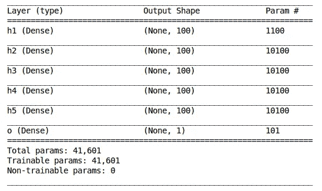**

## **输入**

**输入是从 **10 维球**中抽取的**1000 个随机点**(这看起来*比实际上的*更好，你可以把它想象成一个有 1000 个样本的数据集，每个样本有 10 个特征)这样样本就有了**零均值**和**单位标准差**。**

**在该数据集中，位于球半径一半内的*点被标记为*阴性情况* (0)，而剩余的点被标记为*阳性情况* (1)。***

**Loading 10-dimensional ball dataset using DeepReplay**

# **朴素初始化方案**

**在**开始的时候，有一个 *sigmoid 激活函数*和**随机初始化的权重**。而且训练是*硬*，收敛是*慢*，成绩是*不好*。****

**但是，**为什么呢？****

**那时，通常的程序是*从一个**正态分布**(零均值，单位标准偏差)中抽取随机值*，然后将它们乘以一个小数字，比如说 **0.01** 。结果是一组标准偏差约为 **0.01** 的砝码。这导致了一些问题…**

**在进入更深的*钻头*之前(只是一个*钻头*，我保证！)进入为什么这是一个**坏的**初始化方案的数学原因，让我展示在带有 **sigmoid** 激活功能的**模块**模型中使用它的结果:**

**Code to build the plots! Just change the initializer and have fun! :-)**

**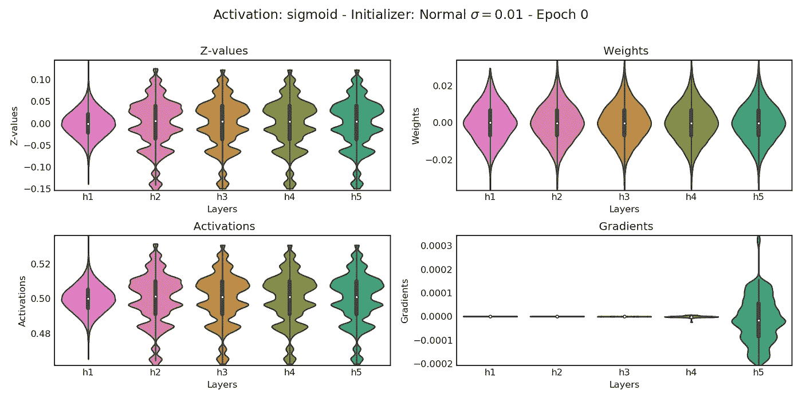**

**Figure 1\. BLOCK model using sigmoid and naive initialization — don’t try this at home!**

**这个**不**好看吧？你能发现所有正在变坏的东西吗？**

*   ****Z 值**(记住，这些是应用激活功能之前的输出*)和**激活**都在**窄范围内；*****
*   ****梯度**几乎为零**；****
*   **左栏的**奇怪的分布**是怎么回事？！**

**不幸的是，如果我们选择尝试和训练它，这个网络可能不会很快学到很多东西。**为什么是**？因为它的渐变**消失了**！**

**我们甚至还没有开始培训过程！这是**纪元 0** ！那么，到目前为止发生了什么？让我们看看:**

1.  **使用**简单方案** ( *右上子情节*)初始化**权重****
2.  **1000 个样本被用于通过网络的正向传递，并为所有层(输出层不包括在图中)生成了 **Z 值** ( *左上子图*)和**激活** ( *左下子图*)**
3.  **针对通过网络反向传播的和**真实标签*计算*损失*，生成所有层的**梯度**(*右下方子图******

**就是这样！**单遍**通过网络！**

**接下来，我们应该**相应地更新权重**，然后**重复**这个过程，对吗？但是，等等…如果**梯度**几乎为零，那么**更新后的权重**将几乎与**相同**，对吗？**

****是什么意思**？这意味着我们的网络几乎毫无用处，因为**它无法在合理的时间内学习任何东西**(即，更新其权重以执行所提议的分类任务)。**

**欢迎来到**消失渐变**的极端案例！**

**你可能会想:“*是的，当然，标准差太低了，不可能像*那样工作”。那么，尝试不同的**值**怎么样，比如说， **10x** 或者 **100x 大**？**

## **标准偏差大 10 倍= 0.10**

**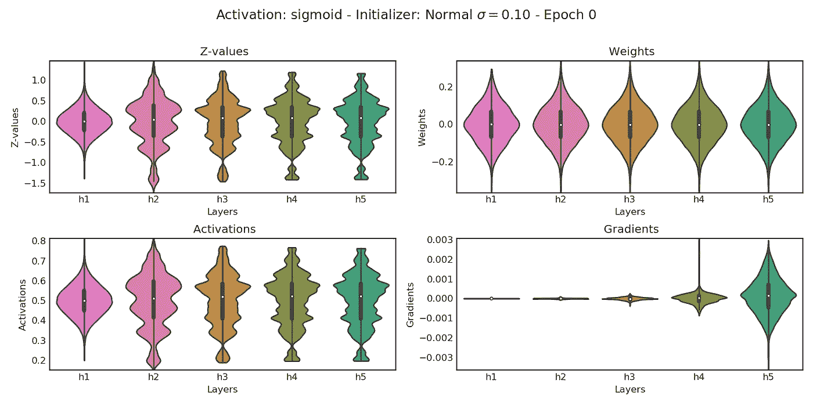**

**Figure 2\. BLOCK model using 10x bigger standard deviation**

**好了，这看起来好一点了… **Z 值**和**激活**在*合适的范围内*，倒数第二个隐藏层的**渐变**显示出一些改善，但是**仍然朝着初始层消失**。**

**也许把**变得更大**可以修正渐变，让我们看看…**

## **标准偏差大 100 倍= 1.00**

**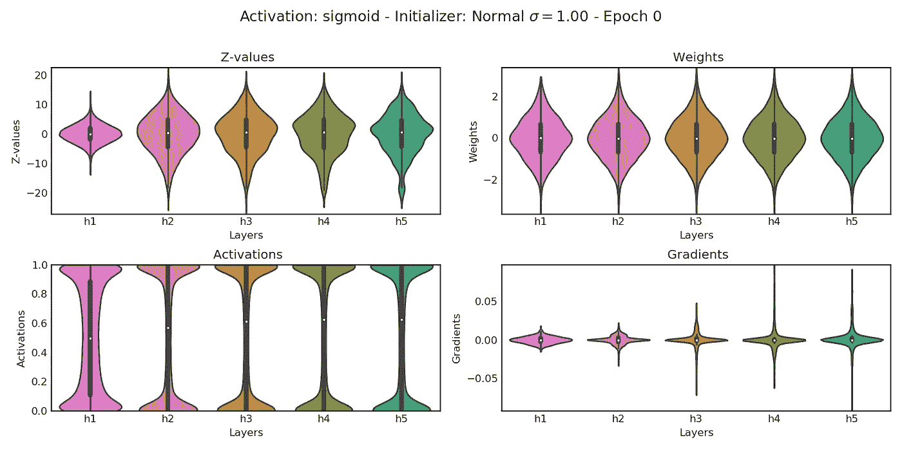**

**Figure 3\. BLOCK model using 100x bigger standard deviation**

**好的，看起来我们在**消失渐变**问题中有了 *som* e *progress* ，因为所有层的范围变得彼此更加相似。耶！**但是** …我们*毁了***Z 值**和**激活**……现在 **Z 值**显示出*太宽的范围*，迫使**激活**几乎变成*二进制模式*。**

## **尝试不同的激活功能**

**如果你读了我关于超参数的第一篇文章，你会记得一个 **Sigmoid 激活函数**有一个基本的问题，就是以 0.5 为中心的**。所以，让我们继续遵循神经网络的进化路径，使用一个 **Tanh 激活函数**来代替！****

**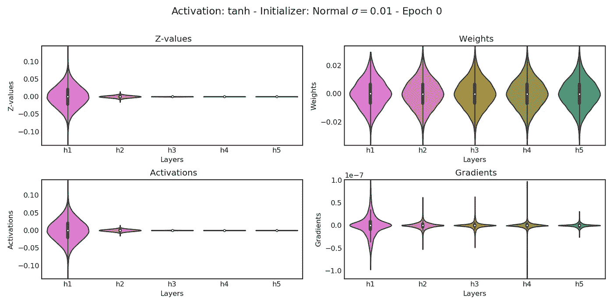**

**Figure 4\. BLOCK model using Tanh and naive initialization**

**用来自正态分布的小随机值替换 **Tanh** 激活函数的 **Sigmoid** ，同时保持**初始初始化方案**将我们带到了另一种**消失渐变**的情况(它可能*看起来*不*像*，毕竟，它们**沿着所有层都是** **相似的**，但是检查一下**比例、**渐变)，伴随着**消失的 Z 值**和**消失的激活**(只是为了明确，这两个是*而不是*真正的术语)！肯定，**不是**该走的路！**

**让我们一直使用一个**大的**标准差，然后看看结果如何(是的，我把最好的留到最后……)。**

**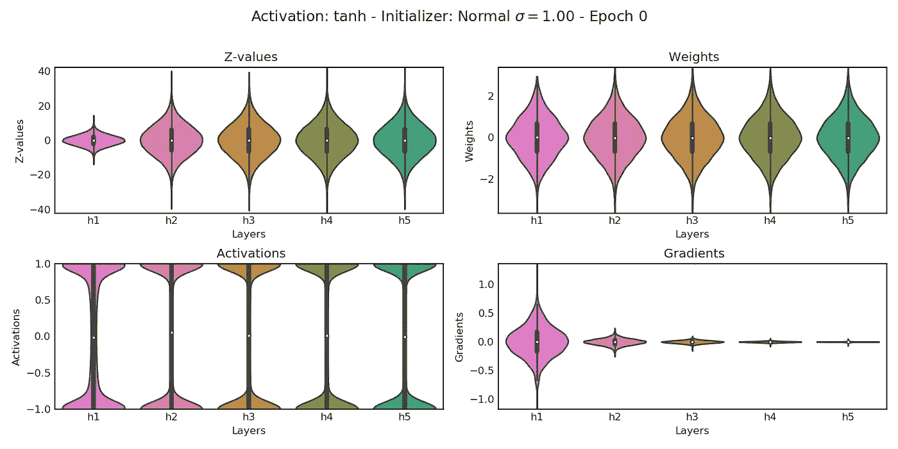**

**Figure 5\. BLOCK model using Tanh and a BIG standard deviation**

**在这个设置中，我们可以观察到**爆炸渐变**的问题。看到渐变值如何随着我们从最后一个隐藏层到第一个隐藏层越来越大了吗？此外，就像使用 Sigmoid 激活函数时发生的一样， **Z 值**具有*太宽的范围*和**激活**在大多数情况下都崩溃为*零或一个*。还是那句话，不好！**

**并且，如承诺的那样，获胜者是… **Tanh** 标准差 **0.10** ！**

**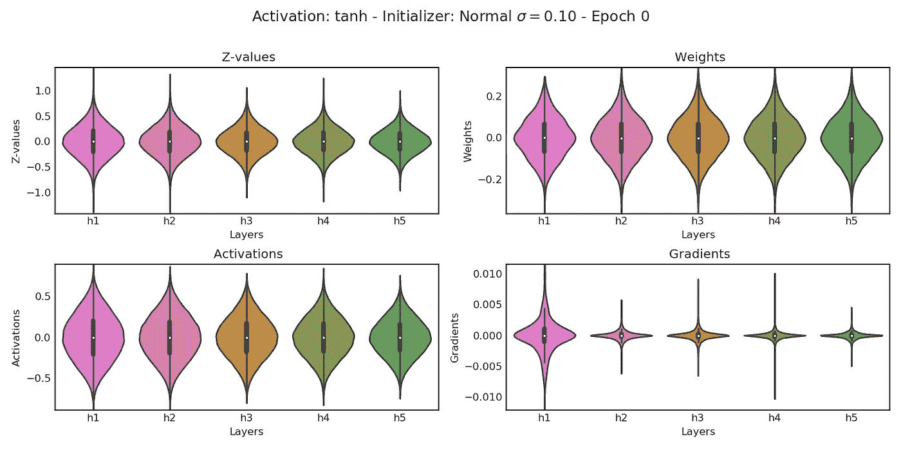**

**Figure 6\. BLOCK model looking good!**

**为什么**这个**一个是赢家？让我们来看看它的特点:**

*   **首先，**梯度**沿着所有层合理地**相似** **(并且在*适当的比例*——大约比权重*小 20 倍*)****
*   **第二， **Z 值**在*合适的范围* (-1，1)内，并且沿着所有层相当**相似(尽管一些收缩是明显的)****
*   **第三，**激活**没有*折叠成二进制模式*，并且沿着所有层合理地**相似(再次，*有一些*收缩)****

**如果你还没有注意到，在所有层上**相似是一件大事！简而言之，这意味着我们可以**在网络的末端堆叠另一层**，并期待类似的**分布**的 **Z 值**、**激活**，当然还有**梯度**。在我们的网络中，我们绝对做**而不是**像*折叠*、*消失*或*爆炸*的行为，不，先生！****

**但是，所有层的**相似是结果，而不是原因……正如你可能已经猜到的，关键**是权重**的**标准偏差！******

**因此，我们需要一个**初始化方案**，它使用**最佳可能标准偏差**来抽取随机权重！进入*泽维尔·格洛特*和*约舒阿·本吉奥* …**

# **Xavier / Glorot 初始化方案**

**Glorot 和 Bengio 设计了一个**初始化方案**，试图保持所有*获胜特征*被列出，即**渐变**、 **Z 值**和**激活**、*沿着所有层*相似。另一种说法是:保持**所有层**的变化相似。**

**你可能会问，他们是怎么把这个拉出来的？一会儿我们会看到，我们只需要做一个**真正的** **简要的**回顾一下**方差**的一个基本性质。**

## **非常简要地回顾一下**

**假设我们有 ***x*** 值(来自前一层的**输入**或**激活值**)和 ***W*** 权重。两个独立变量的[乘积的方差由以下公式给出:](https://en.wikipedia.org/wiki/Variance#Product_of_independent_variables)**

**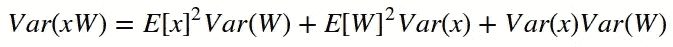**

**那么，我们假设 ***x*** 和 ***W*** 都有**零均值**。上面的表达式变成了两个方差 ***x*** 和 ***W*** 的简单乘积。**

**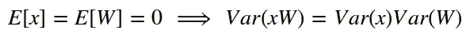**

**这里有两点很重要:**

1.  ****输入**应该有**零均值**以保持在第一层，因此*总是*缩放和居中您的输入！**
2.  ****Sigmoid 激活函数**对此提出了一个问题，因为激活值的平均值为 0.5，**不是** **零**！关于如何补偿的更多细节，请查看这个[帖子](https://mnsgrg.com/2017/12/21/xavier-initialization/#logistic-activation)。**

**鉴于第二点，坚持使用 **Tanh** 才有意义，对吗？所以，这正是我们要做的！现在，是时候将这些知识应用到一个**小例子**中了，所以我们到了(希望如此！)得出与 *Glorot* 和 *Bengio* 相同的结论。**

**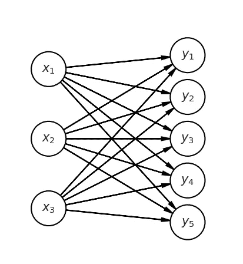**

**Figure 7\. Two hidden layers of a network**

## **微小的例子**

**这个例子由两个完全连接的隐藏层组成， **X** 和 **Y，**(我把通常的约定抛到九霄云外，以保持数学符号最少！).**

**我们只关心连接这两层的**权重**以及**激活**和**渐变**的**差异**。**

**对于**激活**，我们需要在网络中通过一个**转发通道**。对于**渐变**，我们需要**反向传播**。**

**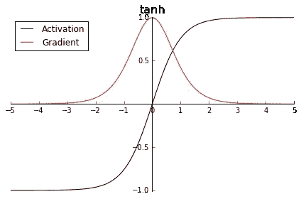**

**Figure 8\. Tanh activation function**

**并且，为了*保持数学简单*，我们将假设**激活函数在等式中是线性的**(而不是 **Tanh** )，这意味着**激活值**是与 Z 值相同的**。****

**虽然这看起来有点夸张，但是图 8 向我们展示了在区间[-1，1] 中，Tanh 大致是线性的，所以结果应该成立，至少在这个区间内。**

****

**Figure 9\. Forward Pass**

## **前进传球**

**因此，不使用矢量化方法，我们将挑出**一个**单元、 ***y1*** ，并计算它。**

****图 9** 提供了所涉及零件的清晰图片，即:**

*   **三个单元在**前一层** ( **扇入**)**
*   ****重量** ( *w11* 、 *w21* 和 *w31* )**
*   **我们要计算的单位**方差**为，**y1****

**假设 ***x*** 和 **W** 是**独立**和**同分布**，我们可以对 ***y1* :** 的**方差**进行一些简单的数学运算**

**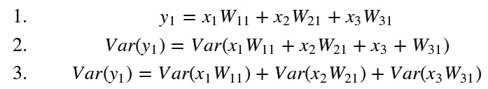**

**还记得关于**差异**的*简要回顾*吗？是时候好好利用它了！**

**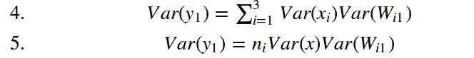**

**好了，快到了！记住，我们的**目标**是保持**方差沿着所有层**相似。换句话说，我们应该致力于使*x 的**方差**与*y 的方差相同。****

****对于我们的单个单元， ***y1*** ，这可以通过选择其连接**权重**的**方差**为:****

****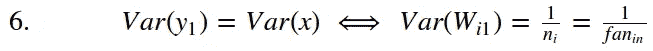****

****并且，对于**所有**隐藏层 **X** 和 **Y** 之间的连接**权重**，我们有:****

****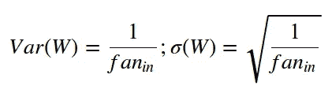****

****顺便说一下，如果我们从一个**正态** **分布**中抽取随机**权重**，这就是要使用的**方差**！****

****如果我们想用一个**均匀分布**怎么办？我们只需计算(对称的)下限和上限**，如下所示:******

******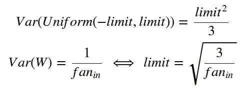******

******完事了吗？！还没有…不要忘了**反向传播**，我们也想保持**的渐变沿着所有的层**(它的方差，更精确)。******

************

******Figure 10\. Backward Pass******

## ******反向传递(反向传播)******

******还是那句话，我们挑出**一个**单位， ***x1*** ，用于后向传递。******

********图 10** 提供了所涉及零件的清晰图片，即:******

*   ********以下五层** ( **扇出**)******
*   ********重量** ( *w11* 、 *w12* 、 *w13* 、 *w14* 和 *w15* )******
*   ******我们要计算**梯度**相对于它的 ***x1*** 的**方差**的单位******

******基本上，我们将做出**相同的假设**，并遵循**与正向传递中相同的步骤**。对于**梯度** s 相对于 ***x1*** 的**方差**，我们可以用同样的方法计算出来:******

******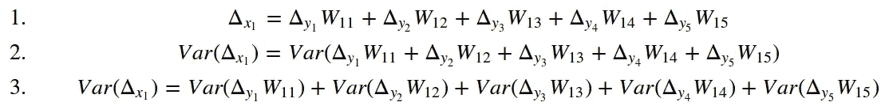******

******再次利用我们在*简要回顾*中学到的知识:******

******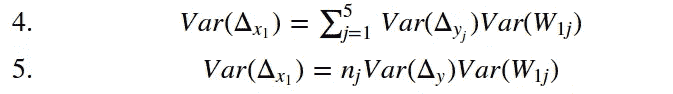******

******并且，为了保持**沿所有层**的梯度方差相似，我们发现其连接**权重**所需的**方差**为:******

******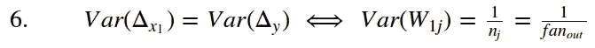******

******好了，我们已经走了很长一段路了！中的“**扇出”的逆运算给出了**正向传递**的**权重**的期望**方差**，而“**扇出**的逆运算给出了( ***同*** )的期望**方差**！)**用于**反向传播**的权重**。********

**但是…如果“**扇入**”和“**扇出**”有**非常不同的**值呢？**

## **协调向前和向后传球**

**无法决定选择哪一个，“**扇入**”或“**扇出**”，来计算你的网络**权重**的**方差**？没问题，就拿**平均值**吧！**

**因此，我们最终得出了**权重**的**方差**的表达式，如 *Glorot* 和 *Bengio* 所示，用于**正态分布**:**

**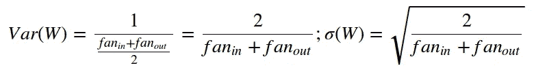**

**并且，对于**均匀分布**，我们相应地计算极限:**

**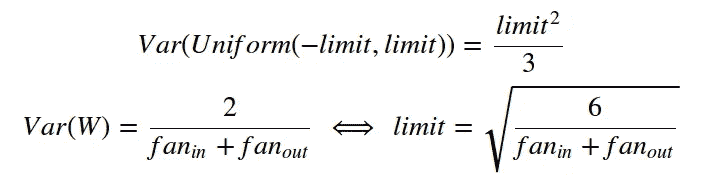**

****恭喜**！你(重新)发现了 **Xavier / Glorot 初始化方案**！**

**但是，仍然有一个*小的*细节，你应该选择一个**正态分布**来提取权重吗…**

## **截断正态和 Keras 方差标度**

**当谈到神经网络的**权重**时，我们希望它们整齐地分布在零附近，甚至更重要的是，我们**不希望有任何**异常值**！所以，我们**截断**它！****

**截断是什么意思？只要**去掉**任何比两倍标准差远的值**！因此，如果您使用标准偏差 **0.1** ，截尾正态分布**将绝对**没有低于-0.2 或高于 0.2** 的值(如图 11** 左侧图**)。******

**事情是这样的，一旦你切掉了正态分布的尾部，剩下的值有一个**稍微低一点的**标准差…准确的说是原始值的 0.87962566103423978。**

> **在 Keras 2 . 2 . 0 之前的版本中，截断正态分布的这种差异在[方差缩放](https://keras.io/initializers/#variancescaling)初始化器中没有考虑，而这是 Glorot 和 he 初始化器的基础。因此，在更深层次的模型中，基于均匀分布的初始化器可能会比它的正常对应物表现得更好，正常对应物会遭受一层又一层缓慢缩小的方差…**

**到今天为止，这不再是一个问题，我们可以在图 11 的右侧图**中观察到补偿**截断的**效果，其中**方差缩放**初始值的分布明显更宽。****

**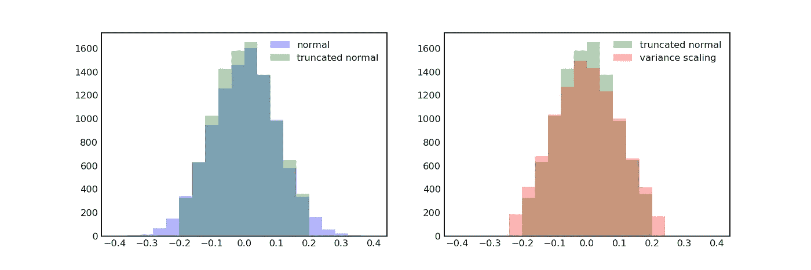**

**Figure 11\. Truncated normal and Keras’ Variance Scaling**

# **求一些剧情！**

**非常感谢你陪我看完了更多的*数学*部分。你的耐心将会得到丰厚的回报！**

**让我们看看 **Glorot 初始化器**(正如它在 **Keras** 中被调用的)如何执行，使用**正常**和**统一**分布。**

**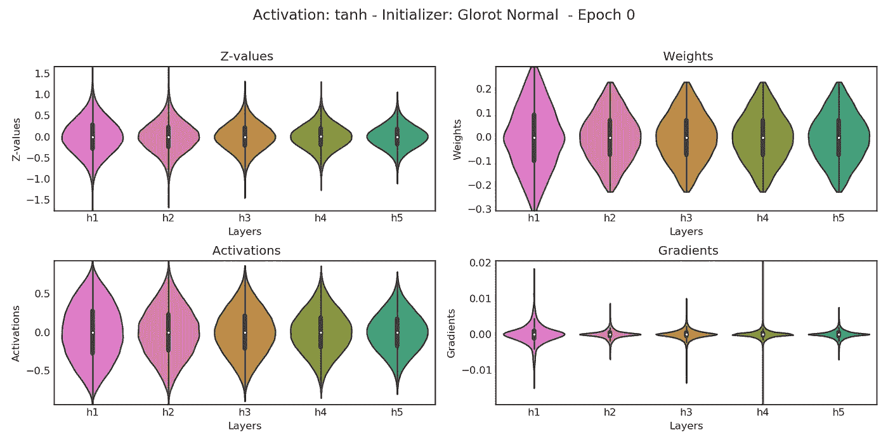**

**Figure 12\. BLOCK model with Glorot Normal initializer**

**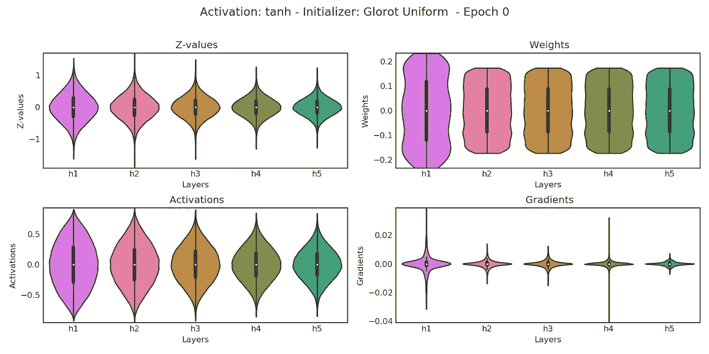**

**Figure 13\. BLOCK model with Glorot Uniform initializer**

**看起来我们有两个赢家了！**

**还记得我们之前的**赢家**吗，在**图 6** 中使用*朴素初始化方案*标准差 *0.1* 的 BLOCK 模型？结果非常相似，对吧？**

**事实证明，根据 **Glorot 初始化方案**，当“**扇入**”和“**扇出**”等于 100 时，我们使用的 0.1 标准偏差正是正确的值。这是**而不是**使用截尾正态分布，虽然…**

**所以，这个初始化方案解决了我们的*消失*和*爆发*渐变的问题…但是它是否适用于**不同于 **Tanh** 的激活函数**？让我想想…**

# **整流线性单元(ReLU)激活功能**

**我们能坚持使用**相同的**初始化方案，而使用 **ReLU** 作为激活函数吗？**

**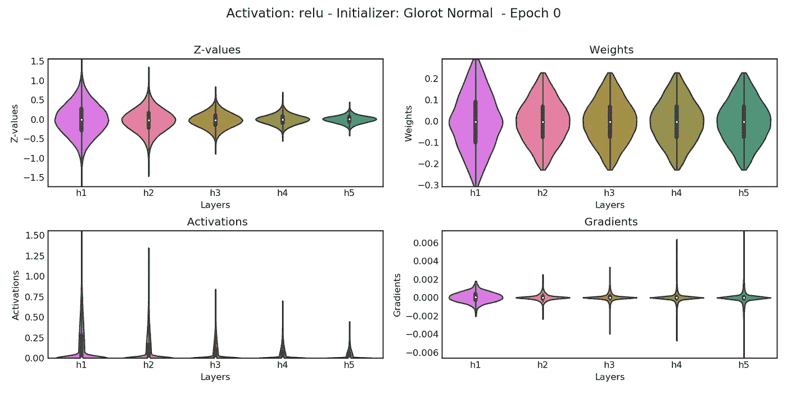**

**Figure 14\. BLOCK model with ReLU and Glorot Normal initializer — they don’t mix well…**

**答案是:**没有**！**

**回到起点…我们需要一个新的改进的初始化方案。进入*何*等人，带着他们的“ [**钻研整流器**](https://arxiv.org/pdf/1502.01852.pdf) ”论文…**

# **初始化方案**

**幸运的是，我们在(重新)发现 **Glorot 初始化方案**时得到的一切仍然有效。只有一个**微调**我们需要做… **将权重的方差乘以 2** ！真的，这就是全部的代价！**

**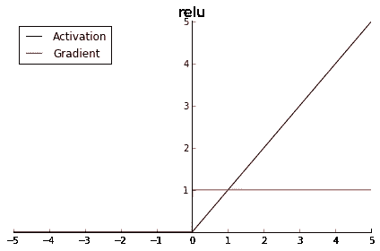**

**Figure 15\. ReLU activation function**

**很简单，对吧？但是，**为什么是**？**

**原因也很简单: **ReLU** 将 **Z 值**(负一)的**一半**变成**零**，有效地去除了**差异**的大约**一半**。因此，我们需要将权重的方差加倍来补偿它。**

**既然我们知道 **Glorot 初始化方案**保留了**方差** ( **1** )，那么**如何补偿**对于 **ReLU** ( **2** )的**方差减半**效应？结果( **3** )不出所料，是**将方差**翻倍。**

**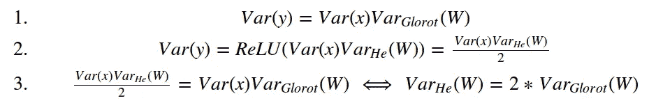**

**因此，与**正态分布**一起使用的**权重**的**方差**的表达式为:**

**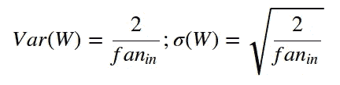**

**并且，对于**均匀分布**，我们相应地计算极限:**

**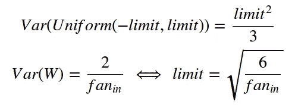**

****恭喜**！你(重新)发现了 **He 初始化方案**！**

****但是** …那么**反向传播**呢？难道我们不应该再次使用两个“*粉丝*的平均值吗？实际上，没有**也不需要**了。*何*等人在他们的论文中指出，对于常见的网络设计，如果初始化方案在*正向传递*期间缩放激活值，那么对于*反向传播* **以及**也是如此！此外，它以两种方式工作**，所以我们甚至可以使用**扇出**，而不是**扇入**。****

**现在，是更多剧情的时候了！**

**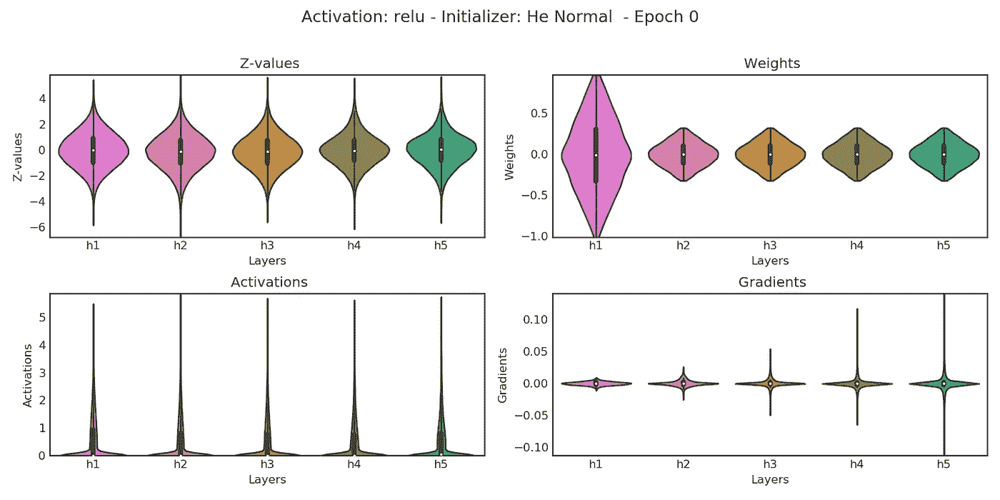**

**Figure 15\. BLOCK model with ReLU and He Normal initializer**

**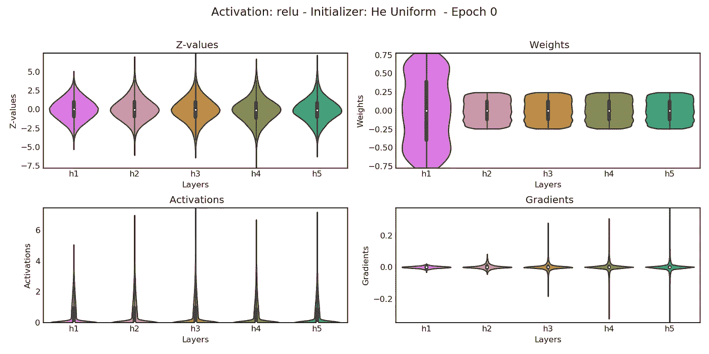**

**Figure 16\. BLOCK model with ReLU and He Uniform initializer**

**再来两个**获奖者**！当谈到 Z 值的分布时，它们看起来非常相似！至于**渐变**，它们现在看起来比我们用**Tanh**/**Glorot**duo 的时候多了一点*vanish*…这是否意味着 **Tanh** / **Glorot** 比 **ReLU** / **He** 更好？我们*知道*这是*不是*真的…**

**但是，那么，*为什么*它的**渐变**在**图 16** 上看起来不那么好看呢？嗯，再一次，别忘了看一下**刻度**！即使梯度**的**方差**随着我们通过网络*反向传播*而减少**，其值也**无处**靠近的**消失(如果你记得*图 4* ，情况正好相反——沿层的方差*相似，但它**).*******

**因此，我们不仅需要沿着所有层的**相似的变化，还需要一个合适的**渐变比例**。**比例**非常重要，因为它将与*学习率*一起定义*多快*更新**权重****更新**。如果坡度**太小**，则*学习*(即*权重*的*更新*)将**极慢**。****

**你会问，**有多小才算太小**？一如既往，它*取决于* …重量**的**大小****。所以，过小是*不是*绝对*度量，而是**相对**度量。***

**如果我们计算梯度的**方差和相应**权重**的**方差**之间的**比率**(或其*标准差*，就可以大致*比较*不同**初始化方案**的*学习速度*及其底层**分布**(假设学习速率不变)。****

**所以，是时候…**

# **摊牌——普通对制服，格洛特对贺！**

**说实话，**Glorot***vs***He**其实就是指**Tanh***vs***ReLU**这场比赛的答案我们都知道(*剧透预警*！): **ReLU 胜**！**

**而**普通** *vs* **制服**呢？让我们来看看下面的情节:**

**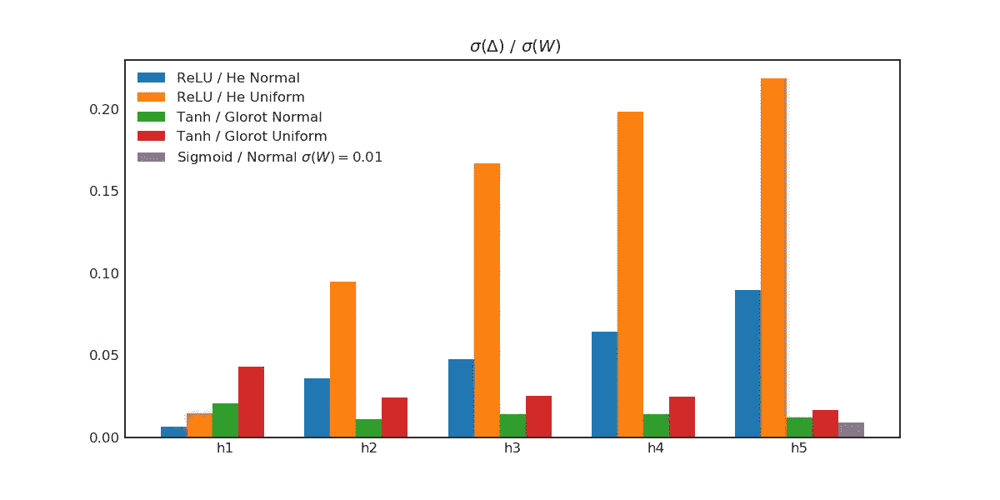**

**Figure 17\. How big are the gradients, after all?**

**而**赢家**是……**制服**！很明显，至少对于我们的特定块模型和输入，使用*均匀分布*比使用*正态分布*产生相对更大的****梯度**。****

****此外，正如所料，使用 *ReLU* 比使用 *Tanh* 产生相对更大的梯度**。对于我们的特定示例，这对于第一层*不成立，因为其在***中的**扇形仅为 **10** (输入的尺寸)。如果我们使用 *100 维*输入，那么 *ReLU* 的**梯度**也会比该层的**大**。******

****而且，即使看起来*像**一样**有点"*消失*"当使用 *ReLU* 时，只要看一下**图 17** 最右边的紫色小条…我将*简单初始化的*和 *Sigmoid 激活的*网络滑入了情节*****

***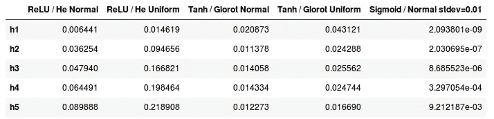***

***Ratio: standard deviation of gradients over standard deviation of weights***

***综上所述，对于一个 **ReLU** 激活的网络，使用**均匀分布**的 **He 初始化方案**是一个**不错的选择**；-)***

> ***有很多很多方法可以分析选择特定初始化方案的影响…我们可以尝试不同的网络架构(如“漏斗”或“沙漏”形状)，更深的网络，改变标签的分布(因此，损失)…我尝试了很多组合，他/统一总是优于其他初始化方案，但这篇文章已经太长了！***

# ***最后的想法***

***这是一篇 *looong* 的帖子，尤其是对于一个如此理所当然的话题，如**重量** **初始者**！但是我觉得，一个人要真正理解它的重要性，就应该遵循步骤，碰到导致现在使用的方案发展的问题。***

***尽管作为一名从业者，你知道用于初始化你的网络的"*正确的*"组合，我真的希望这篇文章能够给你一些**洞察**真正发生了什么，最重要的是，**为什么** *那个*特定组合是"*正确的*"一:-)***

****如果你有什么想法、评论或者问题，请在下方留言或者联系我* [*推特*](https://twitter.com/dvgodoy) *。****