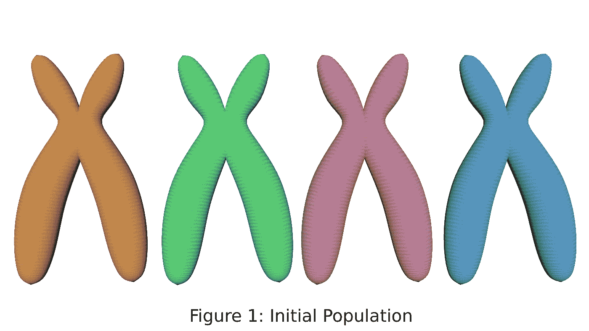
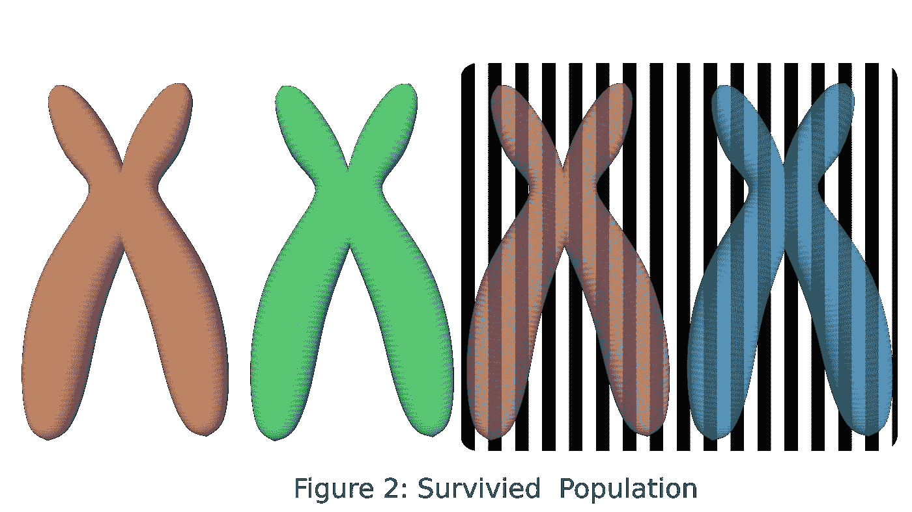
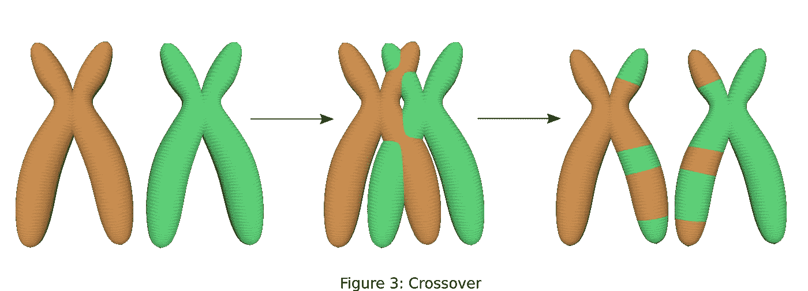
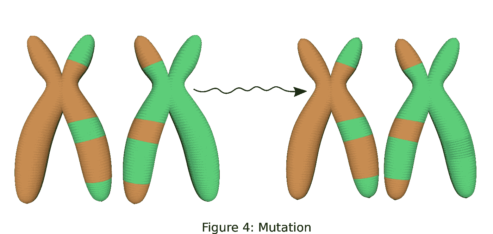
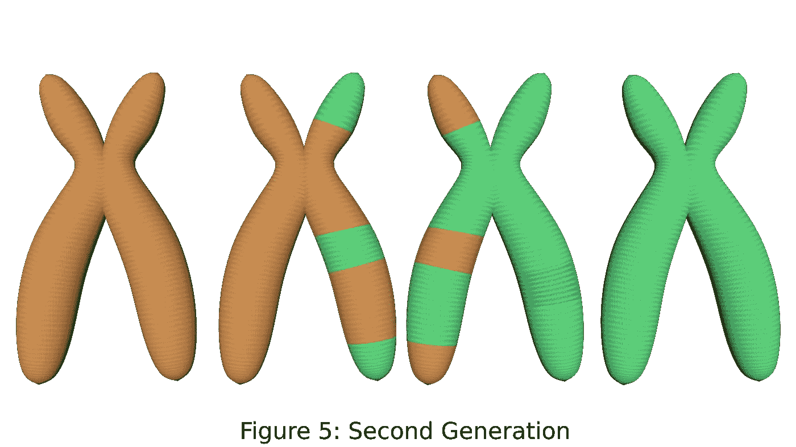
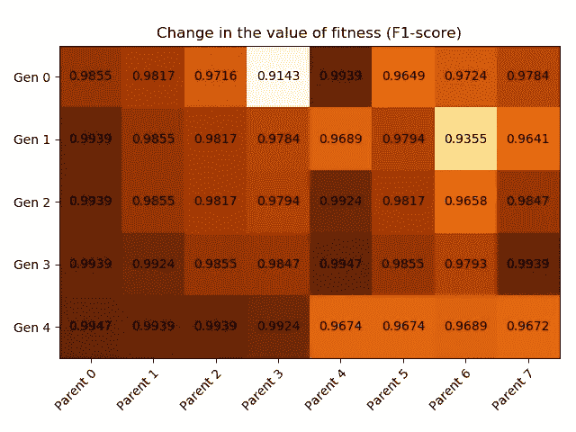

# 基于遗传算法的 XGBoost 超参数整定

> 原文：<https://towardsdatascience.com/hyperparameter-tuning-in-xgboost-using-genetic-algorithm-17bd2e581b17?source=collection_archive---------9----------------------->

# **简介**

在[维基百科](https://en.wikipedia.org/wiki/Genetic_algorithm)中定义的遗传算法，其灵感来自于[查尔斯·达尔文](https://en.wikipedia.org/wiki/Natural_selection)提出的自然选择过程。在更一般的术语中，我们可以理解自然过程以及它如何与遗传算法相关联，使用下面的描述:

我们从初始群体开始，它将具有某些特征，如图 1 所示。该初始群体将在特定环境中进行测试，以观察该群体中的个体(父母)基于预定义的适合度标准表现如何。在机器学习的情况下，适合度可以是任何性能度量——准确度、精确度、召回率、F1 分数、auc 等等。基于适应值，我们选择表现最好的父母(“适者生存”)，作为幸存的群体(图 2)。



(Image by author)



(Image by author)

现在幸存群体中的父母将通过结合两个步骤来交配产生后代:交叉/重组和突变。在杂交的情况下，来自交配父母的基因(参数)将被重组，以产生后代，每个孩子从每个父母那里继承一些基因(参数)(图 3)。



(Image by author)

最后，在突变的情况下，基因(参数)的一些值将被改变以保持遗传多样性(图 4)。这使得自然/遗传算法通常能够得到更好的解决方案。



(Image by author)

图 5 显示了第二代人口，包括幸存的父母和孩子。我们保留幸存的双亲，以便保留最佳适应度参数，以防后代的适应度值不如双亲。



(Image by author)

# **遗传算法模块为**[**XGBoost**](https://xgboost.readthedocs.io/en/latest/index.html)**:**

我们将创建一个为 XGBoost 定制的遗传算法模块。以下是 XGboost 的描述:

> **XGBoost** 是一个优化的分布式梯度增强库，旨在高效**、**灵活**、**便携**。它在[梯度提升](https://en.wikipedia.org/wiki/Gradient_boosting)框架下实现机器学习算法。**

**该模块将具有遵循四个步骤的函数:(I)初始化，(ii)选择，(iii)交叉，和(iv)变异，类似于上面讨论的内容(该代码的一小部分灵感来自帖子[这里](/genetic-algorithm-implementation-in-python-5ab67bb124a6))。**

****初始化:****

**第一步是初始化，参数被随机初始化以创建群体。它类似于图 1 所示的第一代人口。下面的代码显示了初始化过程，其中我们生成了一个包含参数的向量。对于 XGBoost，我们选择了 7 个参数进行优化:learning_rate、n_estimators、max_depth、min_child_weight、subsample、colsample_bytree 和 gamma。这些参数的详细描述可以在[这里](https://xgboost.readthedocs.io/en/latest/parameter.html)找到。**

```
def initilialize_poplulation(numberOfParents):
    learningRate = np.empty([numberOfParents, 1])
    nEstimators = np.empty([numberOfParents, 1], dtype = np.uint8)
    maxDepth = np.empty([numberOfParents, 1], dtype = np.uint8)
    minChildWeight = np.empty([numberOfParents, 1])
    gammaValue = np.empty([numberOfParents, 1])
    subSample = np.empty([numberOfParents, 1])
    colSampleByTree =  np.empty([numberOfParents, 1])for i in range(numberOfParents):
        print(i)
        learningRate[i] = round(random.uniform(0.01, 1), 2)
        nEstimators[i] = random.randrange(10, 1500, step = 25)
        maxDepth[i] = int(random.randrange(1, 10, step= 1))
        minChildWeight[i] = round(random.uniform(0.01, 10.0), 2)
        gammaValue[i] = round(random.uniform(0.01, 10.0), 2)
        subSample[i] = round(random.uniform(0.01, 1.0), 2)
        colSampleByTree[i] = round(random.uniform(0.01, 1.0), 2)

    population = np.concatenate((learningRate, nEstimators, maxDepth, minChildWeight, gammaValue, subSample, colSampleByTree), axis= 1)
    return population
```

**参数的限制要么基于 XGBoost 文档中描述的限制，要么基于合理的猜测(如果上限设置为无穷大)。我们首先为每个参数创建一个空数组，然后用随机值填充它。**

****亲代选择(适者生存)****

**在第二步中，我们使用初始群体训练我们的模型，并计算适应值。在这种情况下，我们将计算 F1 分数。**

```
def fitness_f1score(y_true, y_pred):
    fitness = round((f1_score(y_true, y_pred, average='weighted')), 4)
    return fitness#train the data annd find fitness score
def train_population(population, dMatrixTrain, dMatrixtest, y_test):
    fScore = []
    for i in range(population.shape[0]):
        param = { 'objective':'binary:logistic',
              'learning_rate': population[i][0],
              'n_estimators': population[i][1], 
              'max_depth': int(population[i][2]), 
              'min_child_weight': population[i][3],
              'gamma': population[i][4], 
              'subsample': population[i][5],
              'colsample_bytree': population[i][6],
              'seed': 24}
        num_round = 100
        xgbT = xgb.train(param, dMatrixTrain, num_round)
        preds = xgbT.predict(dMatrixtest)
        preds = preds>0.5
        fScore.append(fitness_f1score(y_test, preds))
    return fScore
```

**我们将定义我们想要选择多少个父节点，并根据它们的适合度值用所选择的父节点创建一个数组。**

```
#select parents for mating
def new_parents_selection(population, fitness, numParents):
    selectedParents = np.empty((numParents, population.shape[1])) #create an array to store fittest parents

    #find the top best performing parents
    for parentId in range(numParents):
        bestFitnessId = np.where(fitness == np.max(fitness))
        bestFitnessId  = bestFitnessId[0][0]
        selectedParents[parentId, :] = population[bestFitnessId, :]
        fitness[bestFitnessId] = -1 #set this value to negative, in case of F1-score, so this parent is not selected again
    return selectedParents
```

****交叉****

**在[遗传算法](https://en.wikipedia.org/wiki/Crossover_(genetic_algorithm)) [、](https://en.wikipedia.org/wiki/Crossover_(genetic_algorithm)),)的情况下，有多种方法定义交叉，如单点、两点和 k 点交叉，均匀交叉和有序列表交叉。我们将使用均匀交叉，其中孩子的每个参数将基于某种分布从父母中独立选择。在我们的例子中，我们将使用来自 [numpy 随机函数](https://docs.scipy.org/doc/numpy/reference/generated/numpy.random.randint.html#numpy.random.randint)的“离散均匀”分布。**

```
'''
Mate these parents to create children having parameters from these parents (we are using uniform crossover method)
'''
def crossover_uniform(parents, childrenSize):

    crossoverPointIndex = np.arange(0, np.uint8(childrenSize[1]), 1, dtype= np.uint8) #get all the index
    crossoverPointIndex1 = np.random.randint(0, np.uint8(childrenSize[1]), np.uint8(childrenSize[1]/2)) # select half  of the indexes randomly
    crossoverPointIndex2 = np.array(list(set(crossoverPointIndex) - set(crossoverPointIndex1))) #select leftover indexes

    children = np.empty(childrenSize)

    '''
    Create child by choosing parameters from two parents selected using new_parent_selection function. The parameter values
    will be picked from the indexes, which were randomly selected above. 
    '''
    for i in range(childrenSize[0]):

        #find parent 1 index 
        parent1_index = i%parents.shape[0]
        #find parent 2 index
        parent2_index = (i+1)%parents.shape[0]
        #insert parameters based on random selected indexes in parent 1
        children[i, crossoverPointIndex1] = parents[parent1_index, crossoverPointIndex1]
        #insert parameters based on random selected indexes in parent 1
        children[i, crossoverPointIndex2] = parents[parent2_index, crossoverPointIndex2]
    return children
```

****突变****

**最后一步将是通过随机选择一个参数并以一个[随机量](https://en.wikipedia.org/wiki/Mutation_(genetic_algorithm))改变它的值，在孩子中引入多样性。我们还将引入一些限制，以便将改变的值限制在一定的范围内。跳过这些约束可能会导致错误。**

```
def mutation(crossover, numberOfParameters):
    #Define minimum and maximum values allowed for each parameterminMaxValue = np.zeros((numberOfParameters, 2))

    minMaxValue[0:] = [0.01, 1.0] #min/max learning rate
    minMaxValue[1, :] = [10, 2000] #min/max n_estimator
    minMaxValue[2, :] = [1, 15] #min/max depth
    minMaxValue[3, :] = [0, 10.0] #min/max child_weight
    minMaxValue[4, :] = [0.01, 10.0] #min/max gamma
    minMaxValue[5, :] = [0.01, 1.0] #min/maxsubsample
    minMaxValue[6, :] = [0.01, 1.0] #min/maxcolsample_bytree

    # Mutation changes a single gene in each offspring randomly.
    mutationValue = 0
    parameterSelect = np.random.randint(0, 7, 1)
    print(parameterSelect)
    if parameterSelect == 0: #learning_rate
        mutationValue = round(np.random.uniform(-0.5, 0.5), 2)
    if parameterSelect == 1: #n_estimators
        mutationValue = np.random.randint(-200, 200, 1)
    if parameterSelect == 2: #max_depth
        mutationValue = np.random.randint(-5, 5, 1)
    if parameterSelect == 3: #min_child_weight
        mutationValue = round(np.random.uniform(5, 5), 2)
    if parameterSelect == 4: #gamma
        mutationValue = round(np.random.uniform(-2, 2), 2)
    if parameterSelect == 5: #subsample
        mutationValue = round(np.random.uniform(-0.5, 0.5), 2)
    if parameterSelect == 6: #colsample
        mutationValue = round(np.random.uniform(-0.5, 0.5), 2)

    #indtroduce mutation by changing one parameter, and set to max or min if it goes out of range
    for idx in range(crossover.shape[0]):
        crossover[idx, parameterSelect] = crossover[idx, parameterSelect] + mutationValue
        if(crossover[idx, parameterSelect] > minMaxValue[parameterSelect, 1]):
            crossover[idx, parameterSelect] = minMaxValue[parameterSelect, 1]
        if(crossover[idx, parameterSelect] < minMaxValue[parameterSelect, 0]):
            crossover[idx, parameterSelect] = minMaxValue[parameterSelect, 0]    
    return crossover
```

# ****实施****

**我们将实现上面讨论的模块，在数据集上进行训练。数据集来自 [UCI 机器学习库](https://archive.ics.uci.edu/ml/machine-learning-databases/musk/)。它包含一组 102 个分子，其中 39 个被人类识别为具有可用于香水的气味，69 个没有所需的气味。该数据集包含这些分子的 6，590 个低能构象，包含 166 个特征。我们正在做最少的前置处理，作为本教程理解遗传算法的目标。**

```
# Importing the libraries
import numpy as np
import pandas as pd
import geneticXGboost #this is the module we crated above
import xgboost as xgbnp.random.seed(723)# Importing the dataset
dataset = pd.read_csv('clean2.data', header=None)X = dataset.iloc[:, 2:168].values #discard first two coloums as these are molecule's name and conformation's namey = dataset.iloc[:, 168].values #extrtact last coloum as class (1 => desired odor, 0 => undesired odor)# Splitting the dataset into the Training set and Test set
from sklearn.model_selection import train_test_split
X_train, X_test, y_train, y_test = train_test_split(X, y, test_size = 0.20, random_state = 97)# Feature Scaling
from sklearn.preprocessing import StandardScaler
sc = StandardScaler()
X_train = sc.fit_transform(X_train)
X_test = sc.transform(X_test)#XGboost Classifier#model xgboost
#use xgboost API now
xgDMatrix = xgb.DMatrix(X_train, y_train) #create Dmatrix
xgbDMatrixTest = xgb.DMatrix(X_test, y_test)
```

**我们有 8 个父母开始，我们选择 4 个最合适的父母交配。我们将创建 4 代并监控适应度(F1 分数)。下一代中有一半的父母将是从上一代中选出的最适合的父母。这将允许我们保持最好的健康分数至少与上一代相同，以防孩子的健康分数更差。**

```
numberOfParents = 8 #number of parents to start
numberOfParentsMating = 4 #number of parents that will mate
numberOfParameters = 7 #number of parameters that will be optimized
numberOfGenerations = 4 #number of genration that will be created#define the population sizepopulationSize = (numberOfParents, numberOfParameters)#initialize the population with randomly generated parameters
population = geneticXGboost.initilialize_poplulation(numberOfParents)#define an array to store the fitness  hitory
fitnessHistory = np.empty([numberOfGenerations+1, numberOfParents])#define an array to store the value of each parameter for each parent and generation
populationHistory = np.empty([(numberOfGenerations+1)*numberOfParents, numberOfParameters])#insert the value of initial parameters in history
populationHistory[0:numberOfParents, :] = populationfor generation in range(numberOfGenerations):
    print("This is number %s generation" % (generation))

    #train the dataset and obtain fitness
    fitnessValue = geneticXGboost.train_population(population=population, dMatrixTrain=xgDMatrix, dMatrixtest=xgbDMatrixTest, y_test=y_test)
    fitnessHistory[generation, :] = fitnessValue

    #best score in the current iteration
    print('Best F1 score in the this iteration = {}'.format(np.max(fitnessHistory[generation, :])))#survival of the fittest - take the top parents, based on the fitness value and number of parents needed to be selected
    parents = geneticXGboost.new_parents_selection(population=population, fitness=fitnessValue, numParents=numberOfParentsMating)

    #mate these parents to create children having parameters from these parents (we are using uniform crossover)
    children = geneticXGboost.crossover_uniform(parents=parents, childrenSize=(populationSize[0] - parents.shape[0], numberOfParameters))

    #add mutation to create genetic diversity
    children_mutated = geneticXGboost.mutation(children, numberOfParameters)

    '''
    We will create new population, which will contain parents that where selected previously based on the
    fitness score and rest of them  will be children
    '''
    population[0:parents.shape[0], :] = parents #fittest parents
    population[parents.shape[0]:, :] = children_mutated #children

    populationHistory[(generation+1)*numberOfParents : (generation+1)*numberOfParents+ numberOfParents , :] = population #srore parent information
```

**最后，我们得到最佳分数和相关参数:**

```
#Best solution from the final iterationfitness = geneticXGboost.train_population(population=population, dMatrixTrain=xgDMatrix, dMatrixtest=xgbDMatrixTest, y_test=y_test)
fitnessHistory[generation+1, :] = fitness#index of the best solution
bestFitnessIndex = np.where(fitness == np.max(fitness))[0][0]#Best fitness
print("Best fitness is =", fitness[bestFitnessIndex])#Best parameters
print("Best parameters are:")
print('learning_rate', population[bestFitnessIndex][0])
print('n_estimators', population[bestFitnessIndex][1])
print('max_depth', int(population[bestFitnessIndex][2])) 
print('min_child_weight', population[bestFitnessIndex][3])
print('gamma', population[bestFitnessIndex][4])
print('subsample', population[bestFitnessIndex][5])
print('colsample_bytree', population[bestFitnessIndex][6])
```

**现在让我们想象一下每一代人在健康方面的变化(下图)。虽然我们已经从高 F1 分数(~0.98)开始，但在随机产生的初始群体中的两个亲本中，我们能够在最终一代中进一步改进它。初始群体中父母一方的最低 F1 值为 0.9143，最终世代中父母一方的最高 F1 值为 0.9947。这表明我们可以通过遗传算法的简单实现来改进 XGBoost 中的性能指标。最终代码可以在[我的 github 账号](https://github.com/mjain72/Hyperparameter-tuning-in-XGBoost-using-genetic-algorithm)找到。它还包含允许您观察每一代中各种参数的变化的代码。**

****

**(Image by author)**