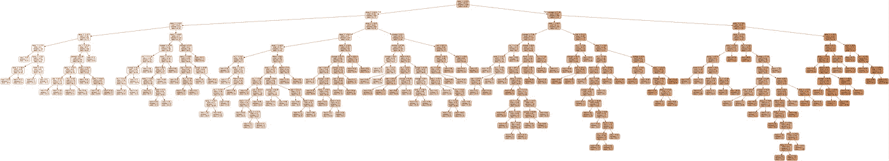
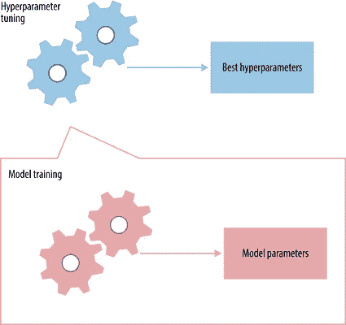
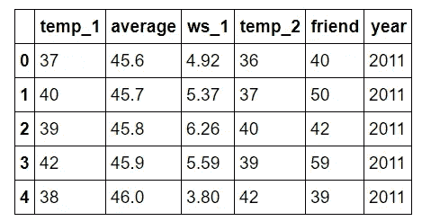
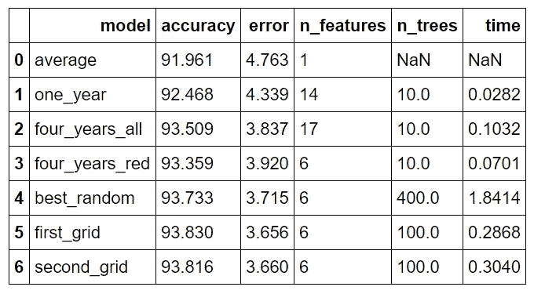
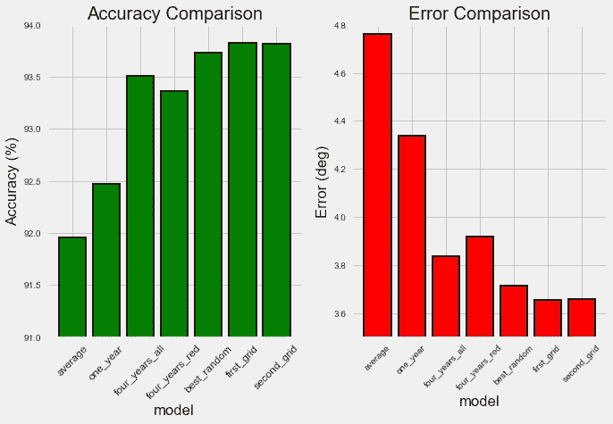
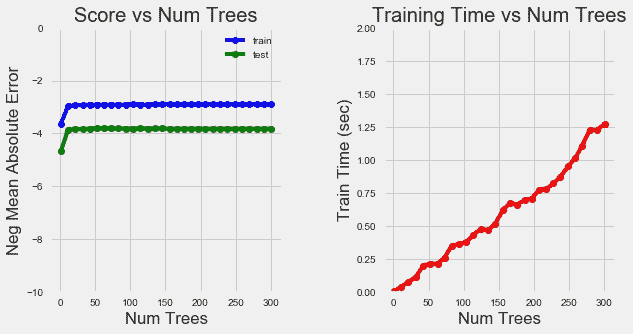
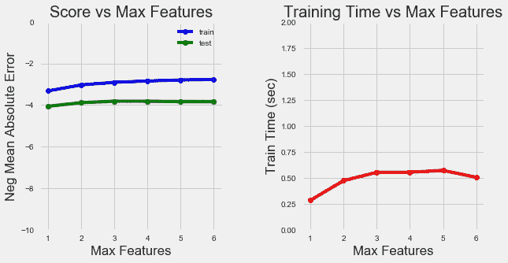

# Python 中随机森林的超参数调优

> 原文：<https://towardsdatascience.com/hyperparameter-tuning-the-random-forest-in-python-using-scikit-learn-28d2aa77dd74?source=collection_archive---------0----------------------->


**改进随机森林第二部分**

因此，我们建立了一个随机森林模型来解决我们的机器学习问题(也许通过遵循这个[端到端指南](/random-forest-in-python-24d0893d51c0))，但我们对结果并不太满意。我们有什么选择？正如我们在这个系列的第一部分的[中看到的，我们的第一步应该是收集更多的数据并执行特征工程。收集更多的数据和特征工程通常在投入的时间和提高的性能方面有最大的回报，但是当我们用尽所有数据源时，是时候继续进行模型超参数调整了。这篇文章将关注使用 Scikit-Learn 工具优化 Python 中的随机森林模型。虽然这篇文章建立在第一部分的基础上，但它完全独立，我们将涵盖许多广泛适用的机器学习概念。](/improving-random-forest-in-python-part-1-893916666cd)



One Tree in a Random Forest

我在本文中包含了 Python 代码，这是最有启发性的。完整的代码和数据可以在 Github 页面上找到。

# 超参数调谐的简要说明

思考超参数的最佳方式就像可以调整以优化性能的算法的设置，就像我们可能转动 AM 收音机的旋钮以获得清晰的信号一样(或者你的父母可能有！).虽然模型*参数*是在训练期间学习的，例如线性回归中的斜率和截距，但是*超参数*必须由数据科学家在训练之前设置。在随机森林的情况下，超参数包括森林中决策树的数量以及分割节点时每棵树考虑的特征的数量。(随机森林的参数是用于分割在训练期间学习的每个节点的变量和阈值)。Scikit-Learn 为所有模型实现了一组[合理的默认超参数](https://arxiv.org/abs/1309.0238)，但这些参数并不能保证对某个问题是最优的。最好的超参数通常不可能提前确定，而调整模型是机器学习从科学转向基于试错的工程的地方。



Hyperparameters and Parameters

超参数调整更多地依赖于实验结果而不是理论，因此确定最佳设置的最佳方法是尝试许多不同的组合来评估每个模型的性能。然而，仅在训练集上评估每个模型会导致机器学习中最基本的问题之一:[过拟合](https://elitedatascience.com/overfitting-in-machine-learning)。

如果我们为训练数据优化模型，那么我们的模型将在训练集上得分很高，但是将不能推广到新数据，例如在测试集中。当一个模型在训练集上表现很好，但在测试集上表现很差时，这被称为过度拟合，或者本质上是创建一个非常了解训练集但不能应用于新问题的模型。这就像一个学生背了课本上的简单问题，却不知道如何在杂乱的现实世界中应用概念。

过度拟合模型在训练集上可能看起来令人印象深刻，但在实际应用中却毫无用处。因此，超参数优化的标准程序通过[交叉验证](http://scikit-learn.org/stable/modules/cross_validation.html)解决过拟合问题。

# 交互效度分析

交叉验证(CV)技术最好用最常用的方法 [K 倍 CV 举例说明。](http://statweb.stanford.edu/~tibs/sta306bfiles/cvwrong.pdf)当我们处理机器学习问题时，我们确保将我们的数据分成训练集和测试集。在 K-Fold CV 中，我们进一步将我们的训练集分成 K 个子集，称为折叠。然后，我们迭代拟合模型 K 次，每次在第 K-1 个褶皱上训练数据，并在第 K 个褶皱上评估(称为验证数据)。例如，考虑拟合 K = 5 的模型。第一次迭代我们在前四次折叠上训练，在第五次折叠上评估。第二次我们在第一、第二、第三和第五次折叠时进行训练，在第四次折叠时进行评估。我们重复这个过程 3 次以上，每次评估不同的折叠。在训练的最后，我们对每个折叠的性能进行平均，以得出模型的最终验证指标。


5 Fold Cross Validation ([Source](https://stackoverflow.com/questions/31947183/how-to-implement-walk-forward-testing-in-sklearn))

对于超参数调整，我们对整个 K-Fold CV 过程进行多次迭代，每次都使用不同的模型设置。然后，我们比较所有的模型，选择最好的一个，在完整的训练集上训练它，然后在测试集上进行评估。这听起来是一个非常乏味的过程！每当我们想要评估一组不同的超参数时，我们必须将我们的训练数据分成 K 份，并训练和评估 K 次。如果我们有 10 组超参数，并且使用 5 重 CV，则代表 50 个训练循环。幸运的是，与机器学习中的大多数问题一样，有人已经解决了我们的问题，并且可以在 Scikit-Learn 中自动实现 K-Fold CV 的模型调整。

# Scikit-Learn 中的随机搜索交叉验证

通常，我们对最佳超参数只有一个模糊的概念，因此缩小搜索范围的最佳方法是评估每个超参数的大范围值。使用 Scikit-Learn 的 RandomizedSearchCV 方法，我们可以定义一个超参数范围网格，并从网格中随机采样，对每个值组合执行 K 倍 CV。

在我们进入模型调整之前，简单回顾一下，我们正在处理一个监督回归机器学习问题。我们试图使用过去的历史天气数据来预测我们城市(华盛顿州西雅图市)明天的温度。我们有 4.5 年的训练数据，1.5 年的测试数据，并使用 6 个不同的特征(变量)来进行预测。(要查看数据准备的完整代码，请参见[笔记本](https://github.com/WillKoehrsen/Machine-Learning-Projects/blob/master/random_forest_explained/Improving%20Random%20Forest%20Part%202.ipynb))。

让我们快速检查一下特性。



Features for Temperature Prediction

*   temp_1 =前一天的最高温度(华氏度)
*   平均值=历史平均最高温度
*   ws_1 =前一天的平均风速
*   temp_2 =两天前的最高温度
*   朋友=来自我们“信任的”朋友的预测
*   年份=日历年

在以前的帖子中，我们检查了数据以检查异常，我们知道我们的数据是干净的。因此，我们可以跳过数据清理，直接进入超参数调优。

为了查看可用的超参数，我们可以创建一个随机森林并检查默认值。

```
from sklearn.ensemble import RandomForestRegressorrf = RandomForestRegressor(random_state = 42)from pprint import pprint# Look at parameters used by our current forest
print('Parameters currently in use:\n')
pprint(rf.get_params())**Parameters currently in use:

{'bootstrap': True,
 'criterion': 'mse',
 'max_depth': None,
 'max_features': 'auto',
 'max_leaf_nodes': None,
 'min_impurity_decrease': 0.0,
 'min_impurity_split': None,
 'min_samples_leaf': 1,
 'min_samples_split': 2,
 'min_weight_fraction_leaf': 0.0,
 'n_estimators': 10,
 'n_jobs': 1,
 'oob_score': False,
 'random_state': 42,
 'verbose': 0,
 'warm_start': False}**
```

哇，这是一个相当压倒性的名单！我们如何知道从哪里开始？一个好地方是 Scikit-Learn 中关于随机森林的[文档。这告诉我们最重要的设置是森林中的树的数量(n_estimators)和考虑在每个叶节点进行分裂的特征的数量(max_features)。我们可以去阅读](http://scikit-learn.org/stable/modules/generated/sklearn.ensemble.RandomForestClassifier.html)[关于随机森林](https://www.stat.berkeley.edu/~breiman/randomforest2001.pdf)的研究论文，并尝试将最佳超参数理论化，但更有效地利用我们的时间只是尝试各种各样的值，看看什么有效！我们将尝试调整以下一组超参数:

*   n_estimators =前集中的树的数量
*   max_features =分割结点时考虑的最大要素数
*   max_depth =每个决策树中的最大级别数
*   min_samples_split =分割节点前放置在节点中的最小数据点数
*   min_samples_leaf =叶节点中允许的最小数据点数
*   bootstrap =数据点采样方法(有或没有替换)

## 随机超参数网格

要使用 RandomizedSearchCV，我们首先需要创建一个参数网格，以便在拟合过程中进行采样:

```
from sklearn.model_selection import RandomizedSearchCV# Number of trees in random forest
n_estimators = [int(x) for x in np.linspace(start = 200, stop = 2000, num = 10)]
# Number of features to consider at every split
max_features = ['auto', 'sqrt']
# Maximum number of levels in tree
max_depth = [int(x) for x in np.linspace(10, 110, num = 11)]
max_depth.append(None)
# Minimum number of samples required to split a node
min_samples_split = [2, 5, 10]
# Minimum number of samples required at each leaf node
min_samples_leaf = [1, 2, 4]
# Method of selecting samples for training each tree
bootstrap = [True, False]# Create the random grid
random_grid = {'n_estimators': n_estimators,
               'max_features': max_features,
               'max_depth': max_depth,
               'min_samples_split': min_samples_split,
               'min_samples_leaf': min_samples_leaf,
               'bootstrap': bootstrap}pprint(random_grid)**{'bootstrap': [True, False],
 'max_depth': [10, 20, 30, 40, 50, 60, 70, 80, 90, 100, None],
 'max_features': ['auto', 'sqrt'],
 'min_samples_leaf': [1, 2, 4],
 'min_samples_split': [2, 5, 10],
 'n_estimators': [200, 400, 600, 800, 1000, 1200, 1400, 1600, 1800, 2000]}**
```

在每次迭代中，算法将选择特征的不同组合。总共有 2 * 12 * 2 * 3 * 3 * 10 = 4320 个设置！然而，随机搜索的好处是，我们不是在尝试每一种组合，而是随机选择大范围的值进行采样。

## 随机搜索训练

现在，我们实例化随机搜索，并像任何 Scikit-Learn 模型一样拟合它:

```
# Use the random grid to search for best hyperparameters
# First create the base model to tune
rf = RandomForestRegressor()
# Random search of parameters, using 3 fold cross validation, 
# search across 100 different combinations, and use all available cores
rf_random = RandomizedSearchCV(estimator = rf, param_distributions = random_grid, n_iter = 100, cv = 3, verbose=2, random_state=42, n_jobs = -1)# Fit the random search model
rf_random.fit(train_features, train_labels)
```

RandomizedSearchCV 中最重要的参数是 n_iter，它控制要尝试的不同组合的数量，以及 CV，它是用于交叉验证的折叠数(我们分别使用 100 和 3)。更多的迭代将覆盖更宽的搜索空间，更多的 cv 折叠将减少过度拟合的机会，但提高每个将增加运行时间。机器学习是一个需要权衡的领域，性能与时间是最基本的因素之一。

我们可以通过拟合随机搜索来查看最佳参数:

```
rf_random.best_params_**{'bootstrap': True,
 'max_depth': 70,
 'max_features': 'auto',
 'min_samples_leaf': 4,
 'min_samples_split': 10,
 'n_estimators': 400}**
```

根据这些结果，我们应该能够缩小每个超参数的取值范围。

## 评估随机搜索

为了确定随机搜索是否产生了更好的模型，我们将基础模型与最佳随机搜索模型进行比较。

```
def evaluate(model, test_features, test_labels):
    predictions = model.predict(test_features)
    errors = abs(predictions - test_labels)
    mape = 100 * np.mean(errors / test_labels)
    accuracy = 100 - mape
    print('Model Performance')
    print('Average Error: {:0.4f} degrees.'.format(np.mean(errors)))
    print('Accuracy = {:0.2f}%.'.format(accuracy))

    return accuracybase_model = RandomForestRegressor(n_estimators = 10, random_state = 42)
base_model.fit(train_features, train_labels)
base_accuracy = evaluate(base_model, test_features, test_labels)**Model Performance
Average Error: 3.9199 degrees.
Accuracy = 93.36%.**best_random = rf_random.best_estimator_
random_accuracy = evaluate(best_random, test_features, test_labels)**Model Performance
Average Error: 3.7152 degrees.
Accuracy = 93.73%.**print('Improvement of {:0.2f}%.'.format( 100 * (random_accuracy - base_accuracy) / base_accuracy))**Improvement of 0.40%.**
```

我们取得了 0.4%的不引人注目的精度改进。不过，根据应用程序的不同，这可能是一个显著的优势。我们可以通过使用网格搜索来集中在随机搜索中找到的最有希望的超参数范围上，从而进一步改进我们的结果。

# 交叉验证网格搜索

随机搜索允许我们缩小每个超参数的范围。既然我们知道了集中搜索的位置，我们就可以显式地指定要尝试的每种设置组合。我们使用 GridSearchCV 来完成这项工作，这种方法不是从分布中随机抽样，而是评估我们定义的所有组合。要使用网格搜索，我们根据随机搜索提供的最佳值制作另一个网格:

```
from sklearn.model_selection import GridSearchCV# Create the parameter grid based on the results of random search 
param_grid = {
    'bootstrap': [True],
    'max_depth': [80, 90, 100, 110],
    'max_features': [2, 3],
    'min_samples_leaf': [3, 4, 5],
    'min_samples_split': [8, 10, 12],
    'n_estimators': [100, 200, 300, 1000]
}# Create a based model
rf = RandomForestRegressor()# Instantiate the grid search model
grid_search = GridSearchCV(estimator = rf, param_grid = param_grid, 
                          cv = 3, n_jobs = -1, verbose = 2)
```

这将尝试 1 * 4 * 2 * 3 * 3 * 4 = 288 种设置组合。我们可以拟合模型，显示最佳超参数，并评估性能:

```
# Fit the grid search to the data
grid_search.fit(train_features, train_labels)grid_search.best_params_**{'bootstrap': True,
 'max_depth': 80,
 'max_features': 3,
 'min_samples_leaf': 5,
 'min_samples_split': 12,
 'n_estimators': 100}**best_grid = grid_search.best_estimator_
grid_accuracy = evaluate(best_grid, test_features, test_labels)**Model Performance
Average Error: 3.6561 degrees.
Accuracy = 93.83%.**print('Improvement of {:0.2f}%.'.format( 100 * (grid_accuracy - base_accuracy) / base_accuracy))**Improvement of 0.50%.**
```

看起来我们已经达到了最大的性能，但是我们可以从之前的结果中进一步细化网格，再试一次。代码和以前一样，只是网格不同，所以我只给出结果:

```
**Model Performance
Average Error: 3.6602 degrees.
Accuracy = 93.82%.****Improvement of 0.49%.**
```

性能的小幅下降表明我们已经达到了超参数调优的收益递减。我们可以继续，但回报最多也是微乎其微。

# 比较

我们可以对用于提高性能的不同方法进行一些快速比较，显示每种方法的回报。下表显示了我们所做的所有改进的最终结果(包括第一部分的改进):



Comparison of All Models

Model 是模型的(非常缺乏想象力的)名称，accuracy 是百分比精度，error 是以度为单位的平均绝对误差，n_features 是数据集中的要素数，n_trees 是森林中决策树的数量，time 是以秒为单位的训练和预测时间。

这些模型如下:

*   平均值:通过预测测试集中每天的历史平均最高温度来计算原始基线
*   一年:使用一年的数据训练的模型
*   four_years_all:使用 4.5 年的数据和扩展特征训练的模型(详见第一部分)
*   four_years_red:使用 4.5 年的数据和最重要特征的子集训练的模型
*   best_random:交叉验证随机搜索的最佳模型
*   first_grid:交叉验证的第一次网格搜索的最佳模型(被选为最终模型)
*   second_grid:第二次网格搜索的最佳模型

**总体而言，收集更多的数据和特征选择将误差降低了 17.69%，而超参数进一步将误差降低了 6.73%。**



Model Comparison (see Notebook for code)

就程序员工时而言，收集数据需要大约 6 个小时，而超参数调优需要大约 3 个小时。就像生活中的任何追求一样，在某个点上追求进一步的优化是不值得努力的，知道什么时候停止和能够继续下去一样重要(抱歉，变得如此哲学化)。此外，在任何数据问题中，都有所谓的[贝叶斯错误率](https://en.wikipedia.org/wiki/Bayes_error_rate)，这是一个问题中绝对最小的可能错误。贝叶斯误差，也称为可再现误差，是潜在变量、影响我们无法测量的问题的因素以及任何物理过程中的固有噪声的组合。因此，创造一个完美的模型是不可能的。尽管如此，在这个例子中，我们能够通过超参数调整显著改进我们的模型，并且我们涵盖了许多广泛适用的机器学习主题。

# **训练可视化**

为了进一步分析超参数优化的过程，我们可以一次更改一个设置，并查看对模型性能的影响(本质上是进行一个受控实验)。例如，我们可以创建一个包含一定数量的树的网格，执行网格搜索 CV，然后绘制结果。绘制训练和测试误差以及训练时间将允许我们检查改变一个超参数如何影响模型。

首先，我们可以看看改变森林中树木数量的影响。(有关训练和绘图代码，请参见笔记本)



Number of Trees Training Curves

随着树的数量增加，我们的误差减少到一定程度。将树的数量增加到超过 20(我们的最终模型有 100)在准确性方面没有太大的好处，并且训练时间持续增加。

我们还可以检查分割节点的特征数量曲线:



Number of Features Training Curves

随着保留的特征数量的增加，模型的准确性也如预期的那样增加。训练时间也增加了，尽管并不显著。

结合定量统计，这些视觉效果可以让我们很好地了解我们使用不同超参数组合所做的权衡。虽然通常没有办法提前知道什么设置会工作得最好，但这个例子展示了 Python 中的简单工具，这些工具允许我们优化我们的机器学习模型。

一如既往，我欢迎反馈和建设性的批评。可以在 wjk68@case.edu 找到我