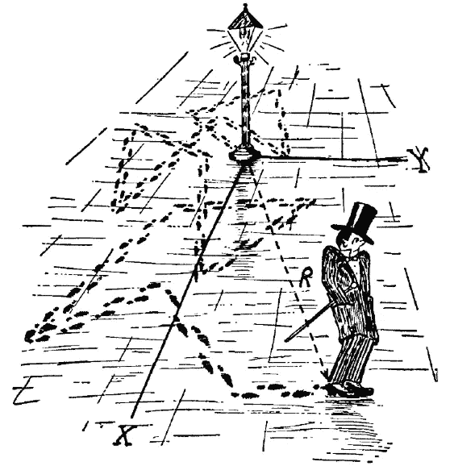
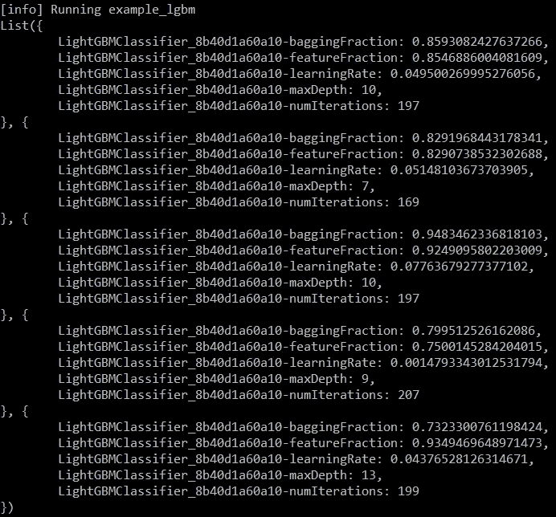

# 调谐超参数(二):火花的随机搜索

> 原文：<https://towardsdatascience.com/hyperparameters-part-ii-random-search-on-spark-77667e68b606?source=collection_archive---------4----------------------->

在本系列的第二部分中，我将继续我的超参数优化策略，这一次我想从 Spark 的角度更仔细地看看**。该系列的每个部分都可以单独阅读，请随意查看[第一部分](https://medium.com/machine-learning-rambling/tuning-hyperparameters-part-i-successivehalving-c6c602865619)。**

# **随机搜索和分布式机器学习框架**

**不管你的算法设计得多好，数学可能有多美，如果客户需要在大量数据上相对较短的训练时间，你最好找到一种方法来提供！**

**幸运的是，分布式计算是随机搜索果冻的花生酱。让我们提醒一下为什么**随机搜索**比**网格搜索**效率高？**

**最大的敌人是维度的诅咒。对于附加的超参数，以及它们各自选择的值，会成倍增加搜索时间。与其固定搜索空间的值，还不如对其进行采样。为了理解这一点，让我们看一下图 1。摘自[原文](http://www.jmlr.org/papers/volume13/bergstra12a/bergstra12a.pdf)。**

****

**Figure 1: Grid Search vs Random Search**

**正如我们所见，在搜索中经常出现的情况，一些超参数比其他的更具决定性。在**网格搜索**的情况下，尽管采样了 9 次试验，实际上我们只试验了一个重要参数的 3 个不同值。在**随机搜索**的情况下，9 次试验将测试 9 个不同的决定性参数值。**

**因为超参数配置的每个样本都是彼此独立绘制的，所以我们可以看到并行化是多么容易！于是，火花来了！**

# **火花**

****

**[**Spark**](https://spark.apache.org/) 是一个流行的开源框架，用于在集群上进行分布式计算，提供了一个广泛的库，用于操作数据库、流、分布式图形处理，最重要的是本讨论中的机器学习，即 Spark MLlib。**

**由于微软 Azure 机器学习团队的工作，Spark MLlib 最近获得了巨大的推动，该团队发布了 [**MMLSpark**](https://github.com/Azure/mmlspark) 。从实用机器学习的角度来看，MMLSpark 最显著的功能是访问极端梯度增强库 **Lighgbm** ，这是大多数数据科学概念证明的快速制胜方法。**

**既然每个数据科学家最喜欢的库都可以在集群上训练，我们只差一个合适的超参数调整框架了。遗憾的是，最初的 Spark MLlib 只有一个网格搜索的实现。MMLSpark 提供了带**随机搜索**的超调，但遗憾的是采样只有**统一**。**

# **实际上…**

**均匀采样是一个很好的步骤，但对于许多超参数来说不是最佳的。在 Lightgbm 等极端梯度推进算法的情况下，学习率和正则化超参数浮现在脑海中。这些参数应该在对数尺度上采样，而不是在一个间隔内均匀采样。**

**那么我们如何黑 Spark MLlib 来满足我们的需求呢？**

**下面让我们先来看看 **Spark** 中的关键成分。**

**正如我们所看到的，超参数值的网格被定义为 ParamMap 类型的数组，来自 ParamGridBuilder 类的一个实例。因此，为了保持与 Spark 的 CrossValidator 兼容，让我们继续并重新定义 **build()** 和 **addGrid** 方法。**

**我们不是在网格中添加一个超参数值列表，而是定义一个分布，稍后我们将从该分布中抽取配置样本。**

**[**Breeze**](https://github.com/scalanlp/breeze)**是一个流行的用于数值处理的 scala 库，在 breeze.stats.distributions 中有各种各样的分布。
例如，在逻辑回归的情况下，我们可能希望定义以下采样空间:****

****一方面，我们希望从分布中取样，另一方面，在一组分类选择的情况下，我们应该能够设置一组选择。****

****我们可以提出以下解决方案，****

****现在让我们对 LightGBM 进行最后一次测试，****

****我们走吧！****

********

****更多例子的代码可以在 [**这里**](https://github.com/benoitdescamps/Hyperparameters-tuning) 找到。****

# ****我写了更多精彩的东西！****

****@ [调整超参数(第一部分):成功减半](https://medium.com/machine-learning-rambling/tuning-hyperparameters-part-i-successivehalving-c6c602865619)****

****@[tensor flow 中的自定义优化器](https://www.kdnuggets.com/2018/01/custom-optimizer-tensorflow.html)****

****@[XG boost 回归预测区间](https://medium.com/bigdatarepublic/regression-prediction-intervals-with-xgboost-428e0a018b)****

# ****参考资料:****

1.  ****J.Bergstra 和 Y. Bengio，超参数优化的随机搜索，2011 年****
2.  ****https://spark.apache.org/[星火](https://spark.apache.org/)****
3.  ****https://github.com/Azure/mmlspark****
4.  ****微风，[https://github.com/scalanlp/breeze](https://github.com/scalanlp/breeze)****
5.  ****J.Bergstra，R. Bardenet，Y. Bengio，B. Kégl，超参数优化算法****
6.  ****github:[https://github.com/benoitdescamps/Hyperparameters-tuning](https://github.com/benoitdescamps/Hyperparameters-tuning)****