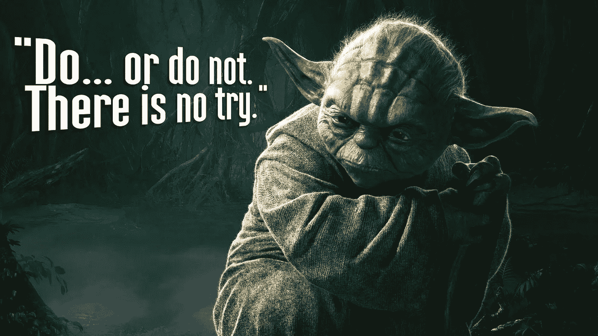

# 永远不要从假设开始

> 原文：<https://towardsdatascience.com/hypothesis-testing-decoded-for-movers-and-shakers-bfc2bc34da41?source=collection_archive---------2----------------------->

## 谎言，该死的谎言，还有 STAT101

设置[假设检验](http://bit.ly/quaesita_statistics)是交际舞；它的步骤是*动作-动作-世界-世界*。有很好的狐步舞节奏。不幸的是，大多数人一开始就搞砸了。以下是如何正确地跳舞。

## **第一步:写下默认动作**

[统计学](http://bit.ly/quaesita_statistics)是一门在不确定的情况下改变你想法的科学，所以首要任务是弄清楚你要做什么*除非数据说服你放弃。*

> *如果你保持无知，你会做什么？*

*这就是为什么[一切都从](http://bit.ly/quaesita_inspired)一个身体动作/决定开始，如果你没有收集到任何(更多)证据，你就[承诺](http://bit.ly/quaesita_inspired)去做。这叫做你的 ***默认动作*** 。*

> *入门是行动，而不是信念。*

*我问你的是，*“如果你走开并且对这些信息一无所知，你实际上*会做什么*

**“收集数据”*不是一个合适的答案。我在敦促你告诉我，如果我现在强迫你选择，你会选择哪个选项。(抱歉我吼了。)*

## *第二步:写下可供选择的行动*

*你将保持你的决定二元，被框定为*做事情*对*不做事情*。哪个不是你默认的就是你的 ***替代动作*** 。*

**

*If binary feels too basic, the amazing variety of shapes on your screen speaks volumes of the power of binary options put together. When you need to make a more complex decision, you can compound several hypothesis tests. Let’s start with one at a time.*

## *第一部分不是关于信仰*

*入门是行动，而不是信念。我不是问你你认为你知道什么，因为作为一个好的[常客](http://bit.ly/quaesita_statistics)(又名经典统计学家，大多数 STAT101 课程中教授的哲学的追随者)你在做分析之前不会相信任何事情。*

> *没什么。你什么都不相信。和我一起说。*

*当谈到这一点时，贝叶斯主义者是不同的，但如果你感到正义的贝叶斯愤怒，因为你在哲学上与这里的逻辑不一致，深呼吸，把这当成了解你的敌人的一课。我们很快就会谈到贝叶斯生活方式。*

*目前，关于您正在处理哪种统计数据的线索是在行话中流传的。如果你听到“ [**置信区间**](http://bit.ly/quaesita_statistics) ”或“ [**p 值**](http://bit.ly/quaesita_statistics) ”，你好常客。如果你听到“ [**可信区间**](http://bit.ly/quaesita_statistics) ”或者“**事前**”或者“**事后**”(这不是什么无礼的话，我保证)，你好贝叶斯。如果第一种更熟悉，那是因为大多数教育项目在教授贝叶斯思维之前/而不是贝叶斯思维。*

## ***处理无信息***

*对于数字迷来说，选择哪个动作作为你的默认动作并不是一个问题。这是 MBA 的事情，是团队决策者的职权范围。你是在密室里沉思的时候根据商业意识做出这个决定的。*

> *选择默认操作需要商业头脑，这是团队决策者的职责。*

*我在问你，如果你保持*无知*，你更愿意做什么，所以你不需要*数据来回答我的问题，尽管你可能会发现之前的分析*鼓舞人心*。[探索性数据分析](http://bit.ly/quaesita_datasci) (EDA)是一种引导式冥想，如果你愿意的话。这是帮助决策者通过这一部分的工具。如果你想更深入地了解分析师和决策者是如何合作的，请阅读这篇文章。**

*EDA 非常有用…如果你买得起的话。价格是你使用的所有数据，因为在你进入统计部分之前，它必须从轨道被[核化。对于没有足够数据的团队来说，从推论中排除任何数据都是非常昂贵的。他们完全受他们的决策者的智力广度和头脑风暴能力的支配。](http://bit.ly/quaesita_sydd)*

**

## *谨慎行事*

*想象一个关于推出新产品的决策。决策者中典型的选择是稳扎稳打: ***不要启动*** it，除非数据给你一个充分的理由按下绿色按钮。如果你没有数据，你会高兴地封存这个项目。也许这是一个错误，但是嘿——你可以心安理得。你选择了默认的方式，使得坚持它是错误中较小的一种。*

> *默认的行动是你在无知下觉得合意的选项。*

*其他社会认为默认相当明显的例子有无罪-直到被证明有罪(默认=如果没有证据就不定罪)，测试新药物(默认=如果没有证据就不批准)，以及科学发表(默认=如果没有证据就不发表)。*

> *如果没有默认，就不需要花里胡哨的统计。*

*虽然真正的冷漠在人类动物中相当罕见，但如果你真的愿意在没有数据的情况下抛硬币，那么你就不需要[统计](http://bit.ly/quaesita_statistics)。如果你的想法没定下来，那是无法改变的。往前走，改为读[这个](http://bit.ly/quaesita_pointofstats)。统计推断是针对 ***不确定性*** 下的决策。如果你已经有了答案，回家吧。*

*坦率地说，第一步包括在没有任何信息的情况下框定你的决定，我希望你看到决策者的培训比数学家的培训更相关。*

## ***处理全部信息***

*舞蹈的下一步有点奇怪。STAT101 教你，就像它不是一件小事，但它是一个非常激烈的精神飞跃。你的工作是想象世界上所有可能的状态。是的，你听到了。*

*这是最艰难的决策任务之一。对于非琐碎的例子(比你在课堂上看到的婴儿例子稍微复杂一点的东西)，要做好它确实需要大量的精神训练、创造力、灵活性和专注力。*

> *你的工作是想象世界上所有可能的状态。*

*一旦你想象了所有可能的平行世界，是时候把它们放入两个桶中的一个了:让我们称桶 1 为“我乐意采取默认行动的世界”，桶 2 为“所有其他的世界”*

## ***步骤 3:描述零假设(H0)***

*如果你不喜欢 Bucket 1 的 10 字名称，它的技术名称是 ***空假设*** 。*

> *统计课教你检验 T21 假设，而不是形成假设。它们往往是在那些考试中为你预先准备好的。*

*你可能听过对零假设的简略描述，比如“现状”、“无聊的那个”或者“我们不想证明的东西”所有这些都是微妙的不准确，懒惰的事情，一个教授可能会教一个一年级的大学生不值得信赖的心智成熟。但是我相信 ***你*** 能够处理哲学上的古怪，所以现在你知道零假设描述了你乐意选择默认行为的所有宇宙。出于对我们要求决策者处理的心理体操的尊重，让我们默哀片刻。*

> *不是每个人都有缩小视野所需的心理灵活性。明智地选择你的决策者。*

*让我们快速回顾一下我们的现状。**这里的要点是，你已经设置好了事情，所以只要你什么都不知道，你只知道一点点，或者你绝对确定你是一个零假设宇宙的公民，你就致力于做你的默认动作。***

> *假说就像蟑螂。当你看到一个，它永远不会只是一个。附近总有更多的藏身之处。*

## *第四步:描述备选假设(H1)*

*桶 2 是 ***的替代假设*** 你把所有的剩菜都放在那里。当空值为假时，一切都可能为真。这两个假设是数学上的补充，也就是说没有第三个桶。*

*简而言之，另一个假设就是你对此的答案:*

> *“怎样才能改变你的想法？”*

**

*Action (default) -action-worlds-worlds: the dance is complete.*

*我们已经准备好添加数据，那么接下来要做什么呢？*

## *改变你想法的科学*

*在它们之间，你的假设涵盖了所有的可能性。它们不重叠。如果我用数据说服你！—你生活在另一个假设世界中……我的天啊，你还在考虑默认动作做什么？停下来。这不是一个快乐的选择。*

> *如果数据让你相信你生活在另一个假设的世界里，那就改变行动。*

*你最好将*从*默认动作切换到 ***替代动作*** :不做默认。这可能会演变成一系列其他决定，但有一件事是肯定的:你不会碰上违约。数据改变了你的想法！***

## ****主动与被动****

**这个决策背景的很大一部分是，从一开始，行动对你来说就是 ***而不是*** 一样。你像一个常客应该的那样完全开放，但这并不意味着你不认为无知下的某个行为更明智或更道德。这是关键。如果这两个动作对你来说是一样的，读[这个](http://bit.ly/quaesita_pointofstats)代替。**

> **默认行为是你被动接受的行为，而另一种行为是你需要被主动说服去做的事情。**

## ****处理部分信息****

**如果你对你的数据只有部分的了解，你将不得不处理不确定性。这就是花里胡哨的概率计算的用武之地。它们可以归结为一句话，每次都是一样的，我们将在下一章的[中看到。](http://bit.ly/quaesita_fisher)**

**关键是你永远也不会确定哪个世界是你的世界。这就是为什么选择正确反映你价值观的默认行为是很重要的。怎么查？如果你把事情框对了，一个[类型 I 错误](http://bit.ly/quaesita_statistics)应该比一个[类型 II 错误](http://bit.ly/quaesita_statistics)感觉更糟。换句话说:**

> **错误地离开你舒适的舒适区(默认动作)的想法应该比错误地坚持它的想法更痛苦。**

**如果这不是真的，那你就没有真正诚实地面对自己。让我们从头再来一遍！**

> **没有魔法能把不确定性变成确定性。**

## ****行动最响亮****

**为了能够建立统计假设，[你必须知道你的默认动作是什么](http://bit.ly/quaesita_inspired)。当你从别处开始时，整个事情就会分崩离析。**

**不幸的是，错误地选择你的默认动作是那些学习数学却没有吸收任何哲学的人的常见错误。这也是一个团队的症状，在这个团队中，决策者在行动中失踪，而数字书呆子们集体出局。**

> **错误地选择默认动作是一个令人痛苦的常见错误。到处都是！**

**一个让自己注定失败的方法是从假设开始，而不是从行动开始。这是课堂练习结构的遗留问题(因为统计课不会教你决策者的角色，这些事情几乎总是由教授为你做的)，但在现实生活中，这相当于出师不利。你将在剩下的时间里投入所有的努力，如果 faceplant 刚出大门，岂不是很可惜？**

> **总是从默认操作开始。**

**如果你渴望这些例子形式的想法(和外星人！)，这里读上**。****

***如果你更喜欢一个没有统计细微差别的基本例子，读读* [*这个*](http://bit.ly/quaesita_hypexample) *。***

****

**Don’t faceplant right out of the gate by starting with the hypotheses, always start with the default action.**

# **感谢阅读！喜欢作者？**

**如果你渴望阅读更多我的作品，这篇文章中的大部分链接会带你去我的其他思考。不能选择？试试这个:**

** [## 我们为什么信任科学家？

### 现在是时候重新思考我们对事实和虚构的假设了

blog.usejournal.com](https://blog.usejournal.com/why-do-we-trust-scientists-98c24e3b9f0e) 

# 比起读书更喜欢 YouTube？试试我的 AI 课程！

如果你在这里玩得开心，并且你正在寻找一个为初学者和专家设计的有趣的应用人工智能课程，这里有一个我为你制作的娱乐课程:

Enjoy the entire course playlist here: [bit.ly/machinefriend](http://bit.ly/machinefriend)

# 喜欢作者？与凯西·科兹尔科夫联系

让我们做朋友吧！你可以在 [Twitter](https://twitter.com/quaesita) 、 [YouTube](https://www.youtube.com/channel/UCbOX--VOebPe-MMRkatFRxw) 、 [Substack](http://decision.substack.com) 和 [LinkedIn](https://www.linkedin.com/in/kozyrkov/) 上找到我。有兴趣让我在你的活动上发言吗？用[这个表格](http://bit.ly/makecassietalk)联系。**