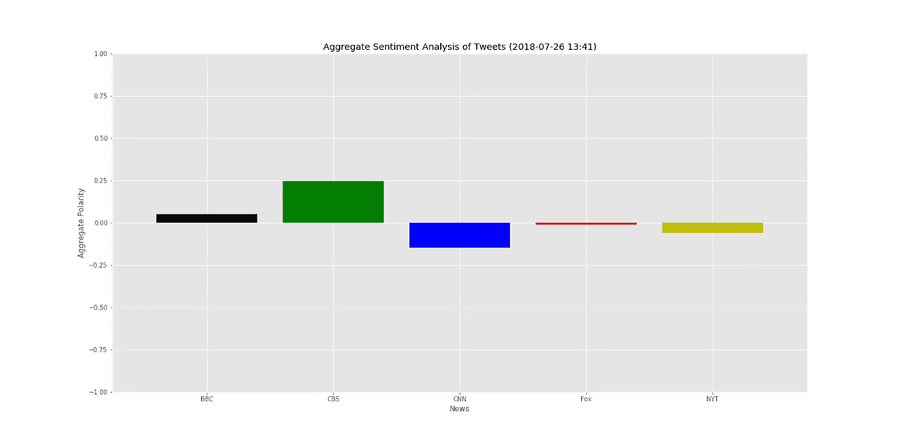
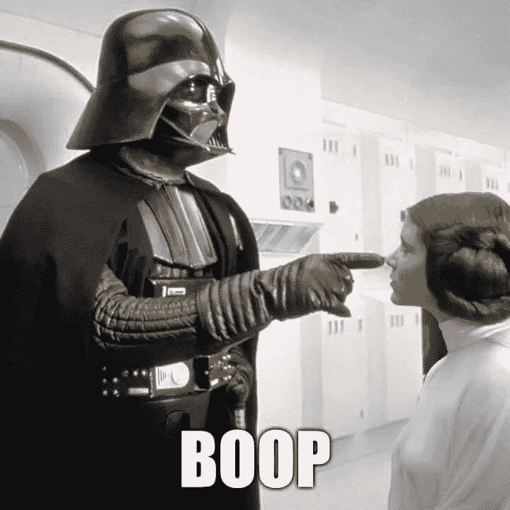
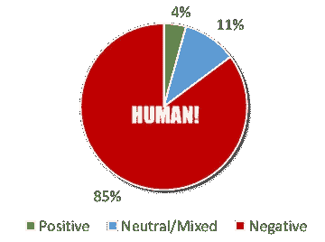
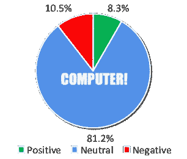

# 每年的这个时候我都会变得多愁善感

> 原文：<https://towardsdatascience.com/i-always-get-sentimental-analysis-this-time-of-year-1d4865ba5f8a?source=collection_archive---------10----------------------->

## Python 中的 NLP &情感分析！

圣诞快乐，我们来谈谈吝啬鬼。狄更斯对老人关于时空连续体午夜幻觉的描绘，呼应了我们自己一年一度的泪眼朦胧的假日反思。或者…随便吧。也许是对过去假期的回忆——回忆家庭聚会、童年礼物和更简单的时光。也许是当前的气氛——空气中的寒冷(或者在亚特兰大，气温的巨大波动)、拥挤和喧嚣(或者在亚特兰大，交通)。或者也许，只是也许，事实是我渴望有一天定性分析，特别是自然语言处理(NLP)，实际上是一种创造有意义见解的有用工具。

😯☃️😤🎄😒🎅🙊☃️

**什么是自然语言处理？**根据维基神的说法，它是“一个与计算机和人类语言之间的交互有关的子领域，特别是如何给计算机编程以处理和分析大量自然语言数据。”干净利落。我为什么关心…？

> 定性数据是下一场革命

## 过去情感的幽灵

**量化数据是 soooo 2010，老弟**。作为分析师和程序员，我们基本上掌握了数字。有无数的科学家、统计学家和商业大师，他们 1)比我聪明得多，2)不知疲倦地努力发明下一个“工具”,让数字运算和数豆子变得更容易、更好、更性感。我想起了第一次打开 Tableau 时，它是如何震撼了我的心灵。我思考 Excel 已经走了多远。我想到了用 Python 和 r 创建的数十亿个库。每天都有新的和旧的出现。显然，我并不是说我们已经完成了定量分析。我只是说，我们现在越来越多地使用非结构化的数据库、图像、声音，当然还有文本。

我们的话语很重要。很多。我花了无数个小时分析美国各地医院的定性数据。这主要是在**情绪分析的保护伞下。**在这些数据中，大部分都存在未开发的改进潜力。是金子，杰瑞。为什么是黄金？调查评论形式的文本通常支持、验证并在许多方面取代我们淹没在其中的定量数据。此外，它还存在于组织的各个层面:领导、中层管理者、一线员工和客户——也就是病人。这些信息不是指南针，而是指导领导者行动计划的 GPS。那里。所以我才在乎。

有没有定性工具可以帮我们做到这一点？简答:有。自动化分析这些信息是可能的，但是它有效吗？我们拿着一个“单词包”,用一个马里奥式的木槌把圆形定性数据打碎成方形定量数据。手动完成这项工作需要花费大量精力，但是当我们利用数据科学工具来加速这一过程时，会发生什么呢？会不会更快达到同样的效果？好点了吗？


Mario BI Analyst vs Qualitative koopa troopa

> 让我们把计算机比作人类

## 情感的幽灵出现了

**让我们想想我们需要什么。**就我而言，我指的是对医院调查的情感分析，我们希望了解医院周围的人对安全因素的积极和消极看法。

**让我们用 VaderSentimentAnalysis。** [这个库](https://github.com/cjhutto/vaderSentiment)是一个很有前途的快速肮脏的‘意见挖掘’库。此外，作者是佐治亚理工学院的毕业生，所以有(去，夹克。蛰他们。bzzz🐝)无论如何，在开始之前，有一些基本的注意事项:

1.  它的预期目的是挖掘和分析社交媒体。

2.它建立在单词、字符和表情符号(是的，表情符号)的静态库上，随着库的更新而更新。所以之前我写的时候，"😯☃️😤🎄😒🎅🙊☃️，“不仅你确切地知道我的意思，而且显然维达也知道我的意思。好吧，或者反正是编出来的😏←这家伙。

3.该方法的输出包含四个分数:正面、中性、负面和复合。以下是更多相关信息。

出于这种分析的目的，我们为什么不假设调查评论的结构类似于“推文”。我知道他们不一样。这不是一篇研究论文。冷静点。重点是，人们通常会写下他们的感受，所以调查评论包含许多俚语、拼写错误和情绪化的词语……就像……一条推特。

**我们来了解一下维达。有了这个假设，让我们来看几个例子和它们相应的分数。这些是直接来自维德 GitHub 页面。注意以下几点:标点符号很重要，大写字母很重要，俚语也很重要。事情很重要。**

```
**[IN]** VADER is smart, handsome, and funny.
**[OUT]** {'pos': 0.746, 'compound': 0.8316, 'neu': 0.254, 'neg': 0.0}**[IN]** VADER is smart, handsome, and funny!
**[OUT]** {'pos': 0.752, 'compound': 0.8439, 'neu': 0.248, 'neg': 0.0}**[IN]** VADER is VERY SMART, handsome, and FUNNY.
**[OUT]** {'pos': 0.754, 'compound': 0.9227, 'neu': 0.246, 'neg': 0.0}**[IN]** VADER is not smart, handsome, nor funny.
**[OUT]** {'pos': 0.0, 'compound': -0.7424, 'neu': 0.354, 'neg': 0.646}**[IN]** Today SUX!
**[OUT]** {'pos': 0.0, 'compound': -0.5461, 'neu': 0.221, 'neg': 0.779}**[IN]** Not bad at all
**[OUT]** {'pos': 0.487, 'compound': 0.431, 'neu': 0.513, 'neg': 0.0}
```

也许‘pos’，‘neu’和‘neg’是不言自明的(也许不像我们将看到的那样)，但是‘compound’需要一些背景:

*“复合得分是通过对词典中每个词的化合价得分求和计算出来的，根据规则进行调整，然后归一化到-1(最极端负)和+1(最极端正)之间。如果你想对一个给定的句子进行单一的一维情感测量，这是最有用的度量。称之为‘标准化加权综合得分’是准确的。”—Vader perspection GitHub*

所以，如果我理解正确的话，他们的**复合分数**有点数学魔力。这是对文本块进行分类时最重要的度量。例如，这里有一个例子，[从各种新闻句柄](https://github.com/jeffreybox/social_media_analysis)抓取推文，并从 7 月份开始计算它们的综合得分。



**让我们来做这件事。**好了，够了。在本地环境中安装库，并根据提示进行升级。

```
> pip install vaderSentiment
> pip install -- upgrade vaderSentiment
```

假设您已经有了其他基本的 Python 分析库，这就是我们所需要的。现在，让我们对这个注释进行一些测试:

```
*“There is a culture where I work that does not appreciate the nurses and does not adequately address concerns brought up by staff regarding potentially dangerous patient situations and potentially dangerous staff situations. Valid concerns are dismissed and disregarded by local and senior management. Employees that raise concerns are made miserable until they quit. Dangerous and problematic employees are kept on and protected.  There is a pervasive culture of bullying among our staff that is not being adequately addressed by management"*
```

这是一个极好的样本。全国各地的医院都有很多类似的观点。也就是说，如果我看到这个评论，并把它分为积极、中立或消极，你认为这会是什么？是啊。咄。它是阴性的。它还对一些特定的类别持否定态度，但稍后会有更多的内容。现在，让我们看看维德要说什么:

```
**[IN]:***# Import libraries including the sentiment analyzer* import pandas as pd
import numpy as np
from vaderSentiment.vaderSentiment import SentimentIntensityAnalyzer
analyzer = SentimentIntensityAnalyzer()*# Read in the comment into a dataframe*
df = pd.read_csv(‘comments.csv’)*# Analyze the comment*
sample = df.iloc[0,0]
compound = analyzer.polarity_scores(sample)[“compound”]
pos = analyzer.polarity_scores(sample)[“pos”]
neu = analyzer.polarity_scores(sample)[“neu”]
neg = analyzer.polarity_scores(sample)[“neg”]*# Print the results*
print(‘ — — — — — — — — -’)
print(f’compound: {compound}’)
print(f’pos: {pos}’)
print(f’neu: {neu}’)
print(f’neg: {neg}’)**[OUT]:** -----------------
compound: -0.965
pos: 0.03
neu: 0.718
neg: 0.251
```

这很有意思。我不确定如何理解“积极”、“消极”和“消极”的分数，因为“消极”的分数在 **0.71…** 时占主导地位。？？但是，注意，‘复合’得分是 **-0.965。这意味着，“你的文本斑点非常非常消极。”这符合我们的精神分类，所以你说对了，维德。**



接下来，有两个任务。

1.  这在汇总我们所有的调查文本时会起作用吗？
2.  有没有办法让这个分析更深入，因为那又怎样？

首先，聚集所有的文本(在本例中大约有 400 条评论),并在新的 blob 上再次运行代码。接下来，如果您想要查看每个单独字符串的分数，创建某种循环并将值推入列表中，以便进行切片和切块。这就是我在分析方面要说的全部。这里有一个方法:

```
compound = []
positive = []
neutral = []
negative = []for x in comments:
    x_comp = analyzer.polarity_scores(x)["compound"]
    x_pos = analyzer.polarity_scores(x)["pos"]
    x_neu = analyzer.polarity_scores(x)["neu"]
    x_neg = analyzer.polarity_scores(x)["neg"]
    compound.append(x_comp)
    positive.append(x_pos)
    neutral.append(x_neu)
    negative.append(x_neg)

print(f'compound: {compound}, length: {len(compound)}')
print(f'positive: {positive}, length: {len(positive)}')
print(f'neutral: {neutral}, length: {len(neutral)}')
print(f'negative: {negative}, length: {len(negative)}')
```

**让我们看看我们的综合结果。**当我手动分析大约 400 条评论时，这是情绪的分布。一个有医疗保健经验并了解全部数据集的资深分析师大约需要一个小时来执行我们的手动“评论分析”



= 4 hours of manpower

Python 和 Vader perspection 代码在这大约 26，000 个单词上运行的结果是什么？



< 4 seconds of computing power

嗯……这看起来很不一样。然而，还有一线希望。**复合得分为** **-0.6951** 。如果我们粗略地将其与我们的手动分析进行比较，**负比率为 0.85** ，我们可能会有所收获。然而，我还不确定在哪里。

## 感情未来的幽灵

那么，我们学到了什么？

*   **PRO** :在宏观层面上，Python 情绪分析复合评分认识到了整体数据集的负面性。就像我在维德的介绍中所说的，如果你需要快速和肮脏，这就是你的工具。
*   **反对**:然而，即使将我们到目前为止所做的所有假设标准化，总得分中的 **15.49%** 的差异也是巨大的。这一点尤其正确，因为我们讨论的是一个数据集,它认为 1%的增量是平均值，5%的增量是显著的。如果我告诉一位首席执行官，69.51%的评论是负面的，他或她会不高兴。如果我后来回来告诉那位首席执行官，我仔细检查了，手动梳理了数据，结果，实际上 85%的评论都是负面的，我可能会被扫地出门。理解上的差距还不够小。
*   PRO**PRO**:情感分析工具可以提供快速简单的结果，将文本块分类为正面、中性、负面等等。
*   **反对**:无论如何，有了 Vader perspection，就很难理解正、中和负突破值的确切含义。复合分数是有用的，但还需要更多的研究。
*   我们为自己节省了大量时间。四小时和四秒钟的差别对于大规模雇佣顾问来说是一大笔钱
*   反对意见:即使客户在省钱，他们也可能忽略了评论中的价值。我关于定量分析的整个策略是，它补充了定量分析，并允许我们超越切片。否则，一个复合分数告诉我们什么？69%的回复是抱怨和抱怨？哦。好的。(再次显示门)。
*   **PRO:** 将复合分数打成列表对于查看基于单元的、基于角色的或者除了聚合之外的任何其他微观分析可能非常有用。
*   **弊**:小心。现在我们进入了基于实践的伦理学。允许的微观分析程度将根据一个组织对其反馈的“老大哥”程度而有所不同。如果员工认为他们会因为说了对组织不利的话而受到惩罚，他们会抑制或缩减他们的语言。如果你打算走这条路，想出一个与领导沟通的计划。

我们还有很长的路要走。展望未来，在处理定性数据时，有一个行动呼吁和一些关键要点。

*   **不要仅仅依赖 NLP 数据科学工具。**自己花时间去理解组织和文本数据。这可能很耗时，但它将提供自动化分析之外的价值
*   理解你的词典。如果员工使用大量医学术语，那么预先构建的自然语言处理库可能就没有用了。如果不剖析代码库，Vader perspective 的字典可以被视为一个黑盒。作为数据科学家，我们可能必须建立解释这种类型分析的字典
*   **不要忘记上下文和微观分析。文本工具正在变得越来越好，但我们仍然错过了上下文、微妙之处、细微差别、习语、讽刺，以及……嗯，说出任何其他与交流相关的特征。**
*   **了解 NLP 的其他应用**(但是这里有一篇[很棒的文章](https://elitedatascience.com/python-nlp-libraries)包含了关于其他 Python NLP 库和应用的信息。我们需要找到合适的工具。)

我留给你两样东西。首先，

```
**[IN]**
sample = '😯☃️😤🎄😒🎅🙊☃️'
compound = analyzer.polarity_scores(sample)["compound"]
pos = analyzer.polarity_scores(sample)["pos"]
neu = analyzer.polarity_scores(sample)["neu"]
neg = analyzer.polarity_scores(sample)["neg"]
print('-----------------')
print(f'compound: {compound}')
print(f'pos: {pos}')
print(f'neu: {neu}')
print(f'neg: {neg}')**[OUT]**
-----------------
compound: 0.0
pos: 0.0
neu: 1.0
neg: 0.0*# Neutral?!? Vader, please...*
```

最后，

> *亲爱的圣诞老人，*
> 
> 请给我一个有用的自然语言处理工具。
> 
> *SRSLY。分析 TINY TIM 的患者体验反馈表的 BI 团队就指望它了。*
> 
> *真诚地，*
> 
> 杰夫

