# 我分析了 122 小时的假日广播

> 原文：<https://towardsdatascience.com/i-analyzed-122-hours-of-holiday-radio-874b5c2cd3ae?source=collection_archive---------15----------------------->

## 你会被迫听到多少次“美妙的圣诞节”？

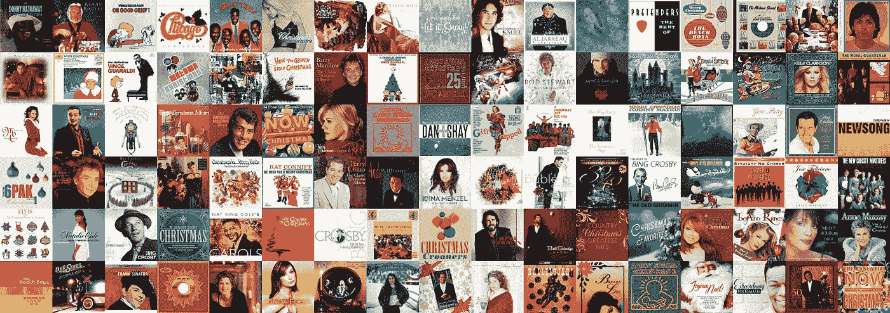

122 hours, 1,510 tracks. Only 80 original songs. Source: [106.7 LiteFM](https://litefm.iheart.com/music/); 11/30/2018–12/5/2018; Download the [data](https://github.com/jonkeegan/holiday-tunes-data).

早在感恩节前就开始了。准确地说，今年是 11 月 16 日下午 5 点。这时，纽约州的 WLTW [106.7 LiteFM](https://litefm.iheart.com/) 硬切换到全圣诞音乐节目。它持续到圣诞节。这是一种家庭规则，让汽车收音机在这段时间里一直调到这个电台。

我和我的家人最近开着车听 106.7 的圣诞音乐，似乎每次我打开汽车，我都会被迫听到那些可怕的八个混响合成器音符，这些音符出现在最糟糕的圣诞歌曲保罗·麦卡特尼的“美妙的圣诞节”之前。其他人已经说了很多关于[为什么这首歌这么差](https://www.golfdigest.com/story/wonderful-christmastime-is-the-worst-christmas-songand-quite-possibly-the-worst-songever)，所以我继续。

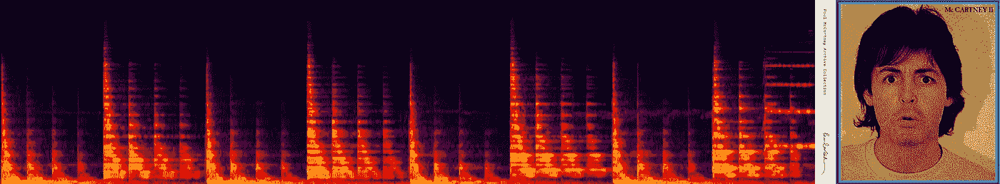

The 8 synthesizer hits at the beginning of the worst Christmas song of all time.

但它确实让我对这个长达 943 小时的圣诞音乐节目感到好奇。我有一些问题。我很好奇新的圣诞歌曲似乎很少。许多艺术家每年都会推出圣诞专辑，但这些通常只是圣诞经典的封面。圣诞音乐有过黄金时代吗？音乐家们已经不再尝试创作原创的圣诞新歌了吗？我决定收集一些数据，并尝试回答其中的一些问题。

我首先从 LiteFM 的网站上下载了“[最近播放的](https://litefm.iheart.com/music/)”播放列表，这是从 11 月 30 日到 12 月 5 日五天多一点的圣诞音乐。在这段时间里，我播放了 1510 首歌曲。此提要列出了歌曲标题、艺术家、专辑封面和歌曲播放时间。对于每首歌，我都尽可能地搜索最接近最初“出版”日期的日期——歌曲创作或作曲的时间——以及作家和作曲家的名字(如果有的话)。这相当于大约 122 小时的广播时间(其中包括他们在歌曲之间播放的任何广告，我没有跟踪这些广告)。

> 圣诞音乐有过黄金时代吗？音乐家们已经不再尝试创作原创的圣诞新歌了吗？

考虑到每首歌创作的年份，我的数据集跨越了 484 年的出版音乐。当然，许多老歌被认为是“传统”歌曲，没有明确的作者或作曲家。这种类型的一个明显的特点是它有丰富的翻唱(表演别人歌曲的新版本)。在我检查的这段时间播放的 1，510 首歌曲中，事实证明数据集中只有大约 80 首独特的歌曲。但是从这 80 首歌中，出现了许多翻唱、混音和现场录音。

所以让我们从基础开始。**“圣诞老人进城了”**是我的数据集中播放次数最多的歌曲。这包括了这首歌所有 10 个版本的所有播放次数。《雪橇之旅》紧随其后，共有 89 部戏剧，11 个不同版本。

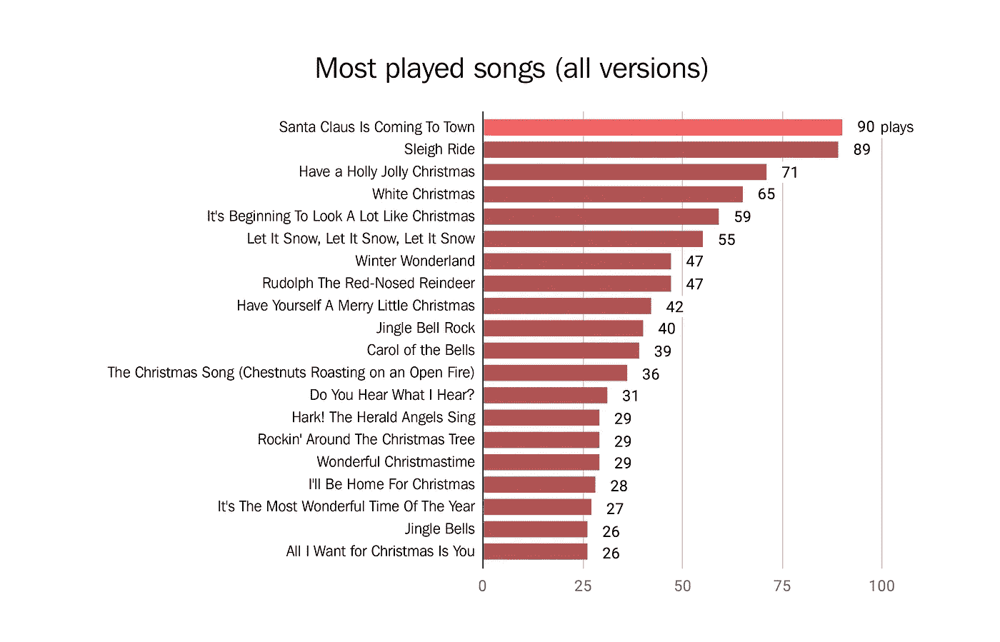

Source: [106.7 LiteFM](https://litefm.iheart.com/music/); 11/30/2018–12/5/2018; Download the [data](https://github.com/jonkeegan/holiday-tunes-data).

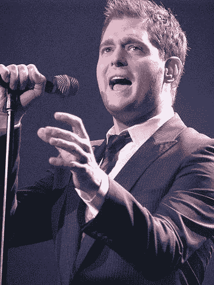

Michael Bublé, the holiday music juggernaut. Photo: [Jeanie Mackinder](https://commons.wikimedia.org/wiki/File:Michael_Bubl%C3%A9.jpg) [[CC BY 2.](https://creativecommons.org/licenses/by/2.0)0]

现在，如果我们看看特定版本的歌曲(包括所有这些封面)，总的来说播放最多的歌曲是宾·克罗斯比的**“白色圣诞节”**——绝对是一首经典老歌。但是紧随其后排在第二(和第三)位的是**麦可·布雷**。我不得不承认我以前从未听说过他的名字，但是这位 43 岁的加拿大歌手(4 次格莱美奖得主)是假日音乐排行榜上不可忽视的力量。在撰写本文时，Bublé目前有 9 首歌曲登上了 [Billboard Holiday 100 排行榜](https://www.billboard.com/charts/hot-holiday-songs)。

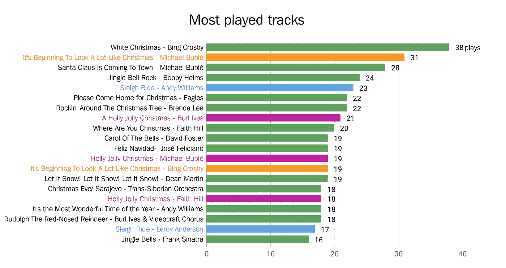

Source: [106.7 LiteFM](https://litefm.iheart.com/music/); 11/30/2018–12/5/2018; Download the [data](https://github.com/jonkeegan/holiday-tunes-data).

果不其然，当我们按照表演者最多的戏剧来看数据时，布莱在这个包含一些大师的列表中占据主导地位。LiteFM 的听众一定非常喜欢他天鹅绒般光滑的声音，因为在我监测的这段时间里,**麦可·布雷**的播放量是**弗兰克·辛纳特拉**的六倍多。

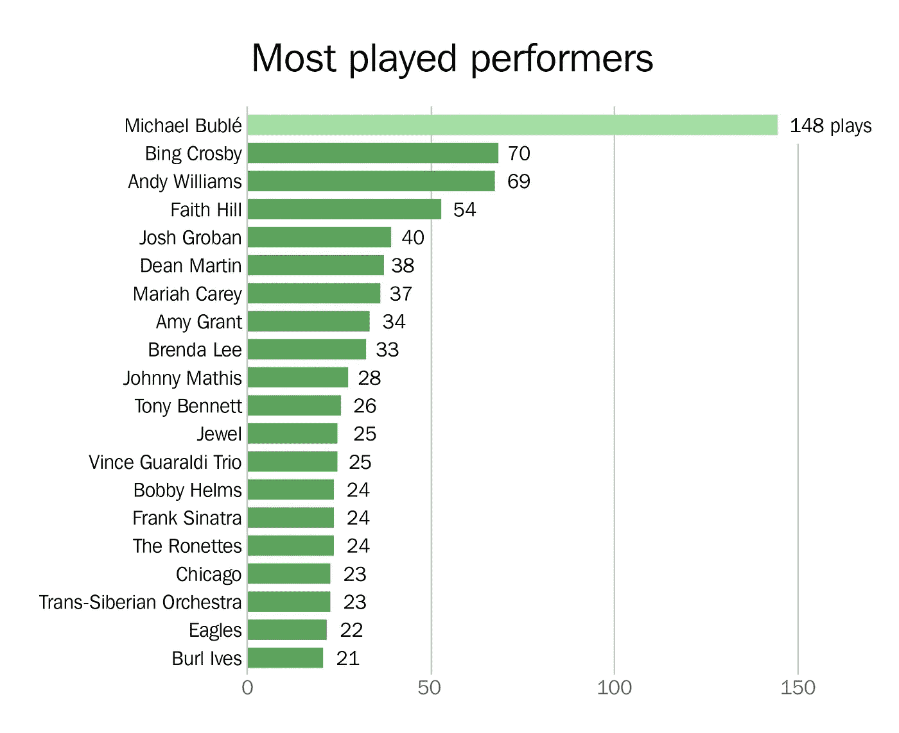

Source: [106.7 LiteFM](https://litefm.iheart.com/music/); 11/30/2018–12/5/2018; Download the [data](https://github.com/jonkeegan/holiday-tunes-data).

Yukon Cornelius sang the words of Johnny Marks.

所以那只是唱和表演这些心爱歌曲的人。幕后真正的词曲作者呢？你可能不认识约翰尼·马克斯这个名字，但你肯定听过他的音乐。约翰尼·马克斯写了**《红鼻子驯鹿鲁道夫》****《过一个快乐的冬青树圣诞节】****《围着圣诞树摇滚》**以及许多其他假日热门歌曲**。尽管约翰尼·马克斯创作了一些最经典的圣诞歌曲，但他是犹太人(与此同时还有欧文·柏林和其他许多歌曲作者)。虽然没有出现在这个数据中，但 **Marks** 还创作了**“银和金”**育空·科尼利厄斯在定格鲁道夫漫画中演唱的朗朗上口的曲子。**

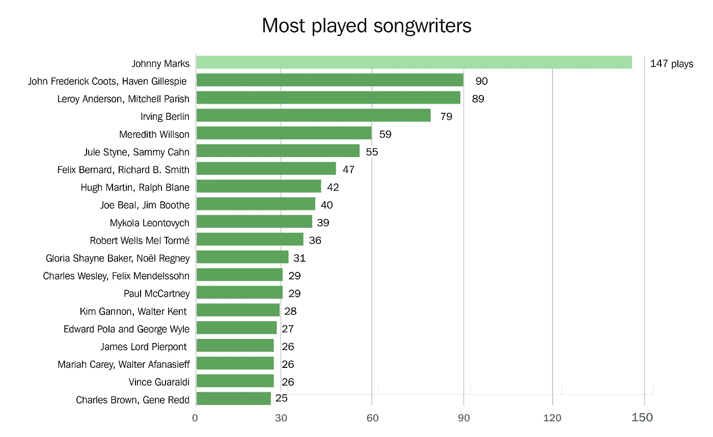

Source: [106.7 LiteFM](https://litefm.iheart.com/music/); 11/30/2018–12/5/2018; Download the [data](https://github.com/jonkeegan/holiday-tunes-data).

因此，如果我们查看这个收藏中的所有原创歌曲，并回顾它们创作或首次出版的年份，我们可以了解最常播放的音乐是何时产生的。果不其然，有一个十年跳出来，成为该数据集播放的近 30%的歌曲的来源——20 世纪 40 年代。

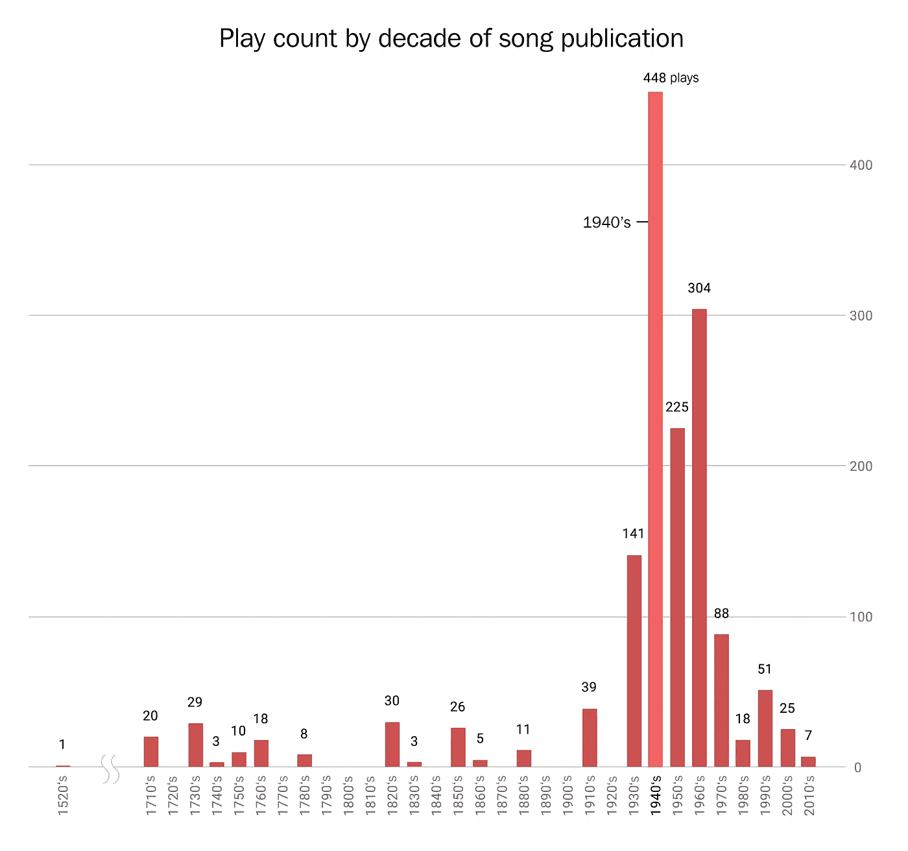

Source: [106.7 LiteFM](https://litefm.iheart.com/music/); 11/30/2018–12/5/2018; Download the [data](https://github.com/jonkeegan/holiday-tunes-data).

> 在我监测的五天中，近 30%的歌曲创作于 20 世纪 40 年代。

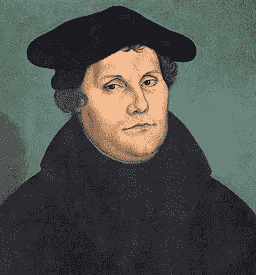

Martin Luther. Cranking out the hits since 1529\. Lucas Cranach the Elder [[Public domain](https://commons.wikimedia.org/wiki/File:Martin_Luther_by_Cranach-restoration.jpg)]

在我收集数据期间，艾米·格兰特(Amy Grant)的混合曲目**“一个强大的堡垒/我们在高处听到的天使”**只播放过一次，但这首曲目拥有收藏中一些最古老音乐的殊荣，因为**马丁·路德**在 1529 年首次为赞美诗**一个强大的堡垒**创作了音乐。

看着这张图表，虽然事情似乎在 20 世纪 70 年代后减少了，但这真的很值得注意。90 年代确实给了我们一个真正的现代圣诞大片的最出色的例子，**玛丽亚·凯莉**和**沃尔特·阿法纳西夫的** **“我想要的圣诞礼物是你”**凯里在 1994 年录制。事实上，我很惊讶的是 **AIWFCIY** 不在这张专辑中播放次数最多的前 20 首歌曲中，因为它目前在 [Billboard 的假日 100 首歌曲中排名第一。](https://www.billboard.com/charts/hot-holiday-songs)有趣的事实:这张唱片里没有真正的乐器，因为[它都是在电脑上完成的](https://www.cosmopolitan.com/entertainment/music/a8534458/mariah-careys-all-i-want-for-christmas-is-you-facts/)。

玛丽亚·凯莉还声称为另一首非常受欢迎的圣诞歌曲《你的圣诞在哪里》创作了歌曲(连同**詹姆斯·霍纳**和**威尔·詹宁斯**)来自 2000 年的电影**《鬼灵精》**。她最初为电影配乐录制了这首歌，但由于她与汤米·莫托拉的离婚，她被法律禁止演唱这首歌。

那么这些圣诞歌曲中哪首版本最多呢？如果你在我分析的这段时间里不停地听 LiteFM，你会听到 11 个不同版本的**【雪橇之旅】**(播放了 89 次)和不少于 10 个版本的**【圣诞老人进城】**(播放了 90 次)，尽管我不明白为什么你需要除了**布鲁斯·斯普林斯汀**之外的任何版本

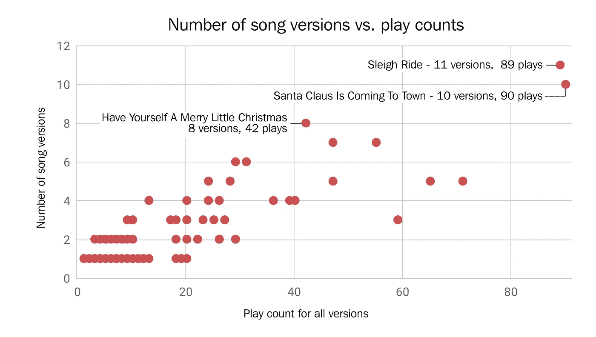

Source: [106.7 LiteFM](https://litefm.iheart.com/music/); 11/30/2018–12/5/2018; Download the [data](https://github.com/jonkeegan/holiday-tunes-data).

最后，我想看看播放所有这些歌曲的模式是什么样的。下面是所有独特歌曲的集合(包括所有版本)，按播放次数从多到少排序。每个红框表示每小时播放一次。我从 11 月 30 日星期五下午开始收集数据，到 12 月 5 日星期三晚上结束，*是的，*收集整整一周的歌曲会好得多。

我确实注意到某些歌曲在不同时间播放的一些有趣的模式。我联系了 LiteFM 的项目主管，但没有得到回复。看着电视台的[播出时间表](https://litefm.iheart.com/schedule/)，我确实看到一些模式与不同主持人的轮班相匹配。我很想知道主持人(他们现在还被称为 DJ 吗？)还是对播放列表有一定的创意控制。看起来午夜到凌晨 5 点是玩**“祝你小圣诞快乐”**的热门时间。如果我收到电视台的回复，我会更新这个帖子。

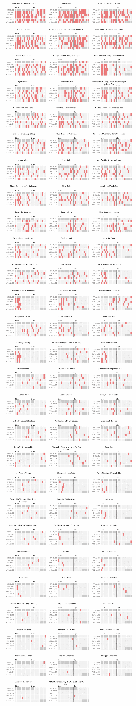

Source: [106.7 LiteFM](https://litefm.iheart.com/music/); 11/30/2018–12/5/2018; Download the [data](https://github.com/jonkeegan/holiday-tunes-data).

你可以在这里下载我收集的[数据](https://github.com/jonkeegan/holiday-tunes-data)。你可以在[jonkeegan@gmail.com](mailto:jonkeegan@gmail.com)向我发送任何问题。感谢阅读！

*Jon Keegan 是大纽约地区的视觉记者。他在华尔街日报***工作了 18 年，处理数据并开发新闻应用。创作了《华尔街日报》的“* [***【蓝馈】、红馈“***](http://graphics.wsj.com/blue-feed-red-feed/) *，图文并茂地过滤脸书上的气泡。其他感兴趣的领域包括 3D 打印和扫描、太空、无线电和可视化。你可以在 jonkeegan.com**看到更多他的作品。**

* [## 乔恩·基根:视觉记者

### 18 年来，我为华尔街日报开发新闻应用程序。我设计、写文字、编码和可视化数据。我…

jonkeegan.com](http://jonkeegan.com/)*