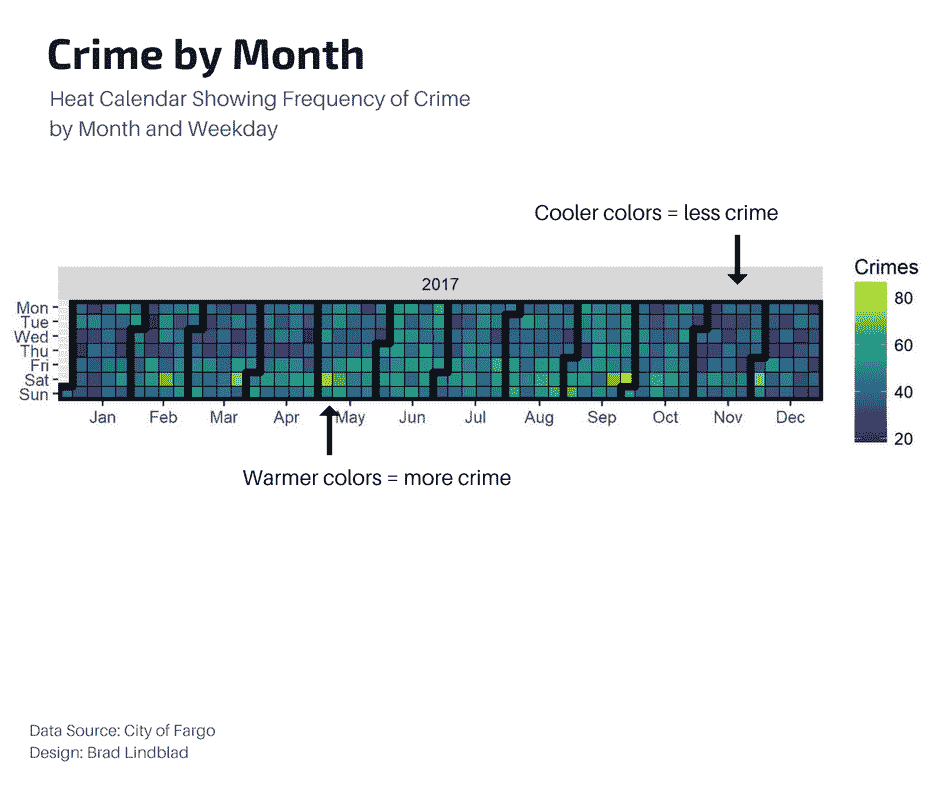
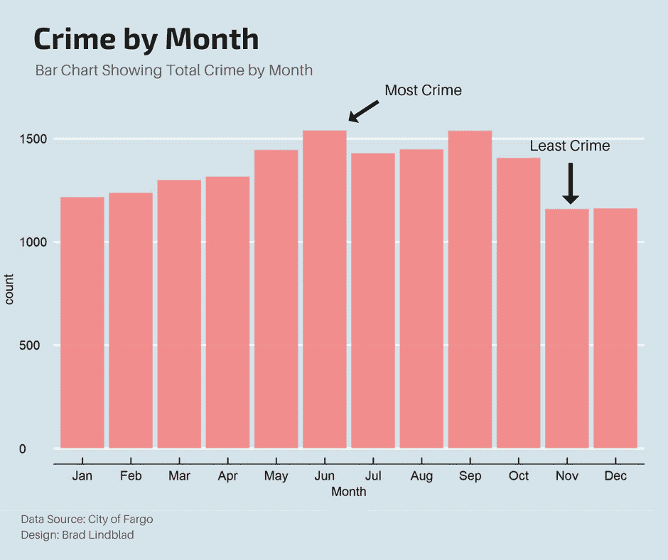
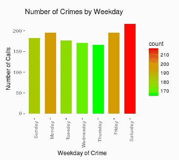
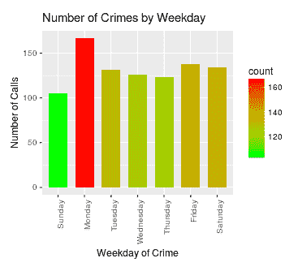
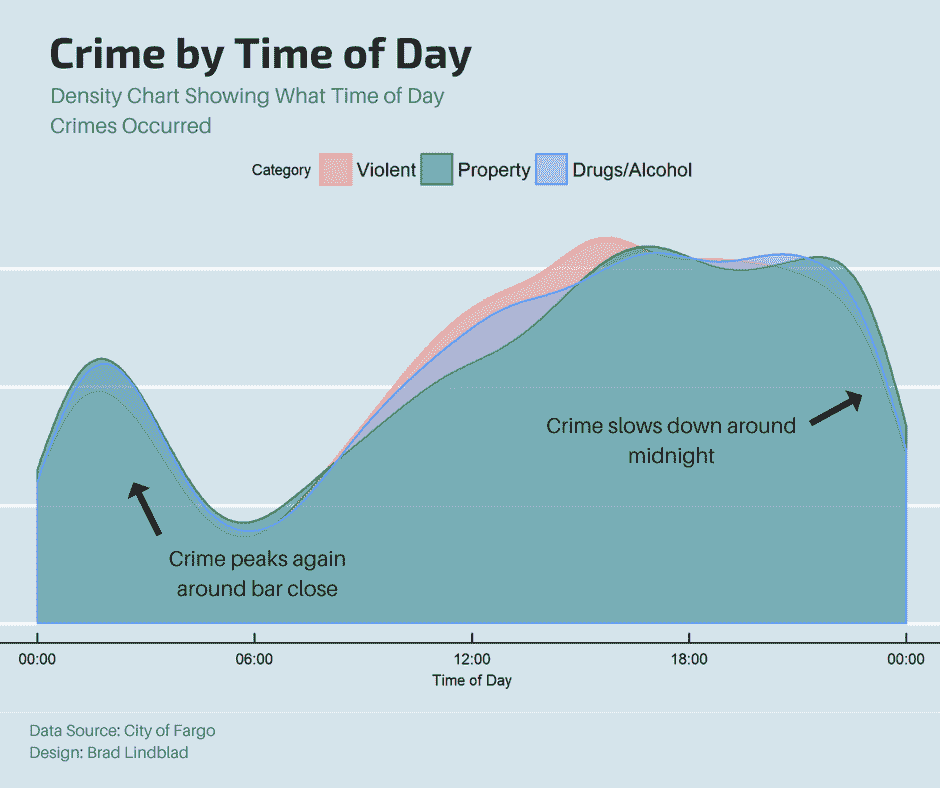
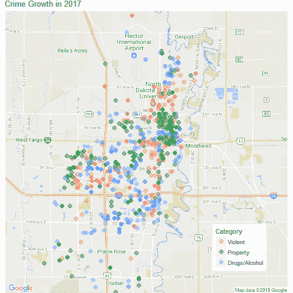
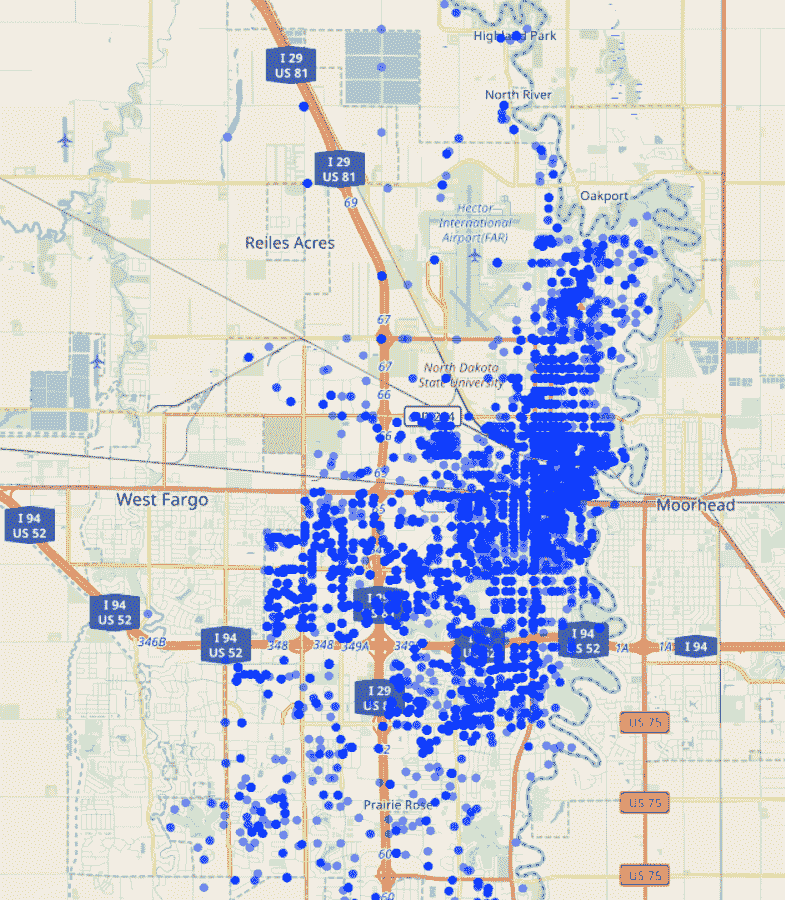
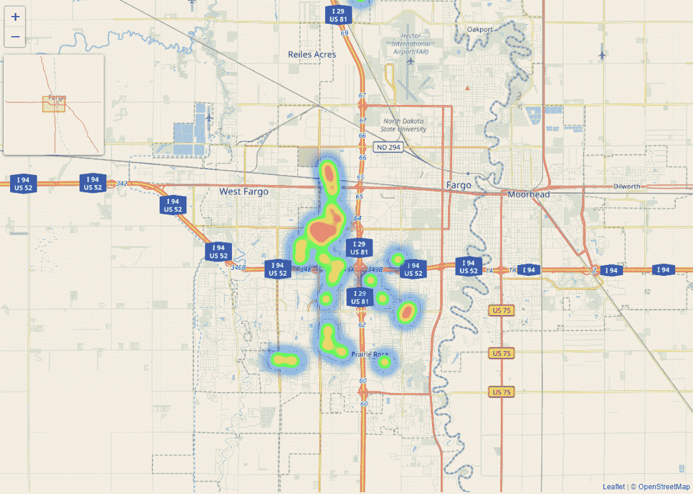
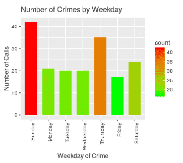
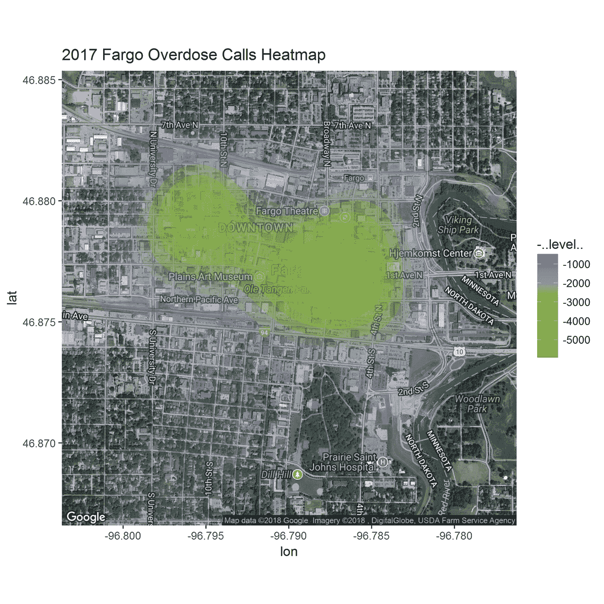

# 我分析了法戈的犯罪数据，这是我的发现

> 原文：<https://towardsdatascience.com/i-analyzed-fargo-crime-data-and-this-is-what-i-found-25138e2d6bb1?source=collection_archive---------5----------------------->

***TL；博士:*** *如果你没有耐心，想直接进入有趣的东西，这里有一个链接到我建立的* [互动网络仪表板](https://bradleylindblad.shinyapps.io/Fargo_Crime/) *来补充这个分析。在台式电脑上观看效果最佳。*

最近的一个周一下午，我通常会趴在桌子上小心翼翼地敲代码，但我偶然发现了一篇关于我家乡的文章，这让我恍然大悟。法戈暴力犯罪首次超过美国全国平均水平。这篇文章详细描述了坐落在肥沃平坦的古老湖床上的曾经沉睡的农业社区是如何超越全国暴力犯罪率的。

我是一个新爸爸，所以我对这些说法一点也不担心，所以我做了任何数据科学家在这种情况下都会做的事情，我搜寻了一些数据以了解更多信息。幸运的是，法戈警察局公布了他们的[调度日志](http://fargond.gov/city-government/departments/police/police-records-data/dispatch-logs)，其中详细记录了所有打给警方的电话。还有一个方便的[地图应用程序](https://www.crimereports.com/city/Fargo%2C%20ND#!/dashboard?incident_types=Assault%252CAssault%2520with%2520Deadly%2520Weapon%252CBreaking%2520%2526%2520Entering%252CDisorder%252CDrugs%252CHomicide%252CKidnapping%252CLiquor%252COther%2520Sexual%2520Offense%252CProperty%2520Crime%252CProperty%2520Crime%2520Commercial%252CProperty%2520Crime%2520Residential%252CQuality%2520of%2520Life%252CRobbery%252CSexual%2520Assault%252CSexual%2520Offense%252CTheft%252CTheft%2520from%2520Vehicle%252CTheft%2520of%2520Vehicle&start_date=2017-04-26&end_date=2017-05-10&days=sunday%252Cmonday%252Ctuesday%252Cwednesday%252Cthursday%252Cfriday%252Csaturday&start_time=0&end_time=23&include_sex_offenders=false&lat=46.865389&lng=-96.829027&zoom=13&current_tab=map&shapeIds=)，可以帮助你在二维空间中可视化“危险区域”的位置。但是，我想知道更多。因此，我制定了一组问题，我将使用 2017 年的派遣数据来回答这些问题。

# 问题陈述

*   问题 1:哪个月犯罪最多？
*   问题 2:哪个工作日犯罪最多？
*   问题 3:一天中什么时候犯罪最多？
*   问题 4:犯罪发生在哪里？

但是首先，让我们把假设和方法放在一边。

# 假设

(1)在调度日志中的犯罪类别中，我们将查看实际上是犯罪的呼叫，例如，我们将忽略停车投诉、胸痛等。

(2)每个电话事件都在街区级别报告，这意味着我们的地图将精确到街区，而不是房子或地址。

(3)为了简洁起见，我将使用“犯罪”一词代替“调度呼叫”，假设调度呼叫通常表示犯罪。

# 方法

计算语言被用来执行这些分析。完整的源代码可以在这个 [Github 库](https://github.com/bradlindblad/Fargo_Crime)找到。

# 哪个月犯罪最多？

法戈既有热天气也有冷天气，但在流行文化中，哈姆雷特更因后者而闻名，(谢谢，科恩兄弟/FX！).天哪，当你搜索法戈的图片时，你得到的只是 1996 年电影的海报和一个血迹斑斑的史蒂夫·巴斯米:

北方气候的人们都知道“幽居病”是真实存在的，尽管没有杰克·尼克尔森在《T4》的《闪灵人》中的解释那么极端。我的观点是，当你不得不刮擦挡风玻璃并在助推汽车前预热发动机时，犯罪就会变得更加困难。

在我查看数据之前，我认为在寒冷的几个月里，犯罪率会很低，这可能从 10 月份开始，一直持续到 5 月份。

上面的图表被称为日历热图。它按月份和星期几显示犯罪频率。冷色(紫色)表示低犯罪率，暖色(黄色)表示高犯罪率。正如我所怀疑的，与六月和九月的狂欢相比，十一月到二月相对平淡。

啊，现在这个条形图更清楚了。似乎从一月开始到五月的寒冷月份是堕落的夏季月份的隐喻斜坡，六月是这种放荡的顶峰。

# 哪个工作日犯罪最多？

我认为条形图也可以解决这个问题。

这很有道理。随着人们在工作周的忙碌，他们比周末有更少的时间变得野蛮。我很好奇，某些犯罪在一周的不同日子里会更常见吗？为此，我将从[交互式仪表盘](http://bradleylindblad.shinyapps.io/Fargo_Crime)中截取一些截图:

# 受损司机

人们在周末聚会更多；很明显。

# 骚扰

看一下调度记录，似乎很多电话都是对电话骚扰的回应，就像骗子一样。显然周一是他们在骗子公司的大日子。

# 一天中什么时候犯罪最多？

没想到会看到这些结果。显然，犯罪率在午夜左右下降，然后在凌晨两点酒吧打烊时又回升。为简单起见，我将不同的犯罪类型分为三个子类。

# 犯罪在哪里发生？

总的来说，这个城市到处都是犯罪。然而，市区在 2017 年的犯罪率最高。

互动仪表盘上的热图很有趣，可以用来查看特定犯罪的热点。

# 有趣的发现

当我摆弄仪表板时，我发现了一些有趣的事情。首先，我注意到窥视者数据相当集中在一个区域:

西英亩西部的法戈地区是主要的偷窥场所吗？我不知道。但是这可能表明只有一两个偷窥者呆在他们自己的社区里。周日的电话数量几乎是一周其他时间的两倍，这是一个明确的模式。

对“过量中毒”犯罪图表的研究显示了一种不同的模式:

这里我们看到两个不同的集群；一个在 Yunker 农场东部，另一个在市中心。如果我放大市中心的集群，我们可以精确定位震中(记住这是块级别的数据):

似乎是一个需要小心的地方。

# 结论

那么我们学到了什么？当你检查交互式仪表盘时，你总是会得出与我不同的结论，但我的观点是:( 1)市中心=危险区,( 2)寒冷肯定对当地犯罪有“冷却效应”(抱歉),( 3)酒吧关门不是遛狗的好时候。

# 进一步研究

我曾想过建立一个实时网页来展示法戈犯罪的发生。有一个[网页](https://www.crimereports.com/city/Fargo%2C%20ND#!/dashboard?incident_types=Assault%252CAssault%2520with%2520Deadly%2520Weapon%252CBreaking%2520%2526%2520Entering%252CDisorder%252CDrugs%252CHomicide%252CKidnapping%252CLiquor%252COther%2520Sexual%2520Offense%252CProperty%2520Crime%252CProperty%2520Crime%2520Commercial%252CProperty%2520Crime%2520Residential%252CQuality%2520of%2520Life%252CRobbery%252CSexual%2520Assault%252CSexual%2520Offense%252CTheft%252CTheft%2520from%2520Vehicle%252CTheft%2520of%2520Vehicle&start_date=2017-04-26&end_date=2017-05-10&days=sunday%252Cmonday%252Ctuesday%252Cwednesday%252Cthursday%252Cfriday%252Csaturday&start_time=0&end_time=23&include_sex_offenders=false&lat=46.865389&lng=-96.829027&zoom=13&current_tab=map&shapeIds=)已经做了类似的事情，但它笨拙而缓慢。如果对这个分析有足够的兴趣，我肯定会把这个应用扔在一起(如果你喜欢这个，给我发电子邮件或评论)。

我可以根据合同提供数据咨询。给 bradley.lindblad@gmail.com 发邮件

