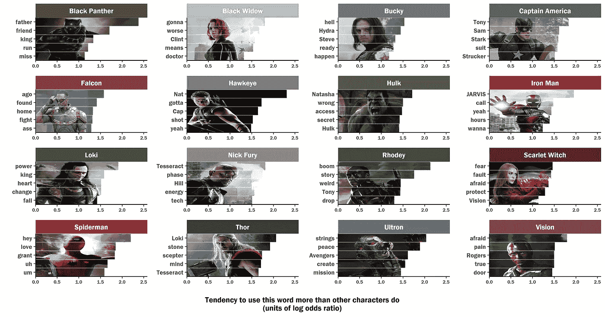

# 我分析了漫威的电影剧本，以了解每个复仇者说得最多的是什么。

> 原文：<https://towardsdatascience.com/i-analyzed-marvel-movie-scripts-to-learn-what-each-avenger-says-most-2e5e7b6105bf?source=collection_archive---------8----------------------->

处理等待无限战争的一个方法是玩一些复仇者联盟的数据。我拿了最近三部漫威电影宇宙跨界电影(《复仇者联盟》、《复仇者联盟:奥创时代》和《美国队长:内战》)的剧本，找出了每个英雄最具特色的词语。我离开洛基和奥创是因为他们有如此独特的声音。

Matt Winn，数据可视化超级英雄，使用 R 的 ggplot 库制作了这个图([在这里查看他的教程](http://mattwinn.com/Plot_Avengers_data.html))。这并不容易，我们得到了西雅图[数据即 Jam meetup](https://www.meetup.com/Data-Viz-Jam-Sessions/?_cookie-check=2WuVPJ3FILTDunvn) 的大力支持。

我们希望你喜欢！

一些值得注意的数据观察:

1.  鹰眼和浩克都在说纳特。当然是因为不同的原因。
2.  洛基有着崇高的想法，比如*权力*和*改变*。虽然索尔比其他复仇者更多地提到洛基，但洛基并没有回报兄弟般的关怀。他的眼睛盯着他的目标。
3.  雷神的关键词表明，在复仇者联盟的电影中(不包括雷神标题的电影，如 Ragnarok 和黑暗世界)，他比大多数其他角色更注重行动。除了他和洛基的关系，他倾向于关注推动剧情发展的有形艺术品。比如洛基的权杖宇宙魔方和心灵之石。
4.  蜘蛛侠是如此笨拙和追星族。他的关键词包括“嘿”、“嗯”、“嗯”。
5.  看看《幻视》和《猩红女巫》有什么相似的词汇——它们都在谈论恐惧。我希望他们在无限战争中保持同步。有趣的是，我也做了一个情绪分析，Vision 有最多的负面情绪。这并不是因为他是一个经常令人沮丧的人，而是因为他认为情况就像他看到的那样，并且有时反思他所爱的人类英雄的徒劳。他看到了额外的，额外的大局，我觉得这让他很不安。
6.  美国队长经常谈论其他人。事实上，他的五个最有特点的词中有四个是名字(托尼、萨姆、斯塔克、斯特鲁克；另一个词是“西装”，几乎都是指托尼的西装)。
7.  看到黑豹的话随着他的角色继续发展而变化将会很酷——我们刚刚在内战中见到他，他在他的个人电影中经历了一个惊人的过程。在内战中，他仍然被他在瓦坎丹皇室的地位和他对传统的依赖所定义，这表现在他的用词上。当他被他的个人电影中的事件改变时(这里没有剧透)，他必须改变他的世界观并重新定义他与他的遗产的关系。

很想听听大家的评论和见解！

再见了，

她