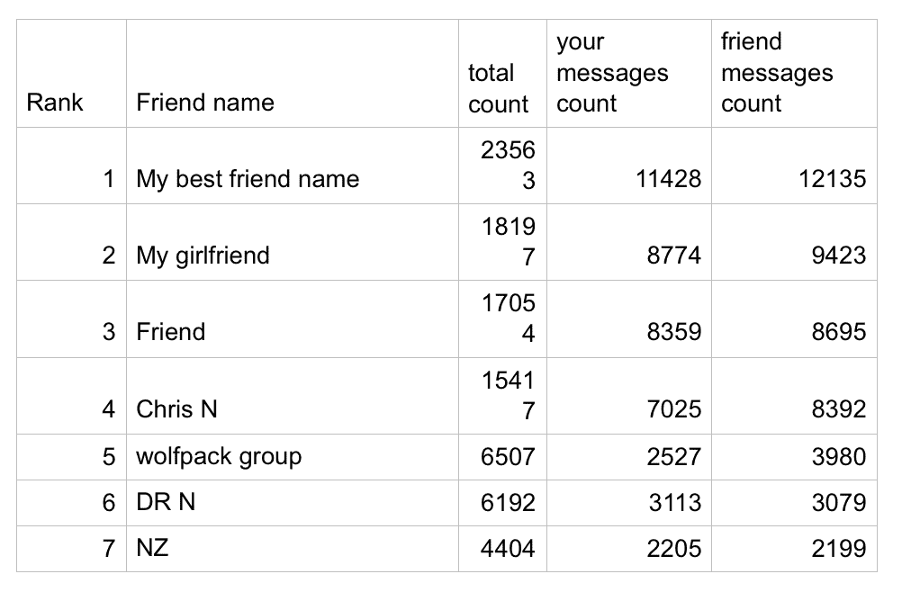
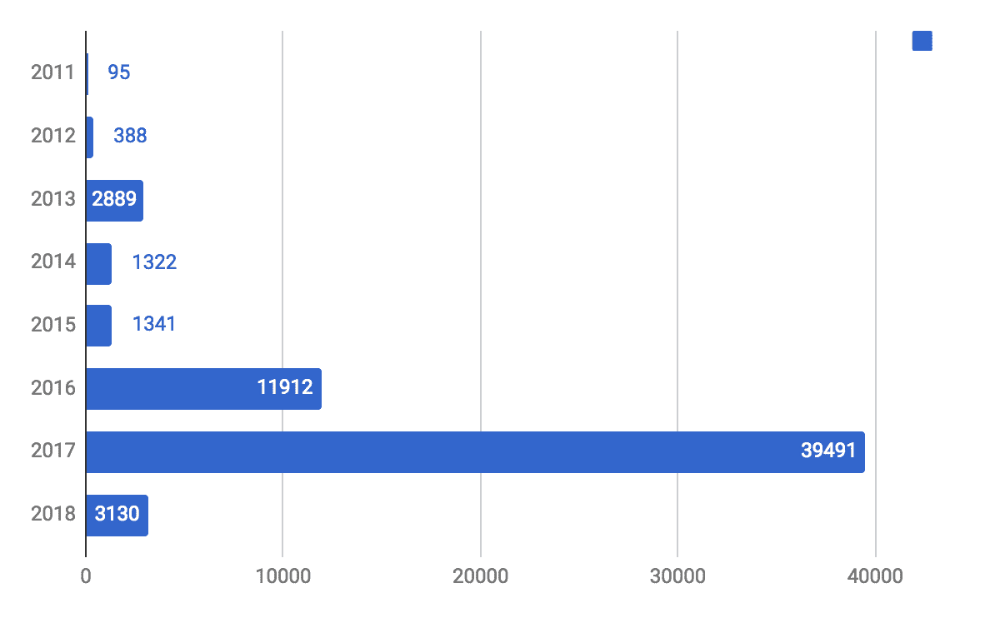
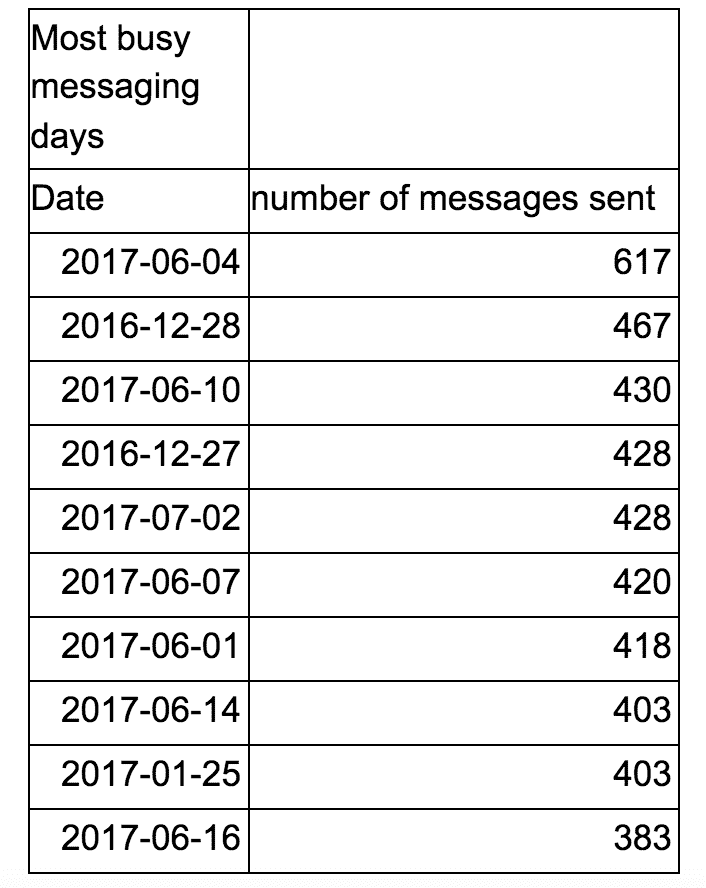
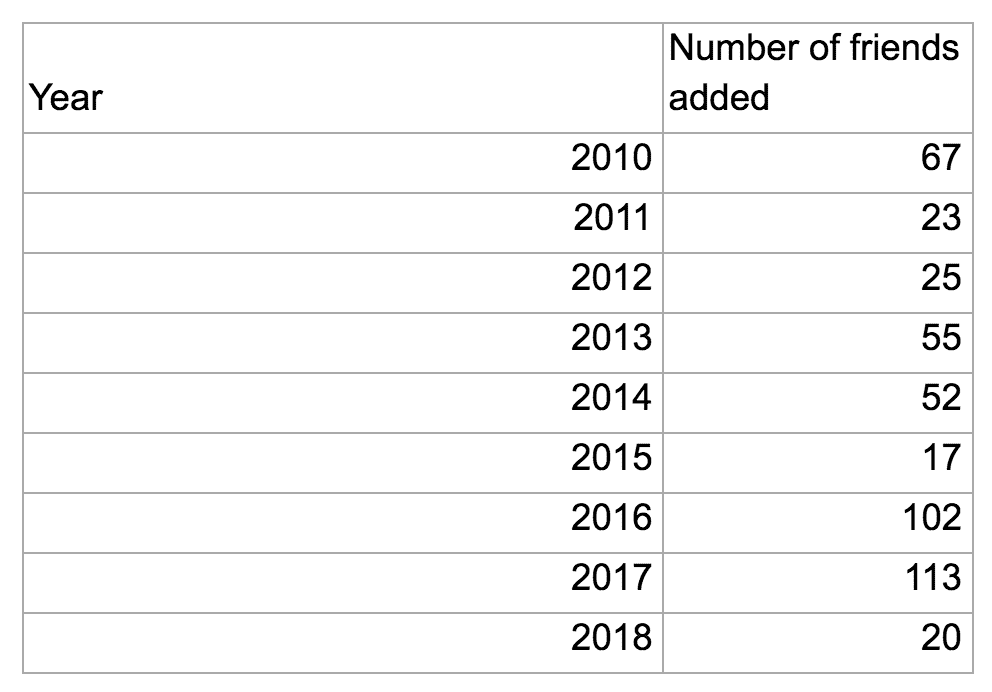
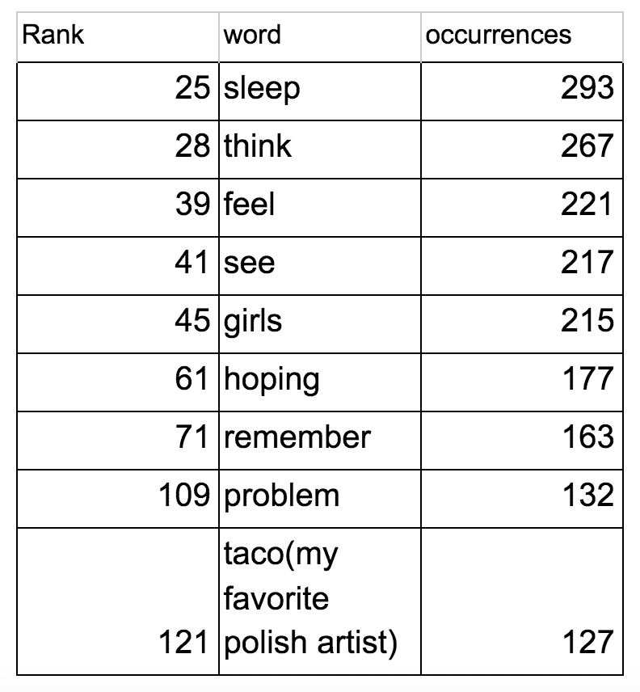

# 我分析了我在脸书的数据，这是一个关于害羞、孤独和变化的故事

> 原文：<https://towardsdatascience.com/i-analyzed-my-facebook-data-and-its-story-of-shyness-loneliness-and-change-7f4e0ec3a952?source=collection_archive---------1----------------------->

我跟随最新的趋势也下载了我的脸书数据的 zip 存档，但是在分析数据之后我发现的并不是我所期望的。

我想知道脸书对我有什么了解，就像现在其他人一样，但我开始深入挖掘联系数据、广告点击量和我的活动历史之外的信息。第一次，我脑子里所有关于解析我的 facebook 数据的想法看起来都是可行的。页面是干净的，他们只是对我尖叫，“利用我，你知道如何编码我周围的东西”。我开始写一个刮刀来分析所有这些数据，数万条消息，好友添加历史，我的词汇，我对一切都很好奇。整个脸书剑桥分析丑闻应该提醒我们，Facebook 在我们的生活中有多重要，我们每天使用它有多频繁，我们表现出的行为远远超出了简单的喜欢和照片。

我想知道我的模式，并在这些年里做了一些改变。我使用脸书这么多年了，在很长一段时间里，信使也一直是我主要的交流方式。那里必须有有趣的数据，如果我所有的工作变得枯燥乏味，我会非常失望。我在 ruby 中创建了一个脚本来解析我的 zip 存档数据，我与你们所有人分享它，所有你需要的是脸书的 zip 副本存档(它必须是英语)。

这是给你阅读后尝试的，对代码质量抱歉，但这是一个快速的黑客，所以请原谅我:

[https://github.com/Lackoftactics/facebook_data_analyzer](https://github.com/Lackoftactics/facebook_data_analyzer)

这个脚本将生成 excel 文件，其中包含所有分布在工作表中的统计数据:“朋友排名”、“我的消息统计”、“词汇统计”、“联系人列表”、“交朋友”。

我首先感兴趣的是我和谁写得最多，以及我们的转化率看起来如何。

People, groups I wrote the most

到目前为止，一切都很好，我最好的朋友排在第一位，其次是我现在的女朋友，我看到他们在交谈中投入了更多，因为他们写了更多的信息和文字。这是一个非常有趣的统计数据，可能说明我真的更喜欢和同样乐于交谈的人交谈。

到目前为止，这很有趣，我有一个我的朋友的排名，通过一些信息，单词，字符。接下来的部分带来了回忆。是时候坦白了，我是一个非常害羞的人，我独自坐在学校直到高中结束。我不会去参加聚会，喝酒，甚至不会和朋友出去玩。如果提到的任何事情曾经发生过，那也是非常罕见的，几乎是不存在的。我从父母身边搬走后，我知道这是我一生中最好的决定，我独自一人，渴望朋友，但他们无处可寻。我从不约会，很少和任何人去看电影或喝啤酒，我把时间都花在看电视节目上。但是有一年，当我开始出去，经常出去，我是说真的经常出去的时候，我突然明白了一些事情。参加那么多派对并不好，但我需要，接触女孩，去上嘻哈课程，更关心更多的外表。有趣的是，你可以从数据中看到。

这是我每年发送的信息数量，猜猜看，我是从哪里开始变得更加社会化的。

Number of messages sent by year

在 2016 年，当我开始在社交和约会领域迈出第一步时，这一数字增加了近 10 倍，然后与 2015 年相比增加了近 40 倍。我知道这只是一种通信类型的数据，但我以前总是使用 messenger 作为我的主要通信方式。不可否认，我与人们的社会交往和我发送的信息数量之间有很强的相关性。在 2015 年和 2014 年，我每天平均收到 3.6 条消息，这表明我当时有多孤独，电话那头没有任何人让我说话，安排会议，关心我的一天或说晚安。在 2017 年，平均每天有 108 条消息，我有可以交谈的人，有趣的人，我每天都可以和他们交谈和交换这么多消息。我的社交能力处于巅峰状态，在接近女孩时，我觉得自己真的不可战胜。

**最繁忙的消息传递日**

好吧，即使是这个数据也显示了社交模式的美妙之处。大多数繁忙的消息传递日恰好是从 2017 年 6 月开始的，就在我遇见我的女朋友并给我留下了非常好的印象之前，好到我们在一起了。

Most messages sent by date

我们在这里，我们在一起不是很可爱吗？:)

@p_mroczek picture from instagram

我还分析了我添加新朋友的历史，进展仍然存在，但这个统计数据并不那么可信，因为每次工作变动，旧同事的快速增加很容易造成脸书，使数据混乱。但是你也可以在这里看到进步。

**按年交友**

我社交最多的一年也是我交朋友最多的一年。但就像我之前说的，这不是我百分百信任的数据，因为任何社会环境的变化都让这个数据不可靠。

我也对我交新朋友感兴趣，是在周末还是在工作日。正如我所预测的，大多数新的友谊来自于周末外出。

你知道，你还能从脸书的数据中得到什么？类型的人，夜猫子对早起的鸟。这并不难，只要分析你的信息模式，按一小时分解。

快速看一看，你就知道，我不是那种早起的人。我一直怀疑我是夜猫子，但现在我有数据支持它。我在晚上更有效率，我最密集的编码会议发生在晚上。即使是这篇文章，我也是在深夜创作的。对我来说更容易进入心流状态，但也很安静。

我们来看看词汇统计。我对我的词汇感兴趣。我总共使用了 43k 个单词和 366k 个单词。那只是冰山一角。我用的最常用的词呢，在我们过了常用词之后，我们得到了有趣的东西。我怀疑，可能作为一个相当敏感的人，这也应该反映在我的写作中。为了更好的理解，我将把这些波兰话翻译成英语。我不想过度分析这一点，但与我的其他朋友相比，我会说这看起来不同，显然我喜欢表达我的情绪和我的感受，人们倾向于隐藏它们，特别是在发短信的时候。也许这也是害羞的一部分，写东西比在别人面前说容易。

Word rank

此外，我真的很喜欢谈论 Taco Hemingway，波兰嘻哈艺术家:)我非常公开地交流我的感受，根据我的经验，这样做的人可能很容易成为欺凌的目标，这导致封闭自己，少说话，更少机会，因为第一次尝试以可怕的方式结束。

所以现在你知道了我的故事(至少有一小部分没有进入沮丧的情绪)，用数据表达，一个我几乎忘记的故事，因为现在事情对我来说太不同了。我不记得那个害怕接近女孩、和她们跳舞、和朋友出去的家伙。这就是我们这个时代真正有趣的地方，我们不仅可以通过写日记，拍照片来创造记忆，我们还可以通过创造数据来创造记忆。这些数据我们可以在未来进行分析，可以激发记忆，尽管有时有点悲伤。

想要运行此脚本并了解自己。也许只是为了好玩，也许你也会发现自己的一些有趣之处。

查看我的 github 存储库，了解如何运行:

 [## lacoftactics/Facebook _ data _ analyzer

### facebook_data_analyzer -分析你的数据的 facebook 副本。从 facebook 下载 zip 文件并获取朋友的信息…

github.com](https://github.com/Lackoftactics/facebook_data_analyzer) 

请在产品搜索上投票支持我的存储库，以便更好地展示该库。那会对我有很大的帮助。

【https://www.producthunt.com/posts/facebook-data-analyzer 号