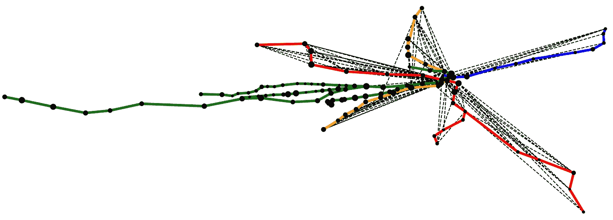
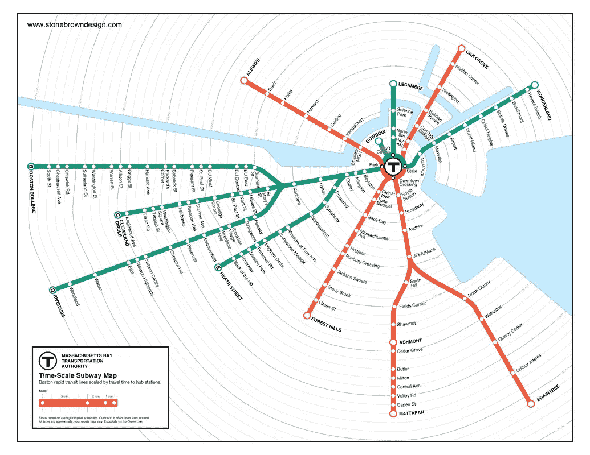
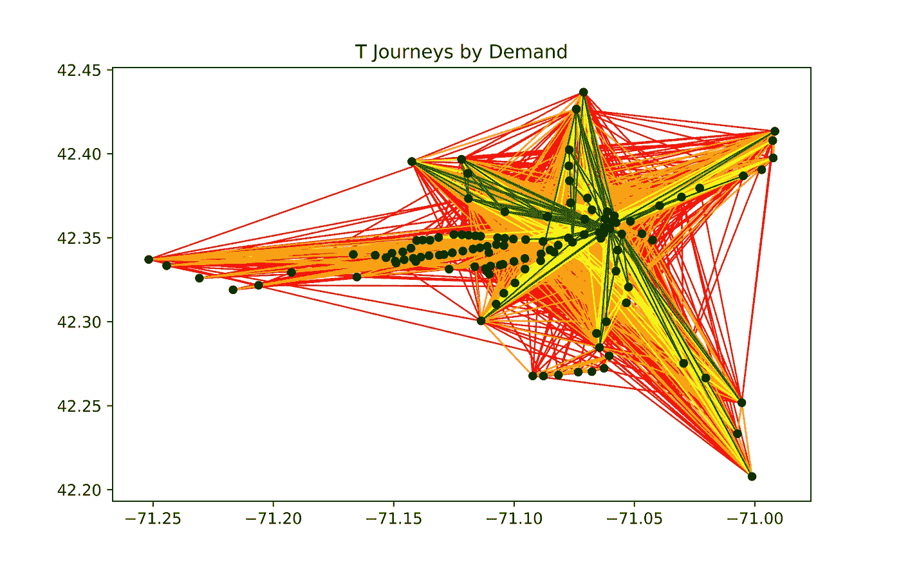
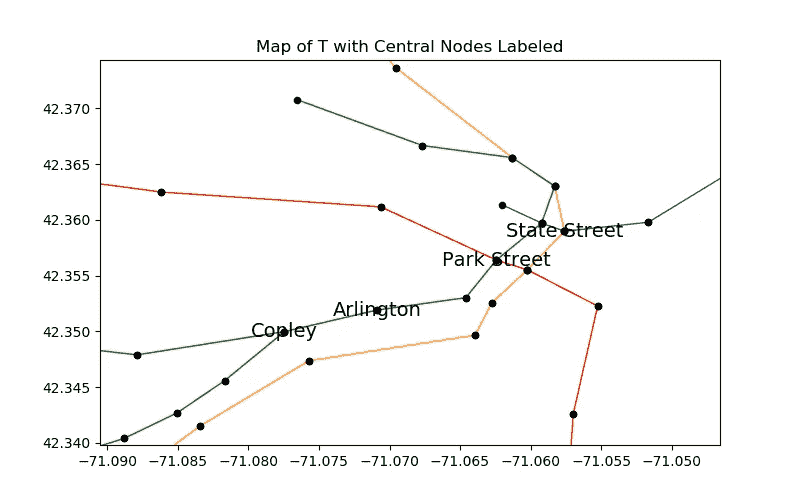
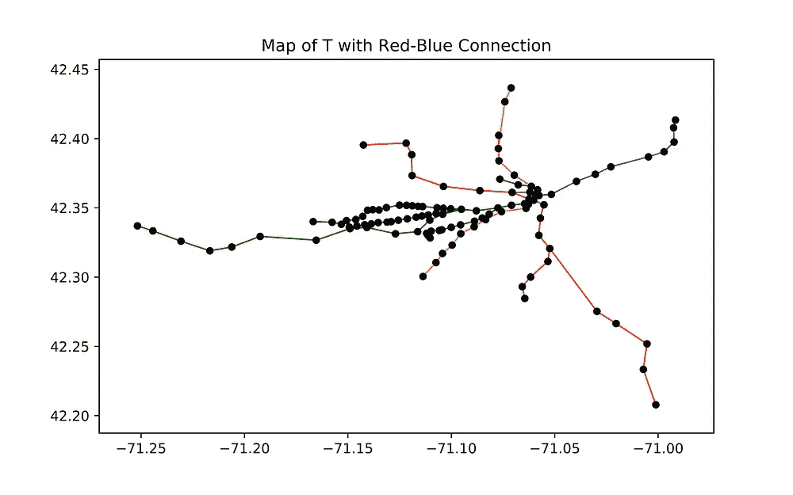
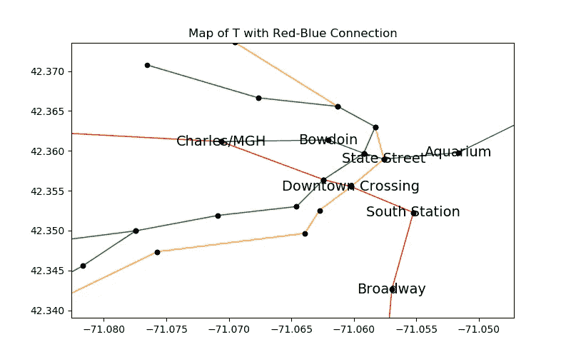
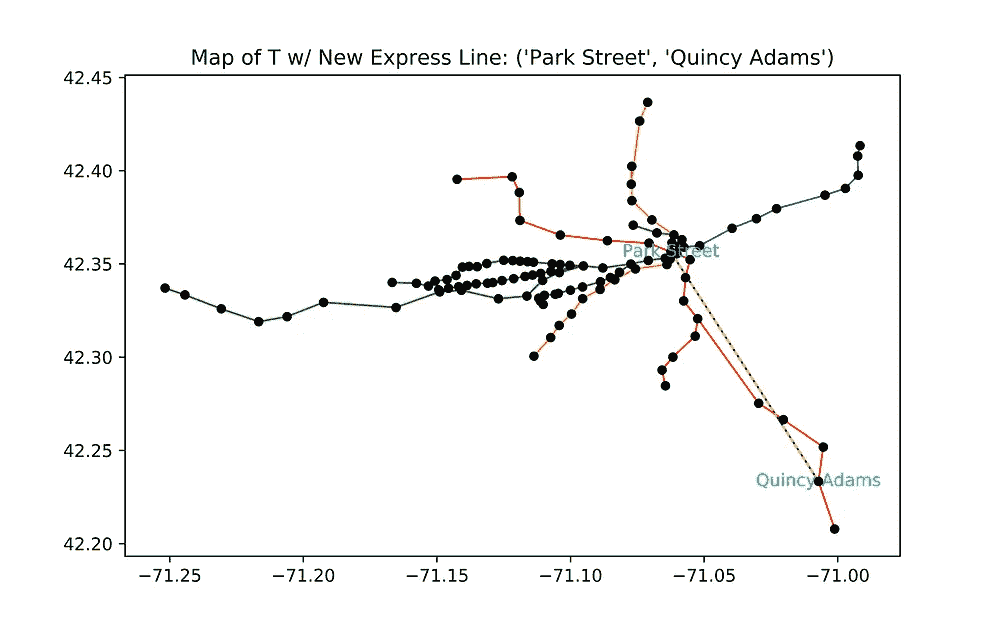
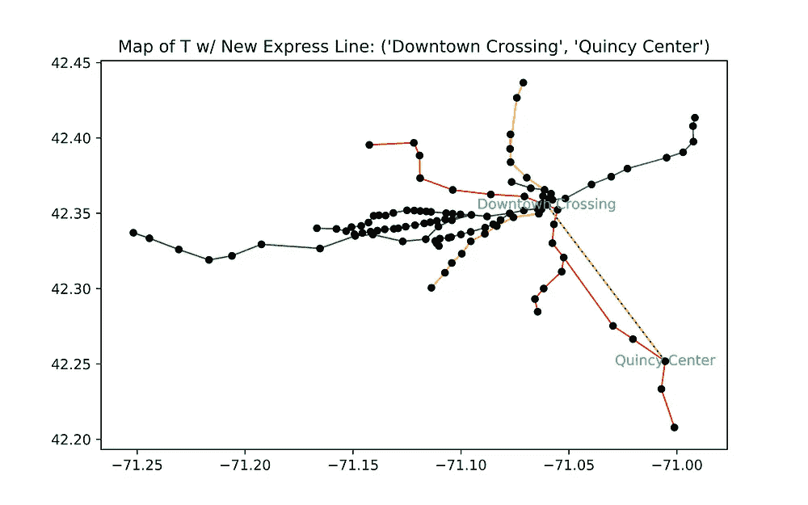

# 我用 Python 构建了 T(并修改了它)

> 原文：<https://towardsdatascience.com/i-built-the-t-with-python-and-revamped-it-632127364f4e?source=collection_archive---------9----------------------->



## Python 是一个很好的网络建模工具——那么它能告诉我们如何改进 T？

今年秋天，我在麻省理工学院上了一堂网络模型课( [1.022](https://learning-modules.mit.edu/class/index.html?uuid=/course/1/fa18/1.022#info) )。这门课涵盖了许多网络/图形的酷概念，如节点中心性和最短路径，以及重要的应用，如流行病和社交网络的行为。这个理论的另一个应用——我选择做我的毕业设计——是交通网络。在我这堂课的最后一个项目中，我模拟了 T，并实验性地对网络做了一些改变。

## 如果你不熟悉 T…

T 是波士顿地铁系统。马萨诸塞湾运输管理局(MBTA)经营 T，以及公共汽车和通勤铁路。T 上有五条线:红色、蓝色、绿色、橙色和银色的线。银线实际上是一辆公共汽车，我没有把它包括在我的模型中。

T 的官方地图，参考[这一页](https://www.mbta.com/schedules/subway)。

Have fun exploring the T via this map I made on Carto! :)

## 首先，我将解释一下我是如何对网络建模的。

你应该知道的第一件事是， [MBTA 的 GTFS 数据](https://www.mbta.com/developers/gtfs)在网上公开。 [GTFS 数据](https://developers.google.com/transit/gtfs/)是一种纯文本格式(。txt)数据，Google 创建这些数据是为了标准化公共交通机构与开发者共享/报告路线的方式。特别是，我使用了“stops.txt”文件，该文件报告了关于 MBTA 站的所有信息。这些数据给了我创建网络节点所需的信息，也就是 T 型站点。

Here is the class Station that I defined to represent the MBTA stations, and the function create_stations that creates Station objects from the MBTA’s GTFS data.

在图论中，图由节点和边组成。边连接节点；它们还可以具有表示其相对重要性的权重。对于 T 形网络，边代表车站之间的连接，即火车轨道所在的位置。这些边的权重表示站点之间的旅行时间。



This map by [Stonebrown Design](http://www.stonebrowndesign.com/boston-t-time.html) was incredibly helpful in reporting travel times.

在时间比例的 T 地图的帮助下，我写了一个文本文件，指定了车站之间的每条边和旅行时间。文件中 116 行的每一行都采用以下形式:

```
stop1,stop2,time,color
```

你可以在这里看到整个文件。

使用 Python 上的 Networkx 包，我制作了一个表示地铁网络的 Graph 对象。我还编写了一个函数，使用站点的地理坐标绘制网络，并保持边的颜色与线的颜色一致。

This module makes a Networkx Graph object to represent the T, and it also plots the resulting network.


Here’s what the network looks like! Travel times are not visually represented, but you can see how physically far apart the stations are, which is correlated to travel time.

但是我不只是对电视台的网络感兴趣；我想知道实际上有多少人乘坐 T 型车，哪些路线最受欢迎。我联系了 MBTA，得到了一些 2017 年秋季的需求数据！利用他们给我的数据，我实现了一个类似的程序来建立另一个网络。在“需求”网络中，边权重代表工作日一对车站之间的平均乘客数量。你可以在这里看到我为那个[写的代码](https://gist.github.com/amyvogel/f75c9e488129e0837109a1ac1797e49e)。



This is a visualization of the demand network, with green edges being the most traveled routes.

## 在对网络进行更改之前，让我们看看我们已经能够辨别出什么。

我从对节点中心性的一些初步分析开始。在地图上，**科普利**和**阿灵顿**具有最高的接近中心度。实际上，这意味着这两个站是网络上所有其他站“最接近的”(在行驶时间上)。同样， **Copley** 具有最高的中间中心性，这意味着网络上最多的最短路径经过 Copley(注意，这没有用行程时间加权)。 **State Street** 具有最高的特征向量和 Katz 中心性，这意味着它是最有影响力的(同样，不根据出行时间或需求进行加权)。度中心性在地图上的唯一意义是指出发生换乘的车站。因此，使用需求图来计算度中心性更相关。**公园街**具有最高的中心度，意味着它具有最多的交通/需求。下面是地图图形的放大视图，中心节点已标记。



Not surprisingly, the most central nodes are all located in the center of Boston, a.k.a. downtown.

This is an interactive map of the same stations, to give you a little more context if you’re unfamiliar with downtown Boston.

**我还计算了乘客在地铁上的平均出行时间。**为此，我做了一些假设。首先，我假设乘客会通过最短的路径(以分钟为单位)从出发地到达目的地。我还假设线路之间的每一次转换都需要五分钟。这是一个重要的规范，因为否则，我的算法会认为换乘是“免费的”——而实际上乘客喜欢尽可能避免换乘。考虑到传输，我制作了另一个版本的 edges 文件；我拆分了每个有换乘的车站(例如，公园街→公园街红和公园街绿)，而是通过 5 分钟的边连接两个车站。下面，看看那些转移边在文本文件中是什么样子的。

```
place-pktrm_red,place-pktrm_green,5,black
place-gover_blue,place-gover_green,5,black
place-state_orange,place-state_blue,5,black
place-haecl_green,place-haecl_orange,5,black
place-north_green,place-north_orange,5,black
place-dwnxg_red,place-dwnxg_orange,5,black
place-kencl_B,place-kencl_C,5,black
place-kencl_C,place-kencl_D,5,black
place-kencl_D,place-kencl_B,5,black
place-coecl_BCD,place-coecl_E,1,black
place-jfk_A,place-jfk_B,5,black
```

我的算法是这样计算平均乘客行程时间的:

*   迭代需求网络上的每条边(例如，站 A 到站 B，150 名乘客/天)
*   计算这些站点之间的最短路径/行驶时间(例如，站点 A 到站点 B 的最短路径需要 13 分钟)
*   乘客数量乘以行程长度(例如，从 a 站到 b 站每天贡献 1950“乘客分钟”)
*   合计每个连接的乘客分钟数，然后除以乘客总数

Here’s how I did it!

使用这个算法，我发现 T 上的平均行程时间(工作日)是 14.7 分钟。

## 那么，如果 MBTA *最终*建造了红线-蓝线连接器会怎么样呢？



Here’s what the network would look like with the Red and Blue Lines connected at Charles/MGH! (Currently, the Blue Line ends at Bowdoin.)

关于从鲍登延伸蓝线——它的终点——到查理斯/MGH 已经有[谈了*年*T5 年了。红色和蓝色线路是该网络中仅有的两条没有直接连接的主线(抱歉，是银色线路)——目前，你必须乘坐橙色或绿色线路才能在两条线路之间穿行，而无需离开地铁。由于两条线路在地理位置上非常接近(例如，步行 5 分钟)，为了避免再次点击你的查理卡并支付另一笔 2.25 美元，乘坐橙色或绿色线路的一站可能会感觉非常愚蠢。](https://www.bostonherald.com/2018/10/18/boston-wants-link-of-red-blue-lines-back-on-track/)

**红线-蓝线连接的好处是什么？我的模型预测红线-蓝线连接可能不是很有用。在没有连接的情况下，平均乘客行程时间为 14.70 分钟；有了这条线路，平均乘客出行时间变成了 14.66 分钟。平均而言，这种连接对乘客的影响可以忽略不计(特别是与施工期间的不便相比)。然而，这种连接不会对乘客产生任何影响，除非他们真的在红线和蓝线之间旅行。所以，我也研究了这种差异。我制作了另一个版本的 average_shortest_path ,它只查看两组不同车站之间的乘客——在这里是红线车站和蓝线车站。**

如果没有连接，乘客在两条线路之间的平均旅行时间为 16.61 分钟。通过连接，这一时间缩短至 15.77 分钟，因此这些乘客每天可以节省近一分钟。这是一个更显著的区别。此外，该模型**假设当添加新连接时，需求不会改变**；然而，如果更多的乘客开始乘坐红蓝线之间的 T 线，因为它变得更加方便，这将进一步减少网络上的平均旅行时间。

## 一条新的快线能给 T 的乘客带来多少好处？

目前，T 没有任何快线。我想知道添加什么样的快速连接是最好的，以及它会带来多大的不同。我应该注意到，我用来确定这一点的指标是相当任意的，但是随着更多的信息和更多的时间，我的模型可以产生更准确的结果。

我看了两个快线场景。在第一种情况下，一列快速列车将在已经存在的轨道上运行，但比正常情况下快 40%(因为它不会在中间停车)。在第二种情况下，一辆特快列车将在两个车站之间的全新轨道上直线行驶，但与其他列车的平均速度相同。

为了确定两种情况下的最佳快速线路，我编写了一个函数(build_best_xline ),测试了给定规范下的每一个可能的连接，并返回平均乘客行程时间减少最多的边。

## 在这两种情况下，我的算法确定从昆西到波士顿市中心的快速线将是对乘客最有用的快速连接。

在没有铺设新轨道的情况#1 中，**公园街到昆西亚当斯**将是最好的新连接。在情况#2 中，新线在两个车站之间的直线轨道上运行，最佳新线将是从**市中心交叉口到昆西中心**。



Shown on the maps are the two express lines that my algorithm recommends.

**当然，我目前展示的所有发现都是基于一些假设，有很大的误差空间。**车站之间的行程时间仅仅是粗略的预测。此外，新快线的规格相当随意。此外，换乘线路时假定的 5 分钟行程时间是任意的，尽管它在为换乘线路分配非零成本方面部分地达到了其目的。但是，由于寻找车站之间的最短路径是我计算的一个重要部分，用更准确和具体的传输时间重做这个项目会很好。我也只使用了在两个 T 站之间旅行的乘客的需求数据；这并没有考虑到 T 上的所有乘客，因为许多乘客从公共汽车站或通勤铁路开始和/或结束他们的旅行。

我认为 T 的这个模型传达了网络的一般行为，但是缺少了许多精确的层次。没有更精确的计算细节，很难说我的结果实际上有多准确。尽管如此，这里还是有一些很酷的外卖。

# T 是一个网络，网络的一般性质可以用来理解在 T 上旅行或改进 T 的最有效方式。

我们可以使用介数中心性、度中心性和最短路径的概念来分析网络的潜在改进。理论上，这种分析可以预测对网络的某些修改会有多大帮助。但是要真正理解这些变化的影响，我们还需要预测需求会如何变化——这要困难得多。

在未来的工作中，我希望使用这种类型的分析来推荐增加 T 型车乘客数量的方法。例如，我可以查看优步的需求数据，而不是只查看 T 型车的当前需求。我怀疑，当公共交通不能充分连接两个点时，人们会更频繁地在这两个点之间乘坐优步。因此，研究如何更好地连接通常由汽车服务的成对 T 型站点可能是值得的。我还想扩展网络模型，使其更加全面；显然，公共汽车(和银线……)是一个重要的考虑因素。该模型的未来迭代也可以包括所有这些连接。

## 我的希望是，通过向您介绍我是如何做到这一点的，您可以自己尝试一下——或者甚至尝试模拟一个不同的交通网络！

如果您对我的流程有任何疑问，或者对您希望我测试的网络的不同修改有任何想法，请在下面留下评论或直接联系我！

*感谢所有帮助我实现这个项目的人！感谢 MBTA 为我提供乘客数据来构建需求网络。感谢我的教授 Amir Ajorlou 和我的助教 Paolo Bertolotti 为我的项目提供指导和反馈。*