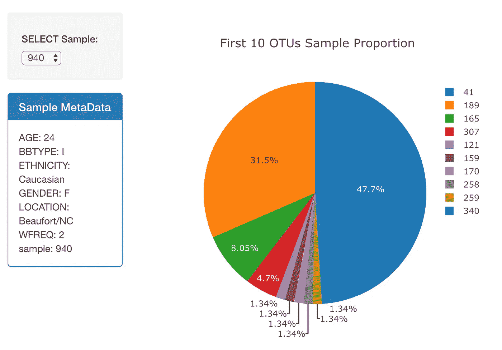
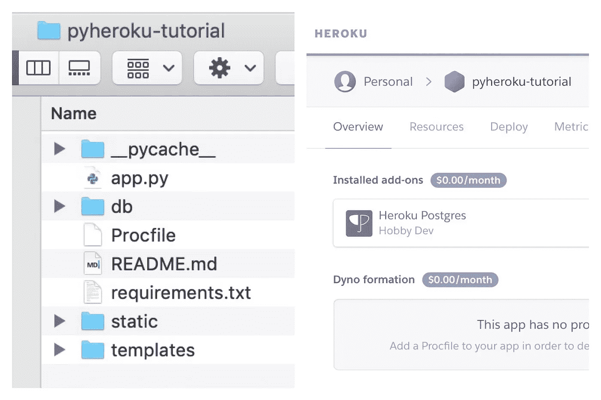

# 我可以成为你的英雄，宝贝

> 原文：<https://towardsdatascience.com/i-can-be-your-heroku-baby-a5c1fa2edfd9?source=collection_archive---------11----------------------->

## 在 Heroku 部署 Python 应用程序！


**你喜欢数据科学吗？**

<*上下摇头>*

**你喜欢数据科学 DIY 部署吗？**

<*左右摇头>*

**我也没有。**

早期数据科学学习或个人工作中最令人沮丧的部分之一是通过免费的云应用程序部署应用程序。你的代码是最棒的，在本地很管用。我相信你。那么，为什么每次你试图把它推到云端时，它都会爆炸呢？

当然，我具体说的是 Heroku。世界上有十亿本指南，然而我认识的每个人在我们每次尝试部署 Python 应用时都会遇到问题。我们的 Flask 应用程序在本地 Python 服务器上运行良好，但是看似简单的 Heroku 设置会在“创建”或“打开”期间崩溃，让我们对着墙壁大喊大叫……无生命的物体。

不管怎样，重点是赫罗库的性情非常多变。如果一个步骤做得不正确，部署很可能会失败，因此应用程序会崩溃。事实上，在早期，我的努力会变得如此之快，我会删除 Heroku 上的应用程序，然后从头开始。

男孩女孩们，让我的猴子成为你们的马戏团。或者别的什么。下面是 Python apps 的指南*来指导你我失败的地方。*

1.  **准备您的申请**
2.  **创建 Heroku app**
3.  **通过 Git 推送到 Heroku**

# 0。但是首先…示例代码&示例应用程序！

*目标:懒惰*

注意:可以随意叉这个回购，自己试试。这是一个关于肚脐眼的荒谬数据集，但是它的简单性和复杂性使它成为本教程的主要候选对象:[链接到回购](https://github.com/jeffreybox/PyHeroku)



# **1。准备您的申请**

*目标:无聊的 Python 基础*

像大多数项目一样，最好从一个全新的环境开始，所以继续创建、复制或安装一个环境。我这里用的是康达。

```
$ conda create — name env_name
```

或者克隆您现有的工作环境

```
$ source activate env_name
```

您可以随时通过以下方式查看您的环境列表:

```
$ conda env list
```

更多关于管理 Conda 环境的信息[请点击](https://conda.io/docs/user-guide/tasks/manage-environments.html):

*注意:如果您使用 PyHeroku 中的示例代码，跳过下一步，在 requirements.txt 文件上构建环境。*

```
$ conda install —- yes —- file requirements.txt
```

**安装所有必要的库**

有时创建一个全新的 python 环境并不包含根环境的基本库标准。为什么？不知道。没关系。我只是注意到这一点。因此，请确保您已经在环境中安装了运行应用程序所需的一切。

通过在活动环境中调用以下脚本来检查包

```
$ conda list
```

如果您缺少必需品(例如熊猫)或任何其他东西(例如 Flask、Flask-SQLAlchemy)，请立即安装 pip 或 conda。在这一切都很舒适之后，我们还需要两个软件包，如果你是一个 Heroku noob，它们可能不会被安装。Herokoob。

**安装 Gunicorn**

这个库是一个高性能的 web 服务器，可以在生产环境中运行他们的 Flask 应用程序。我不会对“如何”进行更多的细节描述，但这就是应用程序工作的原因。在您的环境中:

```
$ pip install gunicorn
```

**安装 psycopg2**
*如果你的应用程序使用本地数据库，它很可能使用本地数据库*

```
$ pip install psycopg2
```

**调试 app**

不要忘记显而易见的事实。确保你的项目在本地运行。由于我使用 Flask 作为示例，只需“Flask run”您的 app.py。如果有问题，请确保 Flask 应用程序已正确初始化、路由和部署。例子包括

```
# the top of your flask appapp = Flask(__name__)# a route example[@app](http://twitter.com/app).route(‘/’)
 def home():
 return “Hello, Jeffrey Box. U R Kool with a K.”# the bottom of your flask appif __name__ == ‘__main__’:
 app.run(debug=True)
```

**创建必要的项目文件**

现在，我们需要在与 app.py 相同的目录下生成两个文件，它们是 Procfile 和 requirements.txt 文件。Heroku 需要这两者来安装所有的应用程序依赖项，然后利用 Gunicorn 在云中启动我们的应用程序。首先创建 Procfile。

```
$ touch Procfile
```

使用终端、代码编辑器、文本编辑器打开 Procfile，只需添加以下文本

```
web gunicorn app:app
```


如果您的应用程序碰巧在不同的子目录中，部署将会失败。您可以通过将脚本修改为“gunicorn 子目录. app:app”或类似的内容来回避这个问题，但我不建议这样做。只要把它们都放在根目录下就行了。

最后，我们通过以下方式创建 requirements.txt 文件

```
$ pip freeze > requirements.txt
```

*注意:这些文件已经存在于 PyHeroku repo 中*

# **2。创建 Heroku 应用程序**

*目标:唤醒 Heroku Heroku*

嗯……如果你还没有 Heroku 账号的话，创建一个。之后，让我们创建第一个应用程序

**创建新应用**

拥有帐户后，点击“新建”>“创建新应用”。您将始终为您部署的每个应用程序创建一个新的“应用程序”。在下一个屏幕中，创建您的“应用程序名称”。

**重要！！！**

这是很多人犯错的地方。该名称对于 Heroku 必须是唯一的，但是该名称还必须与您的本地项目目录(包含 app.py、procfile、需求文件的目录)的名称相匹配。在下面的截图中，heroku app 名称为‘pyheroku-tutorial’；目录名为“pyheroku-tutorial”。明白了吗？



但是你真的明白吗？因为如果由于 Heroku 应用程序名称不可用而导致您最终需要修改您的目录名称，这可能会造成 Github 或任何其他代码依赖的问题。现在你明白了，一些非常简单的事情会浪费你几个小时的时间。

一旦完成，点击“创建应用程序”。

**为您的数据库配置 Heroku 应用**

我们将配置 Heroku 在其末端使用 Postgres。导航到“资源”选项卡。在“加载项”搜索栏中，键入“Heroku Postgres”。它会弹出来。补充一下，但是一定要用免费版！随意 lol 超硬的定价结构。

接下来，单击“设置”选项卡，然后导航到“显示配置变量”按钮。

到数据库的连接字符串现在应该是可用的:
Heroku 会自动将这个 URI 字符串分配给在您的“app.py”文件中使用的“DATABASE_URL”环境变量。已经在 app.py 中的代码将能够使用该环境变量来连接到 heritary 数据库。如果您在 Python 代码中使用 SQLAlchemy，它在 app.py 中可能看起来像这样

```
app.config[“SQLALCHEMY_DATABASE_URI”] = “sqlite:///db/bellybutton.sqlite”
 db = SQLAlchemy(app)
 …
```

如果这看起来不熟悉，或者您没有专门初始化数据库，那么您可能不需要修改配置变量或这段代码。我们继续吧。

# **3。通过 Git** 推进到 Heroku

*目标:万岁！我们快到了。*

有几种方法可以完成下一部分，但是让我们选择最简单的方法，使用 Heroku Git。导航到“Deploy”选项卡，您将看到有关管道的信息以及以下内容:


选择 Heroku Git 为您提供 CLI 说明；然而，我在下面概述了它们。

在您的 CLI 中，确保一切仍在顺利运行，并且您仍处于适当的环境中。然后逐行执行以下命令

```
$ git init
$ git add .
$ git commit -m “init repo”
$ heroku create
$ git push heroku master
$ heroku open
```

您的浏览器应该会打开正常运行的应用程序！！！


你做到了！犒劳一下自己，在法国南部进行一次长途散步。一边洗泡泡浴，一边听约翰·泰什的音乐。创建一个全新的 Heroku 应用程序，因为你可以。

但只是为了团结，这里是如何使用 Github，而不是每一个微小的变化和更新都更新和推送到 Heroku git。

**加成:Github**
我这条“@路线”运气一直不太好……懂了吧……？烧瓶…？😑总之，要这样做，在部署选项卡中，我们选择 Heroku Git

1.  选择“连接到 Github ”,然后单击底部的按钮。
2.  在“repo-name”字段中，输入您的 Github repo 的名称，然后单击“Search”。
3.  点击“连接”,将 Heroku 应用程序与 Github repo 链接起来。
4.  点击“启用自动部署”,这将允许 Heroku 服务器在您对 Github repo 进行更改时重启您的应用程序。
5.  最后，点击“资源”标签，然后点击带有铅笔图标的“编辑”按钮。
6.  向右滑动工人开关，然后点击“确认”。
7.  交叉手指，向上帝祈祷

希望这有所帮助。这是我的第一篇 Medium 帖子，当我在广阔的数据科学世界中蹒跚前行时，我期待着分享更多的“智慧”。同时，我们都指望你了，Heroku

**杰弗里盒子**